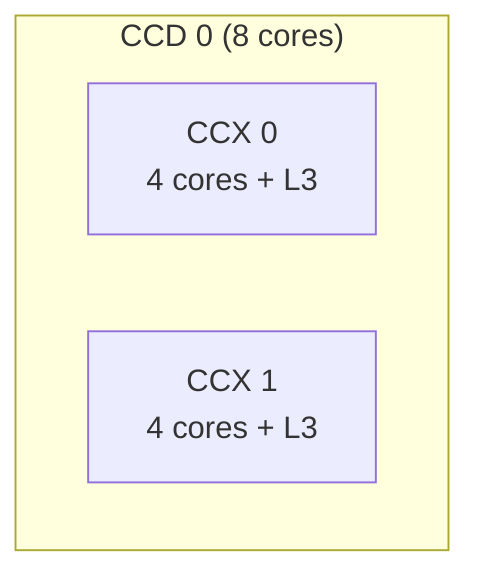
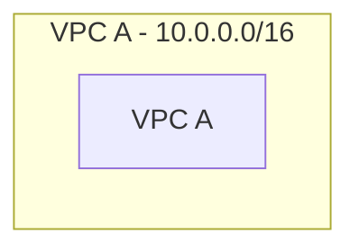
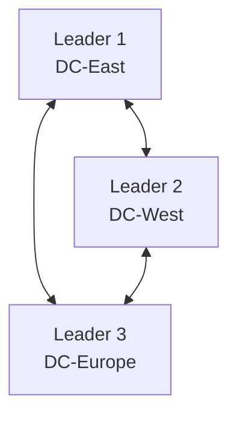
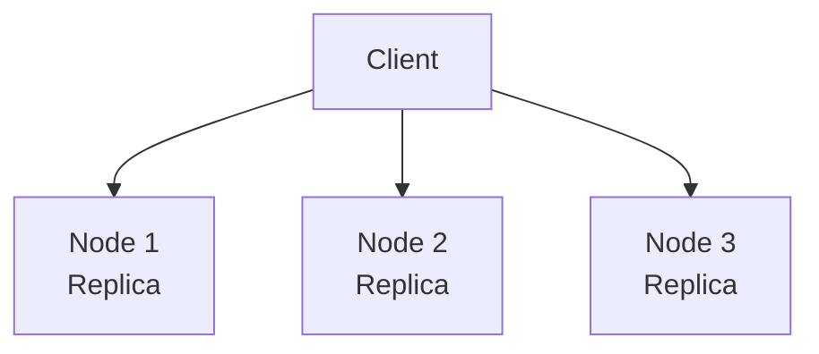
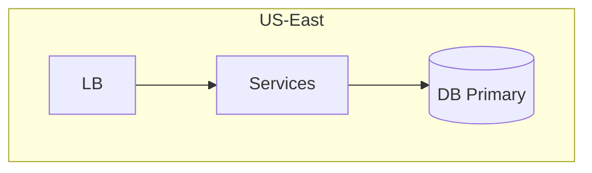
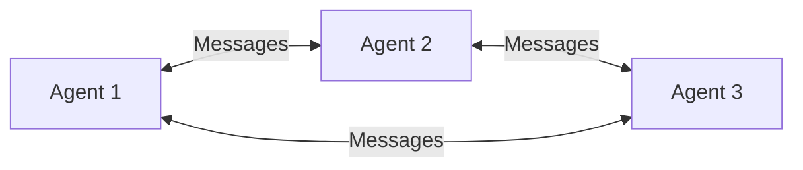

# Mermaid Validation Report

- **Total:** 2276
- **Passed:** 2256
- **Failed:** 20
- **Pass rate:** 99.1%

## Failed Diagrams

### /home/work/.openclaw/workspace/placement_prep/src/arch/cpu/von-neumann.md — Diagram 1 (flowchart)

**Errors:**
- Line 7: Duplicate node ID 'CPU' (first at line 3)
- Line 8: Duplicate node ID 'CPU' (first at line 7)

```mermaid
graph LR
    subgraph Von Neumann Machine
        CPU[CPU]
        MEM[Unified Memory<br/>Instructions + Data]
        IO[I/O Devices]
```

### /home/work/.openclaw/workspace/placement_prep/src/arch/memory-hierarchy/moesi.md — Diagram 3 (flowchart)

**Errors:**
- Line 16: Duplicate node ID 'L3_0' (first at line 6)

```mermaid
graph TD
    subgraph CCD0["CCD 0"]
        subgraph CCX0["CCX 0"]
            C0["Core 0<br/>L1/L2"]
            C1["Core 1<br/>L1/L2"]
```

### /home/work/.openclaw/workspace/placement_prep/src/arch/parallelism/multicore.md — Diagram 7 (flowchart)

**Errors:**
- Line 11: Duplicate node ID 'CCX0' (first at line 3)
- Line 12: Duplicate node ID 'CCX2' (first at line 7)



### /home/work/.openclaw/workspace/placement_prep/src/cloud/aws/vpc.md — Diagram 6 (flowchart)

**Errors:**
- Line 10: Duplicate node ID 'VPC_A' (first at line 3)



### /home/work/.openclaw/workspace/placement_prep/src/concurrency/transactional-memory.md — Diagram 1 (flowchart)

**Errors:**
- Line 13: Unmatched braces: T1[atomic {]
- Line 16: Unmatched braces: T4[}]

```mermaid
graph TD
    subgraph Locks[Lock-Based Programming]
        L1[lock(A)]
        L2[lock(B)]
        L3[modify A and B]
```

### /home/work/.openclaw/workspace/placement_prep/src/dbms/distributed/replication.md — Diagram 6 (flowchart)

**Errors:**
- Line 3: Duplicate node ID 'L1' (first at line 2)



### /home/work/.openclaw/workspace/placement_prep/src/dbms/distributed/replication.md — Diagram 7 (flowchart)

**Errors:**
- Line 8: Duplicate node ID 'N1' (first at line 6)



### /home/work/.openclaw/workspace/placement_prep/src/dbms/transactions/concurrency-control.md — Diagram 1 (unknown)

**Errors:**
- Cannot detect diagram type

```mermaid
graph CC[Concurrency Control] --> LOCK[Lock-Based<br/>Pessimistic]
CC --> TS[Timestamp-Based<br/>Deterministic]
CC --> OPT[Optimistic<br/>Validation-Based]
CC --> MVCC[Multi-Version<br/>Readers ≠ Writers]

```

### /home/work/.openclaw/workspace/placement_prep/src/distributed/mapreduce/spark.md — Diagram 2 (flowchart)

**Errors:**
- Line 5: Duplicate node ID 'D' (first at line 4)

```mermaid
graph TD
    subgraph "RDD Properties"
        R[Resilient] --> R1["Can recompute lost partitions"]
        D[Distributed] --> D1["Data across multiple nodes"]
        D[Dataset] --> D2["Collection of partitioned data"]
```

### /home/work/.openclaw/workspace/placement_prep/src/distributed/microservices/README.md — Diagram 1 (flowchart)

**Errors:**
- Line 16: Duplicate node ID 'US' (first at line 11)
- Line 17: Duplicate node ID 'OS' (first at line 12)
- Line 18: Duplicate node ID 'OS' (first at line 17)

```mermaid
graph TD
    subgraph "Monolith"
        M[Single Application] --> UM[User Module]
        M --> OM[Order Module]
        M --> PM[Payment Module]
```

### /home/work/.openclaw/workspace/placement_prep/src/interview/system-design/availability-patterns.md — Diagram 5 (flowchart)

**Errors:**
- Line 15: Duplicate node ID 'DB1' (first at line 14)



### /home/work/.openclaw/workspace/placement_prep/src/interview/system-design/real-world/youtube.md — Diagram 6 (flowchart)

**Errors:**
- Line 16: Duplicate node ID 'Search' (first at line 5)

```mermaid
graph TB
    subgraph "Candidate Generation"
        Collab["Collaborative Filtering"]
        Content["Content-Based"]
        Search["Search-Based"]
```

### /home/work/.openclaw/workspace/placement_prep/src/ml/agents/README.md — Diagram 2 (flowchart)

**Errors:**
- Line 11: Duplicate node ID 'MEMORY' (first at line 10)


### /home/work/.openclaw/workspace/placement_prep/src/ml/agents/architecture.md — Diagram 1 (flowchart)

**Errors:**
- Line 15: Duplicate node ID 'MEMORY' (first at line 6)
- Line 16: Duplicate node ID 'MEMORY' (first at line 15)

```mermaid
graph TD
    subgraph "Agent Architecture"
        PERCEPTION[Perception Layer]
        REASONING[Reasoning Engine]
        ACTION[Action Layer]
```

### /home/work/.openclaw/workspace/placement_prep/src/ml/agents/frameworks.md — Diagram 4 (flowchart)

**Errors:**
- Line 4: Duplicate node ID 'A1' (first at line 2)



### /home/work/.openclaw/workspace/placement_prep/src/networks/http/websocket.md — Diagram 1 (flowchart)

**Errors:**
- Line 17: Duplicate node ID 'C3' (first at line 16)
- Line 18: Duplicate node ID 'C3' (first at line 17)

```mermaid
graph LR
    subgraph "Long Polling"
        C1[Client] -->|Request| S1[Server]
        S1 -->|Wait... Response| C1
        C1 -->|New Request| S1
```

### /home/work/.openclaw/workspace/placement_prep/src/networks/osi/application.md — Diagram 7 (flowchart)

**Errors:**
- Line 11: Duplicate node ID 'P2P_A' (first at line 9)

```mermaid
graph TD
    subgraph "Client-Server"
        CS_C1[Client] --> CS_S[Server]
        CS_C2[Client] --> CS_S
        CS_C3[Client] --> CS_S
```

### /home/work/.openclaw/workspace/placement_prep/src/networks/sockets/README.md — Diagram 1 (flowchart)

**Errors:**
- Line 8: Duplicate node ID 'SA' (first at line 3)

```mermaid
graph LR
    subgraph "Process A"
        SA[Socket A<br>IP: 10.0.0.1, Port: 52341]
    end
    subgraph "Process B"
```

### /home/work/.openclaw/workspace/placement_prep/src/os/memory/numa.md — Diagram 1 (flowchart)

**Errors:**
- Line 14: Duplicate node ID 'CPU0' (first at line 3)

```mermaid
graph TD
    subgraph "NUMA Node 0"
        CPU0["CPU 0-7"]
        RAM0["Local RAM\n(32 GB)\n~100ns"]
        CPU0 --- RAM0
```

### /home/work/.openclaw/workspace/placement_prep/src/storage/distributed.md — Diagram 6 (flowchart)

**Errors:**
- Line 9: Duplicate node ID 'L1' (first at line 3)

```mermaid
graph TD
    subgraph DC1[Datacenter 1]
        L1[Leader 1]
    end
    subgraph DC2[Datacenter 2]
```
