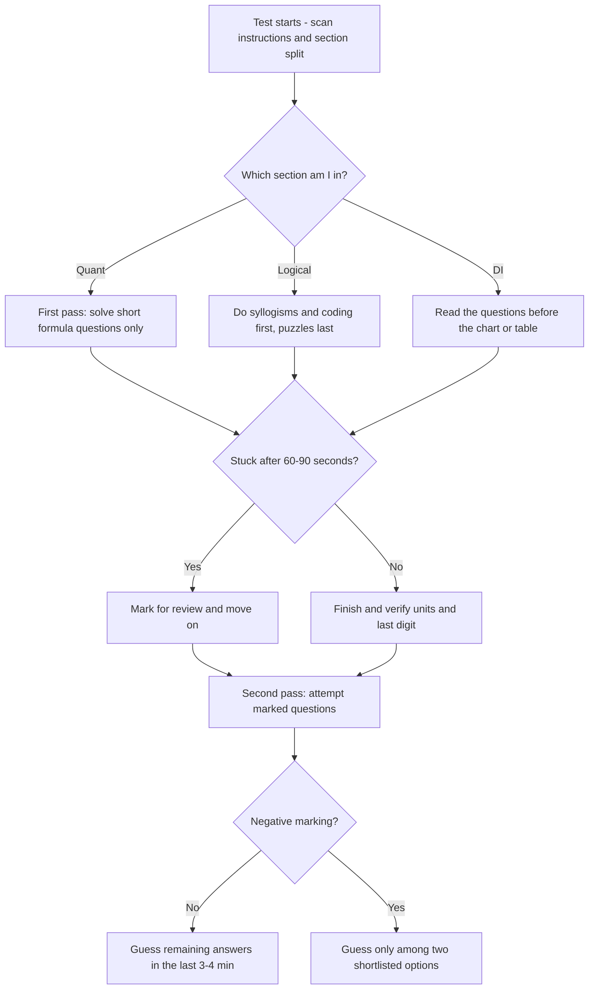

# Aptitude & Quantitative Preparation

This section is the hub for quantitative aptitude, logical reasoning, and data interpretation preparation for Indian campus placements. Companies such as TCS, Infosys, Wipro, Cognizant, and AMCAT-partner recruiters screen candidates with a timed aptitude round before interviews, and clearing it is a hard filter in almost every mass-recruitment drive. Use this page as the entry point: it maps all 13 topic pages, summarizes exam patterns, and collects the speed techniques and study plan that tie the individual chapters together.

## How to Use This Section

Work through the topic pages in the order of the map above, because each tier assumes fluency with the previous one. Read a page once for understanding, then immediately solve its practice set under a stopwatch. Return weekly to the pages you got wrong rather than rereading the ones you already know, and keep a running error log — avoiding repeated mistakes is worth more than learning one extra trick.

1. **Build the base first** — Percentages, Ratios, and Averages unlock every later chapter.
2. **Practice with a timer** — aim for 30-45 seconds per easy question from day one.
3. **Solve every practice set** — each page's questions are calibrated to real exam difficulty.
4. **Mix topics weekly** — real papers interleave topics, so weekly mixed sets build that stamina.

## Topic Map

The section contains 13 topic pages organized in three tiers. Work through the foundation tier first because nearly every other topic reuses percentage, ratio, and average ideas. Then move to commercial math, and finally to the advanced tier that separates shortlisted candidates in the last minutes of a test.

### Foundation Quant

| Topic | What it covers |
|-------|----------------|
| [Percentages](./percentages.md) | Percentage change, successive changes, fraction equivalents, comparison tricks |
| [Ratios & Proportions](./ratios-proportions.md) | Ratios, alligation, mixtures, partnership, direct and inverse variation |
| [Averages](./averages.md) | Simple and weighted averages, deviation method, group and replacement problems |
| [Number Systems](./number-systems.md) | Divisibility rules, HCF/LCM, remainders, cyclicity of powers, factors |
| [Probability & Combinatorics](./probability-combinatorics.md) | Permutations, combinations, dice, coins, cards, conditional probability, Bayes |

### Commercial Math

| Topic | What it covers |
|-------|----------------|
| [Profit & Loss](./profit-loss.md) | CP/SP/MP, discounts, dishonest dealer, markup, two-item same-price puzzles |
| [Compound and Simple Interest](./compound-interest.md) | SI/CI formulas, effective rate, CI-vs-SI difference shortcuts, doubling time |
| [Time & Work](./time-work.md) | Efficiency, LCM method, pipes and cisterns, alternating and negative work |
| [Speed, Distance & Time](./speed-distance.md) | Average speed, relative speed, trains, boats and streams, circular tracks |

### Reasoning, Data and Advanced Math

| Topic | What it covers |
|-------|----------------|
| [Logical Reasoning](./logical-reasoning.md) | Syllogisms, coding-decoding, blood relations, directions, seating, puzzles |
| [Data Interpretation](./data-interpretation.md) | Tables, bar/pie/line charts, caselets, CAGR, estimation under time pressure |
| [Trigonometry](./trigonometry.md) | Identities, height and distance, max-min values, periodicity, inverse trig basics |
| [Calculus Basics](./calculus-basics.md) | Limits, derivatives, max-min optimization, integration, related rates |

## Exam Patterns (Approximate)

The table below collects the approximate public patterns of the most common campus screening tests. Recruiters revise section counts, timing, and cutoffs almost every drive, so treat these as planning numbers rather than guarantees. Verify the current pattern on each company's official career portal a few days before your test.

| Company / Test | Typical sections | Questions (approx.) | Time (approx.) | Notes |
|----------------|------------------|---------------------|----------------|-------|
| TCS NQT (Foundation) | Numerical, Verbal, Reasoning Ability | ~20 + ~25 + ~20 | ~75 min total | No negative marking reported; separate Advanced Quant round for higher packages |
| Infosys (off-campus) | Mathematical Ability, Logical, Verbal | ~10-15 + ~15 + ~20 | ~60-70 min | Puzzle-heavy logical section; verbal cutoff applies |
| Wipro (Elite) | Quantitative, Logical, Verbal | ~16 + ~14 + ~20 | ~50-60 min | Each section separately timed and auto-submitted |
| AMCAT | Quantitative, Logical, English (adaptive) | ~18-25 per module | ~25-35 min per module | Adaptive engine: harder questions raise your percentile faster |
| Cognizant (GenC) | Quantitative, Logical, Verbal | ~20 + ~15 + ~20 | ~55-60 min | Exact split varies by drive type and year |

Across all these tests the quant section is dominated by the foundation and commercial-math topics listed above. Logical reasoning is usually the fastest section once you know the standard templates, because most questions follow a fixed set of patterns. Data interpretation sits between the two: it tests percentage and ratio skill through a chart or table.

Cutoffs are usually both sectional and overall, and the quant section typically carries the highest cutoff because it is the most scoreable. Difficulty has stayed stable over recent years, but the number of questions per minute has tightened, so speed techniques are now worth more than extra theory. Whatever the pattern on test day, the two-pass approach and the time budget below remain the right default behavior.

## 4-Week Study Plan

A focused four-week cycle is enough to take all 13 topics to test-ready level if you can spend about two hours per day. The plan below alternates quant chapters with logical and DI practice so both halves of the paper improve together. Treat the milestone column as a pass/fail gate before moving to the next week.

| Week | Quant focus | Logical & DI focus | Milestone (self-check) |
|------|-------------|--------------------|------------------------|
| 1 | Percentages, Ratios & Proportions, Averages | Syllogisms, coding-decoding, series | 20 mixed problems in 30 min at 80%+ accuracy |
| 2 | Profit & Loss, Compound and Simple Interest | Blood relations, directions, seating basics | 15 commercial-math problems in 25 min |
| 3 | Time & Work, Speed-Distance-Time, Number Systems | Puzzles, Data Interpretation sets | One full sectional mock per topic area |
| 4 | Probability, Trigonometry, Calculus Basics | Full-length mixed mocks | 2 full mocks taken; error log reviewed twice |

A daily two-hour split keeps the plan realistic. Spend 45 minutes on the current quant topic, 30 minutes on logical or DI practice, and 15 minutes of pure mental math from the speed techniques below. Reserve the final 30 minutes for reviewing errors and redoing failed questions from your log, and replace the whole routine with one sectional mock every Sunday.

## Universal Speed Techniques

These techniques apply to every topic page in this section. Practicing them once per day for 15 minutes raises your effective speed more than solving extra full problems, because they remove the arithmetic layer where most time is lost.

### Percentage-to-Fraction Conversions

| Fraction | Percentage | Fraction | Percentage |
|----------|-----------|----------|-----------|
| 1/2 | 50% | 1/9 | 11.11% |
| 1/3 | 33.33% | 1/10 | 10% |
| 1/4 | 25% | 1/11 | 9.09% |
| 1/5 | 20% | 1/12 | 8.33% |
| 1/6 | 16.67% | 1/13 | 7.69% |
| 1/7 | 14.28% | 1/14 | 7.14% |
| 1/8 | 12.5% | 1/15 | 6.67% |
| — | — | 1/16 | 6.25% |

Memorize the full table, because converting a percentage to a fraction turns hard multiplications into easy ones. For example, 37.5% of 640 is instantly 3/8 × 640 = 240 once you recall 37.5% = 3/8. The same table powers the successive-discount and interest shortcuts in the commercial-math pages.

### Option Elimination

Never solve a question completely if the options let you skip most of the work. Check the last digit, divisibility, magnitude, and parity of the options before doing any algebra, and eliminate everything inconsistent with a quick estimate. In problems asking "a number when multiplied by 3/5 gives 48", you can divide 48 by 3 and multiply by 5 in one step rather than forming an equation, and in DI sets the magnitude check alone often kills two options instantly.

### Approximation

Campus tests are designed so that exact arithmetic is rarely required for most questions. Round numbers to the nearest convenient value, compute the approximate answer, and pick the option closest to it, adjusting only when two options are near each other. For example, 47.9 × 8.02 should be computed as 48 × 8 = 384, and 23.7% of 419 should be read as roughly 24% of 420 = 100.8. Keep a mental error budget: if your rounding shifted the answer by less than the gap between the two closest options, the approximation is safe.

## Calculator-Free Arithmetic Tricks

Campus aptitude tests almost never allow calculators, so the fastest candidates are the ones with a small library of mental arithmetic patterns. The three patterns below cover a disproportionate share of the raw multiplication and power computations that appear in quant and DI questions.

### Multiplication Near 100

Use the base-100 method: write each number as 100 minus or plus a deficit, multiply the deficits for the right-hand digits, and subtract the cross-sum from the base for the left-hand part. For 96 × 97, the deficits are 4 and 3, so the left part is 100 − (4 + 3) = 93 and the right part is 4 × 3 = 12, giving 9312. For numbers above 100 the same logic adds: 104 × 107 = (100 + 11) | (4 × 7) = 11128. This also gives instant results for 98 × 92 = 9016 and similar pairs that appear in squares-adjacent problems.

### Multiplying by 5, 25, and 50

Multiplying by these factors is division in disguise: ×5 = ×10 ÷ 2, ×50 = ×100 ÷ 2, and ×25 = ×100 ÷ 4. So 46 × 25 = 4600/4 = 1150, and 68 × 50 = 6800/2 = 3400. The reverse works for division too — 240 ÷ 5 becomes 24 × 2 = 48 — and these rewrites remove the two most common slow multiplications in DI percentage work.

### Squares 11-19

Any square in the teens splits as (10 + a)² = 100 + 20a + a². Compute 100, add 20 times the units digit, then add the units digit squared: 17² = 100 + 140 + 49 = 289. The full set is worth memorizing as a table because 12² to 19² appear constantly in Pythagorean triples, LCM work, and option checks.

| n | 11 | 12 | 13 | 14 | 15 | 16 | 17 | 18 | 19 |
|---|----|----|----|----|----|----|----|----|----|
| n² | 121 | 144 | 169 | 196 | 225 | 256 | 289 | 324 | 361 |

As a bonus, squares of numbers ending in 5 follow the pattern (d)(d+1) | 25: 85² = 8 × 9 | 25 = 7225, and 115² = 11 × 12 | 25 = 13225. Both patterns together cover most square computations a test will demand.

### Cubes Up to 10

| n | 1 | 2 | 3 | 4 | 5 | 6 | 7 | 8 | 9 | 10 |
|---|---|---|---|---|---|---|---|---|---|----|
| n³ | 1 | 8 | 27 | 64 | 125 | 216 | 343 | 512 | 729 | 1000 |

Cube values surface in the LCM method for Time & Work, in volume problems, and in number-system questions about perfect cubes and digit sums. They also let you invert quickly: "how many small cubes of side 2 fit in a cube of side 8" is answered by 8³/2³ = 512/8 = 64 without any setup. Review the table until each cube is recalled in under one second.

## Attempt Strategy

Time allocation inside the paper matters as much as knowing the formulas. The flow below is a safe default for any sectioned aptitude test with a fixed total time; adapt the marking rule if your target test has negative marking.

The diagram encodes two principles that raise scores immediately. First-pass filtering keeps you from sinking five minutes into one puzzle while three easy questions sit unanswered, and separate handling of the negative-marking case prevents blind guessing from lowering your total.

## Time Budget Inside the Paper

Decide your per-section time split before the test, not during it. The numbers below assume a 60-minute paper with three sections, so scale them proportionally to your target test. First-pass targets matter more than totals because they force the two-pass behavior described in the strategy flowchart above.

| Section | First pass | Second pass | Notes |
|---------|-----------|-------------|-------|
| Quantitative | 55% of section time | 30% | Skip anything over 90 seconds on first sight |
| Logical reasoning | 60% of section time | 25% | Puzzles and seating only in the second pass |
| Data interpretation | 50% of section time | 35% | Read the questions before the chart |
| Buffer (review, guessing) | — | 15% | Guess only when there is no negative marking |

## Frequently Asked Questions About the Tests

1. **Do campus aptitude tests have negative marking?**
   It depends on the company and the drive. TCS NQT has historically reported no negative marking in the Foundation section, AMCAT and Cognizant drives usually carry none, while some Infosys and Wipro rounds penalize wrong answers. Read the instructions screen carefully at the start, because the marking rule determines whether you should guess blindly or only between two shortlisted options.

2. **Can I use a calculator during the test?**
   No — physical calculators are universally banned, and most platforms disable or simply never need one because questions are engineered to use clean numbers. Some online-proctored tests display a simple on-screen calculator, but relying on it is a trap since it is slower than the mental techniques above. Prepare assuming pure mental math.

3. **What does it mean that AMCAT is "adaptive"?**
   An adaptive test changes question difficulty based on your recent answers, so there is no fixed paper and you cannot return to earlier questions. Answering harder questions correctly raises your percentile faster than answering many easy ones, so accuracy matters more than raw attempts. Do not panic when questions get harder — that is the algorithm telling you that you are doing well.

4. **Are cutoffs sectional or overall?**
   Most mass recruiters enforce both: a sectional cutoff for each of quant, logical, and verbal, plus an overall cutoff. This means you cannot afford to skip an entire section even if your strength lies elsewhere. Check each company's pattern before the test and make sure your weakest section still clears its minimum.

5. **When should I start preparing relative to the placement season?**
   Start at least two to three months before the first drive of your final year, using the four-week plan above and then repeating it with mocks. Aptitude rounds happen before shortlisting for interviews, so a weak score ends the process regardless of your technical skill. The syllabus is stable across companies, so early preparation serves every drive in the season.

## Key Takeaways

- Aptitude is a filter, not the final round — clear it fast and move your energy to interviews.
- The 13 topic pages form three tiers: foundation quant, commercial math, reasoning/data/advanced.
- Memorize the fraction-percentage table, squares to 19 (teens trick), and cubes to 10.
- Use option elimination and approximation before full algebra; exact math is rarely needed.
- Attempt in two passes: easy questions first, marked questions second, puzzles last.
- Check the marking scheme: no negative marking means guess everything at the end.
- Sectional cutoffs mean every section needs a minimum score, not just your strong one.
- A missed question type in a mock is a pattern to fix, not bad luck — maintain the error log.

## Cross-References

- [Percentages](./percentages.md) — the single most reused topic across all aptitude sections
- [Data Interpretation](./data-interpretation.md) — applies the speed techniques to chart-based questions
- [Logical Reasoning](./logical-reasoning.md) — the other half of every screening paper
- [Compound and Simple Interest](./compound-interest.md) — the commercial-math topic most often skipped and most often tested
- [Company Types](../interview/companies/company-types.md) — how different recruiters structure their whole hiring process
- [Book Index](../index.md) — the full catalog of preparation sections in this book
