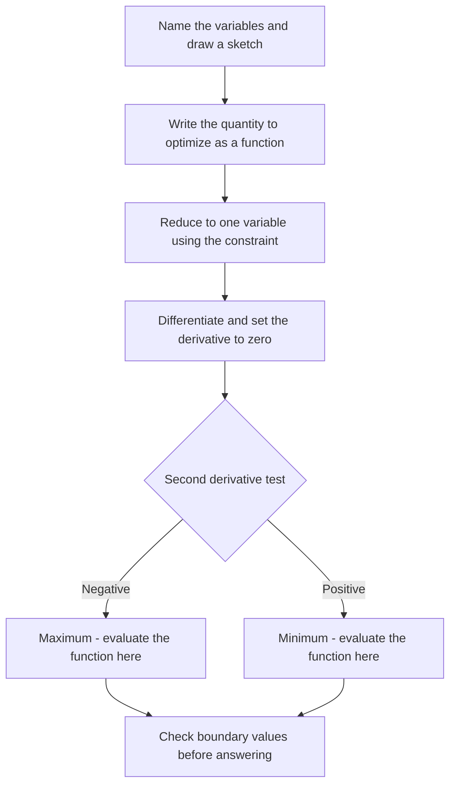

# Calculus Basics for Placement Tests

Calculus appears in quantitative aptitude sections mainly for engineering-role hiring, in advanced quant rounds such as TCS NQT Advanced and in AMCAT's harder bands. The tested surface is narrow and predictable: limits, derivative rules, max-min optimization, basic integration for areas, and rate problems. This page covers exactly that surface, with worked templates for the three classic optimization word problems and a ten-question practice set with hints and answers.

## Why Calculus Appears in Aptitude Tests

Two ideas drive every calculus question in campus tests. Rate problems ask "how fast is something changing right now", which is the derivative in disguise — a filling tank, a sliding ladder, a growing shadow. Optimization asks "what is the largest or smallest possible value", which is where derivatives power questions about fencing a field, cutting a box from a sheet, or pricing a product for maximum profit.

Both ideas reward the same three-step habit: translate the words into a function, differentiate, and interpret the critical point. Companies like these questions because they check whether engineering mathematics survived graduation, yet the formulas required fit in one table. Treat the topic as free marks: it has a fixed syllabus and far fewer candidates prepare it seriously than percentages or puzzles.

## Limits

A limit describes the value a function approaches as the input approaches a point. In aptitude questions, limits appear either as direct "evaluate the limit" items or as the theory behind L'Hôpital's rule covered later on this page. The working rules are listed first, then the two techniques that solve almost every exam limit.

| Property | Rule |
|----------|------|
| Constant | lim(x→a) c = c |
| Linear | lim(x→a) x = a |
| Sum | lim(f + g) = lim f + lim g |
| Product | lim(f · g) = lim f · lim g |
| Quotient | lim(f/g) = lim f / lim g (if lim g ≠ 0) |

### Factoring Technique

Direct substitution producing 0/0 is the signal to factor and cancel first. For example:

\\[
\lim_{x \to 2} \frac{x^2 - 4}{x - 2} = \lim_{x \to 2} \frac{(x+2)(x-2)}{x-2} = \lim_{x \to 2} (x + 2) = 4
\\]

The same trick handles x² − 9 over x − 3 at x = 3, and any quadratic over its linear factor. Factoring is usually faster than L'Hôpital for polynomial ratios because it avoids differentiation entirely, so try it first whenever a polynomial fraction gives 0/0.

### Standard Limits Table

| Form | Limit | Where it is used |
|------|-------|------------------|
| sin x / x as x → 0 | 1 | Trigonometric limits |
| tan x / x as x → 0 | 1 | Trigonometric limits |
| (1 − cos x)/x² as x → 0 | 1/2 | Trigonometric limits |
| (eˣ − 1)/x as x → 0 | 1 | Exponential limits |
| (aˣ − 1)/x as x → 0 | ln a | Exponential limits |
| ln x / x as x → ∞ | 0 | Growth comparisons |
| (1 + 1/n)ⁿ as n → ∞ | e ≈ 2.718 | Compound growth, definitions of e |

The first row is the most quoted limit in campus tests and doubles as the definition behind the derivative of sin x. Combine rows with the sum and product rules to evaluate composite expressions, for instance (sin 3x)/x as x → 0 equals 3 × (sin 3x)/(3x) = 3.

## Derivatives Quick Table

The derivative measures the instantaneous rate of change of a function, or geometrically, the slope of its tangent line. Every max-min and rate problem on this page reduces to computing derivatives from this table plus the four rules underneath it.

| Function f(x) | Derivative f'(x) |
|---------------|------------------|
| xⁿ | n xⁿ⁻¹ |
| c (constant) | 0 |
| eˣ | eˣ |
| aˣ | aˣ ln a |
| ln x | 1/x |
| sin x | cos x |
| cos x | −sin x |
| tan x | sec² x |
| √x | 1/(2√x) |
| 1/x | −1/x² |

### Combination Rules

```
Sum rule:      (f + g)' = f' + g'
Product rule:  (fg)' = f'g + fg'
Quotient rule: (f/g)' = (f'g - fg') / g²
Chain rule:    d/dx [f(g(x))] = f'(g(x)) · g'(x)
```

**Example:** Find d/dx of x³ + 2x² − 5x + 3.

```
= 3x² + 4x - 5
```

**Example (chain rule):** d/dx ln(x² + 1) = 2x/(x² + 1), because the outer derivative of ln u is 1/u and the inner derivative of x² + 1 is 2x. Chain-rule items like this are the most common derivative question format, so practice ten of them until the outer-inner rhythm is automatic.

## Max-Min Problem Templates

### The Three-Step Procedure

1. **Model:** name the variables, draw a sketch, and write the quantity to be maximized or minimized as a function.
2. **Reduce to one variable:** use the constraint equation to eliminate all but one variable, and note the valid range.
3. **Differentiate and test:** set f'(x) = 0, solve, and use the second derivative test — f'' > 0 means minimum, f'' < 0 means maximum.



### Template 1: Fencing Against a River

A farmer has 40 m of fence and wants a rectangular pen along a straight river, with the river side needing no fence. What dimensions give maximum area?

```
        river (no fence)
  ==========================
        |         |
   x    |         |    x        perimeter: 2x + y = 40
        |         |
        +----y----+
```

Let the two sides perpendicular to the river be x and the parallel side be y. The constraint gives y = 40 − 2x, so the area is A(x) = x(40 − 2x) = 40x − 2x².

```
A'(x) = 40 - 4x = 0   →   x = 10, y = 20
A''(x) = -4 < 0        →   maximum
A(10) = 10 × 20 = 200 m²
```

The general takeaway that saves time in variants: with a wall, river, or any free side, the maximum area always has the two perpendicular sides equal to each other and the parallel side twice as long. For a fully enclosed rectangle of fixed perimeter, the maximum is the square, which is the same rule with all four sides equal.

### Template 2: Open Box from a Square Sheet

An open box is made by cutting equal squares of side x from the corners of an 18 cm × 18 cm sheet and folding up the flaps. Find x for maximum volume.

```
  +--+--------------+--+
  |x |      x       |x |
  |--+--------------+--|
  |  |              |  |      base: (18 - 2x) × (18 - 2x)
  |x | (18 - 2x)    |x |      height: x
  |  |              |  |
  |--+--------------+--|
  |x |              |x |
  +--+--------------+--+
```

The box has height x and a square base of side 18 − 2x, so V(x) = x(18 − 2x)².

```
V'(x) = (18 - 2x)² + x · 2(18 - 2x)(-2)
      = (18 - 2x) [ (18 - 2x) - 4x ]
      = (18 - 2x)(18 - 6x) = 0
→ x = 3 (x = 9 gives zero volume, rejected)
V(3) = 3 × 12² = 432 cm³
```

The second critical point x = 9 is the boundary case where the base vanishes, which is why range-checking matters in step 2. A useful check: the answer must satisfy 0 < x < 9, and the volume at the midpoint x = 3 being 432 is consistent with V being zero at both ends 0 and 9.

### Template 3: Profit Maximization

A firm sells x units with revenue R(x) = 100x − x² and cost C(x) = 20x + 100. Find the output for maximum profit.

```
P(x) = R(x) - C(x) = 80x - x² - 100
P'(x) = 80 - 2x = 0   →   x = 40
P''(x) = -2 < 0       →   maximum
P(40) = 3200 - 1600 - 100 = ₹1,500
```

At the optimum, marginal revenue equals marginal cost (both are 20 at x = 40), which is the economics interpretation examiners like to reward in explanations. The fixed cost 100 shifts profit down but never changes the maximizing quantity, because constants differentiate to zero. Expect at least one variant where you must first build R and C from a word statement before differentiating.

## Integration Basics for Area Problems

Integration is the reverse of differentiation and, for aptitude purposes, the tool for areas under curves. A definite integral from a to b of f(x) equals F(b) − F(a) where F is any antiderivative, and its geometric meaning is the signed area between the curve and the x-axis.

| Function | Integral |
|----------|----------|
| xⁿ | xⁿ⁺¹/(n+1) + C (n ≠ −1) |
| 1/x | ln \|x\| + C |
| eˣ | eˣ + C |
| cos x | sin x + C |
| sin x | −cos x + C |

**Area worked example:** Find the area enclosed by y = 6x − x² and the x-axis. The curve meets the axis where 6x − x² = 0, that is x = 0 and x = 6, and it is positive between them.

\\[
\int_0^6 (6x - x^2)\\,dx = \left[ 3x^2 - \frac{x^3}{3} \right]_0^6 = 108 - 72 = 36
\\]

The routine is therefore: find the roots for the integration limits, confirm the sign of the function between them, then evaluate the antiderivative at the endpoints. If the curve dips below the axis, integrate each positive and negative section separately and add absolute values, because the exam asks for geometric area.

## Related Rates: Worked Example

A 10 m ladder leans against a wall. The bottom is pulled away from the wall at 1 m/s. How fast is the top sliding down when the bottom is 6 m from the wall?

```
        wall
         |\
         | \
       y |  \  10 m (ladder, constant)
         |   \
         |    \
         +-----+---- ground
            x (growing at 1 m/s)
```

The ladder length is constant, so x² + y² = 100. Differentiate both sides with respect to time t:

```
2x (dx/dt) + 2y (dy/dt) = 0
When x = 6:  y = √(100 - 36) = 8
dy/dt = -(x/y) (dx/dt) = -(6/8)(1) = -0.75 m/s
```

The top slides down at 0.75 m/s, and the negative sign simply records the downward direction. The general template is: write the geometric relation holding at every instant, differentiate it as a whole, substitute the instantaneous values last. Substituting too early — plugging x = 6 before differentiating — is the most common student error and destroys the relation, since only the equation x² + y² = 100 is true for all t.

## Limits and L'Hôpital's Rule as Exam Shortcuts

When a limit produces 0/0 or ∞/∞, differentiate the numerator and the denominator separately, then take the limit again. This is L'Hôpital's rule, and it is legitimate only for those two indeterminate forms — never for quotients that already have a determinate value. Use it after a quick factoring attempt on polynomials, but reach for it immediately with trigonometric and exponential expressions where factoring is impossible.

**Example 1:** lim(x→0) sin x / x

```
0/0 form → differentiate top and bottom:
lim(x→0) cos x / 1 = 1
```

**Example 2:** lim(x→0) (1 − cos x)/x²

```
0/0 form → lim(x→0) sin x / 2x = (1/2) · lim(x→0) sin x / x = 1/2
```

The second example shows the standard workflow: apply L'Hôpital once, then recognize the surviving sin x/x = 1 standard limit instead of differentiating again. For aptitude purposes the payoff is speed — three or four limits that each take two minutes by expansion take twenty seconds each with this rule, and the standard limits table from the section above supplies the final values.

## Practice Questions

Attempt each question for at most 90 seconds before reading the hint. Answers use e ≈ 2.718 where relevant.

| # | Question | Hint | Answer |
|---|----------|------|--------|
| 1 | lim(x→0) sin x / x | Standard limit | 1 |
| 2 | d/dx (x² · eˣ) | Product rule | eˣ(x² + 2x) |
| 3 | Maximum value of −x² + 4x − 3 | Set derivative to zero | 1, at x = 2 |
| 4 | lim(x→3) (x² − 9)/(x − 3) | Factor and cancel | 6 |
| 5 | Minimum value of x² − 4x + 7 | Second derivative test | 3, at x = 2 |
| 6 | d/dx ln(x² + 1) | Chain rule | 2x/(x² + 1) |
| 7 | ∫₀² 3x² dx | Antiderivative x³ | 8 |
| 8 | lim(x→0) (eˣ − 1)/x | Standard limit or L'Hôpital | 1 |
| 9 | Two positive numbers sum to 20; maximum product? | Square maximizes the product | 100 (10 × 10) |
| 10 | Sphere radius grows at 2 cm/s. Find dV/dt when r = 3 cm | V = (4/3)πr³, differentiate in t | 72π ≈ 226.2 cm³/s |

## Interview Questions

1. **Why does calculus show up in aptitude tests at all?**
   It separates candidates who can model a changing quantity from those who only plug into fixed formulas. Rate questions mirror the "how fast" reasoning behind real engineering work, and optimization mirrors budget and cost trade-offs that even non-engineering roles face. Because the tested surface is small, it is an efficient discriminator: one table of derivatives covers every question asked.

2. **What does the second derivative add in max-min problems?**
   The first derivative locates critical points, but cannot tell a peak from a valley. The second derivative measures how the slope itself is changing: negative at a critical point means the slope is decreasing through zero, so the point is a maximum, and positive means a minimum. In the fencing template, A''(x) = −4 < 0 certified the maximum without drawing a graph.

3. **When is L'Hôpital's rule the fastest route versus factoring?**
   For polynomial ratios giving 0/0, factoring and canceling is usually faster and less error-prone, as in (x² − 9)/(x − 3) at x = 3. For trigonometric or exponential forms like (1 − cos x)/x², factoring is impractical and L'Hôpital plus a standard limit wins immediately. The rule needs an indeterminate form, so always confirm 0/0 or ∞/∞ before differentiating.

4. **How do related rates problems map to everyday situations?**
   Every related rates question is a known equation connecting quantities, where both quantities change with time and one rate is given. The ladder example is x² + y² = 100 with dx/dt known and dy/dt asked; a filling cone is V = (1/3)πr²h with dV/dt known and dh/dt asked. The method never changes: differentiate the relation with respect to t, then substitute instantaneous values last.

5. **Definite versus indefinite integrals — which one does an area problem need?**
   The indefinite integral produces the family of antiderivatives and always carries the constant C. Area problems need the definite integral, which evaluates the antiderivative between limits and cancels the constant, giving a number. The exam workflow is: solve the roots for limits, check the function's sign between them, then compute F(b) − F(a).

## Key Takeaways

- Campus calculus is a narrow surface: limits, derivative rules, max-min, basic integration, related rates.
- Every optimization question follows model → reduce to one variable → differentiate → second-derivative test.
- Fencing with a free side: perpendicular sides equal, parallel side double; fully enclosed: square.
- Box-from-a-sheet problems factor as V = x(L − 2x)² with a rejected boundary root.
- Maximize profit by setting marginal revenue equal to marginal cost; fixed costs never move the optimum.
- Related rates: differentiate the constraint equation first, substitute instant values last.
- L'Hôpital applies only to 0/0 and ∞/∞; pair it with sin x/x = 1 for speed.
- Definite integrals give area; find axis intersections first and check the sign between them.

## References

- Wikipedia: Calculus — <https://en.wikipedia.org/wiki/Calculus>
- Wikipedia: Derivative — <https://en.wikipedia.org/wiki/Derivative>
- Wikipedia: Maxima and minima — <https://en.wikipedia.org/wiki/Maxima_and_minima>
- Wikipedia: Limit of a function — <https://en.wikipedia.org/wiki/Limit_of_a_function>
- Wikipedia: L'Hôpital's rule — <https://en.wikipedia.org/wiki/L%27H%C3%B4pital%27s_rule>
- Wikipedia: Integral — <https://en.wikipedia.org/wiki/Integral>
- Wikipedia: Related rates — <https://en.wikipedia.org/wiki/Related_rates>
- Paul's Online Math Notes, Lamar University — <https://tutorial.math.lamar.edu/>

## Cross-references

- [Trigonometry](./trigonometry.md) — the sin θ + cos θ maximum is the trig case of the same max-min machinery
- [Profit and loss](./profit-loss.md) — profit maximization connects to markup and cost-price arithmetic
- [Percentages](./percentages.md) — rate-of-change language and successive-change formulas overlap here
- [Number systems](./number-systems.md) — quick arithmetic on critical-point values relies on mental math habits
