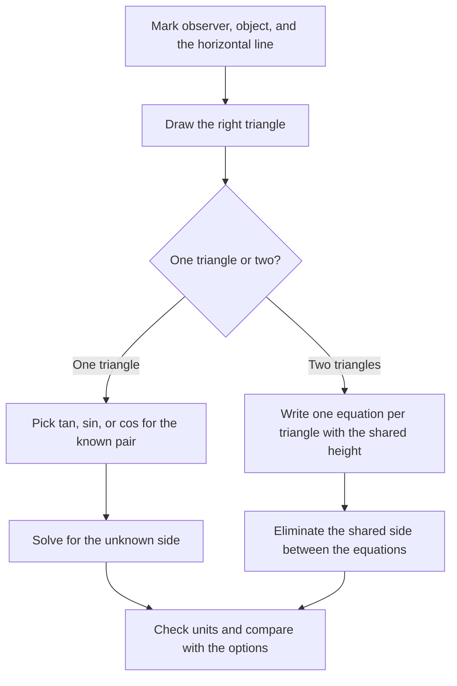

# Trigonometry for Aptitude Tests

Trigonometry appears in placement tests mainly through height-and-distance problems, standard-value evaluation, and max-min questions on expressions like sin θ + cos θ. Unlike board exams, campus tests use only a handful of angles and identities, so preparation narrows to a small, high-frequency toolkit. This page consolidates that toolkit: value tables, the identity sheet, worked height-and-distance templates, and a ten-question practice set with hints and answers.

## Standard Angle Values

The table below is non-negotiable; questions are built around these five angles and everything else is derived from them. Decimal equivalents matter because options usually contain 1.732 (√3) and 1.414 (√2) rather than surds. For the exam, 90° has no defined tan (it tends to infinity), so expressions containing tan 90° are usually trap options.

| Angle | sin | cos | tan | cot |
|-------|-----|-----|-----|-----|
| 0° | 0 | 1 | 0 | ∞ |
| 30° | 1/2 | √3/2 | 1/√3 | √3 |
| 45° | 1/√2 | 1/√2 | 1 | 1 |
| 60° | √3/2 | 1/2 | √3 | 1/√3 |
| 90° | 1 | 0 | ∞ | 0 |

**Memory trick:** For sin, read the numerators top-to-bottom as 0, 1, 2, 3, 4 over √(n/4): sin 0° = √(0/4) = 0, sin 30° = √(1/4) = 1/2, sin 45° = √(2/4) = 1/√2, sin 60° = √(3/4) = √3/2, sin 90° = √(4/4) = 1. For cos, read the same table bottom-to-top, and tan = sin/cos throughout. Memorize the two decimals √3 ≈ 1.732 and √2 ≈ 1.414 so you can match numeric options quickly.

## Core Identity Sheet

### Pythagorean Identities

These three identities come from the unit circle and are used in almost every "given one ratio, find another" question.

\\[
\sin^2\theta + \cos^2\theta = 1
\\]

\\[
1 + \tan^2\theta = \sec^2\theta \qquad 1 + \cot^2\theta = \csc^2\theta
\\]

Dividing the first identity by \\( \cos^2\theta \\) produces the second, and dividing by \\( \sin^2\theta \\) produces the third, so you only truly need to remember one. If \\( \sin\theta = 3/5 \\) with θ acute, then \\( \cos\theta = \sqrt{1 - 9/25} = 4/5 \\) in one step. Aptitude tests always state that θ is acute so you can take the positive root without discussion.

### Sum and Difference Formulas

| Identity | Formula |
|----------|---------|
| Sine sum | sin(A+B) = sin A cos B + cos A sin B |
| Sine difference | sin(A−B) = sin A cos B − cos A sin B |
| Cosine sum | cos(A+B) = cos A cos B − sin A sin B |
| Cosine difference | cos(A−B) = cos A cos B + sin A sin B |
| Tangent sum | tan(A+B) = (tan A + tan B)/(1 − tan A tan B) |
| Tangent difference | tan(A−B) = (tan A − tan B)/(1 + tan A tan B) |

These formulas let you manufacture exact values for 15° and 75°, which do appear in harder questions. For example, tan 15° = tan(45° − 30°) = (1 − 1/√3)/(1 + 1/√3) = 2 − √3 ≈ 0.268. The double-angle results follow immediately: sin 2θ = 2 sin θ cos θ, cos 2θ = cos²θ − sin²θ = 2cos²θ − 1, and tan 2θ = 2 tan θ/(1 − tan²θ).

## Maximum and Minimum Values

This is the single most repeated trigonometry pattern in campus tests after height-and-distance. The master result covers the whole family, and the derivation is short enough to reproduce in the exam if you forget the answer.

\\[
\sin\theta + \cos\theta = \sqrt{2}\left(\frac{1}{\sqrt{2}}\sin\theta + \frac{1}{\sqrt{2}}\cos\theta\right) = \sqrt{2}\left(\cos 45^\circ\\,\sin\theta + \sin 45^\circ\\,\cos\theta\right) = \sqrt{2}\\,\sin(\theta + 45^\circ)
\\]

Since \\( -1 \le \sin(x) \le 1 \\) for every angle x, the expression \\( \sqrt{2}\\,\sin(\theta + 45^\circ) \\) lies between \\( -\sqrt{2} \\) and \\( \sqrt{2} \\). The maximum \\( \sqrt{2} \approx 1.414 \\) occurs at \\( \theta = 45^\circ \\), and the minimum \\( -\sqrt{2} \\) occurs at \\( \theta = 225^\circ \\). The same phase-shift argument gives the general result for any coefficients.

| Expression | Maximum | Minimum | Max at θ = |
|------------|---------|---------|------------|
| a sin θ + b cos θ | √(a² + b²) | −√(a² + b²) | tan θ = b/a |
| sin θ + cos θ | √2 | −√2 | 45° |
| sin θ − cos θ | √2 | −√2 | 135° |
| sin θ · cos θ | 1/2 | −1/2 | 45° |
| 2 sin θ + 3 cos θ | √13 | −√13 | tan θ = 3/2 |

Two companion facts are worth memorizing because they turn three-line questions into five-second answers. First, sin θ · cos θ = (1/2) sin 2θ, so its extremes are ±1/2 and it never exceeds that bound. Second, if sin θ + cos θ = k, then squaring gives 1 + 2 sin θ cos θ = k², so sin θ cos θ = (k² − 1)/2; for k = √2 this yields 1/2 immediately.

## Periodicity Shortcuts

Sign and complement rules let you reduce any angle to a standard one without a calculator. The complementary pair is the most useful in aptitude questions because it silently converts cosines into sines.

- sin(90° − θ) = cos θ, cos(90° − θ) = sin θ, tan(90° − θ) = cot θ.
- sin(180° − θ) = sin θ, cos(180° − θ) = −cos θ, tan(180° − θ) = −tan θ.
- sin(−θ) = −sin θ and cos(−θ) = cos θ (sine is odd, cosine is even).
- Periods: sin and cos repeat every 360°, tan repeats every 180°.

For quadrant signs, use the CAST order "All, Sine, Tangent, Cosine" counter-clockwise starting from the first quadrant, where "All" means every ratio is positive. So sin θ is positive in Q1 and Q2, tan θ in Q1 and Q3, and cos θ in Q1 and Q4. A direct consequence used in options: complementary angles satisfy sin θ = cos(90° − θ), so sin 25° = cos 65°, and any product like sin 25° · cos 65° becomes sin²25° once recognized.

## Inverse Trigonometry Basics

Placement tests use inverse trigonometry lightly: mostly principal values and one identity. The principal range tells you which single value an inverse function returns, since infinitely many angles share the same sine.

| Function | Principal range | Standard values |
|----------|-----------------|-----------------|
| sin⁻¹x | [−90°, 90°] | sin⁻¹(1/2) = 30°, sin⁻¹(√3/2) = 60° |
| cos⁻¹x | [0°, 180°] | cos⁻¹(1/2) = 60°, cos⁻¹(√3/2) = 30° |
| tan⁻¹x | (−90°, 90°) | tan⁻¹(1) = 45°, tan⁻¹(√3) = 60° |
| cot⁻¹x | (0°, 180°) | cot⁻¹(1/√3) = 60° |
| sec⁻¹x | [0°, 180°], x ≠ 0 | sec⁻¹(2) = 60° |
| cosec⁻¹x | [−90°, 90°], x ≠ 0 | cosec⁻¹(2) = 30° |

The identity pair sin⁻¹x + cos⁻¹x = 90° and tan⁻¹x + cot⁻¹x = 90° holds for every valid x, and it is the fastest way to evaluate mixed sums like sin⁻¹(1/2) + cos⁻¹(1/2) = 90°. Complementary-angle logic explains why: sin⁻¹x returns the angle whose sine is x, and cos⁻¹x returns its complement. If an exam question mixes nested functions, evaluate from the inside and stay inside the principal range before applying any identity.

## Height and Distance Problem Templates

### Setup and Vocabulary

Angle of elevation is measured upward from the horizontal at the observer; angle of depression is measured downward from the horizontal at an elevated observer. Both are always measured against a horizontal line, never against the vertical. The golden trick: because the two horizontals are parallel, the angle of depression from the top equals the angle of elevation from the bottom, which lets you always convert a depression problem into the more familiar elevation picture. Every height-and-distance question reduces to one or two right triangles, so the only decisions are which triangle to draw and which of tan, sin, cos fits the known sides.

### Template 1: Single Triangle (Tower from a Distance)

A tower stands on level ground. From a point 100 m from its base, the angle of elevation of the top is 30°. Find the height.

```
  T
  |\
  | \
h |  \   line of sight
  |   \
  |  30°\
  B------P
    100 m
```

The unknown h is opposite the angle and the known 100 m is adjacent, so tan is the correct ratio. Using tan 30° = 1/√3:

```
tan 30° = h / 100
h = 100 × (1/√3) = 100/√3 = 100√3/3 ≈ 57.73 m
```

The reverse form is just as common: if the height were given and the distance asked, you would compute distance = h/tan 30° = h√3, multiplying by 1.732 instead of dividing. Notice how the answer uses √3 ≈ 1.732 from the value table, which is why those two decimals are mandatory memory.

### Template 2: Two Observations (Walking Toward the Tower)

From point A the elevation of a tower top is 30°; after walking 20 m toward it to point B, the elevation is 60°. Find the tower's height h.

```
            T
            |\
            | \
            |  \      ray to A (elevation 30 deg)
          h |   \
            |  \ \
            |   \ \    ray to B (elevation 60 deg)
            +----\--\-------- ground
                 B    A
                 x   +20 m
```

Let x be the distance from B to the base. Each triangle gives one equation sharing the same h:

```
From B:  tan 60° = h / x        →  h = x√3
From A:  tan 30° = h / (x + 20) →  h = (x + 20)/√3
```

Equating both expressions for h: x√3 = (x + 20)/√3, so 3x = x + 20, giving x = 10 and h = 10√3 ≈ 17.32 m. The general shortcut for such pairs is h = d · (tan α · tan β)/(tan β − tan α) with d = 20, α = 30°, β = 60°, which evaluates to the same 10√3 and is worth deriving once so you trust it.

### Template 3: Angle of Depression (Building to a Car)

From the top of a 50 m building, the angle of depression of a car is 60°. Find the car's distance from the building.

```
  T ---------------------------- (horizontal at top)
   \  60° angle of depression
    \
  h |\
    | \
    |  \   line of sight
    | 60°\    (elevation at C, equal by parallel lines)
    B-----C
       d
```

The depression angle at T equals the elevation angle at C, so the working triangle uses 60° at C with opposite side h = 50 and adjacent side d. Therefore tan 60° = 50/d, giving d = 50/√3 = 50√3/3 ≈ 28.87 m. Converting depression to elevation is the whole trick here; students who instead try to place 60° inside the triangle at T waste time and often pick a distractor option.

### Solving Strategy

The flow below summarizes how to attack any height-and-distance question in under a minute.



## Common Traps

- **Degrees vs radians:** campus aptitude uses degrees almost exclusively; never enter 30 as a radian value in mental tables.
- **Elevation vs depression placement:** elevation is at the observer on the ground, depression is at the elevated observer; both are measured from the horizontal.
- **Positive roots only when told:** cos θ = 4/5 has two solutions in general, but tests state "θ is acute" precisely so you take +4/5; ignoring the statement is a designed distractor.
- **sin θ ≠ sin × θ:** expressions like sin²θ + cos²θ = 1 must not be read as sin(θ²) + cos(θ²); parentheses matter.
- **tan 90° does not exist:** any option that requires evaluating tan 90° as a finite number is wrong.
- **Forgetting √3 ≈ 1.732:** numeric options are decimal, so keep 1.732 and 1.414 ready instead of leaving answers as surds.
- **Mixing up opposite and adjacent:** in a ladder problem the ground side is adjacent, the wall side is opposite; drawing the triangle first prevents the swap.

## Practice Questions

Answers use √3 ≈ 1.732 and √2 ≈ 1.414. Attempt each question for at most 60 seconds before reading the hint.

| # | Question | Hint | Answer |
|---|----------|------|--------|
| 1 | A ladder 10 m long makes 60° with the ground. How high does it reach? | Opposite side, so use sin | 5√3 ≈ 8.66 m |
| 2 | If sin θ = 3/5 (θ acute), find cos θ. | Pythagorean identity | 4/5 |
| 3 | Evaluate sin²45° + cos²45°. | Fundamental identity | 1 |
| 4 | Find tan 15°. | tan(45° − 30°) | 2 − √3 ≈ 0.268 |
| 5 | If sin θ + cos θ = √2, find sin θ · cos θ. | Square the sum | 1/2 |
| 6 | Elevation of a tower is 30°, then 45° after walking 30 m toward it. Height? | Two triangles, shared h | 15(√3 + 1) ≈ 40.98 m |
| 7 | Depression of a car is 30°, then 45° after it moves 100 m toward the building. Height? | Convert depression to elevation | 100/(√3 − 1) ≈ 136.6 m |
| 8 | Find the maximum of 3 sin θ + 4 cos θ. | √(a² + b²) | 5 |
| 9 | Evaluate sin 60° cos 30° + cos 60° sin 30°. | Sine sum formula | 1 |
| 10 | From a 75 m lighthouse, ships on one side show depressions 45° and 30°. Distance between ships? | 75(cot 30° − cot 45°) | 75(√3 − 1) ≈ 54.9 m |

## Interview Questions

1. **Why do aptitude tests favor height-and-distance over the rest of trigonometry?**
   It tests the complete modeling skill — drawing a triangle from a word problem, choosing the right ratio, and computing cleanly — without needing a wide formula base. The problems are self-contained and gradeable at scale, and distractor options are easy to design around common mistakes. Preparing the three templates above covers essentially every variant that appears.

2. **How do you maximize a sin θ + b cos θ without a calculator?**
   Rewrite it as √(a² + b²) sin(θ + φ) where tan φ = b/a, which follows from expanding sin(θ + φ) with the sum formula. Since sine is bounded by 1, the maximum is √(a² + b²) and the minimum is its negative. For sin θ + cos θ this gives √2 at θ = 45°, and for 3 sin θ + 4 cos θ it gives 5 — a classic option pair in tests.

3. **What is the relationship between angle of elevation and angle of depression?**
   They are equal for the same line of sight, because the horizontal line at the observer's eye and the horizontal at the ground are parallel and the sight line is a transversal, so alternate interior angles match. This lets you convert a depression problem stated at the top into an elevation problem at the bottom. Most students find the elevation picture more natural, so the conversion saves both time and errors.

4. **Which identities are worth memorizing versus deriving on the spot?**
   Memorize the five standard angles, the three Pythagorean identities, and the max-min result √(a² + b²), because they appear directly in questions. The sum and difference formulas are worth memorizing too, but knowing you can derive double angles and 15°/75° values from them means one table covers many results. Anything beyond this set is rarely tested in campus rounds and can be derived when needed.

5. **How does the complementary-angle identity speed up option checking?**
   Since sin θ = cos(90° − θ), any expression mixing sines and cosines of complementary angles collapses to a square or product of one function. For example sin 25° cos 65° = sin²25°, and pairs like sin 65° − cos 25° vanish to zero. Recognizing this in the options or the question stem often turns a 90-second computation into a 10-second observation.

## Key Takeaways

- Memorize the 0°-90° value table plus √3 ≈ 1.732 and √2 ≈ 1.414; everything else is derived.
- One Pythagorean identity (sin² + cos² = 1) generates the other two by division.
- Max of a sin θ + b cos θ is √(a² + b²); max of sin θ + cos θ is √2 at θ = 45°.
- If sin θ + cos θ = k, then sin θ cos θ = (k² − 1)/2 — a frequent 5-second question.
- Angle of depression from the top equals angle of elevation from the bottom.
- Two-observation problems: write tan equations per triangle and eliminate the shared height.
- Inverse trig needs only principal ranges and sin⁻¹x + cos⁻¹x = 90° for campus tests.
- Draw the triangle first; choosing tan vs sin vs cos is the whole decision in most questions.

## References

- Wikipedia: Trigonometry — <https://en.wikipedia.org/wiki/Trigonometry>
- Wikipedia: List of trigonometric identities — <https://en.wikipedia.org/wiki/List_of_trigonometric_identities>
- Wikipedia: Pythagorean trigonometric identity — <https://en.wikipedia.org/wiki/Pythagorean_trigonometric_identity>
- Wikipedia: Inverse trigonometric functions — <https://en.wikipedia.org/wiki/Inverse_trigonometric_functions>
- Wikipedia: Maxima and minima — <https://en.wikipedia.org/wiki/Maxima_and_minima>

## Cross-references

- [Calculus basics](./calculus-basics.md) — max-min optimization generalizes the sin+cos bound to derivatives
- [Number systems](./number-systems.md) — surd arithmetic with √2 and √3 relies on the same simplification skills
- [Logical reasoning](./logical-reasoning.md) — direction-sense problems use the same diagram-first habit
- [Percentages](./percentages.md) — pairing trig with quick percentage estimation speeds up option elimination
