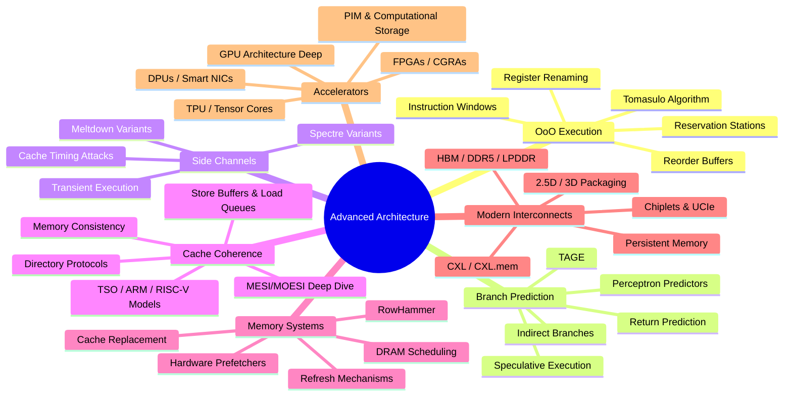

# Section H: Advanced Computer Architecture

This section covers the deep, graduate-level topics in computer architecture that separate candidates who truly understand modern processors from those who only know textbook basics. These are the topics that come up in senior/staff-level interviews at Intel, AMD, Apple, NVIDIA, Google, and Amazon.

## Topic Map

## Reading Order

| Order | File | Prerequisites | Core Focus |
|-------|------|---------------|------------|
| 1 | [Out-of-Order Execution](./ooo-execution.md) | Basic pipelining, data hazards | Tomasulo, renaming, ROB internals |
| 2 | [Branch Prediction Advanced](./branch-prediction-advanced.md) | Basic branch prediction | Neural/TAGE predictors, indirect branches |
| 3 | [Side Channels](./side-channels.md) | OoO execution, branch prediction, cache coherence | Spectre, Meltdown, transient execution |
| 4 | [Cache Coherence Advanced](./cache-coherence-advanced.md) | MESI/MOESI basics | Directory protocols, memory models, TSO |
| 5 | [Memory System Advanced](./memory-system-advanced.md) | Cache basics, DRAM basics | Prefetching, replacement, RowHammer |
| 6 | [Modern Interconnects](./modern-interconnects.md) | PCIe basics, memory hierarchy | CXL, chiplets, packaging, NVRAM |
| 7 | [Accelerators](./accelerators.md) | GPU basics, SIMD | DPUs, TPUs, FPGAs, PIM |

## How This Differs from Earlier Sections

| Earlier Sections | This Section (Advanced) |
|------------------|------------------------|
| What is OoO? | How Tomasulo's algorithm works in hardware |
| 2-bit saturating counters | Perceptron and TAGE neural predictors |
| MESI state diagram | Directory coherence, memory consistency models |
| Basic cache prefetching | Stream prefetchers, Markov prefetchers, stride detection |
| PCIe bandwidth numbers | CXL coherent interconnect, memory pooling |
| GPU programming basics | Warp scheduling, tensor cores, GPU cache hierarchy |

## Cross-References

- [Pipelining](../pipelining/README.md) — Foundation for OoO and branch prediction
- [Cache Coherence Basics](../memory-hierarchy/coherence.md) — Prerequisite for coherence deep dive
- [DRAM](../memory-tech/dram.md) — Prerequisite for DRAM scheduling and RowHammer
- [GPU Basics](../parallelism/gpu.md) — Prerequisite for accelerator deep dive
- [x86-64](../modern/x86-64.md) — Real processor implementations
- [AMD Zen](../modern/amd-zen.md) — AMD-specific architecture details
- [Apple Silicon](../modern/apple-silicon.md) — ARM-based high-performance design
