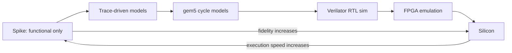
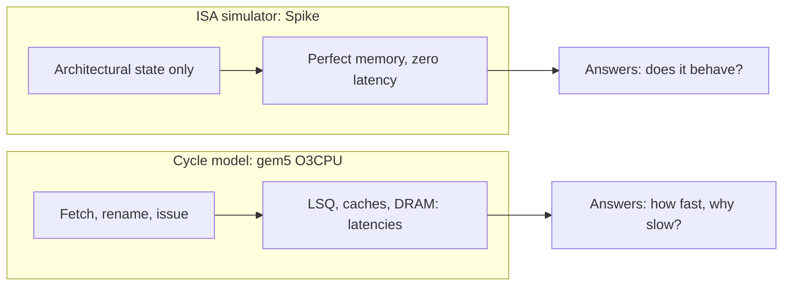
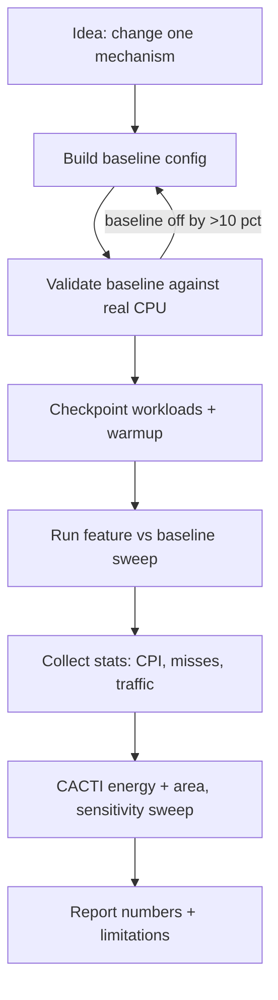

# Architectural Simulation & Modelling

## Overview

Computer-architecture research cannot iterate on silicon: a modern CPU core
takes 3-5 years and tens of millions of dollars to tape out, and once the die
ships you cannot A/B test a different branch predictor or cache geometry on
hardware you already own. Simulators fill that gap: they replay identical
workloads on many hypothetical machines, instrument every pipeline stage, and
turn "what if we changed X?" into a measurable experiment. For interviews in
GPU-performance, hardware-design, and systems-research roles, knowing the tool
landscape -- gem5 for cycle-level CPUs, Spike for the RISC-V ISA, Verilator for
RTL, Ramulator 2 and DRAMsim3 for DRAM timing, CACTI for energy-area estimates
-- tells the interviewer you understand where the numbers in papers come from.

## Why Simulation Beats Benchmarks for Research

Benchmarks and simulators answer different questions. A benchmark run on real
hardware measures one artifact under conditions you only partially control; a
simulator is a *hypothesis-testing instrument*. The concrete advantages:

- **Control**: every input is held fixed except the mechanism under study, so a
  2% CPI delta is a real effect, not machine noise.
- **Observability**: a cycle-level simulator can report per-cycle ROB occupancy,
  per-instruction port pressure, or per-DRAM-bank activity -- signals no
  hardware counter exposes.
- **Counterfactuals**: run the same program on a 4-wide and an 8-wide machine,
  or remove a prefetcher mid-execution from a checkpoint. Silicon offers only
  the configuration that taped out.
- **Pre-silicon de-risking**: industry runs full-SoC models months before first
  silicon; a 500-configuration cache sweep is a week of simulation versus years
  of RTL, synthesis, and bring-up -- and simulation failures are cheap.

The cost is fidelity: every simulator is a model with assumptions baked in, and
a simulated CPI of 0.8 is only meaningful if the *baseline* was validated
against real hardware. That validation step separates credible papers from toys.

## The Fidelity-Speed Spectrum

Simulation techniques form a spectrum: the more physical detail you model, the
slower execution gets. Picking the cheapest model that answers your question is
the core methodological skill.

| Level | Examples | What is timed | Typical use |
|---|---|---|---|
| Functional ISA sim | Spike, QEMU (TCG) | Nothing -- semantics only | ISA compliance, golden model, co-sim |
| Trace-driven | Recorded Pin/DRAM traces | Replays a fixed stream | Memory studies insensitive to feedback |
| Execution-driven cycle model | gem5 O3CPU | Pipelines, resources, contention | CPU/cache/prefetch mechanism studies |
| RTL simulation | Verilator | Every clock cycle of real RTL | Verifying actual RTL, SoC studies |
| FPGA emulation | FireSim | Real clock domain, scaled | Full-OS datacenter-scale studies |
| Tape-out | The chip itself | Everything | Product benchmarks |

Two subtleties interviewers like: trace-driven models cannot see *feedback* (a
different cache behaviour changes the instruction stream itself), and RTL
simulation says nothing about designs you have not yet written. gem5 sits in
the sweet spot where most mechanism research happens.

## gem5: The Academic Standard

[gem5](https://www.gem5.org/) is the de-facto open-source simulator for
microarchitecture research. Its power comes from composability -- every component
(CPU, caches, DRAM, devices) is a **SimObject** written in C++, wired together by
Python configuration scripts, each emitting a uniform statistics stream.

### CPU Models: Atomic, Timing, Minor, O3

gem5 ships interchangeable CPU models that trade fidelity for speed:

- **AtomicSimpleCPU** -- one instruction at a time; memory accesses complete
  *atomically* (zero latency, no queuing). Used to warm caches and generate
  checkpoints fast. It cannot measure performance, only function.
- **TimingSimpleCPU** -- still single-issue in-order, but memory requests now
  traverse the memory system with real timing. Blocking: the CPU stalls on each
  miss. Good for quick cache-hierarchy sweeps.
- **MinorCPU** -- a *configurable in-order pipeline* model: set stage counts,
  widths, and forwarding; the tool for in-order core studies (embedded cores,
  GPU scalar pipes).
- **O3CPU** (out-of-order model, class `DerivO3CPU` in current releases) -- a
  full OoO core derived from the Alpha 21464: ROB, rename, issue queues,
  load-store queue, memory-dependence prediction, TAGE-class branch predictor
  options. Mechanism research lives here: change IQ size, ROB entries, or the
  predictor and re-measure CPI.

A typical gem5 script picks the model like any object parameter -- `cpu =
O3CPU()` -- while caches (classic or Ruby), DRAM, and devices stay untouched.

### Syscall Emulation vs Full System

gem5 has two operating modes, and choosing wrong wastes weeks:

| Aspect | SE (syscall emulation) | FS (full system) |
|---|---|---|
| What runs | User binary; gem5 services syscalls itself | Real firmware + Linux kernel + rootfs image |
| OS modelled | None -- `read()`, `mmap()` answered instantly | Real kernel: page tables, interrupts, drivers |
| Devices | Virtual console and file descriptors | Simulated VirtIO/UART/PCIe, real network stacks |
| Speed | Much faster | 10-100x slower |
| Typical use | SPEC-style user-mode mechanism studies | OS interaction, I/O, virtualization studies |

In SE mode gem5 intercepts each syscall instruction and services it time-free,
so syscalls do not pollute timing. In FS mode you supply a kernel image plus
disk and gem5 boots actual Linux -- required whenever kernel behaviour *is* the
phenomenon (page-fault-driven prefetching, I/O, hypervisors).

### Why gem5 Has a Steep Learning Curve

Be honest about this in interviews -- it is a known pain point:

1. **Two languages**: C++ SimObjects with Python wiring; a bug may live in either.
2. **Config sprawl**: dozens of near-equivalent example configs, and tutorials
   that lagged the API by years until the standard library landed.
3. **Statistics archaeology**: hundreds of counters per run in `m5stats.txt`;
   finding *the* numbers (CPI, miss rates, DRAM bandwidth) takes practice.
4. **Validation burden**: a stock O3CPU config matches no real CPU; reproducing,
   say, a Skylake-class core is your own project.
5. **Long runtimes**: detailed cores execute ~0.1-1 MIPS, so studies checkpoint
   and sample with SimPoints (representative ~100M-instruction windows).

## Spike: The RISC-V Golden Model

[Spike](https://github.com/riscv-software-src/riscv-isa-sim) (in the
`riscv-isa-sim` repository) is the **golden reference model** for RISC-V: the
programmatic embodiment of the unprivileged ISA spec. When an RTL team implements
an extension, "does it match Spike?" is the acceptance test.

- It is a *functional* simulator: every instruction's architectural effect
  (registers, memory, CSRs, exceptions) is exactly right, with an interactive
  debugger and proxy syscalls (HTIF/FESVR) so bare-metal and Linux binaries run
  unchanged.
- It is *not* a timing model: no pipelines, caches, or latencies. You cannot
  measure CPI with Spike, full stop.
- Its engineering role is **co-simulation**: RTL and Spike execute the same
  instruction stream, and any divergence in architectural state is a bug. This
  lockstep pattern is how open RISC-V cores (and OpenTitan's Ibex) are
  validated.

## Verilator: Compiling Verilog to C++

[Verilator](https://www.verilator.org/) is not an interpreter -- it *compiles*
synthesizable SystemVerilog/Verilog into fast single- or multi-threaded C++
(which you link with your own testbench). Because it evaluates the design per
clock cycle (two-state, zero-delay, cycle-based) instead of scheduling every
signal event, it is commonly 10-100x faster and can use all CPU cores.

- **Cycle-accurate, two-state**: Verilator assumes the RTL design discipline
  (signals settle between clock edges) and deliberately does not support
  event-driven corner cases (X-propagation, arbitrary delays) or gate-level
  timing -- which is exactly why it is fast.
- **Lint-first**: `verilator --lint-only` is widely used as a cheap static
  checker that catches width mismatches, inferred latches, and undriven signals.
- **Ecosystem anchor**: OpenTitan verification and many academic RISC-V flows
  (Rocket/BOOM via Chipyard) run Verilator as the standard fast-simulation back
  end, chained with Spike so architectural state is checked every retirement
  -- RTL timing truth plus ISA golden truth.

## Memory Simulation: Ramulator 2 and DRAMsim3

CPU simulators model DRAM crudely; memory research needs a memory-first tool:

- [Ramulator 2](https://github.com/RLNT/ramulator2) -- successor to the widely
  used Ramulator (Kim et al., ISCA 2015), rebuilt around an **actor model**:
  each component (channel, rank, bank, PIM unit) is an independent actor
  reacting to messages, which makes new protocols (DDR5, HBM3, LPDDR5, CXL,
  processing-in-memory) pluggable without rewriting the core. The standard tool
  for row-activation-policy, in-DRAM-operation, and interface-timing studies.
- [DRAMsim3](https://github.com/CSL-TUM/DRAMsim3) -- a cycle-accurate,
  object-oriented rewrite of the classic DRAMsim2 lineage with per-standard
  configuration files. Used when a dependable, hackable DDR/HBM/GDDR model is
  needed, e.g., evaluating scheduler policies related to
  [DRAM controllers](./dram-controllers.md).

Both answer what gem5's built-in DRAM cannot model credibly: bank-parallelism
limits, tFAW/tRTW timing constraints, refresh interference, and latency/bandwidth
trade-offs under mixed traffic. Typical study shape: drive the model with address
traces (from gem5, a profiler, or synthetic patterns) and report latency
distributions and bandwidth utilisation -- the machinery behind papers on CXL
memory pooling, HBM scheduling, and RowHammer defences (interconnect context:
[chiplets and UCIe](./chiplets-ucie.md)).

## CACTI: Cache and DRAM Energy-Area Modelling

CACTI (HP Labs lineage; versions 6.x/7.0 and a gem5-integrated build) is an
**analytical model**, not a cycle simulator: given cache parameters -- capacity,
line size, associativity, banking, technology node -- it estimates access
latency (ns), dynamic energy per access (nJ), leakage power, and area (mm²)
using circuit-level equations for decoders, bit lines, sense amplifiers, and
wires. Its simplicity is the feature:

- A sweep of 10,000 configurations runs in seconds, so papers use CACTI to
  *justify* a geometry before simulating it; energy-delay product from CACTI
  plus runtime from gem5 is the standard currency for energy-saving claims.
- The framework also models DRAM, NUCA tiles, NoC routers, and I/O, so
  accelerator papers cite it for SRAM buffers and interconnect costs (design
  context: [accelerators](./accelerators.md)).

The caveat worth stating: CACTI is a first-order model tuned to historical
designs; absolute numbers are approximate, relative comparisons between nearby
configurations are trustworthy.

## Anatomy of an Arch-Paper Evaluation

A canonical evaluation follows a repeatable workflow -- knowing it lets you read
(and reproduce) papers faster:

Concretely: pick a published config matching a real machine; fast-forward each
SPEC CPU2017 / GAP / PARSEC workload past startup via checkpoints; run equal
instruction windows (SimPoints or fixed ROI) for baseline and modified models;
collect `m5stats` counters; model SRAM with CACTI; sweep one sensitivity
parameter so reviewers see the design is not tuned to one workload.

## Interview Relevance: Where This Shows Up

- **GPU/hardware performance roles**: "we improved X by 15%" depends on baseline
  config and workload selection; gem5/Verilator/Chipyard experience
  differentiates candidates for architecture teams (NVIDIA, AMD research, Arm).
- **Performance-engineering roles**: less simulation, but the same discipline --
  controlled experiments, fixed seeds, one-variable-at-a-time sweeps -- transfers
  directly to A/B benchmarking on real hardware.
- **RISC-V silicon startups**: Spike co-simulation and Verilator regression are
  daily tools; expect "how would you debug an RTL/Spike divergence?" (bisect the
  stream, dump state at the first mismatch, check for unimplemented CSRs).
- **Research screening**: hypothesis, baseline validation, checkpoints, stats,
  sensitivity -- the archetype of the "walk me through your project" answer.

## References

- gem5 project: <https://www.gem5.org/>
- Spike RISC-V ISA simulator (`riscv-isa-sim`): <https://github.com/riscv-software-src/riscv-isa-sim>
- Verilator: <https://www.verilator.org/>
- Ramulator 2: <https://github.com/RLNT/ramulator2>
- DRAMsim3: <https://github.com/CSL-TUM/DRAMsim3>
- Papers cited by title: Binkert et al., "The gem5 Simulator", ACM SIGARCH CAN
  2011; Kim et al., "Ramulator: A Fast and Extensible DRAM Simulator", ISCA
  2015; Muralimanohar et al., "CACTI 6.0", HP Labs TR 2009; Li et al., "The
  Seven Deadly Sins of gem5", ACM TACO 2013.

## Cross-References

- [DRAM Controllers](./dram-controllers.md) -- what the DRAM simulators above
  model: schedulers, refresh, timing constraints.
- [Accelerators](./accelerators.md) -- CACTI and gem5 are the standard
  evaluation pair for accelerator design-space studies.
- [Chiplets and UCIe](./chiplets-ucie.md) -- memory and interconnect contexts
  Ramulator 2 / CACTI are used to cost out.
- [Out-of-Order Execution](./ooo-execution.md) -- the O3CPU model is a
  parameterized version of the mechanisms on that page.

## Interview Questions

1. **Why do architecture researchers prefer simulators over benchmarking real
   hardware?**
   Real hardware only exposes the mechanisms the vendor shipped and runs
   workloads under conditions you cannot freeze; you cannot A/B test a different
   branch predictor or cache geometry on a chip you own. A simulator gives
   control (identical inputs across variants), observability (per-cycle internal
   state), and counterfactuals (remove a component mid-run from a checkpoint).
   The price is fidelity, which is why baseline validation against real hardware
   is mandatory for credible numbers.

2. **Explain the difference between gem5's SE and FS modes and when each is
   appropriate.**
   SE (syscall emulation) runs a user-mode binary and services syscalls inside
   the simulator with zero timing -- fast, ideal for CPU-bound user-space
   mechanism studies. FS (full system) boots a real Linux kernel with firmware
   and simulated devices -- 10-100x slower but required whenever OS behaviour is
   part of the phenomenon: page-fault-driven prefetching, I/O, virtualization.
   The common mistake is running OS-sensitive workloads in SE and claiming the
   numbers generalize to systems.

3. **What distinguishes an ISA simulator like Spike from a cycle-level model
   like gem5's O3CPU?**
   Spike implements architectural semantics only -- every instruction's
   register, memory, and CSR effects are exactly right, but everything completes
   in zero time with perfect memory; it cannot produce a CPI. O3CPU models
   pipelines, queues, caches, and DRAM timing, so it produces performance but
   its functional fidelity is incidental. Their synergy is co-simulation:
   RTL or cycle-model state is checked against Spike's golden state every
   instruction to catch semantic bugs.

4. **Why is Verilator so much faster than event-driven RTL simulators, and what
   does it give up?**
   Verilator compiles synthesizable Verilog/SystemVerilog into cycle-based,
   two-state C++ and evaluates the design once per clock instead of scheduling
   every signal transition; multithreaded, it is often 10-100x faster. It gives
   up event-driven semantics -- X-propagation, arbitrary delays, asynchronous
   corner cases -- and gate-level timing, so it serves cycle-accurate
   architectural simulation and lint, not timing sign-off.

5. **When would you use Ramulator 2 or DRAMsim3 instead of gem5's built-in DRAM
   model?**
   When the question is about DRAM itself: bank-level parallelism, row-buffer
   policies, refresh and bus-turnaround timing, HBM3/DDR5/CXL protocols, or
   processing-in-memory. Ramulator 2's actor-based design lets you drop in new
   protocol actors; DRAMsim3 offers a well-understood cycle-accurate core with
   per-standard configs. Drive them with address traces and report latency
   distributions and bandwidth utilisation -- which gem5's simplified
   controller does not model faithfully enough to publish.

6. **What is CACTI and why do papers use it alongside a cycle simulator?**
   CACTI is an analytical model mapping cache/DRAM parameters (capacity,
   associativity, line size, technology node) to access latency, dynamic energy,
   leakage, and area via circuit-level equations. Cycle simulators give runtime;
   CACTI gives what the structures cost in energy and area, so
   energy-delay-product claims combine the two. It is approximate, so it is used
   for relative comparisons within a design family, not absolute predictions.

7. **A reviewer says your gem5 baseline "isn't a real CPU." How do you respond
   credibly?**
   With a validation table: the baseline config's CPI, branch-miss, and
   cache-miss rates on several SPEC workloads compared against hardware counters
   from a real machine, plus a statement of where they diverge and why. Then
   argue the study measures *relative* deltas between configurations, spot
   checked on hardware where the feature exists -- the validation-plus-
   sensitivity methodology the "seven deadly sins of gem5" paper demands.
