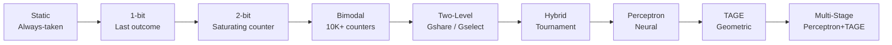

# Advanced Branch Prediction

## Overview

Modern branch predictors are among the most complex and power-hungry structures in a CPU. While the basic 2-bit saturating counter handles simple loops, real-world code requires predictors that can learn complex patterns, handle indirect branches (function pointers, virtual dispatch), and predict return addresses with near-perfect accuracy. This chapter covers the advanced techniques used in Intel, AMD, ARM, and Apple processors.

## From Bimodal to Neural Predictors

### The Spectrum of Complexity



| Predictor | Storage (approx) | Accuracy (SPECint) | Used by |
|-----------|------------------|---------------------|---------|
| 2-bit bimodal | 4 KB | ~85% | Simple cores (Cortex-M)
| Gshare | 8–32 KB | ~92% | Mid-range (early ARM11)
| Tournament (Alpha 21264) | 32–64 KB | ~95% | AMD K7, early Intel
| Perceptron | 50–200 KB | ~97% | IBM POWER (Blue Gene, z15)
| TAGE | 50–150 KB | ~97.5% | ARM Cortex-A, Intel Ice Lake+
| TAGE-SC-L | 100–300 KB | ~98.5% | Intel Golden Cove, AMD Zen 4 |

### Why Bimodal/Gshare Hit a Ceiling

Gshare (XOR of PC with global history) fails on:

```
Pattern that Gshare misses:
  Loop of 100 iterations: T T T ... T NT
  Global history wraps around, can't distinguish iteration count
  
Correlated branches:
  if (a > 0) { ... }
  if (b > 0) { ... }   // correlated with first branch
  Gshare's single global history mixes both
```

## TAGE (Tagged Geometric History Length)

### Core Idea

TAGE, proposed by Seznec and Michaud in 2006, uses **multiple predictor tables indexed by different history lengths**. Each table entry has a **tag** to detect mispredictions and a useful counter to track confidence.

```
TAGE Tables:

  Table 0:   History length 0 (no history, like bimodal)   — 4096 entries
  Table 1:   History length 4                                — 2048 entries
  Table 2:   History length 13                               — 1024 entries
  Table 3:   History length 38                               — 512 entries
  Table 4:   History length 117                              — 256 entries
  Table 5:   History length 354                              — 128 entries
  ...
  Table N:   History length L_N (geometric growth)          — few entries

  For each branch:
    1. Compute index into each table using (PC XOR history[0:i])
    2. Check tags — find longest-history table with a matching entry
    3. Use that entry's prediction
    4. If no match, fall back to shorter-history tables
    5. If still no match, use base predictor (Table 0)
```

### TAGE Entry Structure

```
TAGE Entry:
┌────────────────────────────────────────┐
│ Tag (8–12 bits)    │ Useful counter    │
│ Provider indicator │ Prediction (2b)   │
│ Useful (3 bits):   │  0 = not useful   │
│   Incremented on   │  >0 = confidence  │
│   correct predict  │                   │
│   Decremented on   │                   │
│   provider mispred │                   │
└────────────────────────────────────────┘
```

### TAGE Update Algorithm

```pseudocode
function tage_predict(pc, global_history):
    provider = -1
    prediction = BASE_PREDICT(pc)
    alt_prediction = prediction
    
    for i = 0 to NUM_TABLES-1:
        index = compute_index(pc, global_history[0:lengths[i]])
        entry = tables[i][index]
        tag = compute_tag(pc, global_history[0:lengths[i]])
        
        if entry.tag == tag:
            alt_prediction = prediction
            prediction = entry.prediction
            provider = i
            
    return (prediction, provider, alt_prediction)

function tage_update(pc, taken, provider, alt_prediction, correct):
    if not correct:
        # Allocate in a longer-history table
        for i = provider+1 to NUM_TABLES-1:
            if tables[i][index].useful == 0:
                allocate entry in tables[i]
                break
                
    # Update provider
    if provider >= 0:
        update provider counter toward actual outcome
        if not correct:
            decrement provider useful counter
        
    # Update alternate provider on misprediction
    if not correct and alt_prediction != actual:
        update alt provider counter toward actual outcome
```

> **Interview Angle**: "What is TAGE and why is it better than gshare?" TAGE uses multiple tables with geometrically increasing history lengths, each with tag matching. This lets it capture both short and long correlation patterns. Gshare uses a single fixed history length, so it misses long-range patterns. TAGE is the basis of most modern predictors.

### TAGE-SC-L: State-of-the-Art

Intel's Golden Cove and AMD Zen 4 extend TAGE with:

- **SC (Statistical Corrector)**: A second-level predictor that corrects systematic biases in the TAGE prediction using a small perceptron.
- **L (Loop predictor)**: A dedicated structure that detects counted loops and perfectly predicts the final-iteration taken→not-taken transition.

```
TAGE-SC-L prediction = TAGE_prediction XOR SC_correction

The SC component learns: "when TAGE says taken but history pattern X occurs,
the actual outcome is usually not-taken"
```

## Perceptron Predictors

### Jimenez's Perceptron Predictor

The perceptron predictor treats branch prediction as a **linear classification problem**. Each branch has a weight vector that is dot-producted with the global history to produce a prediction.

```
For branch at PC:
  weights[0..N] = trained weight vector for this PC
  history[0..N] = global branch history (1 = taken, -1 = not-taken)
  weights[0] = bias weight

  output = Σ (weights[i] × history[i])
  
  if output >= θ (threshold):   predict TAKEN
  if output < -θ:                predict NOT-TAKEN
  if -θ <= output < θ:          use base predictor (weak prediction)
```

### Training

```pseudocode
function perceptron_update(weights, history, taken, output, threshold):
    y = taken ? +1 : -1
    
    # Only update if prediction was wrong or output is weak
    if (y * output <= threshold) or (y * output < threshold):
        for i = 0 to N:
            weights[i] += y * history[i]
            # Clamp weights to prevent unbounded growth
            weights[i] = clamp(weights[i], -8*t, +8*t)
        
    # Reset weights if they've been trained too long without success
    if epoch > MAX_EPOCH:
        weights[i] = 0 for all i
```

### Where Perceptrons Are Used

| Processor | Predictor Type | Notes |
|-----------|---------------|-------|
| IBM POWER6–POWER10 | Perceptron (path-based) | Jimenez's design, 1–2% better than gselect |
| IBM z15 (mainframe) | Multiperspective perceptron | Multiple views of branch history |
| Intel Ice Lake+ | TAGE-SC (perceptron as SC) | Perceptron corrects TAGE |
| ARM Cortex-X series | TAGE-SC-L | TAGE primary, SC secondary |

> **Interview Angle**: "What is a perceptron branch predictor?" It's a neural-network-inspired predictor that maintains a weight vector per branch. It computes the dot product of weights with global history. If the result exceeds a threshold, predict taken. Training updates weights on mispredictions. IBM uses pure perceptron; Intel/AMD use it as a secondary corrector for TAGE.

## Indirect Branch Prediction

### The Challenge

Indirect branches (jump to register/memory) are much harder than conditional branches because the target is not known until execution:

```c
// Virtual function dispatch (C++)
obj->virtual_method();   // indirect branch via vtable

// Function pointers
callback(data);           // indirect branch via function pointer

// Switch statements (compiler may use jump table)
switch (x) { ... }       // indirect branch via jump table
```

### Target Prediction Structures

```
Indirect Target Array (ITA):
  Indexed by PC of indirect branch
  Stores last N targets seen for this PC
  
Entry: [Target0, Target1, Target2, Target3, Tag, LRU bits]
  
  Prediction: use MRU target
  Update: move correct target to MRU position
```

### Indirect Target Buffer (ITTB) in Modern CPUs

| Processor | ITTB Size | Targets per Entry | Accuracy |
|-----------|-----------|-------------------|----------|
| Intel Skylake | 1K entries | 4 targets | ~75% |
| Intel Golden Cove | 2K entries | 8 targets | ~85% |
| AMD Zen 4 | 2K entries | 4 targets | ~82% |
| Apple M2 | 4K entries | 6 targets | ~88% |

### ITTAGE: Indirect TAGE

ITTAGE extends TAGE to predict indirect branch targets by storing target values in TAGE entries instead of taken/not-taken predictions:

```
ITTAGE entry:
  Tag + Useful counter + Target address
  
Prediction: find longest-history matching entry → return target

This captures patterns like:
  "When the last 8 branches were T,N,T,T,N,T,N,T, the target is 0x4010"
```

## Return Address Prediction

### The Return Address Stack (RAS)

Function calls and returns come in matched pairs, making returns the easiest branches to predict:

```
RAS (Return Address Stack):
  A hardware stack of 16–32 entries
  
On CALL (detected at decode):
  push return_address onto RAS
  
On RET (detected at decode):
  pop predicted target from RAS
  
Accuracy: >99.9% (limited only by mismatched calls/returns)
```

```
Example:
  CALL foo     → RAS: [0x1008]                    (return address pushed)
  CALL bar     → RAS: [0x1008, 0x200C]             (nested call)
  RET          → predict 0x200C, RAS: [0x1008]     (pop correct)
  RET          → predict 0x1008, RAS: []            (pop correct)
```

### RAS Misprediction Causes

1. **Mismatched call/return** (e.g., setjmp/longjmp, exception handling)
2. **Indirect call not recognized** (call via register not identified as call)
3. **RAS overflow/underflow** (deeply recursive code > 32 levels)

Modern CPUs use a **circular RAS** that wraps around and recover by detecting mispredictions and restoring the RAS pointer on rollback.

> **Interview Angle**: "Why is return prediction so much easier than indirect branch prediction?" Because call/return pairs are balanced (LIFO), so a simple stack works with >99.9% accuracy. Indirect branches have no such structure — the same indirect branch PC can go to different targets depending on runtime data.

## Speculative Execution and Prediction Interaction

### Speculative History Update

The global branch history register (GHR) is updated **speculatively** — before branch outcomes are known. On misprediction, the GHR is restored from a checkpoint.

```
GHR Management:
  GHR: [b1, b2, b3, b4, b5, b6, b7, b8, ...]  (global history bits)
  
  On branch at decode:
    GHR_checkpoint = save(GHR)      // for misprediction recovery
    GHR = (predicted_outcome, GHR)  // shift in speculative bit
    
  On branch resolution:
    if prediction_correct:
      discard checkpoint
    else:
      restore GHR from checkpoint
      GHR = (actual_outcome, GHR)
      flush pipeline from mispredicted branch
```

### Speculative Update of TAGE

TAGE entries are updated speculatively for performance (avoiding a second pass). On misprediction, a **restoration mechanism** undoes the speculative updates by tracking which entries were modified.

## Branch Prediction in Real Processors

| Processor | Front-End Width | Predictor | BTB Size | RAS | Indirect |
|-----------|----------------|-----------|----------|-----|----------|
| Intel Golden Cove | 6-wide decode | TAGE-SC-L | 4K entries | 32-entry | 2K×8 |
| AMD Zen 4 | 6-wide decode | TAGE-SC-L | 6K entries | 32-entry | 2K×4 |
| Apple M2 Firestorm | 8-wide decode | Custom (TAGE-like) | 8K entries | 32-entry | 4K×6 |
| ARM Cortex-X3 | 4-wide decode | TAGE-SC-L | 4K entries | 24-entry | 1K×4 |
| RISC-V SiFive P670 | 3-wide decode | TAGE | 2K entries | 16-entry | 512×4 |

## Interview Questions

### Q1: What is TAGE and how does it differ from gshare?
**A**: TAGE uses multiple predictor tables with geometrically increasing history lengths (e.g., 0, 4, 13, 38, 117 bits). Each entry has a tag for matching. On a prediction, it uses the longest-history table with a matching tag. Gshare uses a single table indexed by PC XOR global history with one fixed history length. TAGE captures both short and long patterns; gshare only captures patterns of its fixed length.

### Q2: How do you predict indirect branches?
**A**: An Indirect Target Buffer stores the last N targets seen for each indirect branch PC (typically 4–8 targets with LRU replacement). The MRU target is predicted. More advanced designs use ITTAGE, which applies TAGE-style geometric history indexing to store target addresses, capturing patterns where the target depends on branch history.

### Q3: Why is a perceptron predictor useful even when TAGE is the primary predictor?
**A**: The perceptron serves as a **statistical corrector (SC)** in TAGE-SC. TAGE may have systematic biases — for certain history patterns, it consistently predicts the wrong direction. The SC component learns these biases and corrects the TAGE output. It's a lightweight way to gain 0.5–1% additional accuracy.

### Q4: How does the RAS handle recursive functions with thousands of call depth?
**A**: The RAS is typically only 16–32 entries deep. Deeply recursive functions overflow the RAS, causing mispredictions. However, the RAS wraps around (circular buffer), and the misprediction recovery mechanism restores the RAS pointer. In practice, the compiler and runtime can mitigate this with tail-call optimization. Most real code has bounded call depth.

### Q5: What happens to the branch history register on a misprediction?
**A**: The GHR is updated speculatively at decode time. A checkpoint is saved before the speculative update. On misprediction, the GHR is restored from the checkpoint and updated with the actual outcome. Any predictor entries updated speculatively (TAGE entries, bimodal counters) are also restored or their updates are suppressed.

## Summary

| Technique | Problem Solved | Key Idea |
|-----------|---------------|----------|
| TAGE | Gshare's fixed history limitation | Multiple tables with geometric history lengths + tags |
| TAGE-SC-L | Systematic prediction biases | Perceptron corrector + loop predictor |
| Perceptron | Complex non-linear patterns | Weighted dot product of history | 
| Indirect prediction | Unknown branch targets | Store last N targets per indirect branch PC |
| RAS | Return address prediction | Hardware stack exploiting call/return pairing |

## Cross-References

- [Basic Branch Prediction](../pipelining/branch-prediction.md) — Bimodal, 2-bit counters, gshare
- [Speculative Execution](../pipelining/speculative.md) — How speculation interacts with prediction
- [Side Channels](./side-channels.md) — Branch prediction enables speculative execution attacks
- [OoO Execution](./ooo-execution.md) — Front-end fetches along predicted path
