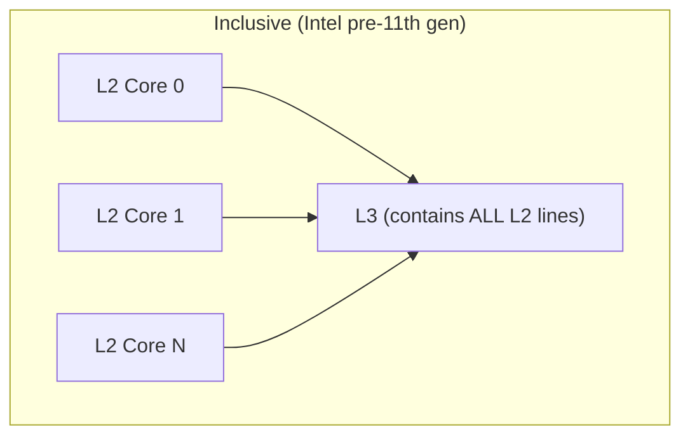
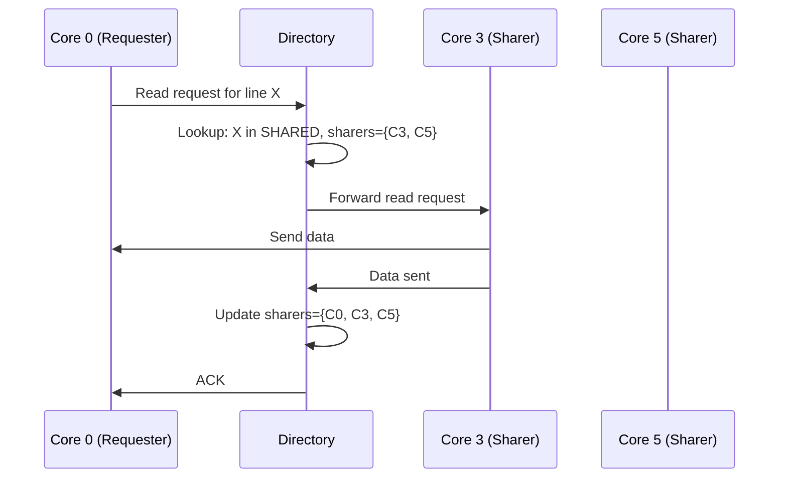
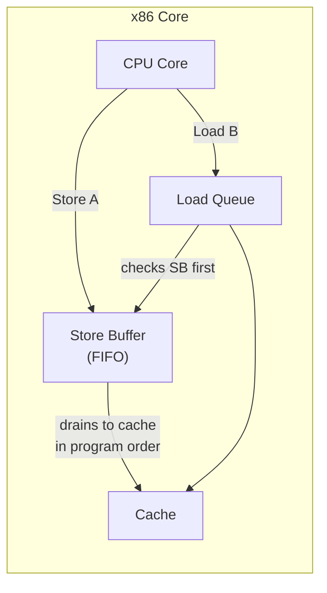

# Cache Coherence Advanced

## Overview

The basic MESI/MOESI protocols (covered in the memory-hierarchy section) assume a **snooping bus** where all cores see all coherence requests. This works for small core counts but scales poorly. Modern many-core systems use **directory-based coherence**, and the interplay between coherence and the programmer-visible **memory consistency model** is subtle and critical for correct concurrent software. This chapter covers both the hardware mechanisms and the software-facing memory models.

## MESI Deep Dive: Implementation Details

### Silent E→M Transition

The Exclusive state's key advantage is the **silent upgrade**: writing to a line in E state doesn't require any bus transaction.

```
Scenario: Private variable (single-threaded code)
  Core 0: Load X → miss → BusRd → no other copies → E state
  Core 0: Store X = 5 → E → M (SILENT, zero bus traffic)
  Core 0: Store X = 10 → M → M (SILENT)
  
Without E state (MSI protocol):
  Core 0: Load X → S state
  Core 0: Store X = 5 → BusUpgr (invalidates no one, wastes bus bandwidth)
  
Intel estimates E state saves ~15-20% of bus transactions on typical workloads.
```

### MESIF (Intel) and MOESI (AMD)

| Protocol | Vendor | Extra State | Purpose |
|----------|--------|-------------|---------|
| MESIF | Intel (Nehalem–Skylake) | **F (Forward)** | Designate one sharer to respond to BusRd, reducing snoop responses |
| MOESI | AMD (all generations) | **O (Owned)** | A sharer can have a dirty copy that others can read (S→O→S without writeback to memory) |
| MESI | ARM, RISC-V, Apple | — | Simpler, works well with inclusive L3 |

#### MOESI Owned State Deep Dive

```
MOESI advantage — cache-to-cache transfer without memory:

Without O (MESI):  Core 0: M (dirty X=5)
  Core 1: Read X → BusRd → Core 0 flushes to memory, Core 1 reads from memory
  Timeline: [flush to mem: 100 cycles] + [read from mem: 40 cycles] = 140 cycles

With O (MOESI):  Core 0: O (dirty X=5)
  Core 1: Read X → BusRd → Core 0 forwards X=5 directly to Core 1
  Core 0: O → O (still holds dirty copy, Core 1 has S)
  Timeline: [cache-to-cache: ~20 cycles]

AMD Zen 4's L3 acts as a Probe Filter:
  L3 tracks which L2s hold each line
  Directs snoop requests only to relevant cores
```

### Inclusive vs. Non-Inclusive vs. Exclusive L3



| Property | Inclusive | Non-Inclusive | Exclusive |
|----------|-----------|---------------|-----------|
| Definition | L3 ⊇ all L2 data | No inclusion guarantee | L3 and L2 are disjoint |
| Coherence | L3 can answer snoop requests alone | Must snoop L2s | L3 is additional capacity |
| Storage overhead | Redundant (L3 stores L2 data) | No redundancy | No redundancy |
| Used by | Intel Skylake, AMD Zen 1-3 | AMD Zen 4 | Intel Golden Cove+, Apple M-series |
| Snoop filtering | L3 acts as snoop filter | Need separate filter | L3 is a victim cache |

> **Interview Angle**: "Why did Intel move from inclusive to exclusive L3?" Inclusive caches waste capacity storing data that's already in L2. With many cores, the inclusion overhead grows. Exclusive L3s provide additional capacity (not a subset of L2) and Intel's Golden Cove uses a **snoop filter** (separate from L3) for coherence.

## Directory-Based Coherence

### The Scalability Problem with Snooping

```
Snooping: Every coherence request is broadcast to ALL cores
  4 cores:  4 snoops per request → manageable
  16 cores: 16 snoops per request → bus bandwidth saturated
  64 cores: 64 snoops per request → completely infeasible
  
  Broadcast bandwidth = O(N) per request
  Snoop logic per core = O(1) per request
  Total system bandwidth = O(N²) for N cores all issuing requests
```

### Directory Protocol: Point-to-Point Instead of Broadcast

A **directory** is a centralized (or distributed) structure that tracks which cores have copies of each cache line. Instead of broadcasting, the requester queries the directory, which forwards the request only to relevant sharers.

```
Directory entry per cache line:
  ┌──────────────────────────────────────────┐
  │ State    │ Sharer Vector / Sharer List     │
  │ (M/S/I)  │ (bitmap: which cores have copy)  │
  └──────────────────────────────────────────┘

Example: 64-core system, directory has 64-bit bitmap
  Bit 5 = 1 → Core 5 has a copy
  Bits 0,3,5 = 1 → Cores 0, 3, 5 share this line
```

### Directory Protocol State Machine

```
Directory states: UNCACHED, SHARED, MODIFIED

Core 0 Read (miss):
  1. Send request to directory
  2. Directory: state = SHARED, sharers = {0,3,5}
  3. Directory forwards request to Core 3 (or any sharer for cache-to-cache)
  4. Core 3 sends data to Core 0
  5. Directory updates sharers = {0,3,5} (add Core 0)

Core 0 Write (miss):
  1. Send request to directory
  2. Directory: state = SHARED, sharers = {0,3,5}
  3. Directory sends invalidate to Cores 3 and 5
  4. Directory waits for ACKs from all
  5. Directory: state = MODIFIED, sharers = {0}
  6. Send data to Core 0 (or Core 3 forwards + invalidates)
```



### Directory Organization

| Type | Description | Storage | Used by |
|------|-------------|---------|---------|
| **Full-map** | One bit per core per line | O(N × M) bits | Small systems (≤16 cores) |
| **Limited-pointer** | Store K sharer IDs (e.g., K=4) | O(K × M) bits | Medium systems |
| **Coarse-vector** | Bitmap at sector/region level | O(N × M/S) bits | Large systems (Intel mesh) |
| **Sparse directory** | Only track lines with multiple sharers | Variable | Research |
| **Broadcast + directory** | Hybrid: broadcast for few sharers, directory for many | Adaptive | AMD Zen 4 (snoop filter + directory) |

### AMD Zen 4's Coherence: Snoop Filter as Directory

AMD Zen uses a **snoop filter** in the L3 that acts as a lightweight directory:

```
AMD Zen 4 Coherence Path:
  1. Request goes to L3 snoop filter
  2. Snoop filter checks: who has this line?
  3. If only requester needs it: no snoop needed (like E state)
  4. If other cores have it: snoop only those cores
  5. L3 data may be forwarded directly (no DRAM access)
  
This is NOT a pure directory (L2 data isn't replicated in L3 on Zen 4)
but the snoop filter provides directory-like point-to-point snoop targeting.
```

## Memory Consistency Models

### Why Consistency Matters

Cache coherence ensures that all cores see the **same data** for each address. Memory consistency defines the **order** in which operations from different cores appear to execute. A weaker consistency model allows more reordering (better performance) but places more burden on the programmer.

```
Core 0:          Core 1:
  x = 1            if (flag == 1)
  flag = 1          assert(x == 1)

Question: Can Core 1 see flag==1 but x==0?

Sequential Consistency: NO (operations appear in program order globally)
x86-TSO:              NO (stores are not reordered with other stores)
ARM/RISC-V (weak):    YES (both stores can be reordered, both loads can be reordered)
```

### Sequential Consistency (SC)

The strongest model: the result of any execution is the same as if all operations were executed in some **total order** consistent with each core's program order.

```
SC guarantees:
  ✅ Loads see the most recent store in the total order
  ✅ All cores agree on the order of all operations
  ✅ No reordering of any kind
  ❌ Requires: no store buffers, no speculative loads, no write combining
  ❌ Performance: terrible — every store is a global synchronization point
```

### Total Store Order (x86-TSO)

x86 implements **TSO**, which is slightly weaker than SC. The only relaxation: **a load can be reordered past an earlier store to a DIFFERENT address**.

```
x86-TSO allowed reordering:
  Store A, then Load B  →  Load B may execute before Store A
  (because the store sits in the store buffer while the load proceeds)

x86-TSO forbidden reordering:
  ✅ Store A, then Store B → never reordered (stores retire in order)
  ✅ Load A, then Load B → never reordered (loads issue in order)
  ✅ Load A, then Store B → never reordered
  ❌ Store A, then Load B → MAY be reordered (if different addresses)
```



### ARM and RISC-V Memory Models

ARM (pre-v8.3) and RISC-V implement **weakly ordered models** that allow more reordering:

| Reordering | x86-TSO | ARMv8 (default) | RISC-V (default) |
|-----------|---------|------------------|------------------|
| Load → Load | ❌ Never | ✅ Allowed | ✅ Allowed |
| Load → Store | ❌ Never | ✅ Allowed | ✅ Allowed |
| Store → Load | ✅ **Allowed** (key difference) | ✅ Allowed | ✅ Allowed |
| Store → Store | ❌ Never | ✅ Allowed | ✅ Allowed |

> **Interview Angle**: "What is the key difference between x86 and ARM memory models?" On x86 (TSO), stores are never reordered with other stores. A store followed by a load to a different address CAN be reordered (the load can read stale data from before the store). On ARM/RISC-V, essentially ALL reorderings are possible — loads and stores can be freely reordered with each other, making the programmer responsible for inserting explicit memory barriers.

### Acquire/Release Semantics

Most ISAs provide acquire/release as portable, efficient synchronization:

```
Acquire (load-acquire, ldar on ARM, acquire on RISC-V):
  - All subsequent loads/stores cannot be reordered BEFORE this load
  - Acts as a one-way fence for following operations
  - Used for: entering a critical section, reading a flag

Release (store-release, stlr on ARM, release on RISC-V):
  - All previous loads/stores cannot be reordered AFTER this store
  - Acts as a one-way fence for preceding operations  
  - Used for: leaving a critical section, publishing data

Example: spinlock using acquire/release:
  lock():
    while (load_acquire(lock_flag) != 0) {}  // acquire: can't move subsequent ops before
    // Critical section here — all our writes visible after we release
  
  unlock():
    store_release(lock_flag, 0)  // release: all previous writes must be visible before this
```

### Memory Fences

| ISA | Fence Instruction | Semantics |
|-----|------------------|-----------|
| x86 | `mfence` | Full fence: all loads/stores ordered |
| x86 | `lfence` | Loads only (also blocks speculation on some CPUs) |
| x86 | `sfence` | Stores only |
| ARM | `dmb ish` | Full data memory barrier (inner shareable) |
| ARM | `dsb ish` | Data synchronization barrier (stronger, waits for completion) |
| ARM | `isb` | Instruction synchronization barrier (flushes pipeline) |
| RISC-V | `fence rw, rw` | Full fence (read+write before, read+write after) |
| RISC-V | `fence r, w` | Read-before-write fence (acquire-like) |

### Store Buffers and Load Queues

The **store buffer** and **load queue** are the microarchitectural structures that cause memory model relaxations:

```
Store Buffer (per core):
  - Holds stores that have executed but not yet committed to L1 cache
  - Allows the CPU to continue without waiting for cache access
  - FIFO (on x86): stores drain in program order
  - Load forwarding: a load to an address in the store buffer gets the buffered value
  - THIS is why x86 allows Store→Load reordering:
    Store [A] goes to store buffer (not yet visible to other cores)
    Load [B] proceeds to cache (may read stale value)
    Other cores see: Load B result, then Store A becomes visible
    → appears as Store A, Load B reordered to Load B, Store A

Load Queue:
  - Tracks in-flight loads in the OoO engine
  - Used to check for memory ordering violations
  - On x86: if a load gets a value that a later store (in program order)
    should have produced, it's a memory ordering violation → must replay
```

### Memory Disambiguation and Speculative Loads

```
Speculative load in OoO execution:
  Store [R1] = 42      ; R1 unknown until this instruction executes
  Load R2, [0x1000]    ; Does this alias with the store?
  
  The load executes speculatively assuming NO alias.
  Later, the store's address (R1) is computed.
  If R1 == 0x1000: alias detected! Load is squashed and replayed.
  If R1 != 0x1000: no alias, load result is valid.

On ARM/RISC-V: this speculation is architecturally visible.
  A speculatively loaded value can be used by a branch, affecting control flow.
  The branch predictor may be trained on wrong-path data.
```

## Interview Questions

### Q1: Why don't we use sequential consistency on all processors?
**A**: SC forbids all reorderings, which means stores can't be buffered and loads can't be speculative. Every store would need to wait for the cache to acknowledge it before the next instruction can issue. This would add ~40 cycles of latency per store, devastating performance. Modern weak models (TSO, ARM, RISC-V) allow the hardware to overlap memory operations while providing synchronization primitives (fences, acquire/release) for when ordering matters.

### Q2: How does a directory protocol scale better than snooping?
**A**: Snooping broadcasts every request to all cores — O(N) bandwidth per request. A directory tracks sharers and forwards requests only to relevant cores — O(1) or O(K) bandwidth where K is the number of sharers (typically small). Directory storage grows as O(N × M) bits where N is cores and M is cache lines, but this is a one-time area cost, not a per-request bandwidth cost.

### Q3: What is the difference between cache coherence and memory consistency?
**A**: Cache coherence ensures that all cores see the **same value** for a given address (no two cores see different values for the same location). Memory consistency defines the **ordering** in which operations from different cores appear to execute. Coherence is about values; consistency is about order. You can have coherence without strong consistency (ARM, RISC-V do this).

### Q4: Explain the x86 store buffer and its impact on TSO.
**A**: The store buffer holds pending stores before they reach L1 cache. A load can bypass a pending store to a different address by reading from cache while the store sits in the buffer. This means a later load can read a value from before an earlier store — a Store→Load reordering. This is the ONLY reordering x86-TSO allows. The store buffer is FIFO, so stores always drain in program order (Store→Store is never reordered).

### Q5: How does acquire/release relate to memory fences?
**A**: Acquire on a load prevents all subsequent memory operations from being reordered before it (acts as a one-way downward fence). Release on a store prevents all prior memory operations from being reordered after it (acts as a one-way upward fence). Together, acquire/release provide ordering sufficient for most synchronization patterns (mutexes, flags, reference counting) without the full overhead of a `mfence`/`dmb` which orders everything in both directions.

## Summary

| Topic | Key Takeaway |
|-------|-------------|
| MESIF vs MOESI | Intel adds Forward state; AMD adds Owned state for cache-to-cache transfer |
| Directory Coherence | Tracks sharers centrally; sends point-to-point instead of broadcast |
| x86-TSO | Only relaxation: Store→Load to different addresses (via store buffer) |
| ARM/RISC-V Models | Weak ordering: all reorderings possible; programmer must use barriers |
| Acquire/Release | One-way fences: acquire blocks later ops, release blocks earlier ops |
| Store Buffers | Cause Store→Load reordering; enable load forwarding within same core |

## Cross-References

- [MESI Basics](../memory-hierarchy/mesi.md) — Foundation protocol states
- [MOESI Basics](../memory-hierarchy/moesi.md) — AMD's coherence variant
- [Coherence Overview](../memory-hierarchy/coherence.md) — The coherence problem
- [OoO Execution](./ooo-execution.md) — Memory disambiguation and store/load queues
- [Side Channels](./side-channels.md) — Speculative loads can leak through coherence