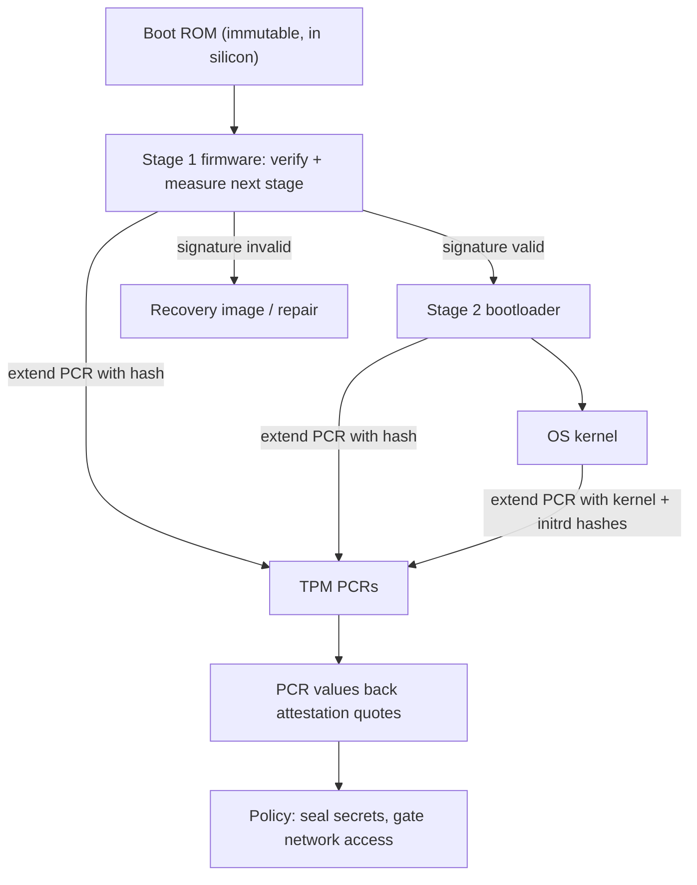
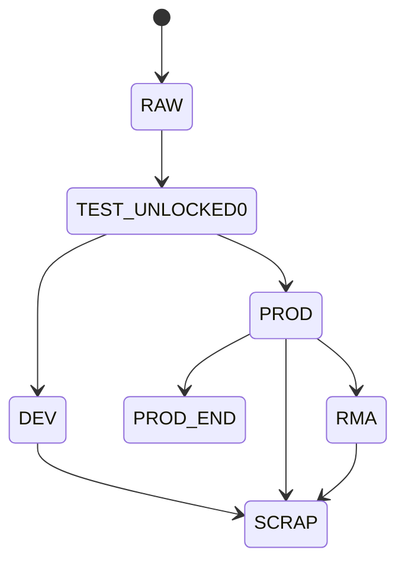
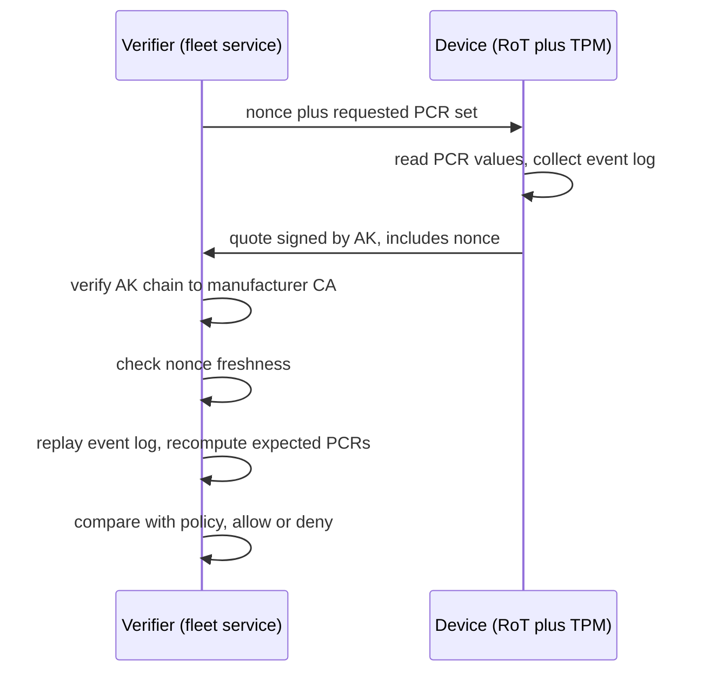

# Hardware Root of Trust

## Overview

Every security guarantee a system makes ultimately rests on a piece of hardware
that cannot be remotely modified: the **root of trust (RoT)**. Software
verification can only authenticate code that is already running -- but something
must bootstrap the very first code, and if that something can be rewritten by an
attacker, every layer above inherits the compromise. This page covers how modern
machines bootstrap trust: the boot chain of trust, OpenTitan's open silicon RoT,
TPM 2.0 PCRs and sealing, UEFI Secure Boot versus measured boot, the RISC-V /
OpenSBI boot flow, and how cloud providers deploy silicon RoT at fleet scale. It
is core material for security-engineering and embedded/firmware roles, and pairs
with the repo's pages on [secure boot](../../linux/security/secure-boot.md),
[remote attestation](../../security/advanced/remote-attestation.md), and
[confidential computing](../../security/advanced/confidential-computing.md).

## Why Software Alone Cannot Bootstrap Trust

A chain of verification needs a fixed starting point. If the bootloader is
verified with a key stored on disk, the key and the bootloader live in the same
attack surface; malware with write access to the block device can replace both.
Bootkits and firmware implants (LoJax, MoonBounce) persist precisely because
they live *below* the OS and survive reinstalls. The solutions all share one
shape -- an immutable compute base that predates any attacker-controlled
storage:

- **Mask ROM**: first-stage code etched into silicon; rewriting it requires
  re-taping the chip, so its integrity is assumed, not checked.
- **OTP memory / fuses**: chip-unique secrets and policy (which keys sign boot
  stages, debug policy) written exactly once, readable but not rewritable.
- **On-die keys**: a private key that never leaves the die, with signing and
  derivation inside the hardware boundary, so OS compromise does not expose the
  identity key.

Trust is then *transitive*: the immutable stage verifies the next stage, which
verifies the next, forming a chain. Everything below is about how that chain is
built, measured, and attested.

## The Boot Chain of Trust

Two distinct mechanisms coexist, and confusing them is a common interview slip:

- **Verified boot**: each stage *cryptographically verifies* the signature of
  the next stage before transferring control. A bad signature means the boot
  fails or falls back to recovery. The chain is only as strong as its first
  link and the key-selection policy.
- **Measured boot**: each stage hashes the next and *records* it -- typically by
  "extending" a TPM platform configuration register (PCR) -- *before* executing
  it. Nothing is blocked; the final PCR values form a tamper-evident fingerprint
  of exactly what ran, checkable later by attestation.

Verified boot enforces *what may run*; measured boot explains *what did run*.
Production systems combine them: the ROM verifies firmware (verified), and the
firmware measures everything into PCRs regardless (measured), so even a policy
mistake is visible in the attestation record. Measured boot also enables
**sealing**: disk-encryption keys released only when the PCR fingerprint matches
a known-good state -- BitLocker's TPM protector is the canonical example.

## OpenTitan: Open-Source Silicon Root of Trust

[OpenTitan](https://opentitan.org/) (hosted under lowRISC with Google, ETH
Zurich, and industry partners) is the first open-source silicon RoT project
building to silicon quality: its **Earlgrey** SoC is a small, auditable design
meant to ship as a discrete chip or an IP block inside larger SoCs. All
components are public, which makes it the best study object for interviews:

- **Ibex RV32 core**: a minimal 2-stage in-order RV32IMC core (the former
  zero-riscy) -- formally approachable, sufficient for firmware that
  orchestrates crypto engines rather than doing bulk crypto itself.
- **Crypto block set**: AES, HMAC-SHA256, KMAC, RSA/ECC accelerators, and a
  hardware **entropy source** with health tests -- the RoT does keys and
  identity, not throughput.
- **OTP controller**: lifecycle configuration and chip-unique data (device ID,
  root key material, debug-enable policy) burned at manufacturing.
- **Key manager**: derives operational keys from a **hardware unique key (HUK)**
  through a one-way ladder, with each stage binding key material to the
  *measurement* of the previous firmware stage -- DICE-style identity, so a
  different software image derives different keys.
- **Lifecycle controller**: the chip's trust level over its whole life, encoded
  in OTP states enforced by hardware.
- Plus the product-hardening kit: alert handler, watchdogs, integrity-checked
  flash/SRAM, and an RV timer.

### Lifecycle States

Silicon RoTs must survive manufacturing, field operation, and returns; OpenTitan
encodes this as lifecycle states burned into OTP:

**RAW / TEST_UNLOCKED\*** covers manufacturing and test with open debug and no
secrets; the transition out is a one-way OTP fuse burn. **DEV** is engineering
samples -- functional with debug, not for production data. **PROD** is field
deployment with debug locked and the key manager active; **PROD_END** closes
production irrevocably. **RMA** re-personalizes returned devices under
manufacturer authorization, and **SCRAP** disables everything. The design point:
*debug access is a lifecycle property, not a runtime switch* -- an attacker who
owns a PROD chip cannot unlock JTAG, and a stolen DEV chip is distinguishable.

## TPM 2.0 Basics: PCRs and Sealing

The Trusted Platform Module ([Trusted Computing Group](https://www.trustedcomputinggroup.org/)
specification) is the standardized RoT: a discrete chip (or firmware
equivalent, fTPM) with measured-boot registers, key storage, and attestation.
Three primitives to know cold:

- **PCRs**: ~24 registers, typically SHA-256 banks, never written directly --
  only *extended*: \\( PCR_{new} = H(PCR_{old} \parallel m) \\) where \\(m\\) is
  the measurement hash. Extension is one-way and order-dependent, so PCRs
  accumulate a fingerprint of the exact boot sequence; a reboot resets them and
  starts a new epoch.
- **Sealing**: encrypting data to a TPM key whose policy references PCR values.
  A disk key sealed to a known-good boot chain unseals only on that machine in
  that state, and unsealing happens *inside* the TPM -- the sealed blob is
  useless elsewhere. BitLocker's TPM protector works this way.
- **Attestation keys**: an endorsement key (EK) provisioned at manufacture
  vouches for the TPM's identity; an attestation identity key (AK) derived from
  it signs **quotes** -- signatures over selected PCR values plus a caller
  nonce. TPM 2.0 adds hierarchies (endorsement/storage/platform),
  dictionary-attack lockout, and NV storage for small policies.

## UEFI Secure Boot vs Measured Boot

Both run on the same hardware; they answer different questions (OS-side detail:
[secure boot](../../linux/security/secure-boot.md); firmware layer:
[BIOS and UEFI](../../os/boot/bios-uefi.md)):

| Aspect | UEFI Secure Boot | Measured Boot |
|---|---|---|
| Mechanism | Signature check against key databases (PK, KEK, db, dbx) | PCR extension of every stage's hash |
| Enforcement | Blocks unsigned/revoked bootloaders | Blocks nothing |
| Failure mode | Refuse to boot; fall back to recovery | Boot proceeds; state is visible later |
| Evidence | None after the fact | PCR values + replayable event log |
| Typical use | Client PCs (shim -> GRUB -> kernel, MOK for custom kernels) | Datacenter fleets: attestation gates for secrets and network |

The databases: PK (platform key) owns the platform; KEKs authorize db updates;
db lists allowed signing keys; dbx lists revocations. Linux chains shim -> MOK
-> GRUB -> kernel with signed modules, and kernel `lockdown` ties security to
the Secure Boot state. The mechanisms compose: Secure Boot decides *what runs*,
measured boot records it, and sealing/attestation *acts* on the record.

## RISC-V Boot Flow with OpenSBI

RISC-V formalizes privilege bootstrapping with firmware at machine level.
[OpenSBI](https://github.com/riscv-software-src/opensbi) is the reference
implementation of the **Supervisor Binary Interface (SBI)**: M-mode firmware
that cold-boots the machine and then hosts S-mode software:

1. **ZSBL** (zero-stage, in mask ROM): minimal SoC init, loads FSBL.
2. **FSBL** (platform-specific): initializes DRAM and typically carries the
   vendor's verified-boot policy (signature checks), then loads OpenSBI.
3. **OpenSBI (M-mode runtime)**: sets up **PMP** (physical memory protection)
   regions to fence M-mode from S/U, configures trap delegation, then either
   chains to a bootloader or stays resident. S-mode software issues `ecall`s
   for services: console, reset/shutdown, HSM (hart start/stop/hotplug), PMU.
4. **U-Boot or EDK II** (S-mode): device-tree fixups, kernel loading, then the
   OS kernel starts.

The design point interviews probe: RISC-V pushes *policy* (verification,
measuring, TPMs) into ZSBL/FSBL or separate RoT hardware, while OpenSBI is the
*privilege-boundary* runtime making M-mode services callable without the OS
touching M-mode state. On confidential-computing RISC-V parts, TEE firmware
takes a further stage with hardware memory protection below the hypervisor
(the Arm analogue is in [CCA and Realms](./arm-cca-realms.md)).

## Silicon RoT at Cloud Scale

Cloud providers treat RoT as fleet infrastructure; the names differ, the
architecture rhymes (described generally -- vendor docs are canonical):

- **Google**: custom security chips (the "Titan" lineage) in servers and Titan
  M in consumer devices -- verified boot of firmware, hardware-held keys, and
  attestation wired into fleet management; a machine is admitted to production
  only with matching boot measurements, and secrets are sealed to those states.
- **AWS**: the **Nitro** system offloads networking/storage to Nitro cards
  guarded by a **Nitro Security Chip** that independently verifies firmware and
  hypervisor; **NitroTPM** exposes a vTPM to guests and Nitro Enclaves provide
  attested isolated compute.
- The common pattern: (1) a discrete RoT whose keys never leave the die, (2)
  measured boot of BMC/firmware/hypervisor with attestation gates, (3) monotonic
  anti-rollback storage so firmware downgrades are detected, and (4) attestation
  wired into workload admission -- machines whose PCRs fail policy get no
  secrets and no traffic.

This is the PC chain-of-trust theory applied with fleet automation, and the
interesting engineering is making it *continuous* -- a machine can be
compromised after boot, so run-time attestation extends the model (the
build-side complement: [supply-chain security](../../security/supply-chain-security.md)).

## Attestation

Attestation is the act of *proving software identity to a verifier*:

Points to articulate: the **nonce** defeats replay of old quotes; the **AK
certificate chain** ties the quote to a specific manufactured device; the
**event log** explains *how* PCRs got their values, since PCRs alone are opaque
hashes; and the allow/deny **policy** decision belongs to the verifier, not the
device. The same pattern recurs in confidential computing -- SEV-SNP, TDX, and
CCA all produce signed evidence of firmware plus guest state (see
[remote attestation](../../security/advanced/remote-attestation.md) and
[confidential computing](../../security/advanced/confidential-computing.md)) --
and RoTs like OpenTitan make the same claims for embedded devices whose only
network is a factory floor.

## Interview Relevance: Security and Embedded Roles

- **Security roles**: expect "walk me through what Secure Boot actually checks"
  and "how does root access still fail to unseal the disk?" -- answers require
  the verified-vs-measured distinction and PCR sealing mechanics.
- **Embedded/firmware roles**: lifecycle states, HUK-derived keys, debug
  locking, and anti-rollback are daily vocabulary; OpenTitan is the one
  codebase you can read end-to-end to speak it concretely.
- **Cloud/infra roles**: attestation admission control and vTPM usage appear in
  confidential-computing design questions; connecting TPM mechanics to
  SEV-SNP/TDX evidence formats is the differentiating depth.
- **Systemic question**: "where does trust start?" -- the disciplined answer is
  mask ROM plus OTP keys plus a key that never leaves the die, then the
  transitive chain, with the admission that physical attacks (glitching, side
  channels) bound everything above.

## References

- OpenTitan project: <https://opentitan.org/>
- Trusted Computing Group (TPM 2.0 specifications): <https://www.trustedcomputinggroup.org/>
- OpenSBI (RISC-V supervisor firmware): <https://github.com/riscv-software-src/opensbi>
- Cited by title (no link): "TPM 2.0 Library Specification, Part 1: Architecture"
  (TCG); OpenTitan Earlgrey documentation (lifecycle controller, key manager
  specs); "RISC-V SBI Specification" (RISC-V International); UEFI Specification,
  Secure Boot sections (UEFI Forum); TCG "DICE Attestation Architecture".

## Cross-References

- [Arm CCA and Realms](./arm-cca-realms.md) -- the confidential-computing
  analogue on Arm: hardware-enforced address spaces and realm attestation.
- [Secure Boot](../../linux/security/secure-boot.md) -- the OS-side of UEFI
  Secure Boot: shim, MOK, kernel lockdown.
- [BIOS and UEFI](../../os/boot/bios-uefi.md) -- the firmware layer the boot
  chain of trust starts from.
- [Remote Attestation](../../security/advanced/remote-attestation.md) -- the
  verifier-protocol deep dive beyond the sequence diagram here.
- [Confidential Computing](../../security/advanced/confidential-computing.md)
  -- SEV-SNP/TDX/SGX: silicon RoT extended into runtime memory protection.
- [Supply-Chain Security](../../security/supply-chain-security.md) -- what gets
  measured must first be trustworthy to build and distribute.
- [Boot Process](../../os/kernel-advanced/boot-process.md) -- the kernel-side
  view of what happens after the chain of trust hands off.

## Interview Questions

1. **Explain the difference between verified boot and measured boot.**
   Verified boot is *preventive*: each stage checks the next stage's signature
   and refuses to boot on failure, enforcing what may run. Measured boot is
   *detective*: each stage hashes the next and extends a PCR before executing
   it, so nothing is blocked but the final PCR fingerprint identifies exactly
   what ran, checkable later via attestation. Production systems use both,
   because verified boot can fail open by misconfiguration and measurement
   makes that visible.

2. **Why is a PCR extended rather than written, and what property does that
   give?**
   Extension computes \\(PCR_{new} = H(PCR_{old} \parallel m)\\), which is
   one-way and order-dependent. You cannot set a PCR to a chosen value without
   actually executing the corresponding software, so final PCR values
   authenticate the boot sequence itself, not a claim about it. The cost is
   opacity: PCRs are hashes, so the verifier needs the event log to interpret
   which components they commit to.

3. **What problem do OpenTitan's lifecycle states solve, and why is debug
   access a lifecycle property?**
   They manage trust across the chip's whole life: manufacturing needs open
   debug and no secrets (RAW/TEST), engineering needs restrained debug (DEV),
   deployment needs locked debug with active keys (PROD), returns need
   scrubbing (RMA), and dead chips need a terminal state (SCRAP). Debug is
   burned into OTP fuses because a runtime switch would be attacker-reachable;
   making it irreversible and stage-gated means a stolen PROD chip cannot be
   turned into a DEV chip and JTAG cannot be re-enabled in the field.

4. **How does key sealing with a TPM protect data at rest, and what does it
   not protect against?**
   The disk key is encrypted to a TPM key whose policy references PCRs from a
   known-good boot; the TPM unseals it only if the current boot state extends
   to exactly those values, so an attacker who boots modified firmware finds
   the key unavailable even as root. It does not protect against compromise
   *after* unsealing while the OS runs, nor against attack classes outside its
   threat model (physical/DMA attacks), and user-PIN guessing is only bounded
   by the TPM's anti-hammering lockout.

5. **What does an attestation quote prove, and what checks does a verifier
   perform on it?**
   A quote is the AK's signature over a selected PCR set plus a nonce; it
   proves that the device holding that AK, at that moment, had those PCR
   values. The verifier checks (1) the AK certificate chain back to a
   manufacturer CA, so the quote comes from genuine hardware; (2) nonce
   freshness, so the quote is not replayed; (3) semantic validity -- replay the
   event log to recompute expected PCRs and compare with policy. Only then
   does it release secrets or admit the device.

6. **Describe the RISC-V boot flow through OpenSBI and what problem SBI solves.**
   Mask ROM (ZSBL) loads an FSBL that initializes DRAM and may verify
   signatures; OpenSBI then runs in M-mode, sets up PMP to fence M-mode state,
   and either chains to U-Boot/EDK II or stays resident as the SBI runtime.
   SBI solves the privilege-boundary service problem: S-mode software calls
   firmware services (console, hart management, reset, PMU) via `ecall` instead
   of touching M-mode CSRs directly, so the OS needs no machine-level code and
   vendors can vary hardware behind a stable interface.

7. **How do cloud providers generalize the PC RoT model to fleets?**
   Every server carries a discrete security chip holding chip-unique keys and
   verifying firmware (Google Titan lineage, AWS Nitro Security Chip); boot of
   BMC/firmware/hypervisor is measured; attestation gates admission -- quotes
   must match policy before a machine receives disk keys, service identity, or
   traffic; monotonic counters block firmware downgrade; guests get vTPMs or
   attested enclaves for their own chains. The engineering challenge is
   operating this continuously: attestation is not a boot-time checkbox but a
   standing property of fleet admission.
