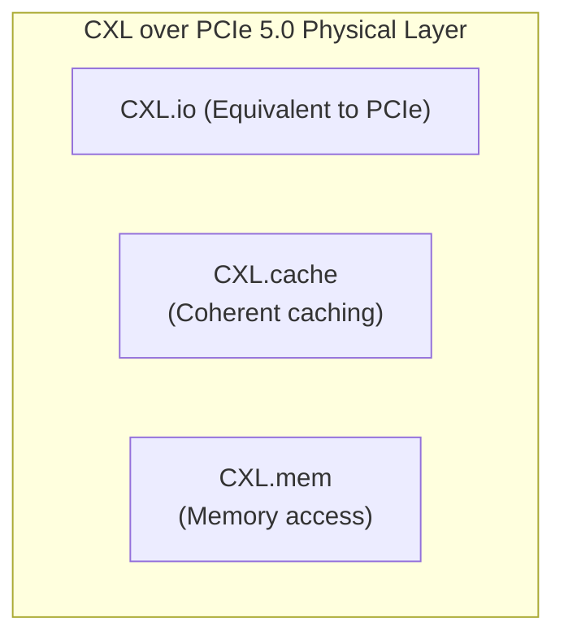
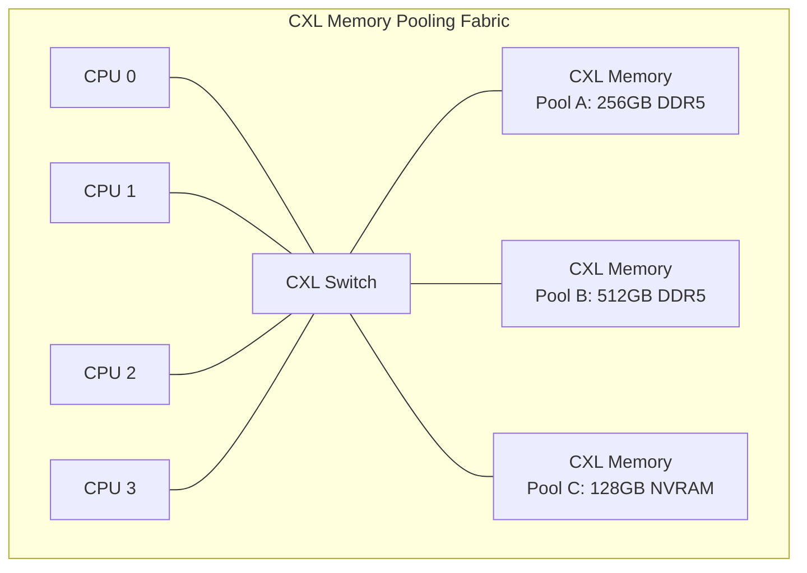

# Modern Interconnects and Packaging

## Overview

The traditional model of a monolithic CPU die connected to DDR memory over a DDR bus and peripherals over PCIe is breaking down. Modern systems use **chiplet-based designs**, **coherent interconnects (CXL)**, **advanced packaging (2.5D/3D stacking)**, and **persistent memory (NVRAM)** to overcome the limitations of scaling a single die. This chapter covers the interconnect and packaging technologies that define modern server and data-center architecture.

## CXL (Compute Express Link)

### What CXL Solves

PCIe is a non-coherent interconnect: a device on PCIe cannot directly access a CPU's cache-coherent memory space. Every transfer requires explicit DMA setup, driver involvement, and cache flushing. This is fine for NICs and SSDs but becomes a bottleneck when devices need **fine-grained shared memory access**.

```
PCIe model (non-coherent):
  CPU wants device data:
    1. Device DMAs data to system memory (via driver)
    2. CPU reads from system memory
    3. Cache coherence handled by CPU's own coherence protocol
    4. Two copies of data: one in device, one in CPU memory

CXL model (coherent):
  CPU accesses device-attached memory as if it were local:
    1. CPU issues normal load to device-attached address
    2. CXL handles coherence (snooping, invalidation)
    3. One copy, cache-coherent across CPU and device
```

### CXL Three Protocols

CXL runs over the **PCIe 5.0 physical layer** but replaces the transaction layer with three protocol layers:



| Protocol | Purpose | Use Case |
----------|---------|----------|
 **CXL.io** | Non-coherent I/O (PCIe equivalent) | Device discovery, configuration, interrupts |
 **CXL.cache** | Device caches CPU memory | Accelerators that cache host data (GPU, DPU) |
 **CXL.mem** | CPU accesses device-attached memory | Memory expansion, memory pooling, tiered memory |

### CXL Memory Types

```
CXL Type 1: Device with CXL.cache only
  → Accelerator that caches host memory (smart NIC, FPGA)
  → Device is a "cache client" of host memory

CXL Type 2: Device with CXL.cache + CXL.mem
  → Device has its own memory AND can cache host memory
  → GPU, DPU, FPGA with local DDR/HBM
  → CPU can access device memory coherently

CXL Type 3: Device with CXL.mem only (memory expansion)
  → No device processing, just memory
  → CXL-attached DDR5, HBM, or NVRAM
  → CPU sees it as additional coherent memory
  → NO caching of host memory (pure memory device)
```

### CXL Memory Pooling



```
Benefits of CXL memory pooling:
  1. Dynamic allocation: assign memory to whichever CPU needs it
  2. Memory tiering: hot data in DDR5, warm data in NVRAM, cold on SSD
  3. Reduced over-provisioning: share a pool instead of provisioning per-server
  4. Live migration: move memory between CPUs without data copy
  5. Failure recovery: memory can survive CPU failure (disaggregated)

CXL 3.0 (2023): adds fabric management for multi-host, multi-switch topologies
```

### Memory Tiering with CXL

```
Tiered memory hierarchy with CXL:
  L1 Cache:     48-96 KB    (per core, ~1 ns)
  L2 Cache:     1-2 MB      (per core, ~3 ns)
  L3 Cache:     32-96 MB    (shared, ~10 ns)
  Local DDR5:   128-1024 GB (per socket, ~80 ns)
  CXL DDR5:     256-2048 GB (pooled, ~120-150 ns)
  CXL NVRAM:    128-1024 GB (pooled, ~300-500 ns)
  NVMe SSD:     1-32 TB     (~10,000 ns)

Memory tiering software (e.g., Intel TAD, memkind, tiered memory in Linux 6.1+):
  - Migrate hot pages to local DDR5
  - Migrate warm pages to CXL DDR5
  - Migrate cold pages to CXL NVRAM or SSD
  - Policies: NUMA balancing, hot-page detection, demotion/promotion
```

> **Interview Angle**: "What problem does CXL solve?" CXL provides cache-coherent access to device-attached memory over a standard interconnect. This enables memory pooling (multiple CPUs share a pool of CXL-attached memory), memory tiering (fast + slow memory visible to all CPUs), and accelerators that can coherently access host memory. It runs over the PCIe physical layer but adds coherence protocols.

## Chiplets and Die-to-Die Interconnects

### Why Chiplets?

```
Monolithic die scaling problems:
  1. Yield: a 600mm² die has ~30% yield at 5nm vs ~90% for a 100mm² chiplet
  2. Cost: reticle limit (~800mm²) constrains maximum die size
  3. Heterogeneity: CPU, GPU, and I/O have different process requirements
  4. Reuse: one I/O chiplet can serve multiple CPU chiplet generations

Chiplet approach:
  - Split into multiple small dies
   - Connect with high-speed die-to-die interconnect
   - Package together on a substrate
  - Achieves "monolithic-like" performance at better yield/cost
```

### Real-World Chiplet Designs

| Processor | Chiplets | Interconnect | Packaging | Year |
-----------|----------|-------------|-----------|------|
 AMD EPYC 9004 (Genoa) | 1 IOD + 12 CCDs (Zen 4) | Infinity Fabric 3.0 | Organic substrate | 2022 |
 AMD EPYC 9005 (Turin) | 1 IOD + up to 16 CCDs (Zen 5) | Infinity Fabric 4.0 | 2024 |
 Intel Arrow Lake | 1 Compute + 1 SOC + 1 GFX + 1 IOE | Foveros | 3D stacking | 2024 |
 Apple M2 Ultra | 2× M2 Max dies | Custom die-to-die | 2.5D | 2023 |
 AWS Graviton 4 | 1 compute + 1 I/O die | Custom mesh | 2.5D | 2023 |

### AMD's Infinity Fabric

```
AMD EPYC (Genoa) chiplet layout:

  ┌──────────────────────────────────────────┐
  │           I/O Die (IOD)                  │
  │  ┌─────┐ ┌─────┐ ┌─────┐ ┌─────┐        │
  │  │CCD 0│ │CCD 1│ │CCD 2│ │CCD 3│        │
  │  └──┬──┘ └──┬──┘ └──┬──┘ └──┬──┘        │
  │     │       │       │       │           │
  │  ┌──┴──┐ ┌──┴──┐ ┌──┴──┐ ┌──┴──┐        │
  │  │CCD 4│ │CCD 5│ │CCD 6│ │CCD 7│        │
  │  └─────┘ └─────┘ └─────┘ └─────┘        │
  │           (8 CCDs per side)             │
  └──────────────────────────────────────────┘

Each CCD: 8 Zen 4 cores, 32MB L3, 1MB L2 total
IOD: DDR5 controllers, PCIe 5.0, CXL, Infinity Fabric crossbar
```

## UCIe (Universal Chiplet Interconnect Express)

### Standardizing Die-to-Die

UCIe is an industry standard (Intel, AMD, ARM, TSMC, Samsung) for die-to-die interconnects, analogous to how PCIe standardized board-to-board interconnects.

```
UCIe specification:
  Physical layer: supports multiple packaging technologies
    - Standard 2.5D (organic substrate): 2-4 GT/s per mm width
    - Advanced 2.5D (silicon interposer): 8-16 GT/s per mm width
    - 3D (die stacking): 16-32 GT/s per mm width
  
  Protocol layer:
    - Streaming mode: like PCIe (flit-based, no coherence)
    - CXL mode: full CXL.cache + CXL.mem over UCIe
    
  Goal: chiplets from different vendors can interoperate
  - An Intel compute chiplet + an ARM I/O chiplet on the same package
  - A TSMC-manufactured die + a Samsung-manufactured die
```

| Specification | UCIe 1.0 | UCIe 2.0 | 
--------------|---------|---------|
 Max bandwidth (2.5D) | 4 GT/s/mm | 8-16 GT/s/mm |
 Max bandwidth (3D) | 8 GT/s/mm | 16-32 GT/s/mm |
 Latency | ~2 ns | <1 ns |
 Protocol support | PCIe-like + CXL | CXL 3.0 + custom |

## 2.5D and 3D Packaging

### 2.5D Packaging (Silicon Interposer)

```
2.5D packaging (e.g., TSMC CoWoS):

  ┌─────────────────────────────┐
  │        Silicon Interposer    │  ← thin silicon wafer with
  │  ┌─────┐  ┌─────┐  ┌─────┐  │     micro-scale wiring
  │  │ Die │  │ Die │  │ HBM │  │
  │  │  A  │  │  B  │  │stack│  │  ← dies connected via
  │  └─────┘  └─────┘  └─────┘  │     microbumps to interposer
  └─────────────────────────────┘
          │
     ┌────┴────┐
     │Package  │  ← organic substrate
     │Substrate│
     └─────────┘

Interposer wiring: sub-micron pitch (1-10 μm)
  vs. organic substrate: ~50 μm pitch
  → 10-100× more routing density → higher bandwidth
  → Used for: GPU+HBM (NVIDIA H100), FPGA+HBM (Xilinx)
```

### 3D Stacking (Die-on-Die)

```
3D stacking (e.g., Intel Foveros, TSMC SoIC):

  ┌──────────────────┐
  │  Top Die         │  ← Compute logic (5nm)
  │  ┌──────────────┐ │
  │  │ Bottom Die   │ │  ← Base die with I/O (7nm)
  │  │ (TSV links)  │ │
  │  └──────────────┘ │
  └──────────────────┘

Connection: Through-Silicon Vias (TSVs)
  - Vertical electrical connections through the die
  - Pitch: 10-50 μm (current), targeting <10 μm
  - Each TSV: ~1-10 Gb/s
  - Thousands of TSVs per die → Tbps of bandwidth
  - Latency: <1 ns (very short physical distance)
```

### Intel Foveros and TSMC SoIC

| Technology | Vendor | Pitch | Use Case |
-----------|--------|-------|----------|
 Foveros | Intel | 36-50 μm | Lakefield, Arrow Lake, Ponte Vecchio |
 Foveros Direct | Intel | <10 μm | Next-gen products |
 CoWoS-S | TSMC | ~65 μm | NVIDIA H100 + HBM3 |
 CoWoS-R | TSMC | ~55 μm | Larger interposer for chiplets |
 SoIC | TSMC | <10 μm | 3D-stacked chiplets |

## HBM, DDR5, and LPDDR

### HBM (High Bandwidth Memory)

```
HBM Architecture:
  - DRAM dies stacked vertically (8-12 layers)
  - Connected via TSVs (thousands of vertical wires)
  - Wide interface: 1024-2048 bits per stack
  - Slower per-pin rate than DDR5 but massively wider bus

HBM3e (2024):
  Per-stack bandwidth:  819 GB/s (2048-bit at 3.2 Gb/s per pin)
  Capacity per stack:   24 GB (12-Hi stack, 2GB per die)
  Power efficiency:     ~30 pJ/bit (vs. ~50 pJ/bit for DDR5)

NVIDIA H100:  6× HBM3 stacks = 4.9 TB/s, 80 GB total
AMD MI300X:   8× HBM3 stacks = 5.3 TB/s, 192 GB total
```

### DDR5

```
DDR5 key improvements over DDR4:
  Data rate:       4800-8400 MT/s (vs DDR4: 1600-3200 MT/s)
  Burst length:    16 (vs DDR4: 8) → more data per access
  Bank groups:     8 groups × 8 banks = 64 banks (vs DDR4: 4×4=16)
  Channel:         2 independent 32-bit channels per DIMM (vs 1×64-bit)
  On-DIMM ECC:     Optional ECC inside the DRAM chip itself
  DIMM voltage:    1.1V (vs DDR4: 1.2V)
  Max capacity:    128 GB per DIMM (vs DDR4: 64 GB)

DDR5-6400 module: ~51 GB/s per DIMM (2 × 32-bit × 6400 MT/s)
DDR5-8400 module: ~67 GB/s per DIMM
```

### LPDDR5X (Low Power)

```
LPDDR5X (mobile/embedded):
  Data rate:       8533 MT/s
  Voltage:         1.05V (down from 1.1V for LPDDR5)
  Banks:           16 banks × 8 bank groups
  Capacity:        up to 32 GB per package
  Use cases:       Smartphones, laptops (Apple M-series uses LPDDR)

Apple M2 Pro:  LPDDR5-6400, 200 GB/s, 200-pin package
Apple M2 Ultra:  LPDDR5-6400, 800 GB/s (4×256-bit channels)
```

## Persistent Memory (NVRAM)

### Intel Optane DC Persistent Memory

```
Optane DC PMEM (discontinued, but architecture matters):
  Technology: 3D XPoint (phase-change memory)
  Latency:    ~300 ns (read), ~2000 ns (write)
  Endurance:  ~100 PBW (petabytes written) per module
  Capacity:   128-512 GB per DIMM
  Interface:  DDR4 bus (but much slower than DRAM)
  Byte-addressable: YES (unlike SSDs which are block-addressable)
  Persistence: survives power loss (unlike DRAM)

Access modes:
  Memory Mode: PMEM acts as volatile memory (cached in DDR4, transparent)
  App Direct: PMEM is directly accessed by applications (persistent)
```

### Programming Persistent Memory

```
Persistent memory programming challenges:
  1. Data is byte-addressable but NOT cache-coherent after power loss
     → Must flush CPU caches before considering data persistent
     → clwb, clflushopt, sfence sequence

  2. Crash consistency: what if power fails mid-update?
     → Need atomic updates or undo/redo logging
     → Libraries: libpmem (PMDK), pmem2

  3. Memory ordering: stores to PMEM may be reordered
     → Need fences to ensure durability order

Pseudocode for persistent update:
  // Ensure old data is durable before overwriting
  clwb(old_data_ptr)    // flush cache line to PMEM
  sfence()              // ensure flush completes
  
  // Write new data
  *ptr = new_value
  clwb(ptr)             // flush new data to PMEM
  sfence()              // ensure durability
```

### Future of Persistent Memory

Intel discontinued Optane (3D XPoint) in 2022, but the **architecture** lives on:

| Technology | Vendor | Latency | Endurance | Status |
-----------|--------|---------|-----------|--------|
 3D XPoint (Optane) | Intel/Micron | ~300 ns | 100 PBW | Discontinued |
 CXL-attached NVRAM | Samsung, SK Hynix | ~300-500 ns | 10-100 PBW | Emerging (2024+) |
 SCM (Storage Class Memory) | Various | ~1 μs | 10-100 PBW | CXL-based future |
 CXL-NVRAM modules | Multiple | ~300 ns via CXL | 10+ PBW | CXL Type 3 device |

> **Interview Angle**: "How does CXL enable memory pooling?" CXL Type 3 devices expose memory that any CPU in the fabric can access coherently. A CXL switch connects multiple CPUs to a shared pool of memory devices. The operating system can dynamically allocate pages from this pool to any CPU, enabling memory overcommit, dynamic tiering, and reduced per-server memory over-provisioning in data centers.

## Interview Questions

### Q1: What is CXL and how does it differ from PCIe?
**A**: CXL is a standard that runs over the PCIe 5.0 physical layer but adds cache-coherent protocols. PCIe is non-coherent — devices use DMA and explicit driver calls to transfer data. CXL adds CXL.cache (device caches host memory), CXL.mem (host accesses device memory), and maintains cache coherence across CPU and device. This enables memory pooling, tiered memory, and accelerators that can coherently share data with the CPU.

### Q2: Why do AMD and Intel use chiplet designs?
**A**: Chiplets solve yield, cost, and heterogeneity problems. A 600mm² monolithic die has low yield (~30% at 5nm). Splitting into smaller chiplets (100mm² each) gives ~90% yield per chiplet. Chiplets also allow mixing process nodes (CPU chiplets on latest node, I/O on older, cheaper node) and reusing I/O chiplets across generations. AMD's EPYC uses 1 I/O die + 12 compute chiplets.

### Q3: What is the difference between 2.5D and 3D packaging?
**A**: 2.5D places multiple dies side-by-side on a silicon interposer, connected via horizontal micro-scale wiring (1-10 μm pitch). Used for GPU+HBM (e.g., NVIDIA H100). 3D stacks dies vertically using Through-Silicon Vias (TSVs), achieving the shortest possible interconnects (<1 ns latency). Intel's Foveros and TSMC's SoIC are 3D technologies. 2.5D is for high-bandwidth horizontal communication; 3D is for ultra-low-latency vertical stacking.

### Q4: Compare HBM and DDR5.
**A**: HBM uses a wide 1024-2048-bit interface with dies stacked vertically via TSVs, achieving 800+ GB/s per stack but at lower per-pin rates. DDR5 uses narrow 32-bit channels (2 per DIMM) at very high per-pin rates (8400 MT/s), achieving ~67 GB/s per DIMM. HBM is 10-100× more expensive and used in GPUs/accelerators. DDR5 is commodity memory for main system RAM. HBM also has better power efficiency (~30 pJ/bit vs ~50 pJ/bit).

### Q5: Why is persistent memory hard to program?
**A**: PMEM is byte-addressable like DRAM but retains data across power loss. The challenge is ensuring **crash consistency**: if power fails during a multi-step update, the on-disk state must be recoverable. Programmers must explicitly flush cache lines to PMEM (clwb/sfence) before considering data durable, and use atomic updates or logging (undo/redo) for multi-word updates. Libraries like PMDK (libpmem) provide data structures for persistent memory.

## Summary

| Technology | Key Benefit | Bandwidth | Latency |
-----------|-------------|-----------|---------|
 CXL Type 3 | Coherent memory pooling | 64 GB/s per link | ~120-150 ns |
 Chiplets | Yield + heterogeneity | 100+ GB/s (Infinity Fabric) | ~20-40 ns |
 UCIe | Standard die-to-die | Up to 32 GT/s/mm | <1-2 ns |
 2.5D Packaging | High-density interconnect | 100s of GB/s | ~5-10 ns |
 3D Stacking | Ultra-low latency | 100s of GB/s | <1 ns |
 HBM3e | Maximum bandwidth | 819 GB/s/stack | ~10-20 ns |
 DDR5-8400 | Commodity high-speed | ~67 GB/s/DIMM | ~80 ns |
 NVRAM/PMEM | Persistence + byte-addressable | ~40 GB/s | ~300 ns |

## Cross-References

- [DDR Basics](../memory-tech/ddr.md) — DDR generation evolution
- [DRAM Technology](../memory-tech/dram.md) — DRAM cell and timing fundamentals
- [HBM Basics](../memory-tech/hbm.md) — HBM architecture overview
- [NVM Basics](../memory-tech/nvm.md) — Non-volatile memory technologies
- [PCIe](../io/pcie.md) — Physical layer that CXL builds upon
- [Accelerators](./accelerators.md) — Devices that use CXL for coherent memory access
