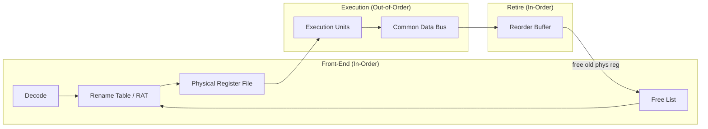
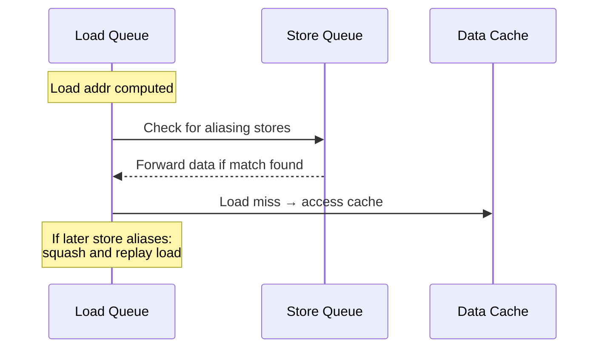
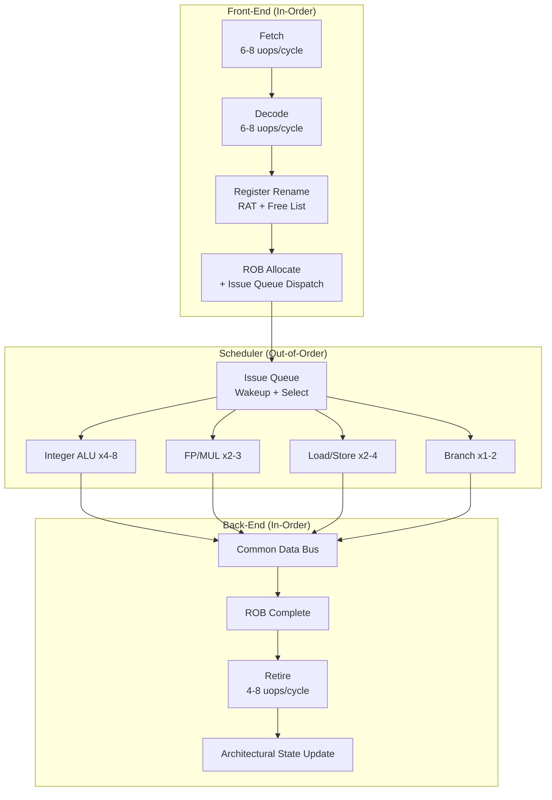

# Out-of-Order Execution: Deep Dive

## Overview

This chapter goes beyond the basic concept of out-of-order execution and examines the **Tomasulo algorithm** — the theoretical foundation — and how modern processors implement it with **register renaming**, **reorder buffers**, **reservation stations**, and **instruction windows**. We trace the evolution from Tomasulo's 1967 IBM 360/91 to today's Intel Golden Cove and Apple M2 Firestorm.

## Tomasulo's Algorithm

### Historical Context

Robert Tomasulo published his algorithm in 1967 for the IBM System/360 Model 91 floating-point unit. The key insight was to use **register tagging** instead of stalling, allowing instructions to wait for operands without blocking the entire pipeline. Every modern OoO processor is a descendant of this idea.

### Core Mechanism: Common Data Bus (CDB)

The CDB is the critical broadcast mechanism. When an execution unit completes an instruction, it broadcasts the result along with the instruction's tag on the CDB. All reservation stations listen simultaneously.

```
Common Data Bus (CDB) broadcast:

  Execution Unit ──→ [Tag: I3, Result: 0x42] ──→ Reservation Station 1 (waiting for I3)
                                                  ──→ Reservation Station 2 (waiting for I3)
                                                  ──→ Reservation Station 3 (waiting for I7, ignores)
```

### Tomasulo Step by Step

```pseudocode
# Simplified Tomasulo algorithm

# ISSUE (in program order)
function issue(instruction):
    rs = get_free_reservation_station()
    if rs is None:
        stall()  # structural hazard: no free RS
        return
    
    for each source operand:
        if register_ready(operand):
            rs.Vj or rs.Vk = register_value(operand)
        else:
            rs.Qj or rs.Qk = register_tag(operand)  # wait for this tag
    
    # Tag destination register
    rs.dest = instruction.dest
    register_tag(instruction.dest) = rs.tag

# EXECUTE (out of order)
function execute(rs):
    if rs.Qj is not None or rs.Qk is not None:
        return  # operands not ready yet
    
    # Both operands ready — issue to execution unit
    result = compute(rs.op, rs.Vj, rs.Vk)
    
    # WRITE RESULT (broadcast on CDB)
    broadcast(rs.tag, result)
    
    for each reservation_station in all_RS:
        if rs_station.Qj == rs.tag:
            rs_station.Vj = result
            rs_station.Qj = None
        if rs_station.Qk == rs.tag:
            rs_station.Vk = result
            rs_station.Qk = None
    
    if register_tag(some_register) == rs.tag:
        register_value(some_register) = result
        register_tag(some_register) = None  # now ready
```

> **Interview Angle**: "Explain Tomasulo's algorithm." Start with the problem (WAR/WAW hazards in scoreboarding), then explain how reservation stations + CDB solve it. Mention that Tomasulo doesn't handle precise exceptions — that requires a reorder buffer (added later).

## Register Renaming

### The Problem: False Dependencies

```
i1: ADD  R1, R2, R3    # writes R1
i2: SUB  R4, R1, R5    # reads R1 (true/RAW dependency)
i3: MUL  R1, R6, R7    # writes R1 (WAW: output dependency)
i4: DIV  R8, R1, R9    # reads R1 (WAR: anti-dependency with i3)
```

WAW and WAR are **false dependencies** — they exist because we reuse architectural register names, not because of actual data flow. Renaming eliminates them by mapping each write to a unique physical register.

### Renaming Implementation

```
Architectural Registers:  R0–R31  (ISA visible)
Physical Registers:       P0–P255 (hardware only)

Rename Table (RAT): maps arch → phys
  R0 → P12
  R1 → P45  (most recent writer)
  R2 → P7
  ...

Free List: [P88, P89, P90, P91, ...]  (available physical regs)
```



### Two-Level Renaming: RRF + RMT

Modern CPUs use a two-level structure to avoid the bottleneck of a single rename table:

| Structure | Abbreviation | Purpose | Size (typical) |
|-----------|-------------|---------|----------------|
| Architectural Register Map Table | **RMT / RRT** | Maps arch reg → current physical reg | 32–64 entries |
| Register Alias Table (per-RAT) | **RAT** | Per-ROB-entry snapshot of mappings | 1 entry per ROB slot |
| Retirement Register File | **RRF** | Holds committed architectural state | 32–64 entries |

**Intel's approach**: Uses a **RAT + RRF** design. The RAT holds speculative mappings. On retirement, results are copied from the PRF to the RRF. If a mispeculation occurs, the RRF provides the checkpoint to restore from.

**AMD's approach (Zen 4)**: Uses a **physically-indexed register file** with a larger PRF (224 integer, 192 FP physical registers). Renaming is done via a unified mapping table.

**Apple's approach (M2 Firestorm)**: Uses an extremely large PRF (380+ integer physical registers) and a deep ROB (~600 entries), allowing massive instruction windows.

> **Interview Angle**: "Why do we need register renaming?" Answer: to eliminate WAW and WAR false dependencies. Follow up: "How are physical registers managed?" The free list is replenished at retirement; old mappings are freed in program order.

## Reorder Buffer (ROB)

### Structure

The ROB is a circular buffer that tracks every in-flight instruction in program order:

```
ROB Entry (per instruction):
┌─────────────────────────────────────────────────┐
│ Valid    │ Instruction opcode                    │
│ Dest     │ Physical register for result          │
│ State    │ Issued → Executing → Complete → Retired│
│ Exception│ Pending exception info (if any)        │
│ PC       │ Program counter of this instruction   │
│ Store?   │ Store address + data (if store)        │
│ Speculative │ Which branch prediction this depends on │
└─────────────────────────────────────────────────┘

Head pointer → oldest unretired instruction
Tail pointer → next slot to allocate
```

### ROB-Based vs. History-Based Renaming

There are two competing approaches to integrating renaming with the ROB:

| Approach | How it works | Used by |
|----------|-------------|---------|
| **ROB-based** | ROB entry holds the result; on retirement, result is copied to the architectural register file | Intel (pre-Sandy Bridge), simpler design |
| **History-based** | Results go directly to the PRF; the ROB only tracks ordering; old physical regs freed on retirement | Intel (post-Sandy Bridge), AMD Zen, Apple M-series |

History-based renaming is preferred in modern designs because it avoids an extra copy on retirement.

### ROB Sizes Across Generations

| Processor | Year | ROB Size | PRF (Int/FP) | Issue Queue |
|-----------|------|----------|--------------|-------------|
| Intel Pentium Pro | 1995 | 40 | 40/40 | 20 RS |
| Intel Nehalem | 2008 | 128 | 128/128 | 36 RS |
| Intel Skylake | 2015 | 224 | 180/168 | 97 RS |
| Intel Golden Cove | 2021 | 512 | 280/192 | — |
| AMD Zen 1 | 2017 | 192 | 180/160 | — |
| AMD Zen 4 | 2022 | 320 | 224/192 | — |
| Apple M1 Firestorm | 2020 | ~630 | 380+ int | — |
| Apple M2 Firestorm | 2022 | ~600+ | 380+ int | — |

> **Interview Angle**: "Why is Apple's M2 ROB so much larger than Intel's?" Apple invests heavily in decode width (8-wide) and ROB depth to extract more ILP from mobile ARM code. Larger ROBs hide more memory latency and tolerate more branch mispredictions. The tradeoff is power and die area.

## Reservation Stations and Instruction Windows

### Reservation Stations vs. Unified Issue Queue

Early OoO designs (IBM 360/91, early Pentium Pro) used **distributed reservation stations** — each execution unit type had its own set of stations. Modern designs use a **unified issue queue** (also called a **scheduler** or **instruction window**):

```
Distributed RS (classic Tomasulo):
  Integer RS (20 entries)  ──→ Integer ALUs
  FP RS (15 entries)      ──→ FP multiplier / adder
  Load RS (12 entries)    ──→ Load/Store units

Unified Issue Queue (modern):
  Scheduler (97 entries)  ──→ Integer ALU 0
                          ──→ Integer ALU 1
                          ──→ FP unit 0
                          ──→ Load/Store unit 0
                          ──→ Load/Store unit 1
                          ──→ (any ready instruction → any free unit)
```

### Selection Logic: Oldest-First vs. Ready-First

The issue queue must select which ready instruction to dispatch each cycle:

| Policy | Description | Used by |
|--------|-------------|---------|
| **Oldest-first** | Prioritize head of ROB | Intel (pre-Ice Lake), reduces ROB pressure |
| **Oldest-ready-first** | Among ready instructions, pick oldest | Intel (Ice Lake+), AMD Zen |
| **FIFO** | Simple queue order | Some ARM cores |

### Instruction Window

The **instruction window** is the set of all instructions currently in-flight (from decode to retirement). It's approximately the size of the ROB:

```
Instruction Window = {all instructions between ROB head and ROB tail}

A larger window means:
  ✅ More ILP extraction (more independent instructions visible)
  ✅ Better latency hiding (more instructions to fill miss gaps)
  ✅ Better branch tolerance (more instructions down wrong path before squashing)
  ❌ Higher power (more comparators, more CAM entries)
  ❌ Longer wakeup/selection logic (critical path)
  ❌ Larger die area
```

### The Wakeup-Select Problem

The issue queue must solve two problems every cycle:

1. **Wakeup**: Which instructions have all operands ready? (broadcast from CDB)
2. **Select**: Which ready instruction gets to issue? (contention for execution units)

Both are implemented as **content-addressable memories (CAM)**:

```
Wakeup (CAM match):
  For each RS entry:
    if (Qj == broadcast_tag) then Vj = broadcast_value, Qj = 0
    if (Qk == broadcast_tag) then Vk = broadcast_value, Qk = 0
    if (Qj == 0 AND Qk == 0) then READY = 1

Select (priority encoder):
  Among all READY entries, pick highest-priority one
  Priority can be: oldest-first, load-first, critical-path-first
```

The wakeup-select logic is on the **critical timing path** of the processor. This is why increasing issue queue size gets progressively harder — the CAM comparisons don't scale well beyond ~200 entries.

## Memory Disambiguation

OoO execution of memory operations requires determining whether a load and store access the same address. Since addresses are computed during execution, this is resolved speculatively:

```
Store Set Prediction (Intel's approach):
  Maintain a Store Set Table indexed by PC of loads/stores
  Each entry: {LD-List, ST-List}
  
  When a load mis-speculates past a store:
    Add store PC to the load's LD-List
    Add load PC to the store's ST-List
  
  Future: When store executes, check ST-List → notify all listed loads
  This prevents the same aliasing failure from recurring

Memory Dependence Predictor (MDP):
  Tracks correlation between store/load pairs
  Predicts whether a given load will alias with a pending store
  Accuracy: ~90-95% on typical workloads
```

### Load/Store Queue Interaction



## Complete OoO Pipeline: End to End



## Interview Questions

### Q1: What is the difference between Tomasulo's original algorithm and a modern OoO implementation?
**A**: Tomasulo used reservation stations with CDB broadcasting but had no reorder buffer — it couldn't provide precise exceptions or handle branch misprediction recovery. Modern designs add a ROB for in-order retirement, a physical register file larger than the architectural register set, and speculative execution with rollback capability. The core idea (tag-based operand waiting + broadcast) remains identical.

### Q2: Why does the ROB size matter so much?
**A**: The ROB size determines the instruction window — how many instructions can be in-flight simultaneously. A larger window means the CPU can see more independent instructions, hiding more cache miss latency and tolerating more branch mispredictions. Apple's ~600-entry ROB vs. Intel's 224-512 entries is a major architectural differentiator.

### Q3: How does register renaming eliminate false dependencies?
**A**: Each write to an architectural register is mapped to a new, unique physical register. WAW (two writes to the same arch reg) becomes two writes to different physical regs — no conflict. WAR (write then read of same arch reg) becomes write to new physical reg, read from old physical reg — again no conflict. Only true (RAW) dependencies are preserved.

### Q4: What limits the size of the issue queue?
**A**: The wakeup-select logic is on the critical timing path. Each entry needs CAM comparators to match broadcast tags, and a priority encoder for selection. Both have O(N) delay, limiting practical sizes to ~100-200 entries before pipeline frequency must drop. This is a fundamental scaling challenge for OoO processors.

### Q5: How do loads and stores interact in an OoO engine?
**A**: Stores are buffered in a store queue and only commit to cache at retirement. Loads check the store queue for forwarding (memory disambiguation predicts whether aliasing exists). If a load is incorrectly allowed to proceed past a store to the same address, it is squashed and replayed. Store set prediction learns aliasing patterns to reduce mis-speculation.

## Summary

| Concept | Key Idea | Why It Matters |
|---------|---------|----------------|
| Tomasulo's Algorithm | Tag-based operand waiting + CDB broadcast | Foundation of all OoO designs |
| Register Renaming | Map arch regs → unique physical regs | Eliminates WAW/WAR false dependencies |
| Reorder Buffer | Track in-flight instructions in program order | Enables precise exceptions + mis-speculation recovery |
| Issue Queue / Instruction Window | Hold instructions waiting for operands | Determines ILP extraction capability |
| Memory Disambiguation | Predict load-store aliasing | Allows memory operations to execute OoO |
| Wakeup-Select | CAM-based ready detection + priority selection | On critical path; limits scaling |

## Cross-References

- [Basic OoO](../pipelining/ooo.md) — Higher-level overview of out-of-order execution
- [Data Hazards](../pipelining/data-hazards.md) — RAW, WAR, WAW hazards that renaming addresses
- [Superscalar](../pipelining/superscalar.md) — Multiple issue combined with OoO
- [Speculative Execution](../pipelining/speculative.md) — Branch speculation in OoO pipelines
- [Registers](../cpu/registers.md) — Architectural register sets (x86, ARM, RISC-V)
- [Side Channels](./side-channels.md) — OoO + speculation enable transient execution attacks
