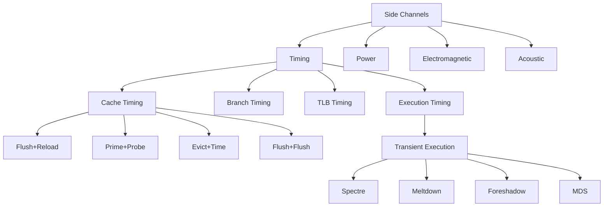
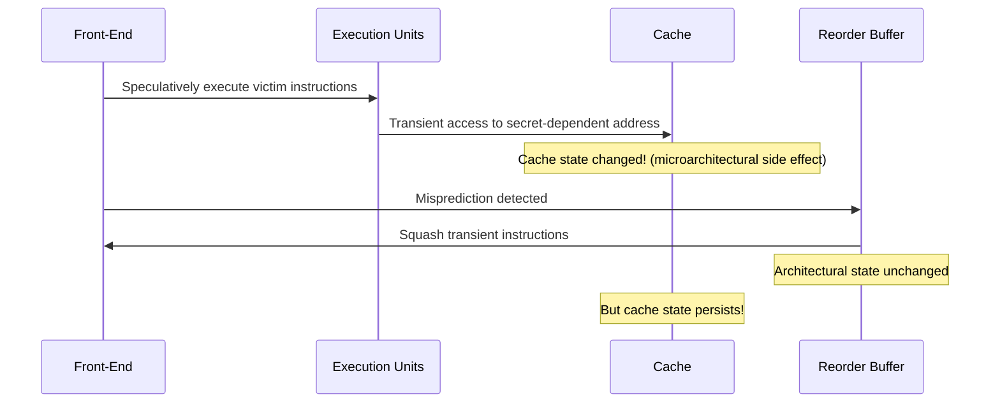
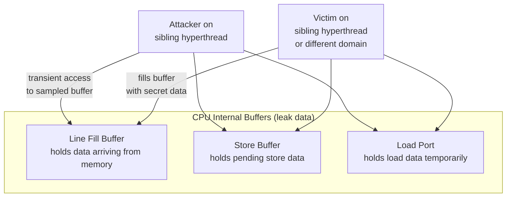

# Side-Channel Attacks and Transient Execution

## Overview

Side-channel attacks exploit **observable physical effects** of computation — timing, power consumption, electromagnetic emissions — to extract secrets that should be protected by software abstractions. The most significant class discovered since 2018 is **transient execution attacks**, where speculative or out-of-order instructions leave microarchitectural traces even after being squashed. This chapter covers the taxonomy, mechanisms, and mitigations for Spectre, Meltdown, and related attacks.

## The Side-Channel Taxonomy



## Cache Timing Attacks

### Why Caches Leak Information
Caches create observable timing differences:

```
Access time for:
  L1 cache hit:     ~4 cycles
  L2 cache hit:     ~12 cycles  
  L3 cache hit:     ~40 cycles
  Main memory:      ~200+ cycles

If an attacker can measure access time to a known address:
  Fast access  → line was in cache (someone else accessed it)
  Slow access  → line was not in cache
```

### Flush+Reload

**Prerequisite**: Attacker and victim share memory (e.g., shared libraries, page deduplication).

```pseudocode
# Attacker code (Flush+Reload)
# Step 1: Flush the probe addresses from all cache levels
for addr in probe_addrs:
    clflush(addr)  # x86 instruction: flush from all cache levels

# Step 2: Wait for victim to execute
wait_for_victim()

# Step 3: Reload and measure time
for addr in probe_addrs:
    t1 = rdtsc()       # read timestamp counter
    access(addr)       # load the address
    t2 = rdtsc()
    if (t2 - t1) < THRESHOLD:
        print(f"Victim accessed {addr}")
```

```
Real example — leaking an AES key byte:
  Victim's AES T-table lookup: table[secret_key_byte * 256 + plaintext_byte]
  Attacker probes: table[0], table[256], table[512], ..., table[255*256]
  Fast reload of table[K*256] → victim's key byte is K
```

### Prime+Probe

**Prerequisite**: No shared memory needed. Works across cores, VMs, even processes.

```pseudocode
# Attacker code (Prime+Probe)
# Step 1: PRIME — fill attacker's cache set with known data
for addr in cache_set_addrs:
    access(addr)  # Load into cache, evicting victim's data

# Step 2: Wait for victim to execute
wait_for_victim()

# Step 3: PROBE — re-access and measure which were evicted
for addr in cache_set_addrs:
    t1 = rdtsc()
    access(addr)
    t2 = rdtsc()
    if (t2 - t1) > THRESHOLD:
        print(f"Victim evicted {addr} → victim accessed same cache set")
```

| Attack | Shared Memory? | Cross-VM? | Granularity | Noise Level |
|--------|---------------|-----------|-------------|-------------|
| Flush+Reload | Required | No (usually) | Single cache line | Very low |
| Prime+Probe | Not required | Yes | Cache set | Moderate |
| Evict+Time | Not required | Yes | Cache set | Moderate |
| Flush+Flush | Not required | Yes (Intel TSX) | Single cache line | Very low |

## Transient Execution: The Fundamental Concept

### What Is Transient Execution?

Transient execution occurs when the processor executes instructions along a **mispredicted path** or **incorrectly speculated path**. These instructions are architecturally squashed, but they leave **microarchitectural traces** (cache state, TLB entries, branch predictor updates) before being cancelled.



> **Interview Angle**: "What is transient execution?" Instructions execute on a wrong path (mispredicted branch, faulting load) and are later squashed. The architectural state is rolled back, but microarchitectural side effects (cache state, TLB entries, predictor updates) remain. An attacker observes these side effects to infer secret data.

## Spectre Variants

### Spectre v1: Bounds Check Bypass (CVE-2017-5753)

**Mechanism**: Mispredict a conditional branch to speculatively access out-of-bounds memory.

```c
// Victim function (in kernel, untrusted input)
char victim_function(size_t x) {
    if (x < array1_size) {          // Branch: x < bound?
        return array2[array1[x] * 256];  // Speculative: x may exceed bound
    }
    return 0;
}
```

```
Attack sequence:
  1. Train branch predictor: call with valid x many times → predicts TAKEN
  2. Call with x = out-of-bounds index (e.g., pointing to secret)
  3. Branch mispredicted TAKEN (x >= array1_size)
  4. Speculatively loads array1[secret_byte] → value V
  5. Speculatively accesses array2[V * 256] → loads into cache
  6. Misprediction detected → squashed architecturally
  7. BUT array2[V*256] is now in cache
  8. Attacker probes array2[0], array2[256], ... to find which is cached
  9. The cached index reveals secret_byte
```

### Spectre v2: Branch Target Injection (CVE-2017-5715)

**Mechanism**: Poison the branch target buffer to misdirect indirect branches.

```
Attack: Cross-process / cross-VM
  1. Attacker trains BTB entry for a specific indirect branch
  2. The indirect branch (e.g., in kernel) is redirected to attacker-chosen gadget
  3. Gadget speculatively loads secret data into cache
  4. Attacker measures cache to recover secret

Mitigation: Retpoline (return trampoline), IBRS, STIBP
```

### Spectre-BHB: Branch History Buffer (CVE-2022-38182, CVE-2022-29900, CVE-2022-29901)

**Mechanism**: Spectre v2 mitigations (retpoline) stop branch target injection but don't prevent the **branch history buffer** from being poisoned to cause misprediction of conditional branches.

```
Spectre-BHB attack:
  1. Attacker executes a long sequence of branches to poison the BHB
  2. Victim's conditional branch mispredicts due to poisoned history
  3. Misprediction causes transient execution (like Spectre v1)
  4. But now the victim can be kernel code (cross-privilege)

Mitigation: EIBRS (Enhanced IBRS) on Intel, CSV2_3 on ARM
```

### Spectre-RSB: Return Stack Buffer Underflow

```
Attack:
  1. Attacker causes many RET instructions without matching CALLs
  2. RSB underflows, returns stale/attacker-controlled addresses
  3. Attacker controls speculative execution after RET
  4. Gadget loads secret data into cache

Mitigation: RSB stuffing (insert dummy CALL/RET pairs on context switch)
```

### Other Spectre Variants

| Variant | CVE | Mechanism | Scope |
|---------|-----|-----------|-------|
| Spectre v1.1 | — | Speculative store bypass (SSB) | Cross-domain |
| Spectre v4 | CVE-2018-3639 | Speculative store bypass, no bounds check | Same thread |
| SpectreRewind | — | Rollback to older RSB entries | Cross-privilege |
| Spectre-RSB | — | RSB underflow | Cross-privilege |
| Ret2spec | — | Return-based speculation via call/ret gadgets | Cross-domain |

## Meltdown Variants

### Meltdown (CVE-2017-5754)

**Mechanism**: Exploit **out-of-order execution of faulting loads**. Unlike Spectre (which uses branch misprediction), Meltdown uses the fact that loads execute before permission checks complete.

```c
// Attacker code (user space)
// Attempt to read kernel memory directly
uint8_t probe = *(uint8_t *)(kernel_address + offset);  // Will FAULT

// But before the fault, OoO execution loads the value and uses it:
uint8_t dummy = array2[probe * 256];  // Transient: cache side effect

// Fault handler catches the access violation
// But array2[probe * 256] is already cached
```

```
Timeline:
  Cycle 0:  LOAD from kernel_address        → dispatched (no fault yet)
  Cycle 1:  OoO engine uses loaded value     → array2[value*256] accessed
  Cycle 3:  Permission check fails           → FAULT raised
  Cycle 4:  Pipeline flushed, state rolled back
  Cycle 5:  Fault handler runs
  
  Architectural state: correct (fault handled)
  Microarchitectural state: array2[value*256] is in cache ← LEAK
```

### Meltdown Variants

| Variant | Name | Mechanism | Affected | Mitigation |
|---------|------|-----------|----------|------------|
| Original | Meltdown | Kernel access from user space | Intel, some ARM | KPTI / KAISER |
| Meltdown-BR | Rogue In-Flight Data | Branch target from kernel data | Intel | KPTI + IBRS |
| Meltdown-US | Unauthorized Read | Unmapped/slow reads | All vendors | Page table isolation |
| Meltdown-GP | Ghost Potato | Transient execution on unmapped PTEs | All vendors | INVLPGB, TLB flush |
| Foreshadow / L1TF | L1 Terminal Fault | L1TF on Intel SGX, OS, SMM | Intel | L1D flush on VMENTRY |

### Foreshadow (L1 Terminal Fault)

```
Foreshadow exploits L1 data cache fill from faulting loads:
  1. Attacker triggers load from address that faults (PTE not present)
  2. L1 cache is filled with data from the physical page
  3. Even though fault is raised, the L1 cache line persists briefly
  4. Attacker in another hyperthread reads the stale L1 data
  
Three sub-variants:
  - Foreshadow-SGX: leaks SGX enclave data
  - Foreshadow-OS:  leaks OS/kernel data  
  - Foreshadow-SMM: leaks System Management Mode data
```

## MDS (Microarchitectural Data Sampling)

### CVE-2018-12130, CVE-2018-12126, CVE-2019-11091, CVE-2019-11135

MDS exploits **internal CPU buffers** (line fill buffers, store buffers, load ports) that temporarily hold data from any security domain:



| MDS Variant | Buffer Exploited | CVE | Mitigation |
|-------------|-----------------|-----|------------|
| ZombieLoad | Line Fill Buffer | CVE-2018-12130 | L1D flush, MD_CLEAR |
| Fallout | Store Buffer | CVE-2018-12126 | VERW instruction |
| RIDL | Internal CPU buffering | CVE-2019-11091 | Microcode + kernel |
| Store-to-Leak Forwarding | Store-forwarding logic | CVE-2019-11135 | MD_CLEAR, VERW |

## Mitigations: Defense in Depth

### Hardware Mitigations

| Mitigation | Mechanism | Performance Impact |
|-----------|-----------|-------------------|
| **KPTI / KAISER** | Separate user/kernel page tables | 2–5% syscall heavy |
| **Retpoline** | Replace indirect branches with return trampolines | 1–3% indirect heavy |
| **IBRS / STIBP** | Indirect Branch Restricted Speculation | 2–15% (varies) |
| **SSBD** | Speculative Store Bypass Disable | ~1% store heavy |
| **L1D Flush** | Flush L1 on context switch/VM entry | 1–3% VM workloads |
| **MD_CLEAR / VERW** | Clear internal buffers before returning to user | <1% |
| **Enhanced IBRS** | Hardware-enforced IBRS (no retpoline needed) | Minimal (Zen 2+, Ice Lake+) |

### Software Mitigations

```
1. Speculation barriers:
   - lfence (x86): prevents later instructions from executing before lfence completes
   - csdb (ARM):    constrain speculative data flow
   - barrier.i (RISC-V): instruction fence

2. Array indexing sanitization:
   - Use branchless access: array[(x & (size-1))]
   - Or: mask with constant-time comparison

3. Avoid secret-dependent control flow:
   - Use constant-time comparisons (memcmp, not string comparison)
   - Avoid: if (secret_byte == 0) { ... }  
   - Prefer: result |= (secret_byte == 0) * flag;

4. Disable speculation for critical code:
   - __builtin_ia32_lfence() (GCC/Clang)
   - -mretpoline compiler flag
```

## Performance Impact Summary

| Workload | KPTI Impact | Retpoline Impact | Combined |
|----------|-------------|-------------------|----------|
| Syscall-heavy (nginx, redis) | 3–5% | 1–2% | 4–7% |
| Database (PostgreSQL) | 2–4% | 2–5% | 4–9% |
| Compute-bound (blender) | <1% | <1% | <2% |
| Virtualization (KVM) | 2–8% | 1–3% | 3–11% |
| SGX workloads | — | — | 10–40% |

> **Interview Angle**: "What is the difference between Spectre and Meltdown?" Spectre exploits **branch misprediction** — the victim speculatively executes valid code along a wrong path. Meltdown exploits **faulting loads** — the CPU transiently executes an instruction that will fault. Both leave cache traces. Spectre requires training the predictor; Meltdown requires no training on vulnerable hardware.

## Interview Questions

### Q1: Explain how Flush+Reload works.
**A**: The attacker flushes specific cache lines, waits for the victim to execute, then reloads the same lines and measures access time. A fast reload indicates the victim accessed that cache line. This reveals which memory addresses the victim touched, potentially leaking secrets through cache timing.

### Q2: How does Spectre v1 differ from Meltdown?
**A**: Spectre v1 tricks the CPU into mispredicting a conditional branch, causing speculative execution of valid instructions that access secret data. Meltdown directly executes an instruction that accesses unauthorized memory (e.g., kernel space from user space), relying on out-of-order execution before the permission check faults. Spectre requires branch prediction training; Meltdown works without training on vulnerable CPUs.

### Q3: Why do transient execution attacks work even though instructions are squashed?
**A**: The CPU squashes the **architectural** effects (register values, program counter, memory writes). But **microarchitectural** side effects (cache state changes, TLB entries, branch predictor state updates) are not rolled back. These microarchitectural traces persist and are observable through timing measurements.

### Q4: What is Prime+Probe and why is it more powerful than Flush+Reload?
**A**: Prime+Probe doesn't require shared memory. The attacker fills a cache set with their own data (Prime), waits, then re-accesses it (Probe). If the victim accessed the same cache set, the victim's access evicted one of the attacker's lines, causing a slower Probe time. This works across VMs, cores, and even processes without shared pages.

### Q5: How does retpoline mitigate Spectre v2?
**A**: Retpoline replaces indirect branch instructions (`call *%reg`) with a return-based trampoline that cannot be predicted by the BTB. The CPU's return stack buffer (RSB) handles the return, and since the RSB is separate from the BTB, the attacker cannot poison the indirect branch target. However, retpoline doesn't help against Spectre-BHB (branch history poisoning).

## Summary

| Attack Type | Mechanism | Key Mitigation |
|-------------|-----------|----------------|
| Spectre v1 (Bounds Check) | Branch misprediction → OOB access | lfence, constant-time code |
| Spectre v2 (BTI) | BTB poisoning → indirect branch gadget | Retpoline, IBRS |
| Spectre-BHB | Branch history poisoning | EIBRS, CSV2_3 |
| Meltdown | Faulting load transient execution | KPTI (page table isolation) |
| Foreshadow / L1TF | L1 terminal fault | L1D flush on VM entry |
| MDS / ZombieLoad | Internal buffer sampling | MD_CLEAR, VERW instruction |
| Flush+Reload | Shared cache timing | Cache partitioning |
| Prime+Probe | Cache set eviction timing | Randomized mapping |

## Cross-References

- [OoO Execution](./ooo-execution.md) — Out-of-order execution enables transient execution
- [Branch Prediction Advanced](./branch-prediction-advanced.md) — Predictors that can be poisoned
- [Cache Coherence Advanced](./cache-coherence-advanced.md) — Cache state persistence across cores
- [Cache Basics](../memory-hierarchy/cache-basics.md) — Cache timing fundamentals
