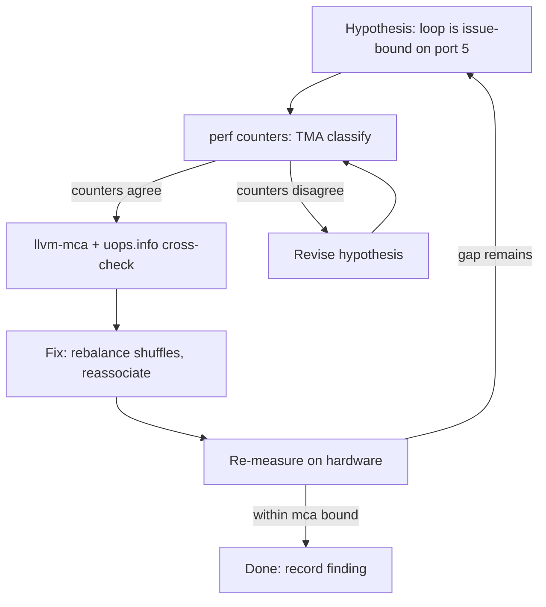
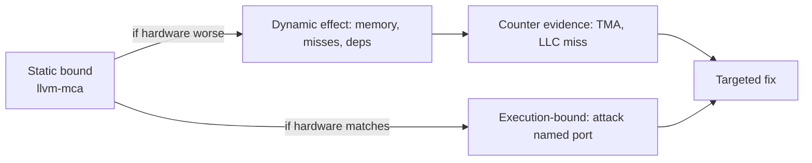

# Microarchitectural Measurement Toolbox

## Overview

Between "the compiler emitted vectorized code" and "the program got faster" lies
a whole discipline of microarchitectural measurement: understanding *which*
hardware resource limits a loop, with evidence from instruction tables, static
throughput analysers, and hardware performance counters. This toolbox is what
separates a performance engineer who cargo-cults `-O3 -march=native` from one who
can say "this kernel is issue-limited on 2 fused-domain µops/cycle, the memory
pipeline is not the constraint, and unrolling is the wrong fix." It is core
material for GPU/performance/hardware-adjacent interviews at companies that care
about cycles: HFT, game engines, database engines, AI-inference teams.

## uops.info: Measuring the Instruction Set

[uops.info](https://uops.info/) publishes machine-readable tables of x86
instruction behaviour -- µop counts, latency, reciprocal throughput, and port
usage -- for every Intel and AMD microarchitecture since roughly Nehalem/K10.
The crucial fact interviewers care about: these numbers are **measured
experimentally on real silicon**, not copied from vendor documentation.

How the automated measurement framework works:

- **Latency** is measured with dependency chains: a probe instruction whose input
  operand depends on its own previous result is executed in a long chain; the
  chain's throughput *is* the latency because nothing else overlaps.
- **Throughput** (reciprocal throughput) is measured with long sequences of
  *independent* instances of the instruction, letting the out-of-order engine
  saturate; cycles per instruction at saturation is the reciprocal throughput.
- **Port usage** is inferred from saturation experiments: run the instruction
  against a known reference load (e.g., a vector load that occupies a specific
  port) and see whether throughput degrades. Combinations across candidate ports
  triangulate the exact port set and per-µop port distribution.
- **µop counts** come from decoder-level probes -- instructions that emit ≤4 µops
  take one fast path, others hit the legacy decoder's slower paths or the
  microcode sequencer (MUL/DIV, string ops), and the probes quantify the
  boundary. The tables report both fused-domain and unfused-domain counts where
  they differ (fused ALU+store, macro-fusion of cmp/jcc).

The site ships an XML export that tooling consumes programmatically, plus a
browser UI where you pick, say, Ice Lake vs Zen 4 and diff instruction tables.
When someone claims "this shuffle is free on Zen 5," uops.info is how you check.

## llvm-mca: Static Throughput Analysis

`llvm-mca` (shipped with LLVM, also embedded in [Compiler Explorer](https://godbolt.org/))
performs **static** bottleneck analysis: given LLVM IR or assembly and a target
CPU model, it walks the scheduling model for that core and simulates the
instruction stream through a resource-bound machine -- dispatch widths, port
occupancy, latencies -- and reports:

- **Block RThroughput**: the reciprocal throughput of a loop block assuming
  infinite repeated execution -- the theoretical cycles/iteration if only the
  execution engine mattered.
- **IPC and total cycles** for the block, plus per-instruction and per-port
  **resource pressure**, which directly shows which execution ports are the
  bottleneck (e.g., port 5 at 100% for a shuffle-heavy loop).
- A **timeline view** showing when each instruction retires in the steady state.

What llvm-mca explicitly **cannot** see -- this list is the interview answer:

- **Memory latency**: every load is assumed to hit L1. Real cache misses are
  invisible, which is why mca predictions for pointer-chasing or
  streaming kernels can be off by 5-10x.
- **Branch mispredicts and fetch**: it models the issue/rename/execute stages,
  not front-end fetch redirection, i-cache misses, or the µop cache.
- **Loop-carried dependencies through memory** (store-to-load forwarding
  stalls, 4K aliasing, false sharing) and dynamic aliasing between pointers.
- **Instruction cache and µop-cache effects** of the surrounding code.

Use it as an upper bound: if hardware measures *worse* than the mca bound, the
gap is a dynamic effect (memory, misses, dependencies); if hardware matches the
bound, the loop is execution-bound and micro-optimization must attack the
bottleneck port mca names. Pair with [vectorization and roofline
analysis](../../hpc/vectorization-roofline.md) for the memory-bounded side.

## Agner Fog's Optimization Manuals

Agner Fog's manuals at [agner.org/optimize](https://www.agner.org/optimize/) are
the microarchitecture bible -- five freely available volumes accumulated over
two decades, cited in every serious x86 optimization discussion:

- **Manual 4, Instruction Tables**: latency, reciprocal throughput, and port
  breakdown per instruction per microarchitecture (pre-uops.info, this was the
  only public source; Fog's methodology was similar dependency-chain
  measurement). Still the fastest reference for "how bad is `vpgatherdd`?"
- **Manual 3, Microarchitecture**: a per-generation narrative of the whole core
  -- fetch, decode widths, µop cache size, retirement width, reorder buffer
  entries, execution ports, cache organization, prefetchers. This is where you
  learn, e.g., that Golden Cove is 6-wide decode with 512+ ROB entries, and why
  that changes unrolling decisions.
- **Manual 1, Optimizing software in C++** and **Manual 2, Optimizing
  subroutines in assembly language**: application of the above to real code --
  dependency chains, loop overhead, vectorization patterns.
- **Manual 5, Calling conventions for x86-64**: SysV vs Microsoft x64 ABI,
  register usage, struct passing, red zone -- the reference when reading or
  writing assembly interfaces.

The mental model Fog teaches: performance is **dependency chains plus bottleneck
resources**. Find the critical dependency chain in your loop, compute its
latency, compare with the port-limited throughput, and optimize whichever is
longer. That sentence is the heart of most "why is this loop slow" interviews.

## Intel Intrinsics Guide and Compiler Explorer

The [Intel Intrinsics Guide](https://www.intel.com/simd) is the canonical
reference for MMX/SSE/AVX/AVX-512 intrinsics: signature, operation semantics,
ISA-extension requirement, CPUID feature flag, and (newer versions) measured
latency/throughput. Navigating it is a skill: search by operation category
(arithmetic, shuffle, compare, conversion), read the "Operation" pseudo-code to
see exact lane behaviour, and check the "CPUID Flags" to know the true
`-march` requirement (an AVX512VNNI intrinsic needs more than baseline
AVX-512).

The complementary skill is reading what the compiler actually emits: paste the
loop into Compiler Explorer, compare clang/gcc output, and use its integrated
llvm-mca view. The full loop -- intrinsics guide for what to call, godbolt for
what got generated, mca for what it costs -- is the daily workflow of SIMD
kernel authors (see [SIMD and roofline](../../hpc/vectorization-roofline.md)).

## Hardware Performance Counters

The ground truth that static tools approximate. Briefly, the counters that anchor
microarchitectural analysis (deep dives live in dedicated pages):

- **CPI and its decomposition**: `cycles / instructions` from fixed counters;
  top-down analysis (TMA) classifies pipeline slots into frontend-bound,
  backend-bound, bad-speculation, and retiring to locate the limiter.
- **Branch misses**: `branch-misses` and per-branch event; interpret against
  predictor theory -- see [advanced branch prediction](./branch-prediction-advanced.md).
- **Cache misses**: LLC misses/kilo-instruction, plus loads/stores granularity;
  hardware prefetch effectiveness is measured, not guessed -- see
  [hardware prefetching](./hardware-prefetching.md).
- **Memory-bound vs compute-bound**: `MEM_INST_RETIRED.STLB_MISS`,
  offcore requests, and DRAM bandwidth counters (uncore/IMC) decide whether the
  roofline says you are bandwidth-bound.

The toolbox rule: counters tell you *where* (which bound), uops.info/llvm-mca
tell you *why* (which ports, which instructions), Agner tells you *what to do*.

## Chips and Cheese: Reverse Engineering in the Open

[Chips and Cheese](https://www.chipsandcheese.com/) is the leading independent
site doing what vendor NDA documents do -- in public. Their method combines
microbenchmarks (carefully constructed kernels that isolate one structure) with
die-shot analysis to reverse-engineer real machines: testing Apple's and AMD's
actual prefetcher reach, measuring shared-cache contention across CCDs,
estimating µop-cache sizes, characterizing Infinity Fabric latency across
chiplet hops. Reading their pieces teaches the *method*: design a kernel whose
performance is a pure function of one microarchitectural parameter, sweep it,
and read the cliffs. For interviews, citing a concrete finding ("Zen 4's L2
streamer stops at 2 pages, measured by their walking-access test") demonstrates
the habit of treating vendors' claims as hypotheses to test.

## Learning Material: Algorithmica HPC and Perf Ninja

Two free resources structure self-study:

- **Algorithmica, High-Performance Computing section**
  ([en.algorithmica.org/hpc](https://en.algorithmica.org/hpc/)): an online book
  by Sergey Slotin covering cycles and instructions, branch prediction, memory
  hierarchy and latency hiding, SIMD, and process pipelines -- written as
  progressive optimization case studies on real code. It is the best
  bridge from "knows assembly" to "thinks in pipeline slots."
- **The Performance Ninja course** (by Denys Haryachyy; search for
  "Performance Ninja Class" -- its companion repo of hands-on lab exercises is
  widely used): structured lab exercises on counter-based analysis, memory
  hierarchy, and pipeline optimization. Cited by name here because hands-on
  counter labs are the part books cannot provide.

Both pair naturally with the repo's own deep pages: counters methodology in
[profiling tools](../../dsa/chapters/ch137-profiling-tools.md) and the vector
performance model in [vectorization and roofline](../../hpc/vectorization-roofline.md).

## Workflow: From Hypothesis to Fix

Measurement without a loop is tourism. The disciplined cycle:

Worked example you can narrate in an interview:

1. A dot-product loop runs at 0.6 IPC; hypothesis: floating-point throughput.
2. `perf stat` shows high `idq.dsb_uops` but low port pressure -- frontend
   delivered, backend not saturated; `LLC-misses` near zero.
3. `llvm-mca` says the block's RThroughput is 0.25 cycles/iteration -- the
   execution engine could do 4x more. Gap must be dynamic: dependency chain
   through memory (serial `add` on the accumulator each iteration).
4. Fix: multiple accumulators to break the chain (the classic latency-vs-
   throughput optimization), or `-ffast-math` style reassociation where legal.
5. Re-measure: IPC rises to the mca bound. Cross-check the new bottleneck port
   on uops.info before the next change.

## Reading Instruction Tables (The Interview Skill)

Given a uops.info row, e.g. for `vfmadd231ps zmm` on Ice Lake -- 1 µop, fused?
No: unfused-domain 1 µop, ports `0+5` (the FMA units), latency 4, reciprocal
throughput 0.5 -- you should be able to say: two FMA ports process one 512-bit
FMA every 2 cycles, so peak FP64 FLOPs/cycle = 2 ports x 8 doubles x 2 FLOP /
2 cycles = 16 FLOP/cycle, which at 3 GHz is 48 GFLOP/s per core -- and that the
*latency of 4* matters only for dependency chains (accumulate with multiple
registers), while *throughput 0.5* matters for independent streams. Mixing up
latency and throughput is the #1 table-reading error; the #2 is ignoring the
port split (e.g., loads on 2-3 ports deciding how many aligned 32B loads/cycle
are sustainable).

## Interview Relevance

- **Performance-engineering / HFT**: expect "here is a hot loop, why is it
  slow?" -- the expected answer follows the workflow above with specific tool
  names, not "profile it and see."
- **GPU roles**: the same instruments exist (Nsight Compute reports port-like
  pipe utilization); the mental model of bound analysis transfers directly.
- **Compiler roles**: llvm-mca and scheduling models are the compiler's own
  performance abstractions; understanding them explains why codegen differs
  across `-mcpu` targets.
- **Hardware roles**: uops.info is the public proxy for the design targets
  architects optimize; knowing how the numbers were *measured* (dependency
  chains, saturation probes) is microarchitecture literacy.

## References

- uops.info instruction tables: <https://uops.info/>
- Compiler Explorer (llvm-mca embedded): <https://godbolt.org/>
- Agner Fog's optimization manuals: <https://www.agner.org/optimize/>
- Intel Intrinsics Guide: <https://www.intel.com/simd>
- Chips and Cheese: <https://www.chipsandcheese.com/>
- Algorithmica HPC section: <https://en.algorithmica.org/hpc/>
- Papers/tools cited by title (no link): LLVM MCA documentation (llvm.org,
  `llvm-mca` command guide); Intel 64 and IA-32 Software Developer Manuals
  (performance-monitoring chapters); Abel & Reineke, "uops.info: Characterizing
  Latency, Throughput, and Port Usage of Instructions on Intel Microarchitectures"
  (ASPLOS 2019).

## Cross-References

- [Advanced Branch Prediction](./branch-prediction-advanced.md) -- the
  machinery behind `branch-misses` counters and bad-speculation slots.
- [Hardware Prefetching](./hardware-prefetching.md) -- measuring prefetcher
  reach and effectiveness with the microbenchmark method this page describes.
- [Vectorization and Roofline](../../hpc/vectorization-roofline.md) -- the
  memory-bandwidth side of bound analysis that llvm-mca cannot see.
- [Profiling Tools](../../dsa/chapters/ch137-profiling-tools.md) -- the
  general profiling toolbox behind the counter workflow.
- [LLVM IR](../../compilers/advanced/llvm-ir.md) -- the IR that llvm-mca
  consumes and the scheduling models it walks.

## Interview Questions

1. **How does uops.info measure instruction latency, and why does that method
   work?**
   It builds a dependency chain: a probe instruction whose source operand is the
   result of the previous instance of itself, repeated dozens of times. Since
   each iteration serializes on the last, the measured cycles per iteration
   equal the instruction's latency. Independent-instruction sequences measure
   reciprocal throughput instead, and saturation experiments against known
   reference loads triangulate port usage. The key insight is that latency and
   throughput are distinct properties requiring different probe designs.

2. **What does llvm-mca tell you about a loop, and what dynamic behaviour does
   it structurally miss?**
   It reports the static bound: block reciprocal throughput, IPC, per-port
   resource pressure, and a retirement timeline, computed by simulating the
   target's scheduling model. It misses everything dynamic: cache and TLB
   misses (all loads are L1 hits), branch mispredicts, store-to-load forwarding
   and 4K-aliasing stalls, µop-cache and i-cache effects. So it is an upper
   bound on issue-bound performance; a large hardware-vs-mca gap points you at
   memory or speculation, not the instruction mix.

3. **A loop's measured CPI is 1.0 but llvm-mca says RThroughput 0.4. Give a
   diagnosis plan.**
   The gap is dynamic. Check counters top-down: bad-speculation slots (branch
   mispredicts), backend memory-bound signals (LLC misses, offcore traffic,
   STLB misses), or a serial dependency chain. Reassociate the accumulation
   across multiple registers if it is a latency chain; prefetch or block if it
   is memory. Re-measure until the hardware IPC approaches the static bound, at
   which point further gains must come from attacking the port llvm-mca names.

4. **Why do Agner Fog's instruction tables list latency, reciprocal throughput,
   and ports separately?**
   Because they constrain different code shapes. Latency limits dependency
   chains (serial accumulation, pointer chasing); reciprocal throughput limits
   independent streams (vector kernels, bulk loads); ports decide whether
   competing instruction types contend (a shuffle and a load competing for the
   same port halves effective throughput). Optimization means finding which of
   the three is the binding constraint for your loop and attacking that one.

5. **How would you measure the reach of a hardware prefetcher on a machine you
   do not control?**
   With a timing microbenchmark: walk an array with a stride larger than the
   cache line so each access is a miss, then vary the pattern to detect when
   prefetching engages -- e.g., measure latency of access distances before and
   after a boundary, or use two interleaved streams to see whether the
   prefetcher tracks multiple streams. Cliffs in the latency-versus-distance
   curve reveal page and stream limits. This is exactly the Chips and Cheese
   methodology, and the results you compare against the documented or
   reverse-engineered prefetcher design.

6. **What is the difference between fused-domain and unfused-domain µop counts,
   and why does it matter for throughput math?**
   Macro-fused pairs (compare+branch) and micro-fused ALU+store pairs count as
   one µop in the fused domain at fetch/rename but occupy multiple µops
   downstream. Throughput limits like 6-wide rename apply to the fused domain,
   while execution-port occupancy applies to unfused µops. Using the wrong
   domain when hand-computing a bottleneck over- or under-estimates how many
   instructions/cycle the front end can sustain.

7. **Where do SIMD intrinsics, the compiler, and hardware counters intersect in
   a real optimization task?**
   The intrinsics guide tells you the semantic and ISA-cost of each intrinsic;
   the compiler (inspected on Compiler Explorer) shows whether intrinsics were
   kept, folded, or pessimised and what the surrounding code became; llvm-mca
   and uops.info then price the emitted sequence in ports and cycles; finally
   counters on the target machine confirm or refute the static prediction. All
   four steps are expected in a competent SIMD kernel task -- stopping at "I
   used AVX-512 so it is fast" is the failure mode the toolbox exists to
   prevent.
