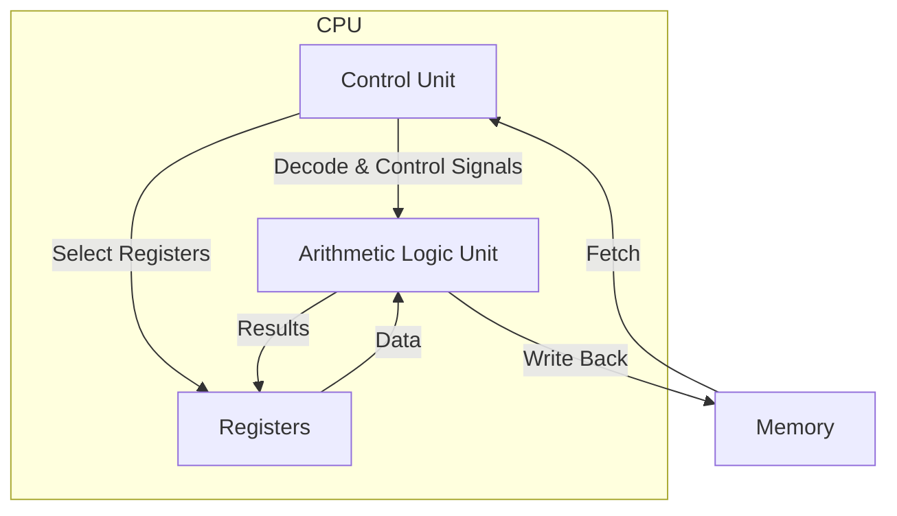

# CPU Architecture

## Overview

The **Central Processing Unit (CPU)** is the brain of a computer system. It fetches instructions from memory, decodes them, executes them, and writes back results. Understanding CPU architecture is fundamental to systems programming, performance optimization, and answering placement interview questions.

This section covers the foundational models (Von Neumann and Harvard), instruction set architectures, the CISC vs RISC debate, and the internal components—registers, ALU, control unit, and microcode—that make a CPU work.

## Topics

| Topic | Description |
|-------|-------------|
| [Von Neumann Architecture](./von-neumann.md) | Stored-program concept with unified memory |
| [Harvard Architecture](./harvard.md) | Separate instruction and data memory |
| [Instruction Set Architecture](./isa.md) | The contract between hardware and software |
| [CISC vs RISC](./cisc-vs-risc.md) | Two philosophies of CPU design |
| [Registers](./registers.md) | Fastest storage inside the CPU |
| [ALU](./alu.md) | The arithmetic and logic workhorse |
| [Control Unit](./control-unit.md) | The orchestrator of instruction execution |
| [Microcode](./microcode.md) | How complex instructions are implemented internally |

## Interview Focus

- Explain the Von Neumann bottleneck and how Harvard architecture addresses it
- Compare CISC and RISC with real-world examples (x86 vs ARM)
- Describe the fetch-decode-execute cycle step by step
- Explain why registers are the fastest storage and how many a typical CPU has
- Differentiate between the ISA (what the CPU can do) and microarchitecture (how it does it)
