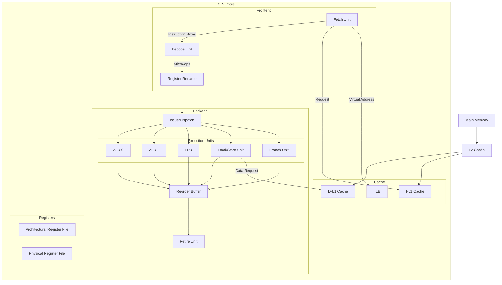

# CPU Architecture

## Overview

The **Central Processing Unit (CPU)** is the brain of a computer system. It fetches instructions from memory, decodes them, executes them, and writes back results. Understanding CPU architecture is fundamental to systems programming, performance optimization, and answering placement interview questions.

This section covers the foundational models (Von Neumann and Harvard), instruction set architectures, the CISC vs RISC debate, and the internal components—registers, ALU, control unit, and microcode—that make a CPU work.

## CPU Block Diagram



## Core CPU Components

### 1. Control Unit (CU)

The control unit is the **orchestrator** of the CPU. It directs the operation of all other components.

| Function | Description |
|----------|-------------|
| **Instruction Fetch** | Sends PC to memory, receives instruction bytes |
| **Instruction Decode** | Determines opcode, operands, and control signals |
| **Sequencing** | Generates control signals in correct order |
| **Exception Handling** | Responds to interrupts, traps, and faults |

**Hardwired vs Microprogrammed Control:**

| Type | Speed | Flexibility | Used In |
|------|-------|-------------|---------|
| **Hardwired** | Faster | Fixed, hard to modify | RISC CPUs |
| **Microprogrammed** | Slower | Easy to update | CISC CPUs (x86) |

### 2. Arithmetic Logic Unit (ALU)

The ALU performs all arithmetic and logical operations.

```text
┌─────────────────────────────────┐
│              ALU                │
│  ┌─────────┐  ┌─────────────┐  │
│  │ Adder   │  │ Logic Unit  │  │
│  │(Add/Sub)│  │(AND/OR/XOR) │  │
│  └─────────┘  └─────────────┘  │
│  ┌─────────┐  ┌─────────────┐  │
│  │ Shifter │  │ Comparator  │  │
│  │(<<>>)  │  │ (< > =)     │  │
│  └─────────┘  └─────────────┘  │
│                                 │
│  Inputs: A, B, ALUControl      │
│  Outputs: Result, Flags (Z,C,N,V)│
└─────────────────────────────────┘
```

**ALU Operations:**

| Operation | ALUControl | Result |
|-----------|-----------|--------|
| ADD | 0000 | A + B |
| SUB | 0001 | A - B |
| AND | 0010 | A & B |
| OR | 0011 | A \| B |
| XOR | 0100 | A ^ B |
| SLL | 0101 | A << B |
| SRL | 0110 | A >> B (logical) |
| SLT | 0111 | (A < B) ? 1 : 0 |

### 3. Registers

Registers are the **fastest storage** in the CPU, accessed in a single clock cycle.

#### Register Categories

| Category | Examples | Purpose |
|----------|---------|---------|
| **General Purpose** | RAX, RBX, RCX (x86-64); X0-X30 (ARM) | Store operands and results |
| **Program Counter** | RIP (x86-64); PC (ARM) | Address of next instruction |
| **Stack Pointer** | RSP (x86-64); SP (ARM) | Top of call stack |
| **Flags/Status** | RFLAGS (x86-64); CPSR (ARM) | Condition codes (Z, C, N, V) |
| **Floating Point** | XMM0-15 (x86-64); V0-V31 (ARM) | Floating-point operands |
| **Control** | CR0-CR4 (x86-64) | CPU configuration (paging, protection) |
| **Segment** | CS, DS, SS, ES (x86) | Memory segmentation (legacy) |

#### Register Count Comparison

| Architecture | GPRs | FP/Vector | Total |
|-------------|------|-----------|-------|
| x86-64 | 16 | 16 (SSE/AVX) or 32 (AVX-512) | 48 (with AVX-512) |
| ARM64 (AArch64) | 31 | 32 (V/NEON/SVE) | 63 |
| RISC-V (RV64I) | 31 | 32 (F/D) | 63 |
| MIPS | 32 | 32 | 64 |

### 4. Fetch-Decode-Execute Cycle

The fundamental cycle of CPU operation:


**Detailed steps:**

| Stage | Action | Components Used |
|-------|--------|-----------------|
| **Fetch** | Read instruction from memory at PC; PC += instruction_size | PC, I-Cache, Fetch Unit |
| **Decode** | Parse opcode, identify operands, generate control signals | Decode Unit, Control Unit |
| **Execute** | Perform ALU operation, compute address, evaluate branch | ALU, Branch Unit |
| **Memory** | Read/write data from/to memory (if load/store) | Load/Store Unit, D-Cache |
| **Write Back** | Write result to destination register | Register File |

### 5. Addressing Modes

How instructions specify operand locations:

| Mode | Example | Description |
|------|---------|-------------|
| **Immediate** | `MOV R1, #42` | Operand is in the instruction |
| **Register** | `ADD R1, R2, R3` | Operand is in a register |
| **Direct** | `MOV R1, [0x1000]` | Memory address in instruction |
| **Indirect** | `MOV R1, [R2]` | Memory address in register |
| **Indexed** | `MOV R1, [R2 + offset]` | Base + displacement |
| **PC-Relative** | `BEQ label` | PC + offset (branches) |

## CPU Performance Factors

### What Makes a CPU Fast?

```text
CPU Performance = f(Pipeline Depth, Width, Cache, Branch Prediction, OoO)

Pipeline Depth:    Deeper = higher clock rate, but higher branch mispredict penalty
Superscalar Width: Wider = more IPC, but harder to keep fed
Cache Hierarchy:   Larger/faster caches = fewer memory stalls
Branch Prediction: Better prediction = fewer pipeline flushes
Out-of-Order:      More reorder capacity = better ILP extraction
```

### Pipeline Depth Tradeoff

| Depth | Clock Rate | Branch Penalty | Example |
|-------|-----------|----------------|---------|
| Shallow (5-10) | Lower | ~5 cycles | ARM Cortex-M |
| Medium (12-15) | Medium | ~16-19 cycles | Intel Skylake |
| Deep (20+) | Higher | ~20 cycles | Intel Pentium 4 (NetBurst) |

## Interview Focus

- Explain the Von Neumann bottleneck and how Harvard architecture addresses it
- Compare CISC and RISC with real-world examples (x86 vs ARM)
- Describe the fetch-decode-execute cycle step by step
- Explain why registers are the fastest storage and how many a typical CPU has
- Differentiate between the ISA (what the CPU can do) and microarchitecture (how it does it)
- Describe the role of the ALU, control unit, and register file
- Explain how addressing modes affect instruction encoding and flexibility

## Cross References

- [Von Neumann Architecture](von-neumann.md)
- [Harvard Architecture](harvard.md)
- [ISA](isa.md)
- [CISC vs RISC](cisc-vs-risc.md)
- [Registers](registers.md)
- [ALU](alu.md)
- [Control Unit](control-unit.md)
- [Microcode](microcode.md)
- [Pipelining](../pipelining/README.md)
