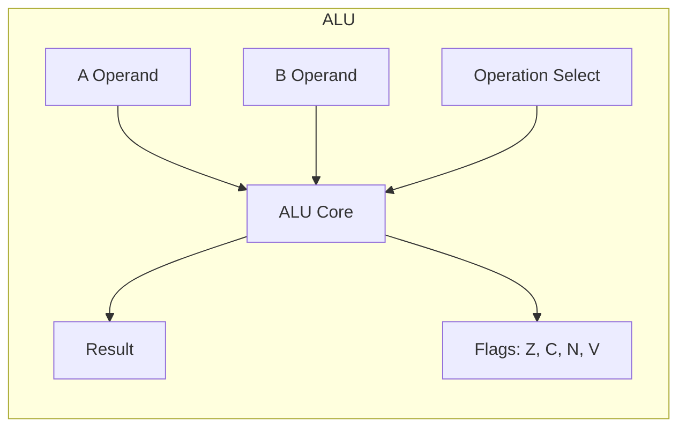
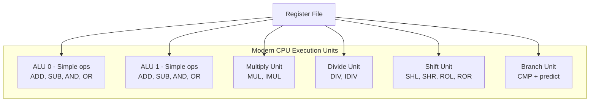

# ALU (Arithmetic Logic Unit)

## Overview

The **Arithmetic Logic Unit (ALU)** is the combinational digital circuit inside the CPU that performs arithmetic and logical operations. It's the computational workhorse—every ADD, SUB, AND, OR, CMP, and SHIFT instruction ultimately executes in the ALU.

## Detailed Explanation

### ALU Block Diagram



**Inputs:**
- **A, B**: Operand buses (typically the width of the data path—32 or 64 bits)
- **Operation code**: Selects which operation to perform (from the control unit)

**Outputs:**
- **Result**: The computation result
- **Flags**: Status bits (Zero, Carry, Negative, Overflow)

### Operations Performed

| Category | Operations | Description |
|----------|-----------|-------------|
| **Arithmetic** | ADD, SUB, INC, DEC, NEG | Integer addition, subtraction, increment, decrement, negation |
| **Logical** | AND, OR, XOR, NOT, TEST | Bitwise logical operations |
| **Shift** | SHL, SHR, SAR, ROL, ROR | Shift and rotate operations |
| **Comparison** | CMP, TST | Subtraction without storing result (sets flags only) |
| **Bit Manipulation** | BT, BTR, BTS, BSF, BSR | Bit test, set, reset, scan |
| **BCD** | DAA, DAS, AAA, AAS | Binary-coded decimal arithmetic (x86 legacy) |
| **Multiply/Divide** | MUL, IMUL, DIV, IDIV | Integer multiplication and division |

### ALU Design: 1-Bit ALU

The building block is a 1-bit ALU:

```
         A ──┐
             │
         B ──┤
             ├── Full Adder ──┐
       Cin ──┘                ├── MUX ── Result
                              │
         A ──┐                │
             ├─ AND ──────────┤
         B ──┤                │
             ├─ OR ───────────┤
             │                │
         A ──┤                │
             ├─ XOR ──────────┘
         B ──┤
             │
       Op ──── (selects operation)

       Cout → next bit's Cin
```

A 64-bit ALU chains 64 of these 1-bit ALUs together with carry propagation.

### Carry Lookahead Adder

A ripple-carry adder (where carry propagates bit by bit) is too slow for wide ALUs. A **carry lookahead adder** computes carries in parallel:

```
Generate: G_i = A_i AND B_i     (carry is generated at bit i)
Propagate: P_i = A_i XOR B_i    (carry is propagated through bit i)

C_1 = G_0 + P_0·C_0
C_2 = G_1 + P_1·G_0 + P_1·P_0·C_0
C_3 = G_2 + P_2·G_1 + P_2·P_1·G_0 + P_2·P_1·P_0·C_0

All carries computed in O(log n) time instead of O(n)
```

### Status Flags

The ALU sets flags based on the result:

```
Zero Flag (Z):     Result == 0
                   Set by: AND result with itself, check if all bits zero

Carry Flag (C):    Unsigned overflow / borrow
                   Addition: carry out of MSB
                   Subtraction: borrow into MSB

Negative Flag (N): Result's MSB is 1 (result is negative in 2's complement)

Overflow Flag (V): Signed overflow occurred
                   V = C_in_MSB XOR C_out_MSB
                   Example: 127 + 1 = 128 (overflows in 8-bit signed: -128)
```

### Multi-Cycle Operations

Simple operations (ADD, AND) complete in one cycle. Complex operations take multiple cycles:

```
Operation      | Cycles (typical)
---------------|------------------
ADD, SUB       | 1
AND, OR, XOR   | 1
Shift by const | 1
Shift by reg   | 1-2
MUL (integer)  | 3-5
DIV (integer)  | 10-40+
```

Modern CPUs often have separate integer ALUs and multiply/divide units.

### Modern ALU Organization



Modern superscalar CPUs have multiple ALUs that can execute in parallel:
- Intel Skylake: 4 integer ALUs, 2 load, 1 store
- AMD Zen 4: 4 integer ALUs, 3 load, 2 store

## Examples

### Example 1: Addition with Flags

```
Operation: 5 + 3 (8-bit)
  A    = 00000101
  B    = 00000011
  ─────────────────
  Sum  = 00001000 = 8
  C = 0 (no carry)
  Z = 0 (result not zero)
  N = 0 (result positive)
  V = 0 (no signed overflow)

Operation: 200 + 100 (8-bit unsigned)
  A    = 11001000 (200 unsigned = -56 signed)
  B    = 01100100 (100 unsigned = +100 signed)
  ─────────────────
  Sum  = 00101100 (44)
  C = 1 (carry out — unsigned overflow, since 200+100=300 > 255)
  Z = 0
  N = 0
  V = 0 (no signed overflow: -56 + 100 = +44, which fits in [-128, 127])
       Proof via V = C_in_MSB XOR C_out_MSB = 1 XOR 1 = 0
```

### Example 2: Subtraction Using 2's Complement

```
Operation: 7 - 3 (8-bit)
  Internally: 7 + (-3) = 7 + (256 - 3) = 7 + 253
  A    = 00000111 (7)
  B    = 11111101 (-3 in 2's complement)
  ─────────────────
  Sum  = 00000100 (4)
  C = 1 (carry out in subtraction means no borrow)
  Z = 0
  N = 0
  V = 0
```

### Example 3: Shift Operations

```
SHL R1, 2   ; Shift left by 2 (multiply by 4)
  Before: 00000011 (3)
  After:  00001100 (12)

SHR R1, 1   ; Logical shift right by 1 (unsigned divide by 2)
  Before: 00001100 (12)
  After:  00000110 (6)

SAR R1, 1   ; Arithmetic shift right by 1 (signed divide by 2, preserves sign)
  Before: 11110000 (-16)
  After:  11111000 (-8)
```

### Example 4: ALU in the Datapath

```
Instruction: ADD R1, R2, R3  (R1 = R2 + R3)

1. Register file outputs R2 → A bus, R3 → B bus
2. Control unit sets ALU operation = ADD
3. ALU computes A + B → Result bus
4. Result written back to R1
5. Flags updated (Z, C, N, V)

All in one clock cycle for a simple single-cycle datapath.
```

## Interview Questions

### Q1: What is the difference between an ALU and a CPU?
**Answer**: The ALU is a component *inside* the CPU. The CPU includes the ALU (for computation), the control unit (for instruction decoding and sequencing), and registers (for storage). The ALU only performs arithmetic and logical operations; it doesn't fetch instructions or manage program flow.

### Q2: What is the carry lookahead adder and why is it used?
**Answer**: A carry lookahead adder computes all carry bits in parallel using generate (G) and propagate (P) signals, rather than waiting for carries to ripple through each bit. This reduces addition time from O(n) to O(log n), which is critical for wide (64-bit) ALUs operating at high clock speeds.

### Q3: What does the overflow flag indicate vs the carry flag?
**Answer**: The carry flag indicates unsigned overflow (the result doesn't fit in unsigned representation). The overflow flag indicates signed overflow (the result doesn't fit in signed representation, e.g., adding two positive numbers yields a negative-looking result). They're independent—either can be set without the other.

### Q4: How does the ALU perform subtraction?
**Answer**: Subtraction is typically implemented as addition with the 2's complement of the subtrahend. `A - B` becomes `A + (~B + 1)`. The ALU inverts B and sets the carry-in to 1, then performs addition. This reuses the adder hardware.

### Q5: Why do modern CPUs have multiple ALUs?
**Answer**: To exploit instruction-level parallelism. A superscalar CPU can issue multiple ALU operations per clock cycle if they're independent. Having 4 ALUs means up to 4 integer operations can execute simultaneously, effectively quadrupling throughput for integer workloads.

## Common Mistakes

1. **Confusing ALU with FPU** — The ALU handles integer operations. Floating-point operations are performed by a separate Floating-Point Unit (FPU) or SIMD execution unit.
2. **Thinking ALU operations always take 1 cycle** — Simple operations (ADD, AND) are single-cycle, but multiply and divide can take many cycles. Modern CPUs may have separate multiply/divide pipelines.
3. **Forgetting about the flags register** — The ALU always computes flags, even for non-CMP instructions. Understanding flags is essential for conditional branching.
4. **Confusing logical and arithmetic shifts** — Logical shift (SHR) fills with zeros; arithmetic shift (SAR) fills with the sign bit. Using the wrong one for signed values produces incorrect results.

## Summary

| Aspect | Detail |
|--------|--------|
| **What** | Combinational circuit for arithmetic and logical operations |
| **Operations** | ADD, SUB, AND, OR, XOR, SHL, SHR, MUL, DIV, CMP |
| **Inputs** | Two operands + operation code |
| **Outputs** | Result + status flags (Z, C, N, V) |
| **Building Block** | 1-bit ALU with full adder + logic gates |
| **Modern Design** | Multiple ALUs, carry lookahead, separate multiply/divide units |
| **Speed** | 1 cycle for simple ops, multiple cycles for MUL/DIV |

## Cross-References

- [Registers](./registers.md) — ALU reads from and writes to registers
- [Control Unit](./control-unit.md) — Selects the ALU operation
- [Boolean Algebra](../digital-logic/boolean.md) — Foundation for ALU logic design
- [Combinational Circuits](../digital-logic/combinational.md) — ALU is a combinational circuit
- [Classic Pipeline](../pipelining/classic.md) — ALU operates in the Execute stage

## Cross References

- [Registers](registers.md)
- [Control Unit](control-unit.md)
- [Binary](../number-systems/binary.md)
- [Floating Point](../number-systems/floating-point.md)
