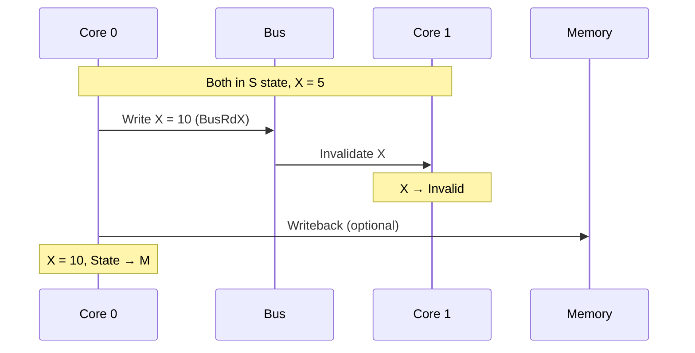
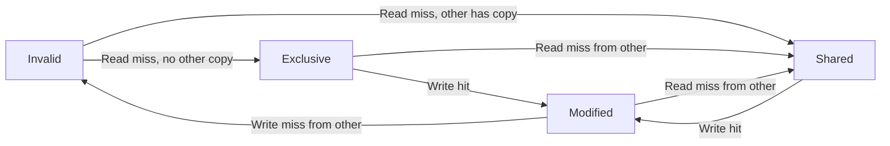
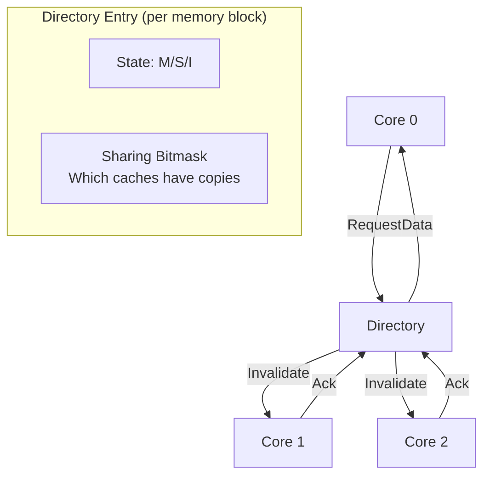
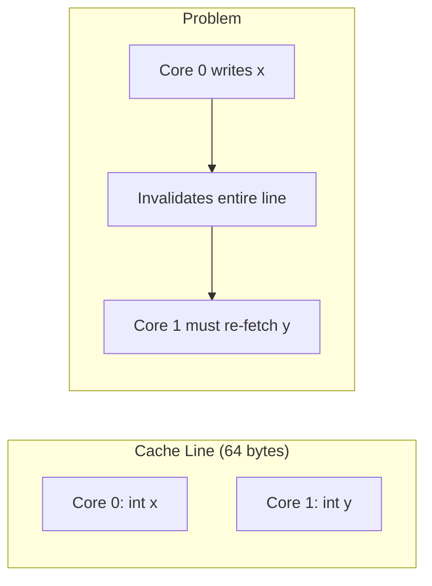

# Cache Coherence

## Overview

In multi-core processors, each core has its own private cache. When multiple cores access the same memory address, they can see inconsistent values. Cache coherence protocols ensure all cores have a consistent view of memory.

## The Cache Coherence Problem

```mermaid
flowchart TD
    subgraph "Core 0"
        C0[L1 Cache<br/>X = 5]
    end
    subgraph "Core 1"
        C1[L1 Cache<br/>X = 5]
    end
    MEM[Main Memory<br/>X = 5]
    
    C0 -->|Read X| MEM
    C1 -->|Read X| MEM
    
    subgraph "Problem: Core 0 writes X = 10"
        C0W[L1 Cache<br/>X = 10]
        C1OLD[L1 Cache<br/>X = 5 (stale!)]
    end
```

Without coherence, Core 1 would read stale data (X = 5) after Core 0 writes X = 10.

## MSI Protocol

The simplest cache coherence protocol with three states:

| State | Meaning | Can Write? | Can Read? |
|-------|---------|-----------|-----------|
| **M (Modified)** | Only copy, dirty | Yes | Yes |
| **S (Shared)** | Multiple copies, clean | No | Yes |
| **I (Invalid)** | Not valid | No | No |

### State Transitions

```mermaid
flowchart LR
    I[Invalid] -->|Read hit| S[Shared]
    I -->|Write hit| M[Modified]
    S -->|Write hit| M
    M -->|Read miss (other core)| S
    M -->|Write miss (other core)| I
    S -->|Invalidate from other core| I
```

### MSI Operations



## MESI Protocol

Extends MSI with an **Exclusive** state for better performance:

| State | Meaning | Dirty? | Exclusive? |
|-------|---------|--------|-----------|
| **M (Modified)** | Only copy, dirty | Yes | Yes |
| **E (Exclusive)** | Only copy, clean | No | Yes |
| **S (Shared)** | Multiple copies, clean | No | No |
| **I (Invalid)** | Not valid | - | - |

### Why Exclusive?

When a core reads a value that no other core has, it goes to E state (not S). Writing from E doesn't need bus traffic (no invalidation needed).



## MOESI Protocol

Adds **Owned** state to avoid memory writes:

| State | Meaning | Dirty? | Supplies data? |
|-------|---------|--------|---------------|
| **M (Modified)** | Only copy, dirty | Yes | Yes |
| **O (Owned)** | Shared, dirty | Yes | Yes |
| **E (Exclusive)** | Only copy, clean | No | Yes |
| **S (Shared)** | Multiple copies, clean | No | No |
| **I (Invalid)** | Not valid | - | - |

### MOESI Advantage

When a modified line is shared, the owner keeps the dirty copy and supplies data to other caches. Memory writeback is deferred.

## MESIF Protocol (Intel)

Adds **Forward** state for efficiency:

| State | Description |
|-------|-------------|
| **F (Forward)** | Shared, but designated to respond to reads |

Only one cache in S state is designated as F. It responds to read requests, reducing memory traffic.

## Directory-Based Coherence

### Problem with Snooping

Snooping protocols broadcast all cache events on the bus. This doesn't scale beyond ~8 cores.

### Directory-Based Solution



### Directory Entry Fields

| Field | Description |
|-------|-------------|
| **State** | M, S, or I |
| **Dirty bit** | Is the block modified? |
| **Sharing mask** | Which caches have copies |
| **Pending requests** | Outstanding coherence messages |

## False Sharing

### What is False Sharing?

Two cores access different variables that happen to be on the same cache line. The coherence protocol treats the entire cache line as the unit of sharing, causing unnecessary invalidations.



### Example

```cpp
// BAD: False sharing
struct SharedData {
    std::atomic<int> counter0; // Core 0
    std::atomic<int> counter1; // Core 1
    // Same cache line → false sharing
};

// GOOD: Padding to separate cache lines
struct AlignedData {
    alignas(64) std::atomic<int> counter0;
    alignas(64) std::atomic<int> counter1;
    // Different cache lines → no false sharing
};

// Alternative: Use padding
struct PaddedData {
    std::atomic<int> counter0;
    char padding0[60]; // Pad to 64 bytes
    std::atomic<int> counter1;
    char padding1[60];
};
```

### Performance Impact

```cpp
// Benchmark: incrementing counters on 4 threads
// Without padding: ~200ms (false sharing)
// With padding: ~50ms (4x faster)
```

## Memory Ordering

### Why Memory Ordering Matters

Modern CPUs reorder memory operations for performance. Cache coherence ensures eventual consistency, but the order of visibility can vary.

```cpp
// Thread 1
x = 1;          // Store x
flag = true;    // Store flag

// Thread 2
if (flag) {     // Load flag
    print(x);   // Load x — may see 0!
}
```

### Memory Ordering Models

| Model | Description | Examples |
|-------|-------------|---------|
| **Sequential consistency** | All operations in total order | Ideal but slow |
| **Total store ordering** | Stores seen in order | x86 (TSO) |
| **Relaxed** | Minimal guarantees | ARM, RISC-V |

### x86 Memory Model (TSO)

- Loads are not reordered with other loads
- Stores are not reordered with other stores
- Loads may be reordered with earlier stores (store buffer)
- Stores are not reordered with earlier loads

### Fence Instructions

```cpp
// x86
asm volatile("mfence" ::: "memory"); // Full fence
asm volatile("sfence" ::: "memory"); // Store fence
asm volatile("lfence" ::: "memory"); // Load fence

// C++ atomics
std::atomic_thread_fence(std::memory_order_seq_cst);
std::atomic_thread_fence(std::memory_order_release);
std::atomic_thread_fence(std::memory_order_acquire);
```

## Interview Questions

### Q1: Why do we need cache coherence?

Because each core has a private cache. Without coherence, different cores could see different values for the same memory address, leading to incorrect program behavior.

### Q2: MESI vs MSI?

MESI adds Exclusive state. When a core reads a value that no other core has, it's E (not S). Writing from E doesn't need bus traffic (no invalidation). This reduces bus traffic for exclusive reads.

### Q3: What is false sharing and how to detect it?

False sharing occurs when different cores access different variables on the same cache line, causing unnecessary invalidations. Detect with `perf c2c` on Linux. Fix with padding or `alignas(64)`.

### Q4: Why does memory ordering matter?

CPUs reorder operations for performance. Cache coherence ensures eventual consistency, but not the order. Memory fences enforce ordering when needed for correctness.

### Q5: How does directory-based coherence scale better than snooping?

Snooping broadcasts all events → O(n) bandwidth. Directory only sends point-to-point messages to caches that have copies → O(1) per request. But directory adds latency for lookups.

## Related Topics

- [Cache Hierarchy](./pipeline.md) — L1/L2/L3 cache
- [Memory Ordering](./memory-ordering.md) — CPU memory models
- [NUMA](../../os/memory/numa.md) — Non-uniform memory access
- [Concurrency](../../concurrency/) — Lock-free programming
