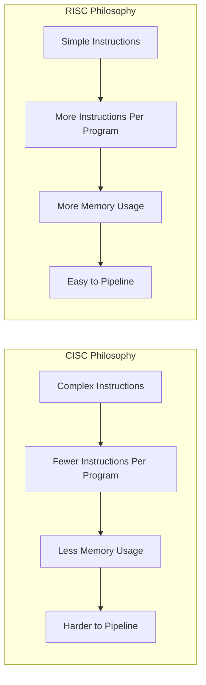
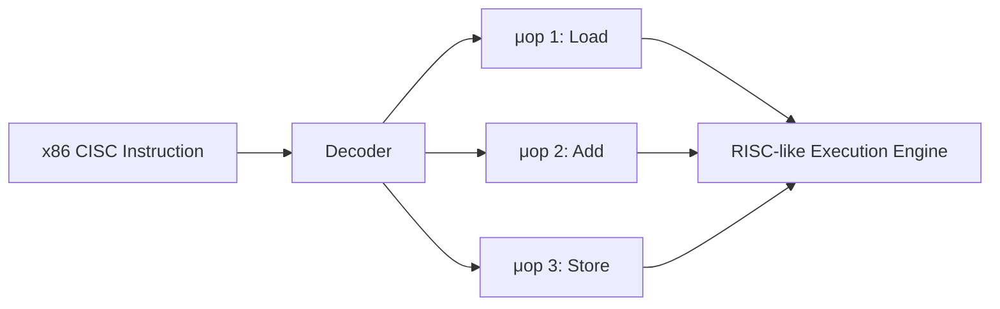

# CISC vs RISC

## Overview

**CISC** (Complex Instruction Set Computer) and **RISC** (Reduced Instruction Set Computer) represent two fundamentally different philosophies for designing instruction set architectures. CISC aims to complete tasks in as few instructions as possible (complex instructions), while RISC aims to execute each instruction as quickly as possible (simple instructions, more of them).

## Detailed Explanation

### The Design Philosophies



### Side-by-Side Comparison

| Feature | CISC | RISC |
|---------|------|------|
| **Instruction Complexity** | Complex, multi-step operations | Simple, single-cycle operations |
| **Instruction Length** | Variable (1–15 bytes in x86) | Fixed (typically 32 bits) |
| **Instruction Count** | Fewer instructions per program | More instructions per program |
| **Clock Cycles Per Instruction** | Multiple (1–20+) | One (ideally) |
| **Addressing Modes** | Many (10+) | Few (3–5) |
| **Memory Access** | Any instruction can access memory | Only LOAD/STORE access memory |
| **Registers** | Fewer (x86 had 8 GPRs originally) | More (32+ typical) |
| **Pipelining** | Difficult (variable-length, complex) | Easy (fixed-length, simple) |
| **Code Density** | Higher (fewer instructions) | Lower (more instructions) |
| **Hardware Complexity** | More complex decoder | Simpler decoder, more registers |
| **Power Consumption** | Generally higher | Generally lower |
| **Examples** | x86, VAX, System/360 | ARM, RISC-V, MIPS, SPARC |

### The Load-Store Architecture

RISC follows a **load-store** model:

```
RISC (Load-Store):
  LOAD  R1, [addr]    ← Must explicitly load from memory
  ADD   R1, R1, R2    ← ALU operations only on registers
  STORE R1, [addr]    ← Must explicitly store to memory

CISC:
  ADD   R1, [addr]    ← One instruction does memory read + add
  ; The CPU internally does load + add, but it's one instruction
```

### Why CISC Exists: Historical Context

In the 1970s–80s:
- Memory was expensive ($1000s per MB)
- Programs needed to be compact
- Compilers were primitive; hand-written assembly was common
- Complex instructions helped assembly programmers

```
CISC approach: One instruction = many micro-operations
  Example: REP MOVSB (x86 string copy)
  → Copies a block of memory in one instruction
  → Internally: loop of load + store micro-ops

RISC approach: Explicit loop
  loop:
    LOAD  R1, [R2]
    STORE R1, [R3]
    ADDI  R2, R2, 1
    ADDI  R3, R3, 1
    SUBI  R4, R4, 1
    BNEZ  R4, loop
```

### Why RISC Won (Partially)

Research in the 1980s (Patterson, Hennessy) showed:
1. **20% of instructions do 80% of the work** — most complex instructions are rarely used
2. **Simple instructions execute faster** — enabling higher clock speeds
3. **Fixed-length instructions simplify pipelining** — no need to decode instruction length first
4. **More registers reduce memory accesses** — register operations are 100x faster than memory

### How Modern x86 Is Actually RISC Inside

Modern x86 CPUs (since Intel P6, 1995) decode CISC instructions into **micro-operations (μops)**:



```
Example: ADD [RBX + 8], RAX

Decoded into micro-ops:
  μop 1: LOAD  tmp, [RBX + 8]    ; Memory read
  μop 2: ADD   tmp, tmp, RAX     ; ALU operation
  μop 3: STORE [RBX + 8], tmp    ; Memory write

These μops are fixed-format, RISC-like operations
that execute through a pipelined, out-of-order engine.
```

This means x86 has the **programming model** of CISC (backward compatibility) with the **execution efficiency** of RISC internally.

### The Convergence

Modern CPUs have converged:

| Aspect | Modern x86 (CISC) | Modern ARM (RISC) |
|--------|-------------------|-------------------|
| Internal execution | RISC μops | Native RISC |
| Instruction fusion | Yes (macro-fusion) | Yes (macro-ops) |
| Out-of-order | Yes | Yes |
| Superscalar | Yes (4-6 wide) | Yes (4-8 wide) |
| SIMD | AVX-512 | SVE2 |
| Complex instructions | Decoded to μops | N/A |

## Examples

### Example 1: Memory Copy

```asm
; x86 CISC — one instruction
REP MOVSB          ; Copy CX bytes from [RSI] to [RDI]

; ARM RISC — explicit loop
.loop:
    LDRB  W0, [X1], #1   ; Load byte, increment source
    STRB  W0, [X2], #1   ; Store byte, increment dest
    SUBS  X3, X3, #1     ; Decrement count
    B.NE  .loop           ; Branch if not zero
```

### Example 2: Complex Addressing

```asm
; x86 CISC — complex addressing in one instruction
ADD EAX, [EBX + ECX*4 + 16]  ; Load from base + index*scale + offset, add

; ARM RISC — separate steps
LSL  X3, X2, #2         ; index * 4
ADD  X3, X1, X3         ; base + index*4
LDR  W4, [X3, #16]      ; load from base + index*4 + 16
ADD  W0, W0, W4          ; add to destination
```

### Example 3: Instruction Encoding

```
x86 ADD instruction (variable encoding):
  83 C0 05          ; ADD EAX, 5 (3 bytes)
  01 D8             ; ADD EAX, EBX (2 bytes)
  03 44 8B 10       ; ADD EAX, [RBX + RCX*4 + 16] (4 bytes)

ARM ADD instruction (fixed encoding):
  ADD X0, X0, #5    ; 4 bytes always
  ADD X0, X0, X1    ; 4 bytes always
```

### Example 4: Register Count Impact

```c
// This loop benefits from many registers
for (int i = 0; i < N; i++) {
    a[i] = b[i] + c[i] * d[i] - e[i];
}
```

```
With 32 registers (RISC): All variables stay in registers
  → No memory spills in the loop body

With 8 registers (CISC, original x86): 
  → Compiler must spill some variables to stack
  → Stack accesses are slow memory operations
  → x86-64 expanded to 16 GPRs to address this
```

## Interview Questions

### Q1: Is x86 a CISC or RISC architecture?
**Answer**: x86 is a CISC ISA—it has variable-length instructions, complex addressing modes, and instructions that operate on memory. However, since the mid-1990s, x86 CPUs internally decode CISC instructions into RISC-like micro-operations that execute through a pipelined, out-of-order engine. So x86 is CISC at the ISA level but RISC at the execution level.

### Q2: Why does RISC use more registers?
**Answer**: RISC's load-store model means all ALU operations work on registers. More registers reduce the need to spill values to memory (which is slow). With fewer memory-accessing instructions, having more registers keeps operands readily available, improving performance.

### Q3: What is the load-store architecture?
**Answer**: A design where only dedicated LOAD and STORE instructions can access memory. All other instructions (ADD, SUB, AND, etc.) operate only on registers. This simplifies instruction execution and makes timing more predictable, enabling efficient pipelining.

### Q4: Why did ARM become dominant in mobile while x86 dominates servers?
**Answer**: ARM's RISC design results in simpler hardware, lower power consumption, and lower cost—critical for battery-powered devices. x86's strength is backward compatibility with the vast x86 software ecosystem and high single-thread performance for server workloads. However, ARM is now entering servers (AWS Graviton, Ampere) with competitive performance and better power efficiency.

### Q5: Can a CISC processor be pipelined efficiently?
**Answer**: Yes, but it requires additional hardware complexity. Modern x86 CPUs use a decode stage that converts variable-length CISC instructions into fixed-length micro-operations, which are then pipelined like RISC instructions. The decode stage is the bottleneck—it's more complex than a RISC decoder.

## Common Mistakes

1. **Thinking RISC is always faster** — RISC doesn't guarantee better performance. A well-designed CISC processor (like modern x86) can match or exceed RISC performance. The ISA philosophy matters less than the microarchitecture quality.
2. **Confusing ISA with implementation** — "CISC" and "RISC" describe the ISA design, not the hardware. Modern x86 hardware is extremely RISC-like internally.
3. **Assuming RISC means fewer instructions** — "Reduced" refers to instruction complexity, not count. Modern ARM has thousands of instructions with various extensions.
4. **Ignoring the role of compilers** — RISC's efficiency depends on good compilers that can effectively use registers and schedule instructions. Poor compilation negates RISC advantages.
5. **Thinking the debate is settled** — It's not. ARM is pushing into servers (Graviton, Apple M2), and RISC-V offers a clean-slate RISC ISA. Meanwhile, x86 continues to dominate high-performance computing.

## Summary

| Aspect | CISC | RISC |
|--------|------|------|
| **Philosophy** | Do more per instruction | Do each instruction faster |
| **ISA Complexity** | High (variable-length, many modes) | Low (fixed-length, load-store) |
| **Hardware Complexity** | Complex decoder, simpler compiler | Simple decoder, complex compiler |
| **Modern Reality** | x86: CISC outside, RISC inside | ARM/RISC-V: RISC throughout |
| **Dominant In** | Desktops, servers (x86) | Mobile, embedded (ARM), emerging servers |
| **Power** | Higher | Lower |

## Cross-References

- [ISA](./isa.md) — What the instruction set defines
- [Registers](./registers.md) — Why register count matters
- [Classic Pipeline](../pipelining/classic.md) — How RISC enables simpler pipelining
- [ARM](../modern/arm.md) — The dominant RISC architecture
- [RISC-V](../modern/risc-v.md) — The open-source RISC ISA
- [x86-64](../modern/x86-64.md) — The dominant CISC architecture
