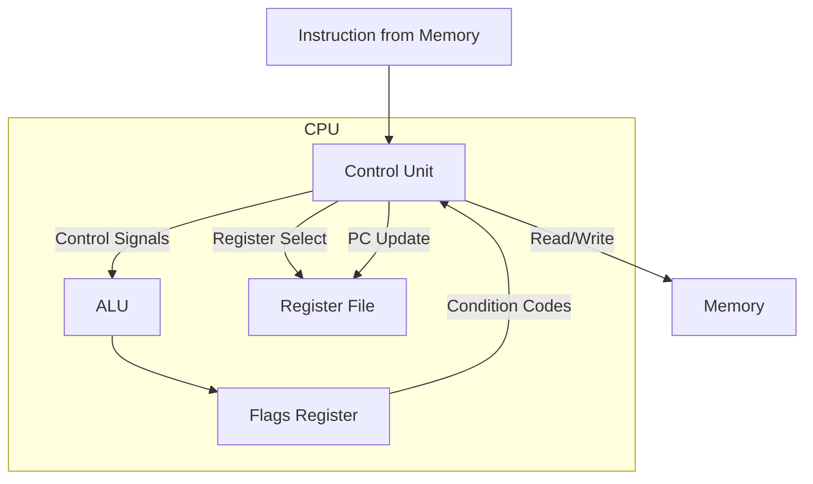
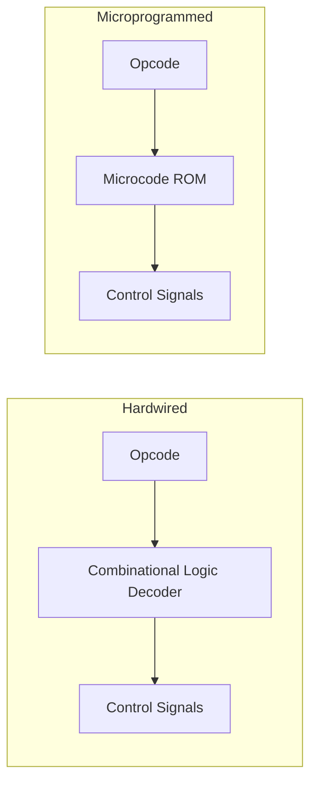
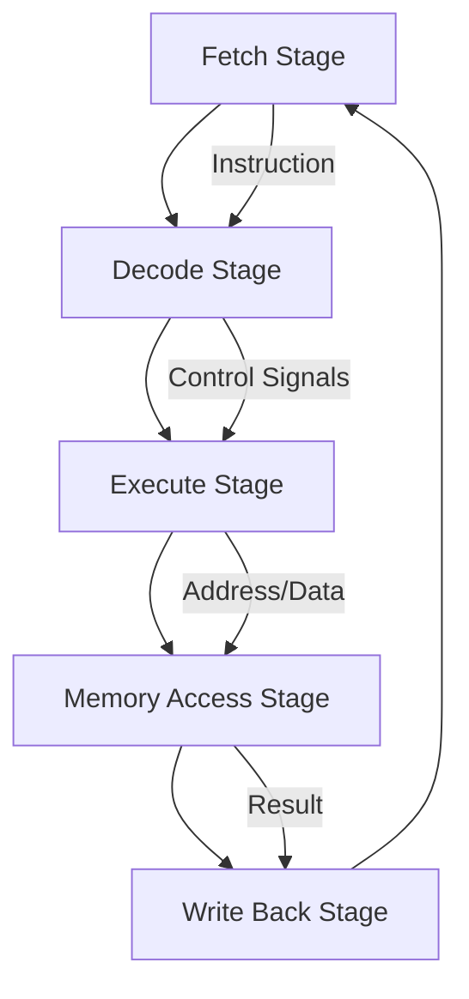

# Control Unit

## Overview

The **Control Unit (CU)** is the component of the CPU that orchestrates the execution of instructions. It fetches instructions from memory, decodes them, and generates the control signals that direct all other components (ALU, registers, memory interface) to perform the correct operations. If the ALU is the "muscle" of the CPU, the control unit is the "brain."

## Detailed Explanation

### Role in the CPU



The control unit:
1. **Fetches** the next instruction from memory (using the PC)
2. **Decodes** the opcode to determine what operation to perform
3. **Generates control signals** that configure the datapath
4. **Manages the pipeline** (in pipelined CPUs)
5. **Handles interrupts and exceptions**

### Hardwired vs Microprogrammed Control

There are two fundamental approaches to implementing a control unit:



| Aspect | Hardwired | Microprogrammed |
|--------|-----------|-----------------|
| **Implementation** | Combinational logic circuits | Microcode stored in ROM |
| **Speed** | Faster (direct logic) | Slower (ROM lookup + sequencing) |
| **Flexibility** | Difficult to modify | Easy to update (change microcode) |
| **Complexity** | Complex for large ISAs | Easier to manage complex ISAs |
| **Used In** | RISC processors | CISC processors (x86) |
| **Design Time** | Longer (manual circuit design) | Shorter (write microcode programs) |
| **Cost** | Lower per-unit (no ROM) | Higher per-unit (ROM needed) |

### How Hardwired Control Works

The control signals are direct Boolean functions of the opcode and state:

```
Control Signal = f(opcode, stage, flags)

Example signals for ADD R1, R2, R3:
  RegRead = 1       (read from register file)
  ALUOp = ADD       (select addition in ALU)
  RegWrite = 1      (write result to register file)
  MemRead = 0       (no memory read)
  MemWrite = 0      (no memory write)
  Branch = 0        (no branch)
  ALUSrc = 0        (ALU input from register, not immediate)
```

### How Microprogrammed Control Works

Each machine instruction triggers a sequence of **micro-operations (micro-ops)** stored in a microcode ROM:

```
Machine Instruction: ADD [RBX + 8], RAX

Microcode sequence:
  ┌─ μop 1: MAR ← RBX + 8       ; Calculate memory address
  ├─ μop 2: MDR ← Memory[MAR]    ; Read from memory
  ├─ μop 3: MDR ← MDR + RAX      ; Add RAX to value
  └─ μop 4: Memory[MAR] ← MDR    ; Write back to memory

Each μop generates specific control signals for one clock cycle.
```

### The Fetch-Decode-Execute Cycle (Detailed)



```
Stage 1 - Fetch:
  MAR ← PC                    ; Put PC on address bus
  MDR ← Memory[MAR]          ; Read instruction from memory
  IR ← MDR                    ; Load into Instruction Register
  PC ← PC + instruction_size  ; Advance PC

Stage 2 - Decode:
  Decode IR opcode            ; Identify instruction type
  Read source registers       ; Get operands from register file
  Generate control signals    ; Set up datapath for execution

Stage 3 - Execute:
  ALU performs operation      ; Add, subtract, compare, etc.
  Calculate branch target     ; If branch instruction

Stage 4 - Memory Access:
  Read/write memory if needed ; LOAD/STORE instructions only

Stage 5 - Write Back:
  Write result to register    ; Store ALU result in destination register
```

### Control Signals

The control unit generates signals that configure the datapath:

| Signal | Purpose | Values |
|--------|---------|--------|
| **RegDst** | Select destination register | RT or RD |
| **ALUSrc** | Select ALU second input | Register or Immediate |
| **MemtoReg** | Select write-back source | ALU result or Memory |
| **RegWrite** | Enable register write | 0 or 1 |
| **MemRead** | Enable memory read | 0 or 1 |
| **MemWrite** | Enable memory write | 0 or 1 |
| **Branch** | Enable branch logic | 0 or 1 |
| **ALUOp** | Select ALU operation | ADD, SUB, AND, OR, etc. |

### Instruction Register (IR)

The control unit reads the instruction register to determine what to do:

```
IR contents for "ADD R1, R2, R3" (RISC-V R-type, 32-bit):
┌─────────┬───────┬───────┬───────┬────────┬─────────┐
│ 0000000 │ 00011 │ 00010 │ 000   │ 00001  │ 0110011 │
│ Funct7  │  Rs2  │  Rs1  │Funct3 │  Rd    │ Opcode  │
└─────────┴───────┴───────┴───────┴────────┴─────────┘
         │                                   │
         └── Control unit reads these fields ┘
             to generate control signals
```

## Examples

### Example 1: Control Signals for Different Instructions

```
Instruction: ADD R1, R2, R3
  RegDst=Rd, ALUSrc=Reg, ALUOp=ADD, MemtoReg=ALU, RegWrite=1, MemRead=0, MemWrite=0

Instruction: LOAD R1, [R2 + 4]
  RegDst=Rt, ALUSrc=Imm, ALUOp=ADD, MemtoReg=Mem, RegWrite=1, MemRead=1, MemWrite=0

Instruction: STORE R1, [R2 + 4]
  RegDst=X, ALUSrc=Imm, ALUOp=ADD, MemtoReg=X, RegWrite=0, MemRead=0, MemWrite=1

Instruction: BEQ R1, R2, label
  RegDst=X, ALUSrc=Reg, ALUOp=SUB, MemtoReg=X, RegWrite=0, MemRead=0, MemWrite=0, Branch=1
```

### Example 2: Microcode for Complex x86 Instruction

```
Instruction: REP MOVSB  (copy CX bytes from [RSI] to [RDI])

Microcode:
  loop:
    μop 1: Check CX; if 0, exit
    μop 2: tmp ← Memory[RSI]     ; Load byte from source
    μop 3: Memory[RDI] ← tmp     ; Store byte to destination
    μop 4: RSI ← RSI + 1         ; Increment source pointer
    μop 5: RDI ← RDI + 1         ; Increment destination pointer
    μop 6: CX ← CX - 1           ; Decrement counter
    μop 7: Goto loop

This one x86 instruction generates 7 micro-ops per iteration.
The microcode sequencer handles the loop internally.
```

### Example 3: Interrupt Handling

```
When an interrupt occurs:
  1. Control unit finishes current instruction
  2. Saves PC and flags to stack (or link register)
  3. Loads interrupt vector from interrupt controller
  4. Sets PC to interrupt handler address
  5. Switches to kernel mode (if privilege change needed)
  
After interrupt handler:
  1. Restores PC and flags
  2. Returns to interrupted instruction
```

### Example 4: Hardwired vs Microcode Performance

```
Simple RISC instruction (hardwired):
  Decode: 1 gate delay (~0.01-0.02 ns at modern process nodes)
  Execute: 1 cycle
  Total: 1 cycle

Complex CISC instruction (microcoded):
  Decode: ROM lookup (~0.5 ns)
  Execute: Multiple micro-ops, 3-20 cycles
  Total: 3-20 cycles
```

## Interview Questions

### Q1: What does the control unit do?
**Answer**: The control unit fetches instructions from memory, decodes them, and generates control signals that direct the ALU, registers, and memory interface to execute the instruction. It orchestrates the entire fetch-decode-execute cycle and manages interrupts.

### Q2: What's the difference between hardwired and microprogrammed control?
**Answer**: Hardwired control uses combinational logic circuits to directly generate control signals—it's faster but harder to modify. Microprogrammed control stores control sequences in a ROM—it's slower but more flexible and easier to design for complex ISAs. RISC typically uses hardwired; CISC (x86) uses microprogrammed.

### Q3: What are micro-operations?
**Answer**: Micro-operations (μops) are the atomic operations that the control unit sequences to implement a machine instruction. For example, `ADD [mem], RAX` generates μops for: load from memory, add, store to memory. In x86, complex CISC instructions are decoded into RISC-like μops for efficient execution.

### Q4: How does the control unit handle branch instructions?
**Answer**: The control unit evaluates the branch condition (using flags from the ALU). If the branch is taken, it loads the branch target into the PC. If not taken, it increments the PC normally. In pipelined CPUs, branch prediction speculatively determines the PC value before the condition is known.

### Q5: What happens during an interrupt?
**Answer**: The control unit finishes the current instruction, saves the processor state (PC, flags) to the stack or a special register, loads the interrupt handler's address from the interrupt vector table, and transfers control to the handler. After the handler completes, the saved state is restored and execution resumes.

## Common Mistakes

1. **Confusing the control unit with the CPU** — The CU is one part of the CPU, alongside the ALU, registers, and buses. The CU doesn't compute; it directs.
2. **Thinking microcode is software** — Microcode is firmware—it's stored in ROM inside the CPU and is not accessible to programmers. It's lower-level than assembly language.
3. **Assuming all CPUs use microcode** — RISC CPUs typically use hardwired control, which is faster. Microcode is mainly used for CISC ISAs with complex instructions.
4. **Forgetting the control unit in pipelining** — In a pipelined CPU, the control unit is split across pipeline stages, with each stage having its own control signals.

## Summary

| Aspect | Detail |
|--------|--------|
| **Role** | Orchestrates instruction execution |
| **Functions** | Fetch, decode, generate control signals, handle interrupts |
| **Hardwired** | Combinational logic, fast, used in RISC |
| **Microprogrammed** | ROM-based, flexible, used in CISC (x86) |
| **Micro-ops** | Atomic operations implementing a machine instruction |
| **Key Signals** | RegDst, ALUSrc, MemRead, MemWrite, RegWrite, Branch, ALUOp |

## Cross-References

- [ALU](./alu.md) — The execution unit controlled by the CU
- [Registers](./registers.md) — Selected and controlled by the CU
- [Microcode](./microcode.md) — How microprogrammed CU stores its programs
- [ISA](./isa.md) — The instruction set the CU must implement
- [Classic Pipeline](../pipelining/classic.md) — How the CU is distributed across pipeline stages
