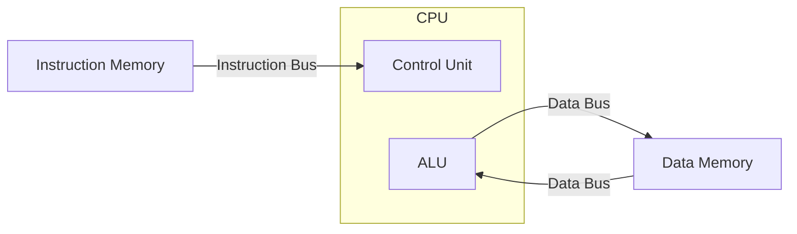
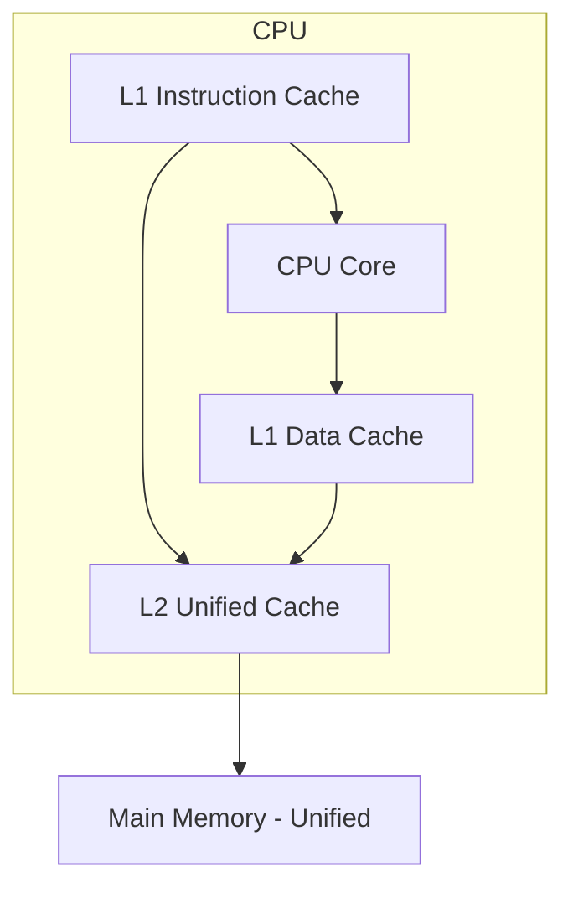

# Harvard Architecture

## Overview

The **Harvard architecture** uses physically separate memory and buses for instructions and data. Named after the Harvard Mark I computer (1944), this design allows the CPU to fetch an instruction and read/write data simultaneously, eliminating the Von Neumann bottleneck at the cost of increased hardware complexity.

## Detailed Explanation

### Core Design



**Key characteristics:**
- Two separate memory spaces: one for instructions, one for data
- Two separate buses: instruction bus and data bus
- The CPU can fetch the next instruction while simultaneously reading/writing data
- Program memory is often read-only (ROM/flash), data memory is read-write (RAM)

### Harvard vs Von Neumann

| Feature | Von Neumann | Harvard |
|---------|-------------|---------|
| Memory | Unified (instructions + data) | Separate (instruction memory + data memory) |
| Buses | Single shared bus | Two independent buses |
| Simultaneous Access | No (bus contention) | Yes (parallel fetch + data access) |
| Hardware Complexity | Lower | Higher |
| Programming Model | Simpler (one address space) | More complex (two address spaces) |
| Cost | Lower | Higher (more buses, more memory) |
| Primary Use | General-purpose computers | Embedded systems, DSPs, microcontrollers |

### Why Embedded Systems Prefer Harvard

Embedded processors (like AVR, PIC, and many ARM Cortex-M variants) often use Harvard architecture because:

1. **Predictable timing** — No bus contention means deterministic execution time
2. **Higher throughput** — Fetch instruction and access data in the same clock cycle
3. **Simpler memory** — Program in flash (read-only), data in SRAM (read-write)
4. **Cost effective** — Two small, specialized memories are cheaper than one large general-purpose memory

### Modified Harvard Architecture

Most modern CPUs use a **Modified Harvard architecture**:



- **At L1 level**: Separate I-cache and D-cache (Harvard)
- **At L2 and below**: Unified cache (Von Neumann)
- **Programming model**: Unified address space (Von Neumann)

This gives the performance benefit of parallel instruction/data access with the flexibility of a unified memory model.

### The Harvard Mark I

The original Harvard Mark I (1944) used:
- Punched paper tape for instructions (read-only)
- Electromagnetic counters for data (read-write)
- Physically different media, making it impossible to treat instructions as data

## Examples

### Example 1: Simultaneous Fetch and Read

```
Cycle 1: Fetch instruction from address 0x100 (instruction bus)
         AND simultaneously read data from address 0x50 (data bus)

In Von Neumann: These would require two sequential bus transactions
In Harvard:     Both happen in parallel — 2x throughput for this operation
```

### Example 2: AVR Microcontroller (Arduino)

The ATmega328P (used in Arduino Uno) is a Harvard architecture chip:

```
Flash Memory (Instruction):  32 KB  — Stores program code
SRAM (Data):                  2 KB  — Stores variables and stack
EEPROM (Data):                1 KB  — Persistent data storage

The CPU can read an instruction from flash while writing to SRAM
in the same clock cycle — this is why AVR achieves 1 instruction/cycle.
```

### Example 3: DSP Processing

A Digital Signal Processor (DSP) performing a multiply-accumulate:

```
Harvard:  Cycle 1: Fetch instruction X[n] from program memory
                   AND read coefficient a[k] from data memory
                   AND read sample x[n-k] from data memory
          → All three in one cycle (triple-bus variant)

Von Neumann: Same operations require 3 sequential memory accesses
```

### Example 4: x86 L1 Cache Split

Modern x86 processors (Intel/AMD) use Harvard at L1:

```
Intel Core i7:
  L1 Instruction Cache: 32 KB, 8-way, 4 cycles latency
  L1 Data Cache:        32 KB, 8-way, 4 cycles latency
  L2 Unified Cache:     256 KB, 8-way, 12 cycles latency
  L3 Unified Cache:     8 MB, 16-way, ~40 cycles latency

The L1 split allows the front-end (instruction fetch) and back-end
(data load/store) to operate independently.
```

## Interview Questions

### Q1: What is the main advantage of Harvard architecture?
**Answer**: The ability to simultaneously access instruction memory and data memory, eliminating bus contention. This allows higher throughput—the CPU can fetch the next instruction while the current instruction reads or writes data.

### Q2: Why don't general-purpose computers use pure Harvard architecture?
**Answer**: Because having two separate memory spaces complicates the programming model. Compilers, linkers, and operating systems assume a unified address space. The Modified Harvard approach (separate L1 caches, unified memory model) provides the performance benefit without the programming complexity.

### Q3: What is Modified Harvard architecture?
**Answer**: A hybrid where the CPU has separate instruction and data caches (Harvard) but accesses a unified main memory (Von Neumann). The programmer sees a single address space. Most modern CPUs (x86, ARM Cortex-A) use this approach.

### Q4: Give an example of a pure Harvard architecture device.
**Answer**: Microcontrollers like AVR (Arduino), PIC, and some ARM Cortex-M variants. They have physically separate flash memory (for programs) and SRAM (for data) with independent buses.

### Q5: How does Harvard architecture affect pipelining?
**Answer**: It simplifies pipelining because the fetch stage can read instructions while the memory access stage reads/writes data without conflict. In Von Neumann, these stages would contend for the same bus, requiring stalls or complex arbitration.

## Common Mistakes

1. **Thinking Harvard is always better** — The parallel bus advantage comes at the cost of hardware complexity and inflexible memory allocation. For general-purpose computing, Von Neumann with caches is more practical.
2. **Confusing "separate caches" with "separate memory"** — Modern x86 CPUs have split L1 caches but unified main memory. This is Modified Harvard, not pure Harvard.
3. **Assuming Harvard means no data in program memory** — Some Harvard architectures allow reading from program memory (e.g., AVR's `LPM` instruction), but it's through special instructions, not the normal data path.
4. **Forgetting about bus width** — Harvard doesn't inherently mean wider buses. The advantage is parallelism, not width.

## Summary

| Aspect | Detail |
|--------|--------|
| **Key Idea** | Separate memory and buses for instructions and data |
| **Advantage** | Simultaneous instruction fetch + data access |
| **Disadvantage** | More hardware, less flexible memory allocation |
| **Pure Harvard** | Embedded systems, DSPs, microcontrollers |
| **Modified Harvard** | Most modern CPUs (split L1 cache, unified memory) |
| **Programming Model** | Usually two address spaces (pure) or unified (modified) |

## Cross-References

- [Von Neumann Architecture](./von-neumann.md) — The alternative with unified memory
- [Cache Basics](../memory-hierarchy/cache-basics.md) — How caches implement the Harvard split
- [Split Caches](../memory-hierarchy/split.md) — Separate I-cache and D-cache design
- [Classic Pipeline](../pipelining/classic.md) — How Harvard enables better pipeline throughput

## Cross References

- [Von Neumann](von-neumann.md)
- [Cache Split](../memory-hierarchy/split.md)
- [Memory Hierarchy](../memory-hierarchy/README.md)
