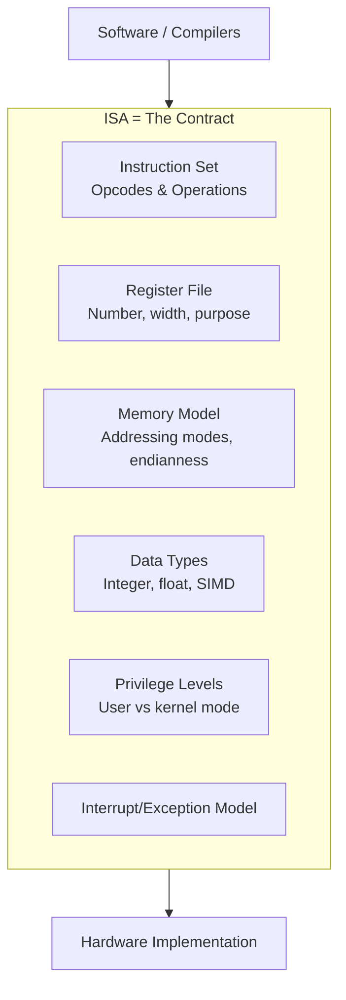

# Instruction Set Architecture (ISA)

## Overview

The **Instruction Set Architecture (ISA)** is the abstract interface between hardware and software. It defines what the processor can do—its instructions, registers, memory addressing modes, data types, and I/O model—without specifying how it's implemented internally. The ISA is the "contract" that compilers target and hardware designers fulfill.

## Detailed Explanation

### What the ISA Defines



| Component | What It Specifies | Example (x86-64) |
|-----------|-------------------|-------------------|
| **Instructions** | Opcodes and their semantics | `ADD`, `MOV`, `JMP`, `PUSH` |
| **Registers** | Number, size, and purpose | 16 general-purpose 64-bit registers |
| **Addressing Modes** | How memory operands are specified | Direct, indirect, indexed, base+offset |
| **Data Types** | Supported data widths and formats | 8/16/32/64-bit int, 32/64-bit float, SIMD |
| **Memory Model** | Byte ordering, alignment, ordering rules | Little-endian, strongly ordered |
| **Privilege Levels** | Protection rings | Ring 0 (kernel) to Ring 3 (user) |
| **Interrupts** | How exceptions and interrupts are handled | IDT, interrupt vectors |

### ISA vs Microarchitecture

This is a critical distinction:

```
ISA (What)                    Microarchitecture (How)
─────────────                 ──────────────────────
x86-64                        Intel Skylake
x86-64                        Intel Alder Lake
x86-64                        AMD Zen 4
ARMv8-A                       Apple M2
ARMv8-A                       Cortex-A78
RISC-V RV64GC                 SiFive P670
```

The same ISA can have vastly different implementations:
- **Skylake**: 4-wide decode, 192-entry ROB
- **Zen 4**: 4-wide decode, 320-entry ROB
- Both execute x86-64 code

### Instruction Formats

Instructions are encoded as binary words. The format specifies how bits are divided:

```
Typical RISC instruction (fixed-width, 32-bit):
┌────────┬───────┬───────┬───────┬────────┬────────┐
│ Opcode │  Rd   │  Rs1  │  Rs2  │ Funct3 │ Funct7 │
│ 7 bits │ 5 bits│ 5 bits│ 5 bits│ 3 bits │ 7 bits │
└────────┴───────┴───────┴───────┴────────┴────────┘

x86 instruction (variable-width, 1-15 bytes):
┌────────┬────────┬────────┬───────┬────────────────┐
│Prefixes│ Opcode │ ModR/M │  SIB  │ Displacement   │
│0-4 bytes│1-3 bytes│1 byte │1 byte │ 0/1/2/4 bytes  │
└────────┴────────┴────────┴───────┴────────────────┘
```

### Addressing Modes

How an instruction specifies where its operands are:

| Mode | Description | Example |
|------|-------------|---------|
| **Immediate** | Value is in the instruction itself | `MOV R1, #42` |
| **Register** | Operand is in a register | `ADD R1, R2, R3` |
| **Direct** | Memory address is in the instruction | `LOAD R1, [0x1000]` |
| **Indirect** | Register holds the memory address | `LOAD R1, [R2]` |
| **Base + Offset** | Address = register + constant | `LOAD R1, [R2 + 16]` |
| **Indexed** | Address = base + index × scale | `LOAD R1, [R2 + R3*4]` |
| **PC-Relative** | Address = PC + offset | `BEQ R1, R2, label` |

### Endianness

How multi-byte values are stored in memory:

```
Value: 0x12345678 stored at address 0x100

Big-Endian (network order, SPARC, MIPS):
  0x100: 0x12  (most significant byte first)
  0x101: 0x34
  0x102: 0x56
  0x103: 0x78  (least significant byte last)

Little-Endian (x86, ARM default):
  0x100: 0x78  (least significant byte first)
  0x101: 0x56
  0x102: 0x34
  0x103: 0x12  (most significant byte last)
```

### Privilege Levels

ISAs define protection mechanisms:

```
┌─────────────────────────────┐
│  Ring 0: Kernel / OS        │  Full access to all instructions and memory
├─────────────────────────────┤
│  Ring 1-2: Device Drivers   │  Limited access (used in some architectures)
├─────────────────────────────┤
│  Ring 3: User Applications  │  Restricted; cannot execute privileged instructions
└─────────────────────────────┘

ARM Exception Levels:
  EL0: User applications
  EL1: OS kernel
  EL2: Hypervisor
  EL3: Secure Monitor (TrustZone)
```

## Examples

### Example 1: x86-64 ISA Summary

```
Registers:    16 GPRs (RAX-R15), RIP, RFLAGS, 16 XMM/YMM/ZMM
Instructions: ~1500 base + extensions (SSE, AVX, AVX-512, BMI, etc.)
Encoding:     Variable-length (1-15 bytes), CISC
Endianness:   Little-endian
Memory Model: TSO (Total Store Ordering)
Privilege:    Ring 0-3
```

### Example 2: RISC-V ISA Summary

```
Registers:    32 GPRs (x0-x31), 32 FPRs (f0-f31)
Base ISA:     RV32I (32-bit), RV64I (64-bit)
Extensions:   M (multiply), A (atomic), F/D (float), V (vector), C (compressed)
Encoding:     Fixed-width 32-bit (16-bit with C extension)
Endianness:   Little-endian
Privilege:    Machine, Supervisor, User
```

### Example 3: How a Compiler Uses the ISA

```c
// C code
int a = 10, b = 20;
int c = a + b;
```

```asm
; x86-64 assembly (ISA: x86-64)
mov eax, 10        ; MOV opcode: load immediate into register
add eax, 20        ; ADD opcode: add immediate to register

; ARM assembly (ISA: ARMv8-A)
mov w0, #10        ; MOV: load immediate
add w0, w0, #20    ; ADD: add immediate

; RISC-V assembly (ISA: RV64I)
li a0, 10          ; pseudo-instruction for ADDI
addi a0, a0, 20    ; ADDI: add immediate
```

The compiler translates high-level code into ISA-specific instructions. The same logic produces different binary code for different ISAs.

### Example 4: ISA Extensions

ISAs evolve through extensions:

```
x86 Evolution:
  8086 (1978)    → 16-bit, no FPU
  i386 (1985)    → 32-bit, protected mode
  x86-64 (2003)  → 64-bit, more registers
  SSE (1999)     → 128-bit SIMD
  AVX (2011)     → 256-bit SIMD
  AVX-512 (2016) → 512-bit SIMD
  APX (2023)     → 32 GPRs, new condition codes

Each extension adds new opcodes while maintaining backward compatibility.
```

## Interview Questions

### Q1: What is an ISA?
**Answer**: The Instruction Set Architecture is the abstract specification of a processor's programmer-visible interface. It defines the instruction set, registers, memory model, data types, and privilege levels. It's the boundary between hardware (implementation) and software (compilers/OS).

### Q2: What's the difference between ISA and microarchitecture?
**Answer**: The ISA defines *what* the processor can do (the contract); microarchitecture defines *how* it does it (the implementation). For example, x86-64 is an ISA, while Intel's Skylake and AMD's Zen are different microarchitectures implementing that same ISA.

### Q3: Why is x86 considered CISC while ARM is considered RISC?
**Answer**: x86 has variable-length instructions, many addressing modes, and complex instructions (string operations, SIMD). ARM has fixed-length instructions, a load/store model, and simpler instructions. However, modern x86 CPUs internally decode complex instructions into RISC-like micro-operations.

### Q4: What is endianness and why does it matter?
**Answer**: Endianness determines the byte order of multi-byte values in memory. Big-endian stores the most significant byte first (like writing numbers); little-endian stores the least significant byte first. It matters for network protocols (which use big-endian/network order) and binary file formats.

### Q5: Can the same ISA have different performance on different implementations?
**Answer**: Absolutely. The ISA is the interface; performance depends on the microarchitecture. An x86-64 program runs on both a low-power Intel Atom and a high-performance Intel Core i9, but with vastly different performance. The program is binary-compatible; the hardware determines speed.

## Common Mistakes

1. **Confusing ISA with assembly language** — The ISA is the specification; assembly is one way to write ISA-level code. Multiple assembly syntaxes can exist for the same ISA (e.g., AT&T vs Intel syntax for x86).
2. **Thinking RISC always means simpler hardware** — Modern RISC processors (Apple M2, ARM Cortex-X3) are extremely complex. RISC refers to the ISA design philosophy, not the hardware simplicity.
3. **Assuming ISA compatibility means identical behavior** — Different implementations may have different performance characteristics, pipeline depths, and microarchitectural side effects (relevant for security, e.g., Spectre).
4. **Overlooking privilege levels** — The ISA defines how the processor enforces protection. Understanding Ring 0 vs Ring 3 is essential for OS and security interviews.

## Summary

| Aspect | Detail |
|--------|--------|
| **Definition** | The hardware-software interface specification |
| **Components** | Instructions, registers, memory model, data types, privilege levels |
| **vs Microarchitecture** | ISA = what; microarchitecture = how |
| **Examples** | x86-64, ARMv8-A, RISC-V, MIPS |
| **Evolution** | Extended through backward-compatible additions (SSE → AVX → AVX-512) |
| **Key Insight** | Same ISA, different performance across implementations |

## Cross-References

- [CISC vs RISC](./cisc-vs-risc.md) — Two ISA design philosophies
- [Registers](./registers.md) — The register file defined by the ISA
- [Von Neumann Architecture](./von-neumann.md) — The memory model underlying most ISAs
- [ARM](../modern/arm.md) — ARM ISA details
- [RISC-V](../modern/risc-v.md) — The open-source ISA
- [x86-64](../modern/x86-64.md) — The dominant desktop/server ISA

## Cross References

- [CISC vs RISC](cisc-vs-risc.md)
- [Registers](registers.md)
- [ARM](../modern/arm.md)
- [x86-64](../modern/x86-64.md)
- [RISC-V](../modern/risc-v.md)
