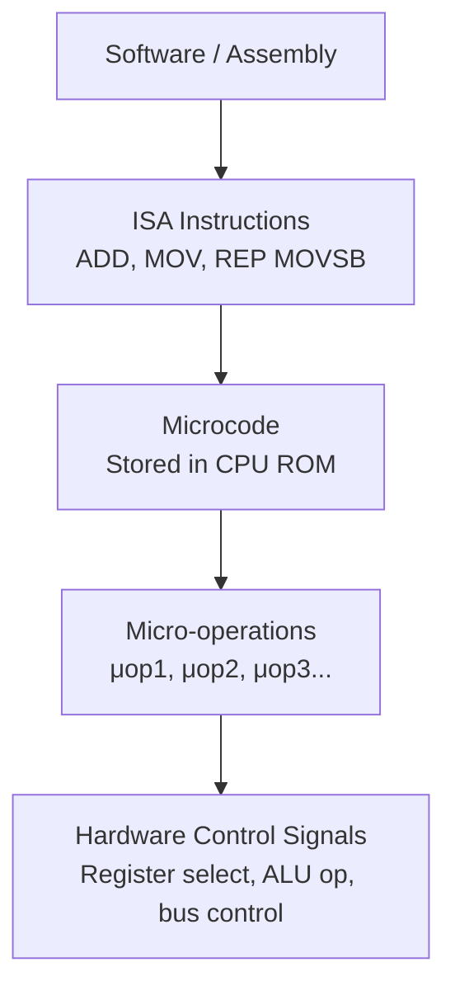
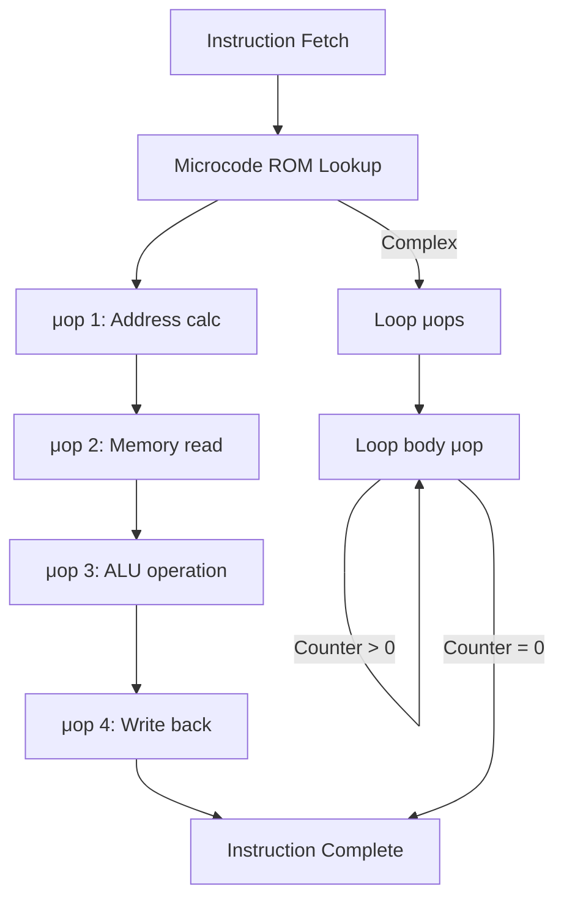
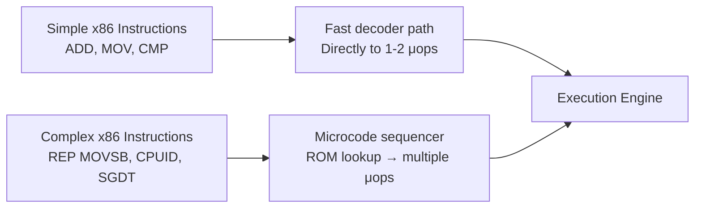

# Microcode

## Overview

**Microcode** is a layer of software-like instructions stored inside the CPU that translates complex machine instructions into sequences of low-level control signals. It serves as an intermediary between the ISA (what the programmer sees) and the hardware (what actually happens). Microcode is primarily used in CISC processors like x86, where the ISA has many complex instructions.

## Detailed Explanation

### What Microcode Is



Microcode is essentially a **translator**:
- Input: A machine instruction (opcode + operands)
- Output: A sequence of micro-operations (μops)
- Each μop generates specific control signals for one clock cycle

### Microcode vs Hardwired Control

| Aspect | Microcode | Hardwired |
|--------|-----------|-----------|
| **Storage** | ROM inside CPU | Combinational logic gates |
| **Latency** | ROM lookup + sequencing (slower) | Direct logic (faster) |
| **Flexibility** | Can be patched/updated | Fixed at fabrication |
| **Complex ISA** | Handles well (just more μops) | Difficult to design |
| **Simple ISA** | Overkill | Ideal |
| **Used in** | x86 (Intel, AMD) | RISC (ARM, RISC-V, MIPS) |

### Microcode Structure

A microcode entry (microinstruction) typically contains:

```
┌─────────────────────────────────────────────────────────────┐
│ Microinstruction (typically 64-200+ bits wide)              │
├──────────┬──────────┬──────────┬──────────┬─────────────────┤
│ ALU Ctrl │ Reg Sel  │ Bus Ctrl │ Seq Ctrl │ Next Address    │
│ (what op)│ (which   │ (read/   │ (next μop│ (if branching   │
│          │ registers│  write)  │  or stop)│  in microcode)  │
└──────────┴──────────┴──────────┴──────────┴─────────────────┘
```

**Fields explained:**
- **ALU Control**: What operation the ALU should perform
- **Register Select**: Which registers to read/write
- **Bus Control**: Memory read/write, data direction
- **Sequencing**: Whether to continue to next μop, branch, or end
- **Next Address**: For microcode branches (loops, conditionals)

### Microcode Sequencing



### Microcode Updates

Modern x86 CPUs support **microcode updates**:

```
Why update microcode?
  1. Fix CPU bugs (errata)
  2. Patch security vulnerabilities (Spectre, Meltdown mitigations)
  3. Add new instruction support (rare)

How it works:
  1. OS/firmware loads microcode update from disk
  2. Update is written to a writable microcode store (patch RAM)
  3. Patch RAM overrides default ROM entries
  4. Takes effect after writing; no reboot needed on modern CPUs

Intel: Microcode updates distributed via Linux firmware or Windows Update
AMD: Similar mechanism through AGESA firmware
```

### How x86 Uses Microcode

Modern x86 processors use a hybrid approach:



```
Simple instruction (fast path):
  ADD RAX, RBX → 1 μop (direct decode, no microcode needed)

Medium instruction:
  ADD [RBX+8], RAX → 3 μops (load, add, store — still fast decoder)

Complex instruction (microcode):
  REP MOVSB → many μops (loop with load+store, handled by microcode sequencer)
  CPUID → ~100+ μops (complex internal logic)
  SGDT → microcode (accesses internal system registers)
```

### Microcode and Security

Microcode has security implications:

```
Spectre/Meltdown (2018):
  - Exploited speculative execution side effects
  - Mitigated partly through microcode updates
  - Added new instructions via microcode: IBRS, STIBP, IBPB
  
Downfall (2023):
  - Exploited Gather Data Sampling
  - Microcode update disabled affected functionality
  
Microcode patches can:
  ✓ Disable or modify instruction behavior
  ✓ Add new MSR (Model-Specific Register) controls
  ✗ Cannot change the fundamental pipeline structure
```

### Micro-ops vs Microcode

These are related but different:

| Concept | Description |
|---------|-------------|
| **Micro-instruction** | A single entry in the microcode ROM |
| **Micro-operation (μop)** | An atomic operation that executes in the pipeline |
| **Microcode** | The collection of micro-instructions implementing the ISA |
| **Micro-architecture** | The overall hardware design including pipeline, execution units |

All micro-instructions produce μops, but not all μops come from microcode—simple instructions are decoded directly to μops without microcode involvement.

## Examples

### Example 1: x86 `ADD [mem], reg` Microcode

```
Machine instruction: ADD [RBX + 8], RAX

Microcode sequence:
  μop 1: LOAD tmp1, [RBX + 8]    ; Read from memory (address = RBX + 8)
  μop 2: ADD  tmp1, tmp1, RAX     ; Add RAX to loaded value
  μop 3: STORE [RBX + 8], tmp1    ; Write result back to memory

Control signals for μop 1:
  ALUOp = ADD (compute address)
  ALUSrc = Immediate (8)
  MemRead = 1
  RegWrite = 0 (not writing to register yet)
```

### Example 2: x86 `CPUID` Microcode (Simplified)

```
Machine instruction: CPUID

Microcode sequence (simplified, actual is much longer):
  μop 1: Read EAX input value
  μop 2: Switch on EAX value
  μop 3: If EAX=0: return vendor string and max EAX
  μop 4: If EAX=1: return family, model, stepping, features
  μop 5: If EAX=7: return extended features
  ... (many more cases)
  μop N: Write results to EAX, EBX, ECX, EDX

This instruction cannot be decoded in the fast path—it requires
the microcode sequencer to handle the complex branching logic.
```

### Example 3: Microcode Update File

```
Intel microcode update file format:
  Header:
    Header Version: 1
    Update Revision: 0x12345678
    Date: 2024-01-15
    Processor Signature: 0x906EA (family 6, model 142, stepping 10)
    Checksum: 0xABCD1234
  Body:
    Encrypted microcode patches (hundreds to thousands of bytes)
    
Loading process:
  1. CPU reads update header
  2. Verifies processor signature matches
  3. Verifies checksum
  4. Copies patch to internal patch RAM
  5. Patches override corresponding ROM entries
```

### Example 4: RISC vs CISC Microcode Overhead

```
Task: Copy 100 bytes from address A to address B

CISC (x86 with microcode):
  Instruction: REP MOVSB
  Microcode: 7 μops × 100 iterations = ~700 μops
  But: Microcode sequencer handles the loop internally
  
RISC (ARM):
  Instructions:
    .loop:
      LDRB  W0, [X1], #1    ; 1 μop
      STRB  W0, [X2], #1    ; 1 μop
      SUBS  X3, X3, #1      ; 1 μop
      B.NE  .loop            ; 1 μop (predicted taken)
  Total: 4 instructions × 100 = 400 instructions
  But: Each is 1 μop, fully pipelined, no microcode overhead
  
Modern x86 optimization: "ERMS" (Enhanced REP MOVSB) uses
optimized microcode that can leverage wider memory operations.
```

## Interview Questions

### Q1: What is microcode and why is it needed?
**Answer**: Microcode is firmware stored inside the CPU that translates complex machine instructions into sequences of micro-operations (μops). It's needed because CISC ISAs like x86 have instructions too complex to implement with simple combinational logic. Microcode provides a flexible way to implement these complex instructions while maintaining backward compatibility.

### Q2: Do RISC processors use microcode?
**Answer**: Generally no. RISC processors use hardwired control units with combinational logic that directly decodes instructions into control signals. Since RISC instructions are simple and uniform (fixed-length, load-store model), they don't need the microcode translation layer. This is one reason RISC can achieve lower latency per instruction.

### Q3: Can microcode be updated after manufacturing?
**Answer**: Yes, on modern x86 processors. Intel and AMD support microcode updates that are loaded during boot (by BIOS/UEFI) or at runtime (by the OS). These updates can fix CPU bugs, patch security vulnerabilities (like Spectre), and modify instruction behavior. The updates are stored in a writable patch RAM that overrides the default ROM.

### Q4: What's the difference between a micro-operation and a micro-instruction?
**Answer**: A micro-instruction is an entry in the microcode ROM that defines control signals. A micro-operation (μop) is an atomic operation that flows through the execution pipeline. Micro-instructions produce μops, but simple instructions may be decoded directly to μops without going through microcode (the "fast path" in modern x86).

### Q5: How does microcode affect performance?
**Answer**: Microcode adds latency because instructions must be looked up in ROM and sequenced through multiple μops. Modern x86 CPUs mitigate this by: (1) having a fast decoder for simple instructions that bypasses microcode, (2) caching decoded μops in the μop cache, and (3) using micro-op fusion to combine related μops. Complex instructions that require microcode are inherently slower.

## Common Mistakes

1. **Thinking microcode is the same as assembly** — Microcode is lower-level than assembly. Assembly is the ISA; microcode implements the ISA. Programmers never see or write microcode.
2. **Assuming all x86 instructions use microcode** — Simple x86 instructions (ADD, MOV, CMP) are decoded directly to μops by the fast decoder. Only complex instructions need the microcode sequencer.
3. **Confusing microcode with firmware (BIOS)** — BIOS/UEFI is software that runs on the CPU. Microcode is stored inside the CPU and operates at a lower level—it defines how the CPU interprets instructions.
4. **Thinking microcode updates change the ISA** — Microcode updates can modify instruction behavior (fix bugs, add security features) but don't fundamentally change the ISA. The same binary code continues to run.
5. **Overlooking the μop cache** — Modern x86 CPUs have a decoded μop cache that stores previously decoded μops, avoiding repeated microcode lookups. This significantly reduces the microcode overhead for hot code paths.

## Summary

| Aspect | Detail |
|--------|--------|
| **What** | Firmware inside CPU that translates instructions to control signals |
| **Used By** | CISC processors (x86, VAX) |
| **Not Used By** | RISC processors (ARM, RISC-V, MIPS) |
| **Storage** | ROM (with writable patch RAM for updates) |
| **Updates** | Can fix bugs, patch security vulnerabilities |
| **Performance** | Adds latency for complex instructions; fast decoder handles simple ones |
| **μop Cache** | Caches decoded μops to avoid repeated microcode lookups |

## Cross-References

- [Control Unit](./control-unit.md) — Microcode implements the control unit in CISC CPUs
- [CISC vs RISC](./cisc-vs-risc.md) — Why CISC needs microcode and RISC doesn't
- [ISA](./isa.md) — The interface that microcode implements
- [Superscalar](../pipelining/superscalar.md) — How μops enable superscalar execution
- [Out-of-Order Execution](../pipelining/ooo.md) — μops are the unit of OoO execution
