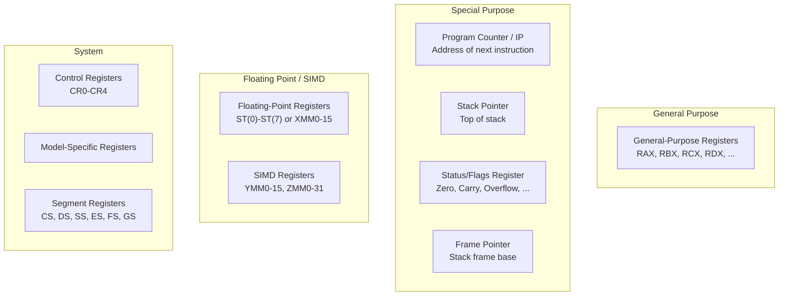

# Registers

## Overview

**Registers** are the smallest, fastest storage locations inside a CPU. They hold operands, results, addresses, and control information that the processor needs immediately. Understanding registers—their types, purposes, and how they relate to the ISA—is essential for understanding how CPUs execute instructions.

## Detailed Explanation

### Why Registers Exist

The memory hierarchy creates a fundamental trade-off:

```
Storage    | Size       | Latency    | Location
-----------|------------|------------|------------------
Registers  | Bytes      | 0 cycles   | Inside CPU core
L1 Cache   | 32-64 KB   | 1-4 cycles | On CPU die
L2 Cache   | 256 KB-1MB | 10-20 cycles | On CPU die
L3 Cache   | 8-64 MB    | 30-50 cycles | On CPU die
DRAM       | 16-128 GB  | 100-300 cycles | Motherboard
```

Registers sit at the top—every instruction reads from or writes to registers. Without them, the CPU would need to access L1 cache for every operand, adding latency to every operation.

### Types of Registers



### x86-64 Register Set

| Register | Purpose | Size |
|----------|---------|------|
| **RAX** | Accumulator, return value | 64-bit |
| **RBX** | Base register, callee-saved | 64-bit |
| **RCX** | Counter (loops, shifts) | 64-bit |
| **RDX** | I/O operations, multiply/divide | 64-bit |
| **RSI** | Source index (string ops) | 64-bit |
| **RDI** | Destination index (string ops) | 64-bit |
| **RBP** | Stack frame base pointer | 64-bit |
| **RSP** | Stack pointer (top of stack) | 64-bit |
| **R8-R15** | General purpose (x86-64 addition) | 64-bit |
| **RIP** | Instruction pointer (program counter) | 64-bit |
| **RFLAGS** | Status flags | 64-bit |
| **XMM0-15** | SSE floating-point/SIMD | 128-bit |
| **YMM0-15** | AVX SIMD (extends XMM) | 256-bit |
| **ZMM0-31** | AVX-512 SIMD (extends YMM) | 512-bit |

### Register Naming Conventions (x86-64)

```
64-bit: RAX
32-bit: EAX    (lower 32 bits of RAX)
16-bit: AX     (lower 16 bits of RAX)
8-bit:  AL     (lower 8 bits of AX)
8-bit:  AH     (upper 8 bits of AX)

RAX: [63 .............................................. 0]
EAX:                              [31 ................... 0]
AX:                               [15 ................. 0]
AH:                                     [15 ...... 8]
AL:                                     [7 ....... 0]
```

### ARM Register Set

```
ARMv8-A (AArch64):
  X0-X30    : 31 general-purpose 64-bit registers
  XZR       : Zero register (always reads as 0)
  SP        : Stack pointer
  PC        : Program counter
  PSTATE    : Process state (N, Z, C, V, DAIF flag bits) — saved to SPSR_ELx on exception
  V0-V31    : 128-bit SIMD/FP registers
  
Special:
  X30 (LR)  : Link register (return address)
  X29 (FP)  : Frame pointer
```

### RISC-V Register Set

```
Register | ABI Name | Purpose          | Preserved?
---------|----------|------------------|----------
x0       | zero     | Constant 0       | —
x1       | ra       | Return address   | No
x2       | sp       | Stack pointer    | Yes
x3       | gp       | Global pointer   | —
x4       | tp       | Thread pointer   | —
x5-x7    | t0-t2    | Temporaries      | No
x8       | s0/fp    | Saved/frame ptr  | Yes
x9       | s1       | Saved register   | Yes
x10-x11  | a0-a1    | Args / return    | No
x12-x17  | a2-a7    | Arguments        | No
x18-x27  | s2-s11   | Saved registers  | Yes
x28-x31  | t3-t6    | Temporaries      | No
```

### Status Flags Register

The flags register (RFLAGS in x86, PSTATE in AArch64 / CPSR in AArch32) contains condition codes:

| Flag | Name | Set When |
|------|------|----------|
| **Z** | Zero | Result is zero |
| **C** | Carry | Unsigned overflow |
| **N** | Negative | Result is negative (MSB = 1) |
| **V** | Overflow | Signed overflow |
| **S** | Sign | Same as N on x86 |

```
Example: CMP R1, R2  (computes R1 - R2, sets flags)

If R1 = 5, R2 = 5:  Z=1, C=0, N=0, V=0  (equal)
If R1 = 3, R2 = 5:  Z=0, C=1, N=1, V=0  (R1 < R2 unsigned, negative result)
If R1 = 5, R2 = 3:  Z=0, C=0, N=0, V=0  (R1 > R2)
```

### Register Allocation

Compilers must decide which variables go in registers vs. memory:

```
// C code
int foo(int a, int b, int c) {
    int d = a + b;
    int e = d * c;
    return e;
}

; x86-64 with register allocation:
foo:
    add  edi, esi      ; d = a + b (edi = a, esi = b)
    imul eax, edi, ecx  ; e = d * c (ecx = c)
    ret                 ; return e (in eax)

; All variables fit in registers — no memory accesses!
```

**Spilling**: When there aren't enough registers, variables are "spilled" to the stack:

```c
// Many live variables → some must spill
int result = a + b + c + d + e + f + g + h + i + j;
// If only 8 registers available, some values go to stack
```

### Calling Conventions

Registers have roles in function calls (x86-64 System V ABI):

```
Arguments:     RDI, RSI, RDX, RCX, R8, R9 (first 6 integer args)
Return value:  RAX (integer), XMM0 (float)
Caller-saved:  RAX, RCX, RDX, RSI, RDI, R8-R11 (caller must save if needed)
Callee-saved:  RBX, RBP, R12-R15 (callee must preserve)
Stack pointer: RSP must be 16-byte aligned before CALL
```

## Examples

### Example 1: Register vs Memory Speed

```
; Adding two values in registers: 1 cycle
ADD RAX, RBX

; Adding two values from memory: ~4 cycles (L1 hit)
ADD RAX, [RBX]

; Adding with L2 cache miss: ~12 cycles
; Adding with DRAM access: ~200 cycles
```

### Example 2: Context Switch and Registers

During a context switch, the OS must save and restore all registers:

```
Process A running:
  RAX=1, RBX=2, RCX=3, RSP=0x7FFF..., RFLAGS=0x246

Context switch to Process B:
  1. Save A's registers to A's PCB (Process Control Block)
  2. Load B's registers from B's PCB
  3. Resume B

Process B:
  RAX=100, RBX=200, RCX=300, RSP=0x7FFE..., RFLAGS=0x202
```

### Example 3: SIMD Registers

SIMD registers allow parallel operations on multiple values:

```
; x86 AVX2: Add 8 pairs of 32-bit integers simultaneously
VMOVDQU YMM0, [array1]    ; Load 8 ints into YMM0 (256 bits)
VMOVDQU YMM1, [array2]    ; Load 8 ints into YMM1
VPADDD  YMM0, YMM0, YMM1  ; Add 8 pairs in parallel
VMOVDQU [result], YMM0     ; Store 8 results

; One instruction processes 8 data elements — 8x throughput
```

## Interview Questions

### Q1: Why are registers the fastest storage?
**Answer**: Registers are physically located inside the CPU core, directly connected to the ALU and control unit. They're implemented as flip-flops (SRAM-like) with no address decoding or bus traversal needed. Access is direct wiring—zero additional latency beyond the clock edge.

### Q2: How many registers does a typical CPU have?
**Answer**: It depends on the ISA. x86-64 has 16 general-purpose registers plus SIMD/FP registers. ARM has 31 GPRs. RISC-V has 32 GPRs (though x0 is hardwired to zero). Modern x86 CPUs also have many more physical registers internally (for register renaming), but the ISA-visible count is 16.

### Q3: What is register spilling?
**Answer**: When a function needs more registers than available, the compiler "spills" some variables to the stack (memory). This is a performance penalty because stack access is slower than register access. Good register allocation algorithms minimize spills.

### Q4: What is register renaming?
**Answer**: A microarchitectural technique where the CPU maintains more physical registers than the ISA specifies. When an instruction writes to a register, the CPU maps it to a new physical register, eliminating false dependencies (WAR and WAW hazards). This enables more out-of-order execution.

### Q5: What is the zero register in RISC-V/ARM?
**Answer**: A register hardwired to always read as zero (x0 in RISC-V, XZR in ARM). It simplifies the ISA: `MOV R1, R2` can be encoded as `ADD R1, R2, x0`. It also provides a constant zero without needing an immediate field.

## Common Mistakes

1. **Confusing registers with cache** — Registers are inside the CPU core and accessed directly by instructions. Cache is on the CPU die but accessed through memory addressing. Registers have no "address"—they're selected by instruction encoding.
2. **Thinking more registers = always better** — More registers increase instruction encoding size (more bits needed to specify register numbers) and context switch overhead (more state to save/restore). There's a diminishing return.
3. **Ignoring ABI calling conventions** — Understanding which registers are caller-saved vs callee-saved is essential for assembly programming and debugging.
4. **Confusing physical and architectural registers** — The ISA defines architectural registers (e.g., 16 in x86-64). The CPU may have hundreds of physical registers for register renaming. The programmer only sees architectural registers.

## Summary

| Aspect | Detail |
|--------|--------|
| **What** | Fastest storage inside the CPU core |
| **Speed** | 0 additional cycles (directly wired to ALU) |
| **Types** | GPRs, special-purpose (PC, SP, flags), SIMD/FP, system |
| **x86-64** | 16 GPRs, RFLAGS, RIP, XMM/YMM/ZMM |
| **ARM** | 31 GPRs + SP, PC, PSTATE, V0-V31 |
| **RISC-V** | 32 GPRs (x0 = zero), 32 FPRs |
| **Register Spilling** | When too many live variables, some go to stack |
| **Register Renaming** | Microarchitectural technique to eliminate false dependencies |

## Cross-References

- [ISA](./isa.md) — The ISA defines the register set
- [ALU](./alu.md) — Operates on register values
- [Control Unit](./control-unit.md) — Selects registers for instruction operands
- [CISC vs RISC](./cisc-vs-risc.md) — RISC typically has more registers
- [Cache Basics](../memory-hierarchy/cache-basics.md) — The next level of the memory hierarchy
- [Forwarding/Bypassing](../pipelining/forwarding.md) — Register forwarding in pipelines
