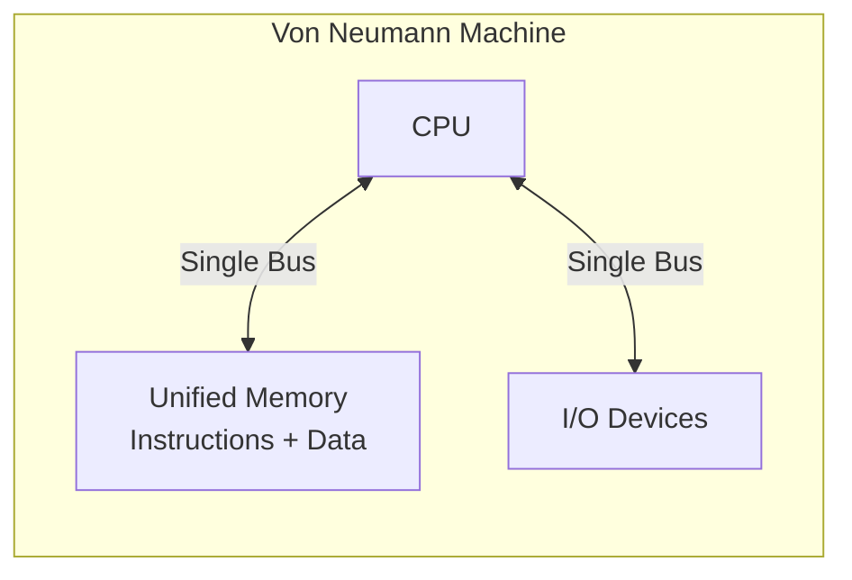

# Von Neumann Architecture

## Overview

The **Von Neumann architecture**, proposed by John von Neumann in 1945, is the foundational model for nearly all modern computers. Its key insight is the **stored-program concept**: both instructions and data reside in the same memory and are accessed through the same bus.

## Detailed Explanation

### Core Components



1. **Central Processing Unit (CPU)** — Contains the ALU, control unit, and registers
2. **Unified Memory** — A single address space holds both program instructions and data
3. **Single Bus System** — One set of wires (address bus + data bus) connects CPU to memory
4. **I/O Devices** — Input/output peripherals connected via the same or separate bus

### The Stored-Program Concept

Before Von Neumann, computers like ENIAC were programmed by physically rewiring them. The stored-program concept means:

- Programs are represented as data in memory
- Programs can be modified at runtime (self-modifying code)
- Loading a new program is as simple as writing to memory

### The Fetch-Decode-Execute Cycle

Every instruction follows this cycle:


1. **Fetch**: The control unit reads the instruction at the address in the Program Counter (PC)
2. **Decode**: The control unit interprets the opcode and determines what operation to perform
3. **Execute**: The ALU performs the operation; data may be read from/written to registers or memory
4. **Write Back**: Results are stored in the destination register or memory location
5. **PC Update**: The program counter advances to the next instruction (or branches)

### The Von Neumann Bottleneck

The single bus creates a fundamental limitation:

- CPU and memory communicate over one channel
- The CPU often stalls waiting for data from memory
- CPU speed has historically grown much faster than memory speed
- This gap creates a **bandwidth bottleneck**

```
Timeline:
CPU  ██████████████░░░░░░░░██████████████░░░░░░░░
         ↑ compute         ↑ waiting for memory
MEM  ░░░░░░░░░░░░░░████████░░░░░░░░░░░░░░████████
```

### How Modern CPUs Mitigate the Bottleneck

| Technique | How It Helps |
|-----------|-------------|
| **Cache hierarchy** (L1/L2/L3) | Keeps frequently used data close to the CPU |
| **Branch prediction** | Speculatively fetches instructions before knowing the branch outcome |
| **Out-of-order execution** | Executes independent instructions while waiting for memory |
| **Prefetching** | Predicts and fetches data before it's needed |
| **Wider buses** | Modern systems use 64-bit data buses and multiple memory channels |
| **Harvard split at L1** | Separate L1 caches for instructions and data |

## Examples

### Example 1: Simple Von Neumann Program

A program that adds two numbers stored in memory:

```
Address  | Content          | Meaning
---------|------------------|------------------
0x00     | LOAD R1, [0x10]  | Load value at address 0x10 into R1
0x04     | LOAD R2, [0x14]  | Load value at address 0x14 into R2
0x08     | ADD R3, R1, R2   | R3 = R1 + R2
0x0C     | STORE R3, [0x18] | Store result at address 0x18
0x10     | 5                | Data: first number
0x14     | 3                | Data: second number
0x18     | ?                | Data: result (8 after execution)
```

Notice how instructions (0x00–0x0C) and data (0x10–0x18) share the same memory space.

### Example 2: The Bottleneck in Practice

```c
// This loop is memory-bandwidth bound, not compute-bound
for (int i = 0; i < N; i++) {
    sum += array[i];  // Each iteration needs a memory fetch
}
```

With a cache, most accesses hit L1/L2 and complete in 1–4 cycles. Without cache (pure Von Neumann), each access goes to main memory (~100+ cycles), and the CPU stalls.

### Example 3: Self-Modifying Code

Since instructions and data share memory, a program can overwrite its own instructions:

```c
// Pseudo-assembly (not recommended in practice!)
// At runtime, change an ADD instruction to a SUB instruction
memory[0x08] = SUB_OPCODE;  // Self-modifying: changes ADD to SUB
```

This was occasionally used in early computing for optimization but is avoided in modern systems due to security (W⊕X) and pipeline flushing costs.

## Interview Questions

### Q1: What is the Von Neumann bottleneck?
**Answer**: The limitation caused by a single shared bus between the CPU and memory. Since instructions and data travel over the same channel, the CPU cannot fetch an instruction and read data simultaneously, creating a throughput ceiling. Modern CPUs mitigate this with caches, separate L1 instruction/data caches (Harvard at L1 level), and prefetching.

### Q2: What is the stored-program concept?
**Answer**: The idea that program instructions are stored in the same memory as data, represented as binary numbers. This allows programs to be loaded, modified, and executed without hardware changes—unlike earlier machines that required physical rewiring.

### Q3: Can a Von Neumann machine execute instructions and fetch data simultaneously?
**Answer**: Not with a single bus. However, modern processors use **Modified Harvard Architecture** at the L1 cache level (separate I-cache and D-cache) while presenting a Von Neumann interface to the programmer (unified address space). This gives the best of both worlds.

### Q4: Why is Von Neumann architecture still dominant?
**Answer**: Its simplicity and flexibility. A unified memory space simplifies programming, compilers, and operating systems. The Harvard model's advantage (parallel instruction/data fetch) is achieved through cache splitting, so a pure Harvard design isn't necessary for general-purpose computing.

### Q5: What's the difference between Von Neumann and stored-program architectures?
**Answer**: They're often used interchangeably, but technically Von Neumann refers to the specific design with unified memory and a single bus. The stored-program concept is the broader idea that programs are data in memory, which Von Neumann popularized but others (like Turing) also conceptualized.

## Common Mistakes

1. **Confusing Von Neumann with "no caches"** — Modern Von Neumann machines have extensive cache hierarchies. The single bus is the theoretical model; real implementations are more complex.
2. **Thinking Harvard architecture is always faster** — The separate buses add complexity and cost. For general-purpose computing, the cache-based approach is more practical.
3. **Assuming Von Neumann means no parallelism** — Superscalar, out-of-order, and SMT processors all work within the Von Neumann model.
4. **Ignoring the Modified Harvard approach** — Most modern CPUs use Harvard separation at L1 level while maintaining a Von Neumann programming model.
5. **Confusing Von Neumann bottleneck with memory wall** — The bottleneck is the single bus limitation; the memory wall is the growing speed gap between CPU and DRAM. Related but distinct concepts.

## Summary

| Aspect | Detail |
|--------|--------|
| **Key Idea** | Stored-program with unified memory for instructions and data |
| **Bottleneck** | Single bus limits CPU-memory throughput |
| **Modern Mitigation** | Cache hierarchy, prefetching, branch prediction, OoO execution |
| **Still Dominant** | Yes—virtually all general-purpose CPUs follow this model |
| **Practical Hybrid** | Modified Harvard at L1, Von Neumann at the programming model level |

## Cross-References

- [Harvard Architecture](./harvard.md) — The alternative with separate memories
- [Cache Basics](../memory-hierarchy/cache-basics.md) — How caches mitigate the bottleneck
- [Classic Pipeline](../pipelining/classic.md) — How the fetch-decode-execute cycle is pipelined
- [ISA](./isa.md) — The interface that sits above the hardware model

## Cross References

- [Harvard Architecture](harvard.md)
- [Memory Hierarchy](../memory-hierarchy/README.md)
- [OS Memory](../../os/memory/README.md)
