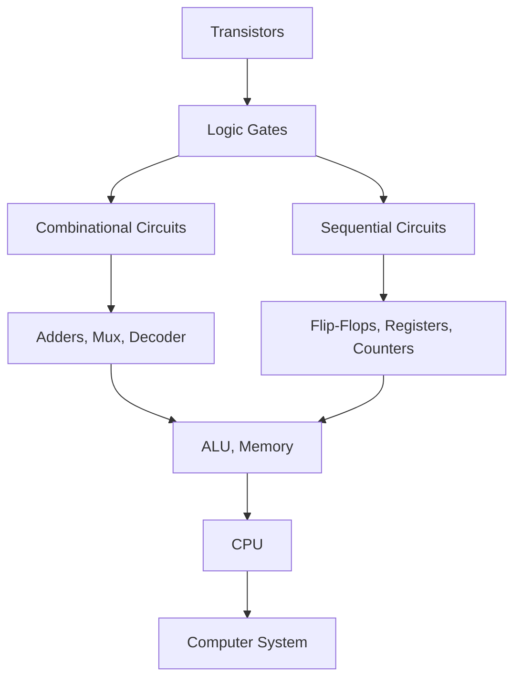

# Digital Logic

## Overview

Digital logic is the foundation of all computer hardware. It deals with signals that have two discrete values (0 and 1) and the circuits that process them. Every component in a computer — from simple gates to complex processors — is built from digital logic.

## Why Digital Logic Matters

- **Foundation**: All digital circuits are built from logic gates
- **Design**: Understanding gates is essential for hardware design
- **Interviews**: Frequently tested in hardware and systems interviews
- **Debugging**: Understanding circuits helps debug hardware issues
- **Abstraction**: Modern software runs on hardware built from these primitives

## From Transistors to Computers



Each level of abstraction hides complexity from the level above. Software engineers interact with the top; hardware engineers work at lower levels.

## Boolean Algebra

Boolean algebra is the mathematical foundation of digital logic. It uses three basic operations:

| Operation | Symbol | Expression | Truth Table |
|-----------|--------|------------|-------------|
| **AND** | `·` or `&&` | `A · B` | 1 only if both A and B are 1 |
| **OR** | `+` or `\|\|` | `A + B` | 1 if either A or B (or both) is 1 |
| **NOT** | `'` or `!` | `A'` | Inverts: 0→1, 1→0 |

### Fundamental Laws

| Law | Expression | Meaning |
|-----|-----------|---------|
| **Identity** | `A + 0 = A`, `A · 1 = A` | Element unchanged |
| **Null** | `A + 1 = 1`, `A · 0 = 0` | Dominant element |
| **Idempotent** | `A + A = A`, `A · A = A` | Duplicate doesn't matter |
| **Complement** | `A + A' = 1`, `A · A' = 0` | Element and inverse |
| **Commutative** | `A + B = B + A` | Order doesn't matter |
| **Associative** | `(A+B)+C = A+(B+C)` | Grouping doesn't matter |
| **Distributive** | `A·(B+C) = A·B + A·C` | AND distributes over OR |
| **De Morgan's** | `(A·B)' = A'+B'` | Negate and swap operators |

### De Morgan's Theorem

De Morgan's theorem is critical for circuit simplification:

```
(A · B)' = A' + B'    — NAND = OR of inverted inputs
(A + B)' = A' · B'    — NOR = AND of inverted inputs
```

**Practical use**: Any circuit can be built using only NAND gates (or only NOR gates). This is called a "universal gate."

## Logic Gates

### Basic Gates

| Gate | Symbol | Expression | Output is 1 when |
|------|--------|------------|------------------|
| **AND** | `&` | `Y = A · B` | Both inputs are 1 |
| **OR** | `≥1` | `Y = A + B` | At least one input is 1 |
| **NOT** | `1` | `Y = A'` | Input is 0 |
| **NAND** | `&` with bubble | `Y = (A · B)'` | NOT AND |
| **NOR** | `≥1` with bubble | `Y = (A + B)'` | NOT OR |
| **XOR** | `=1` | `Y = A ⊕ B` | Inputs differ |
| **XNOR** | `=` with bubble | `Y = (A ⊕ B)'` | Inputs are same |

### XOR Properties (Important for Interviews)

```
A ⊕ 0 = A          (identity)
A ⊕ 1 = A'          (complement)
A ⊕ A = 0           (self-inverse)
A ⊕ A' = 1
A ⊕ B = B ⊕ A       (commutative)
(A ⊕ B) ⊕ C = A ⊕ (B ⊕ C)  (associative)
```

**Interview trick**: Swap two variables without a temp variable:
```
A = A ⊕ B
B = A ⊕ B    (now B = original A)
A = A ⊕ B    (now A = original B)
```

## Combinational Circuits

Combinational circuits produce outputs that depend only on current inputs (no memory).

### Half Adder

Adds two single bits:

```
Inputs: A, B
Outputs: Sum = A ⊕ B, Carry = A · B

A | B | Sum | Carry
0 | 0 |  0  |   0
0 | 1 |  1  |   0
1 | 0 |  1  |   0
1 | 1 |  0  |   1
```

### Full Adder

Adds two bits plus a carry-in:

```
Inputs: A, B, Cin
Outputs: Sum = A ⊕ B ⊕ Cin
         Carry = (A · B) + (Cin · (A ⊕ B))
```

### Multiplexer (MUX)

Selects one of N inputs based on select lines:

```
2:1 MUX: Y = S'·D0 + S·D1

If S=0, output D0; if S=1, output D1
```

A 4:1 MUX needs 2 select lines (2² = 4 inputs).

### Decoder

Activates one of N output lines based on input:

```
2-to-4 Decoder:
Input: A1, A0
Output: D0 = A1'·A0', D1 = A1'·A0, D2 = A1·A0', D3 = A1·A0
```

## Sequential Circuits

Sequential circuits produce outputs based on current inputs AND previous state (they have memory).

### SR Latch

The simplest memory element:

```
S | R | Q (next) | Description
0 | 0 | Q (prev) | No change (memory)
0 | 1 | 0        | Reset
1 | 0 | 1        | Set
1 | 1 | Invalid  | Not allowed
```

### D Flip-Flop

Stores one bit, triggered by clock edge:

```
     ┌───┐
D ──>│   │──> Q
     │ D │
CLK ->│ FF│──> Q'
     └───┘

On rising clock edge: Q = D
At all other times: Q holds previous value
```

### Registers and Counters

- **Register**: Group of flip-flops storing a multi-bit value
- **Counter**: Register that increments on each clock pulse
- **Shift Register**: Shifts bits left/right on each clock pulse

## Karnaugh Maps (K-Maps)

K-Maps are used to simplify Boolean expressions visually.

### 3-Variable K-Map Example

```
     BC
A  | 00 | 01 | 11 | 10 |
---+----+----+----+----+
0  |  0 |  1 |  1 |  0 |
1  |  0 |  1 |  1 |  1 |

Groups: {01,11,01,11} = C, {11,10} = AB
Simplified: Y = C + AB
```

**Rules**: Group 1s in powers of 2 (1, 2, 4, 8). Larger groups = simpler expression. Groups can wrap around edges.

## Interview Questions

1. **Q: What's the difference between combinational and sequential logic?**
   A: Combinational logic: output depends only on current inputs (no memory). Examples: adders, MUX, decoders. Sequential logic: output depends on current inputs AND previous state (has memory via flip-flops). Examples: registers, counters, FSMs. Sequential circuits need a clock signal.

2. **Q: Why do we use binary in digital circuits?**
   A: Binary is robust against noise. A transistor is either ON or OFF — small voltage fluctuations don't change the state. Analog circuits are sensitive to noise; digital circuits are reliable. Also, binary maps naturally to Boolean algebra (AND, OR, NOT), making circuit design systematic.

3. **Q: How many transistors does a NAND gate need?**
   A: A 2-input NAND gate requires 4 transistors in CMOS technology (2 NMOS in series, 2 PMOS in parallel). NAND is a universal gate — any Boolean function can be implemented using only NAND gates. This is why NAND flash memory is named after it.

4. **Q: Explain a 4-bit ripple carry adder and its limitation.**
   A: A 4-bit ripple carry adder chains 4 full adders. Each FA's carry output feeds into the next FA's carry input. The carry "ripples" from LSB to MSB. Limitation: the final carry takes 4 gate delays to propagate, making it slow for large adders. Solution: carry-lookahead adder computes carry in parallel using generate and propagate signals.

5. **Q: What is a state machine (FSM)?**
   A: A Finite State Machine is a sequential circuit with a finite number of states, transitions between states based on inputs, and outputs associated with states or transitions. Used in: protocol implementations (TCP), controllers (traffic lights), parsers. Two types: Mealy (output depends on state + input) and Moore (output depends on state only).

6. **Q: How does a clock signal work in digital circuits?**
   A: A clock is a periodic square wave that synchronizes all sequential elements. On the rising (or falling) edge, flip-flops capture their inputs. Clock frequency determines processing speed. Clock skew (different arrival times at different flip-flops) is a major design challenge at high frequencies. Modern CPUs use PLLs to generate and distribute clock signals.

7. **Q: What is setup time and hold time for a flip-flop?**
   A: Setup time: the input D must be stable BEFORE the clock edge. Hold time: the input D must remain stable AFTER the clock edge. Violating these causes metastability (flip-flop enters an unstable state between 0 and 1). This is critical in cross-clock-domain design and is addressed with synchronizer flip-flops.

8. **Q: Explain De Morgan's theorem with a circuit example.**
   A: De Morgan's: (A·B)' = A'+B' and (A+B)' = A'·B'. Example: To implement Y = (A·B)' using OR and NOT gates: invert A, invert B, OR the results. This is exactly a NAND gate. De Morgan's lets you convert between AND/OR implementations, which is useful when you can only use one type of gate (NAND-only or NOR-only designs).

9. **Q: What is a multiplexer and where is it used?**
   A: A MUX selects one of N inputs based on log₂(N) select lines. A 2:1 MUX uses 1 select line; 4:1 uses 2; 8:1 uses 3. Used in: CPU data path (selecting ALU input), memory address decoding, communication bus arbitration. A MUX can implement any Boolean function by connecting inputs to constants 0/1.

10. **Q: How is memory (RAM) built from logic gates?**
   A: SRAM (static RAM) uses 6 transistors per bit — two cross-coupled inverters forming a bistable latch, plus access transistors. DRAM uses 1 transistor + 1 capacitor per bit — cheaper but needs refreshing. SRAM is faster (used for cache); DRAM is denser (used for main memory). Both are addressed using decoders to select specific cells.

## Summary

Digital logic is built from transistors → gates → circuits → processors. Boolean algebra provides the mathematical framework. Combinational circuits process current inputs; sequential circuits add memory. K-Maps simplify Boolean expressions. Understanding these foundations is essential for hardware interviews and for understanding how software ultimately executes.

## Cross-References

- [Boolean Algebra](boolean.md)
- [Logic Gates](gates.md)
- [Combinational Circuits](combinational.md)
- [Sequential Circuits](sequential.md)
- [Flip-Flops](flip-flops.md)
- [CPU Architecture](../cpu/README.md)
- [Number Systems](../number-systems/README.md)

## References

- [Digital Design and Computer Architecture](https://www.elsevier.com/books/digital-design-and-computer-architecture/harris/978-0-12-394424-5) — Harris & Harris
- [Digital Logic and Computer Design](https://www.pearson.com/en-us/subject-catalog/p/digital-logic-and-computer-design/P200000003158) — M. Morris Mano
- [Neso Academy — Digital Electronics](https://www.youtube.com/playlist?list=PLBlnK6fEyqRjMH3mWf6kwqiTbT798eju2) — YouTube
- [All About Circuits — Digital](https://www.allaboutcircuits.com/textbook/digital/) — Free textbook
