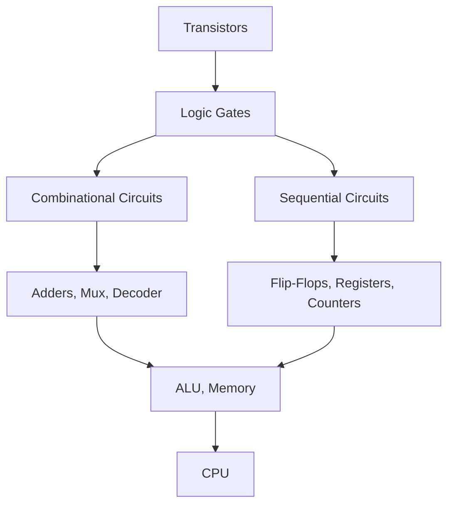

# Digital Logic

## Overview

Digital logic is the foundation of all computer hardware. It deals with signals that have two discrete values (0 and 1) and the circuits that process them. Every component in a computer — from simple gates to complex processors — is built from digital logic.

## Why Digital Logic Matters

- **Foundation**: All digital circuits are built from logic gates
- **Design**: Understanding gates is essential for hardware design
- **Interviews**: Frequently tested in hardware and systems interviews
- **Debugging**: Understanding circuits helps debug hardware issues

## Hierarchy

## Key Concepts

| Concept | Description |
|---------|-------------|
| **Boolean Algebra** | Mathematical foundation for logic design |
| **Logic Gates** | Basic building blocks (AND, OR, NOT, etc.) |
| **Combinational Logic** | Output depends only on current inputs |
| **Sequential Logic** | Output depends on current inputs AND previous state |
| **Clock** | Synchronizes sequential circuits |
| **Truth Table** | Lists all input-output combinations |

## Interview Questions

1. **Q: What's the difference between combinational and sequential logic?**
   A: Combinational logic: output depends only on current inputs (no memory). Sequential logic: output depends on current inputs AND previous state (has memory via flip-flops). Adders are combinational; counters are sequential.

2. **Q: Why do we use binary in digital circuits?**
   A: Binary is robust against noise. A transistor is either ON or OFF — small voltage fluctuations don't change the state. Analog circuits are sensitive to noise; digital circuits are reliable.

## Summary

Digital logic is built from transistors → gates → circuits → processors. Boolean algebra provides the mathematical framework. Combinational circuits process current inputs; sequential circuits add memory.

## Cross-References

- [Boolean Algebra](boolean.md)
- [Logic Gates](gates.md)
- [Combinational Circuits](combinational.md)
- [Sequential Circuits](sequential.md)
- [Flip-Flops](flip-flops.md)
