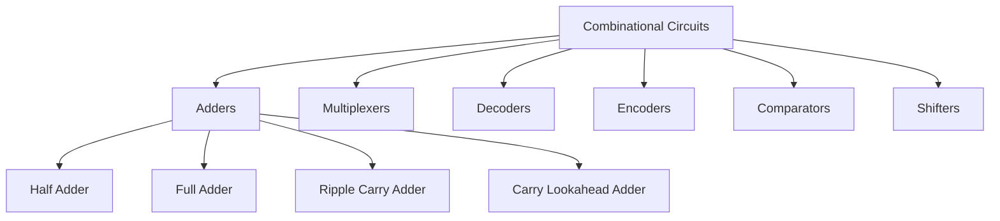
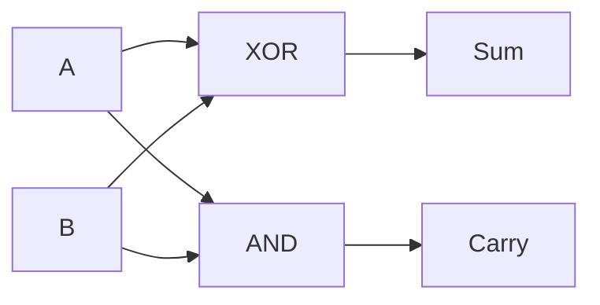
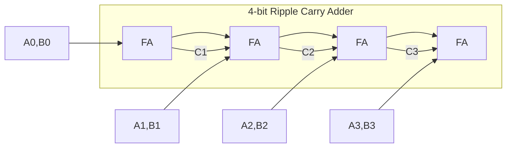

# Combinational Circuits

## Overview

Combinational circuits are digital circuits where the output depends **only on the current inputs** — there is no memory or feedback. They're built from logic gates and implement Boolean functions directly.

## Key Characteristics

- No memory (stateless)
- No clock signal needed
- Output changes when input changes (after propagation delay)
- Examples: adders, multiplexers, decoders, encoders

## Common Combinational Circuits



## Half Adder

Adds two 1-bit numbers. Produces sum and carry.

```
A | B | Sum | Carry
0 | 0 |  0  |   0
0 | 1 |  1  |   0
1 | 0 |  1  |   0
1 | 1 |  0  |   1
```

**Equations:**
- Sum = A ⊕ B (XOR)
- Carry = A · B (AND)



## Full Adder

Adds three 1-bit numbers (A, B, Carry-in). Produces sum and carry-out.

```
A | B | Cin | Sum | Cout
0 | 0 |  0  |  0  |  0
0 | 0 |  1  |  1  |  0
0 | 1 |  0  |  1  |  0
0 | 1 |  1  |  0  |  1
1 | 0 |  0  |  1  |  0
1 | 0 |  1  |  0  |  1
1 | 1 |  0  |  0  |  1
1 | 1 |  1  |  1  |  1
```

**Equations:**
- Sum = A ⊕ B ⊕ Cin
- Cout = A·B + Cin·(A ⊕ B)

## Ripple Carry Adder

Chains full adders to add multi-bit numbers:



**Problem**: Carry must ripple through all stages → slow for large numbers.
**Delay**: O(n) where n = number of bits.

## Carry Lookahead Adder (CLA)

Computes all carries in parallel using generate (G) and propagate (P) signals:

```
Gi = Ai · Bi        (Generate: carry is generated)
Pi = Ai ⊕ Bi        (Propagate: carry passes through)

C1 = G0 + P0·C0
C2 = G1 + P1·G0 + P1·P0·C0
C3 = G2 + P2·G1 + P2·P1·G0 + P2·P1·P0·C0
```

**Advantage**: O(log n) delay vs O(n) for ripple carry.
**Disadvantage**: More hardware (wider gates).

## Multiplexer (MUX)

Selects one of many inputs based on select lines:

```
2:1 MUX:
S | Output
0 |   I0
1 |   I1

4:1 MUX:
S1 S0 | Output
 0  0 |   I0
 0  1 |   I1
 1  0 |   I2
 1  1 |   I3
```

**Implementation**: MUX = OR of (AND of input with select pattern).

**n:1 MUX** needs **log₂(n)** select lines.

## Decoder

Activates one of many output lines based on input:

```
2-to-4 Decoder:
A1 A0 | D3 D2 D1 D0
 0  0 |  0  0  0  1
 0  1 |  0  0  1  0
 1  0 |  0  1  0  0
 1  1 |  1  0  0  0
```

**n-to-2^n decoder** activates exactly one of 2^n outputs.

## Encoder

Opposite of decoder — converts active input line to binary:

```
4-to-2 Encoder:
D3 D2 D1 D0 | A1 A0
 0  0  0  1 |  0  0
 0  0  1  0 |  0  1
 0  1  0  0 |  1  0
 1  0  0  0 |  1  1
```

**Priority encoder**: If multiple inputs active, highest priority wins.

## Comparator

Compares two binary numbers:

```
1-bit Comparator:
A | B | A>B | A=B | A<B
0 | 0 |  0  |  1  |  0
0 | 1 |  0  |  0  |  1
1 | 0 |  1  |  0  |  0
1 | 1 |  0  |  1  |  0
```

## Interview Questions

1. **Q: What's the difference between combinational and sequential circuits?**
   A: Combinational: output depends only on current inputs (no memory). Sequential: output depends on current inputs AND previous state (has memory). Combinational examples: adder, MUX. Sequential examples: counter, register.

2. **Q: What is the advantage of a carry lookahead adder over ripple carry?**
   A: CLA computes carries in parallel using generate/propagate signals, achieving O(log n) delay. Ripple carry has O(n) delay because each carry depends on the previous. CLA is faster but uses more hardware.

3. **Q: How many select lines does an 8:1 MUX need?**
   A: 3 select lines (log₂8 = 3). Each combination of select lines selects one of the 8 inputs.

4. **Q: What is a decoder used for?**
   A: Decoders activate one of many output lines based on binary input. Used in: memory address decoding (selecting a memory chip), instruction decoding (selecting operation), and address expansion.

5. **Q: How do you implement any Boolean function using a MUX?**
   A: An n-variable function can be implemented with a 2^(n-1):1 MUX. Connect n-1 variables to select lines, and set each data input to the function's value for the remaining variable (0, 1, or the variable/complement).

## Common Mistakes

- Confusing decoder (binary → one-hot) with encoder (one-hot → binary)
- Forgetting that combinational circuits have propagation delay
- Not understanding that MUX can implement any Boolean function
- Confusing half adder (2 inputs) with full adder (3 inputs)
- Assuming ripple carry adder is efficient for large bit widths

## Summary

Combinational circuits implement Boolean functions without memory. Key circuits: adders (half, full, ripple carry, CLA), MUX, decoder, encoder, comparator. They're the building blocks of ALUs and other processor components.

## Cross-References

- [Digital Logic Overview](README.md)
- [Boolean Algebra](boolean.md) — Mathematical foundation
- [Logic Gates](gates.md) — Building blocks
- [Sequential Circuits](sequential.md) — Adding memory
- [ALU](../cpu/alu.md) — Uses combinational circuits
