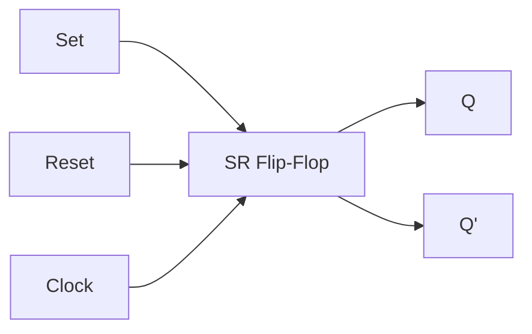
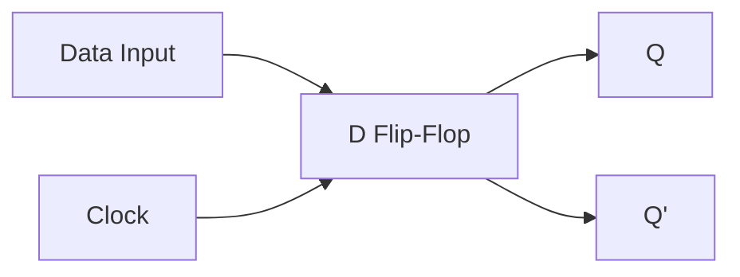
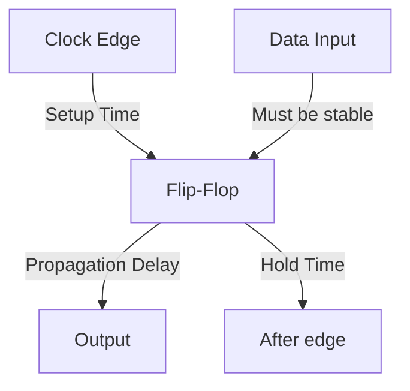
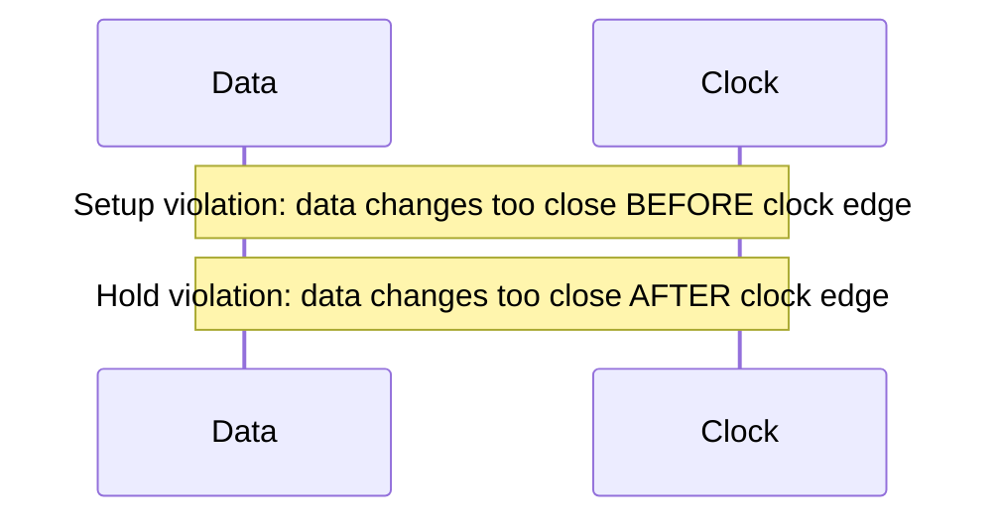
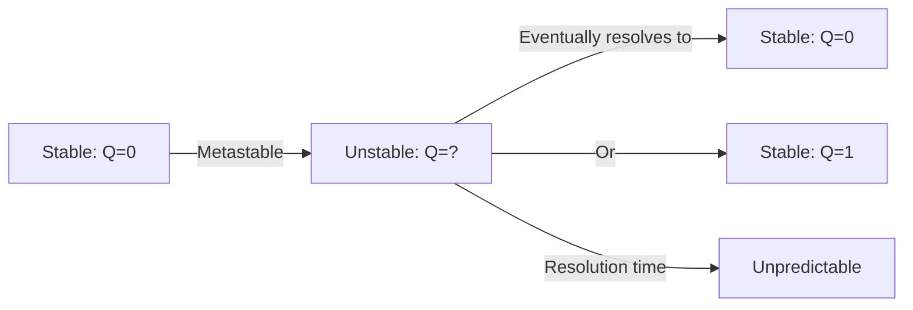
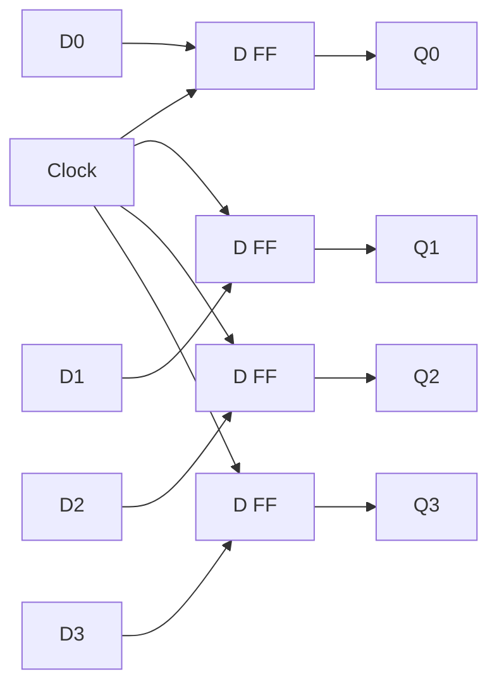
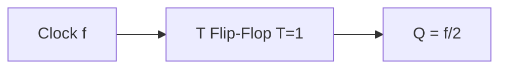
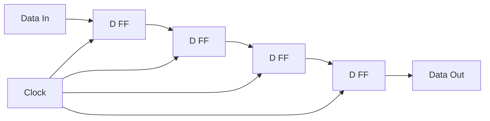

# Flip-Flops

## Overview

Flip-flops are the fundamental memory elements in digital circuits. They store one bit of data and change state only on clock edges (edge-triggered). All registers, counters, and state machines are built from flip-flops.

## SR Flip-Flop (Set-Reset)

The simplest flip-flop with two inputs: S (Set) and R (Reset).

```
S | R | Q(next) | Description
0 | 0 | Q       | No change
0 | 1 | 0       | Reset
1 | 0 | 1       | Set
1 | 1 | Invalid | Avoid!
```



**Problem**: S=1, R=1 is invalid (both set and reset simultaneously).

## D Flip-Flop (Data/Delay)

The most commonly used flip-flop. Has a single data input D.

```
On rising edge: Q(next) = D
```



**Advantage**: No invalid states. D flip-flop simply captures the D input on the clock edge.

## JK Flip-Flop

An improvement on SR flip-flop where J=1, K=1 toggles the output.

```
J | K | Q(next) | Description
0 | 0 | Q       | No change
0 | 1 | 0       | Reset
1 | 0 | 1       | Set
1 | 1 | Q'      | Toggle
```

**Advantage**: No invalid state (J=K=1 toggles instead of being invalid).

## T Flip-Flop (Toggle)

Toggles output on each clock pulse when T=1.

```
T | Q(next)
0 | Q (no change)
1 | Q' (toggle)
```

**Implementation**: T flip-flop = JK flip-flop with J=K=T.

## Timing Parameters



| Parameter | Description | Typical |
|-----------|-------------|---------|
| **Setup time (t_setup)** | Data must be stable BEFORE clock edge | 0.1-1 ns |
| **Hold time (t_hold)** | Data must be stable AFTER clock edge | 0.05-0.5 ns |
| **Propagation delay (t_pd)** | Time from clock edge to output change | 0.1-2 ns |
| **Clock-to-Q (t_cq)** | Same as propagation delay | 0.1-2 ns |

### Setup and Hold Time Violations



**Violations cause metastability** — the flip-flop enters an unstable state between 0 and 1.

## Metastability

When setup or hold times are violated, the flip-flop may enter a metastable state:



**Solution**: Synchronizer chains (two or more flip-flops in series) give metastability time to resolve.

## Flip-Flop Comparison

| Type | Inputs | Invalid State | Toggle | Use Case |
|------|--------|---------------|--------|----------|
| **SR** | S, R | Yes (S=R=1) | No | Simple latches |
| **D** | D | No | No | Data storage, registers |
| **JK** | J, K | No | Yes | Counters, state machines |
| **T** | T | No | Yes | Counters, frequency dividers |

## Applications

### Register (Bank of D Flip-Flops)



### Frequency Divider (T Flip-Flop)



Each T flip-flop divides frequency by 2.

### Shift Register



On each clock pulse, data shifts one position right.

## Interview Questions

1. **Q: What is setup time and hold time?**
   A: Setup time: data must be stable for a minimum time BEFORE the clock edge. Hold time: data must be stable for a minimum time AFTER the clock edge. Violating either causes metastability.

2. **Q: What is metastability?**
   A: When a flip-flop violates setup/hold times, it may enter an indeterminate state (neither 0 nor 1). It eventually resolves, but the time is unpredictable. Solved by synchronizer chains.

3. **Q: Why is the D flip-flop the most commonly used?**
   A: It has no invalid states (unlike SR), captures data cleanly on clock edge, and is the simplest edge-triggered storage element. JK and T flip-flops are built from D flip-flops in modern designs.

4. **Q: What's the difference between a latch and a flip-flop?**
   A: A latch is level-triggered (transparent while enable is HIGH). A flip-flop is edge-triggered (captures only on clock edge). Flip-flops provide deterministic timing; latches can cause timing issues in synchronous designs.

5. **Q: How do you build a counter from flip-flops?**
   A: Connect T flip-flops in series (each output drives the next T input) for a ripple counter. For synchronous counters, use JK or D flip-flops with combinational logic to determine next state.

## Common Mistakes

- Confusing setup time (before edge) with hold time (after edge)
- Forgetting that SR flip-flop has an invalid state
- Not understanding metastability and its consequences
- Confusing level-triggered latches with edge-triggered flip-flops
- Assuming flip-flops have zero delay

## Summary

Flip-flops are edge-triggered memory elements. D flip-flop is the most common (no invalid states). JK adds toggle capability. Setup/hold times must be met to avoid metastability. Applications: registers, counters, shift registers, state machines.

## Cross-References

- [Digital Logic Overview](README.md)
- [Sequential Circuits](sequential.md) — Circuits using flip-flops
- [Combinational Circuits](combinational.md) — Stateless circuits
- [Registers](../cpu/registers.md) — CPU registers built from flip-flops
