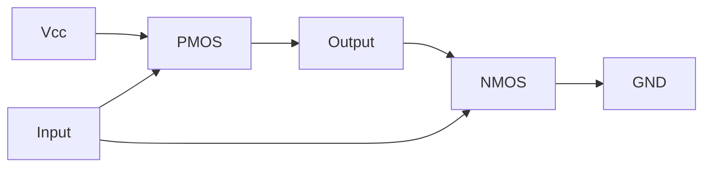

# Logic Gates

## Overview

Logic gates are the physical building blocks of digital circuits. Each gate implements a basic Boolean operation. All complex digital circuits — from adders to processors — are built from combinations of these gates.

## Basic Gates

### NOT Gate (Inverter)

```
Symbol:    A ──▷── A'
           (triangle with bubble)

Truth Table:
A | A'
0 |  1
1 |  0
```

### AND Gate

```
Symbol:    A ──┐
               ├─▷── A·B
           B ──┘

Truth Table:
A | B | A·B
0 | 0 |  0
0 | 1 |  0
1 | 0 |  0
1 | 1 |  1
```

### OR Gate

```
Symbol:    A ──┐
               ├─▷── A+B
           B ──┘

Truth Table:
A | B | A+B
0 | 0 |  0
0 | 1 |  1
1 | 0 |  1
1 | 1 |  1
```

## Universal Gates

### NAND Gate (NOT-AND)

```
A | B | (A·B)'
0 | 0 |   1
0 | 1 |   1
1 | 0 |   1
1 | 1 |   0
```

**NAND is universal** — any Boolean function can be implemented using only NAND gates:
- NOT A = NAND(A, A)
- A AND B = NAND(NAND(A, B), NAND(A, B))
- A OR B = NAND(NAND(A, A), NAND(B, B))

### NOR Gate (NOT-OR)

```
A | B | (A+B)'
0 | 0 |   1
0 | 1 |   0
1 | 0 |   0
1 | 1 |   0
```

**NOR is also universal** — any function can be implemented with only NOR gates.

## Other Important Gates

### XOR Gate (Exclusive OR)

```
A | B | A⊕B
0 | 0 |  0
0 | 1 |  1
1 | 0 |  1
1 | 1 |  0
```

**XOR = 1 when inputs differ.** Used in adders, parity checking, encryption.

Implementation: A⊕B = A·B' + A'·B

### XNOR Gate (Exclusive NOR)

```
A | B | (A⊕B)'
0 | 0 |   1
0 | 1 |   0
1 | 0 |   0
1 | 1 |   1
```

**XNOR = 1 when inputs are the same.** Used in equality comparators.

## Gate Implementations with Transistors

### NOT Gate (CMOS)



- Input HIGH → NMOS ON, PMOS OFF → Output LOW
- Input LOW → NMOS OFF, PMOS ON → Output HIGH

### NAND Gate (CMOS)

Requires 4 transistors (2 PMOS in parallel, 2 NMOS in series).

### NOR Gate (CMOS)

Requires 4 transistors (2 PMOS in series, 2 NMOS in parallel).

## Gate Count Summary

| Gate | Transistors (CMOS) | Universal? |
|------|-------------------|------------|
| NOT | 2 | No |
| NAND | 4 | Yes |
| NOR | 4 | Yes |
| AND | 6 (NAND + NOT) | No |
| OR | 6 (NOR + NOT) | No |
| XOR | 8-12 | No |

## NAND and NOR as Universal Gates

### Implementing AND with NAND

```
A ──┐
    ├─NAND──┐
B ──┘       ├─NAND── A·B
    ┌───────┘
    │ (tie both inputs)
    └───────┘
```

Actually: AND = NAND followed by NOT = NAND(NAND(A,B), NAND(A,B))

### Implementing OR with NAND

```
A ──NAND──┐
          ├─NAND── A+B
B ──NAND──┘
```

OR = NAND(NAND(A,A), NAND(B,B))

## Interview Questions

1. **Q: Why are NAND and NOR gates called universal gates?**
   A: Because any Boolean function can be implemented using only NAND gates or only NOR gates. AND, OR, and NOT can all be constructed from NAND or NOR alone. This is important for manufacturing — simpler fabrication.

2. **Q: How many transistors does a NAND gate need?**
   A: 4 transistors in CMOS: 2 PMOS in parallel (pull-up) and 2 NMOS in series (pull-down). This makes NAND more efficient than AND (which needs NAND + NOT = 6 transistors).

3. **Q: What is the difference between XOR and XNOR?**
   A: XOR outputs 1 when inputs differ (odd parity). XNOR outputs 1 when inputs are the same (even parity). XNOR is the complement of XOR.

4. **Q: How do you implement XOR using NAND gates only?**
   A: XOR = NAND(NAND(A, NAND(A,B)), NAND(B, NAND(A,B))). Requires 4 NAND gates.

5. **Q: What is the fan-out of a gate?**
   A: The number of inputs that a gate's output can drive. Limited by the output current of the driving gate. A gate with high fan-out may need buffer gates.

## Common Mistakes

- Confusing NAND with AND (NAND is inverted)
- Forgetting that NAND/NOR are universal but AND/OR are not
- Not knowing the transistor count for basic gates
- Confusing XOR (⊕) with OR (+) — XOR is exclusive, OR is inclusive
- Assuming gates have zero propagation delay (they have small delays)

## Summary

Logic gates implement Boolean operations physically. NAND and NOR are universal gates (any function can be built from them). CMOS implementation uses 2-4 transistors per gate. Understanding gate properties is essential for digital design.

## Cross-References

- [Digital Logic Overview](README.md)
- [Boolean Algebra](boolean.md) — Mathematical foundation
- [Combinational Circuits](combinational.md) — Building with gates
- [Sequential Circuits](sequential.md) — Adding memory

## Cross References

- [Boolean Algebra](boolean.md)
- [Combinational Circuits](combinational.md)
- [ALU](../cpu/alu.md)
