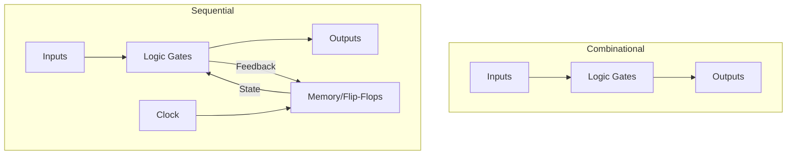
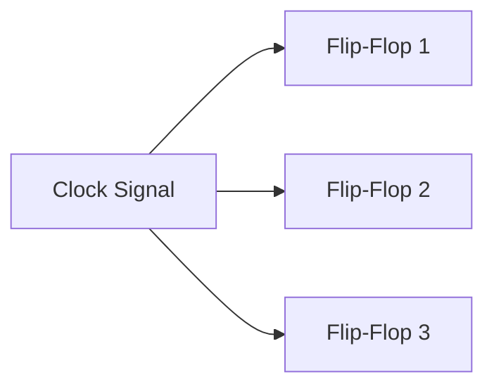
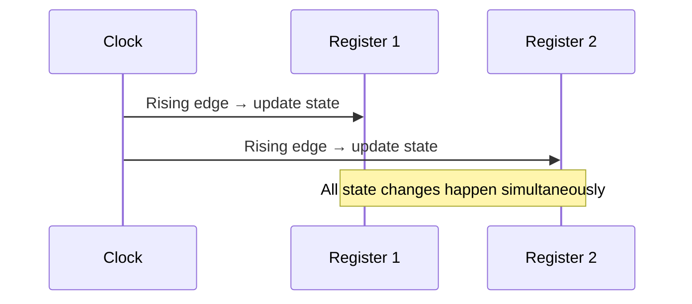
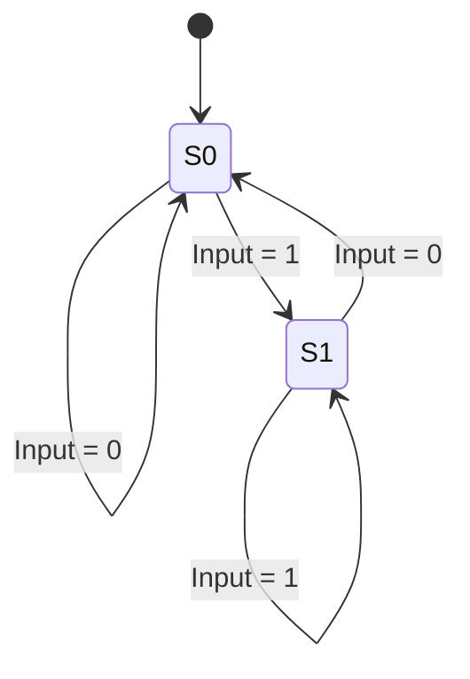
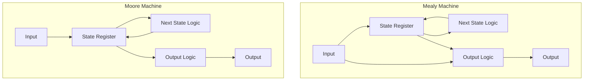
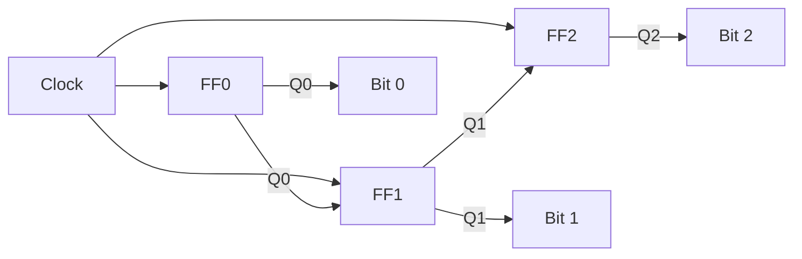
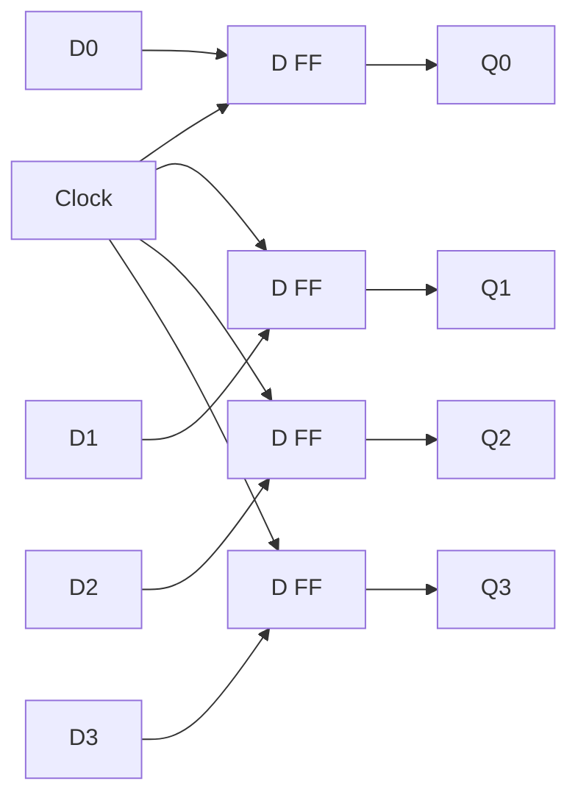

# Sequential Circuits

## Overview

Sequential circuits are digital circuits where the output depends on **both current inputs AND previous state** (memory). They use feedback loops and are synchronized by a clock signal.

## Combinational vs Sequential



| Aspect | Combinational | Sequential |
|--------|--------------|------------|
| **Memory** | No | Yes (flip-flops) |
| **Clock** | Not needed | Required |
| **Output depends on** | Current inputs only | Current inputs + state |
| **Examples** | Adder, MUX | Counter, register, FSM |

## Clock Signal



**Clock parameters:**
- **Frequency**: Cycles per second (Hz)
- **Period**: Time for one cycle (1/frequency)
- **Duty cycle**: Percentage of time clock is HIGH
- **Rising edge**: LOW → HIGH transition (most circuits trigger here)
- **Falling edge**: HIGH → LOW transition

## Types of Sequential Circuits

### Synchronous

All state changes occur on clock edges:



### Asynchronous

State changes occur when inputs change (no global clock):

- Faster but harder to design
- Prone to race conditions
- Rare in modern designs

## Latches vs Flip-Flops

### Latch (Level-Triggered)

Changes state while clock is HIGH (transparent):

```
SR Latch:
S | R | Q(next)
0 | 0 | Q (no change)
0 | 1 | 0 (reset)
1 | 0 | 1 (set)
1 | 1 | Invalid
```

### Flip-Flop (Edge-Triggered)

Changes state only on clock edge:

```
D Flip-Flop:
On rising edge: Q(next) = D
```

**Key difference**: Latch is transparent (output follows input while clock HIGH). Flip-flop captures input only at clock edge.

## State Machines (Finite State Machines)



### Mealy vs Moore Machines



| Type | Output depends on | Characteristics |
|------|------------------|-----------------|
| **Mealy** | State + Input | Faster response, can have glitches |
| **Moore** | State only | More stable, one cycle delay |

## Counters

### Synchronous Counter

All flip-flops share the same clock:



### Ripple Counter (Asynchronous)

Each flip-flop's clock is the previous flip-flop's output:

```
Clock → FF0 → FF1 → FF2 → ...
```

**Problem**: Propagation delay accumulates → slow for many bits.

## Registers

A register is a group of flip-flops that store multi-bit values:



**4-bit register**: 4 D flip-flops sharing a clock. On rising edge, all D inputs are captured.

## Interview Questions

1. **Q: What's the difference between a latch and a flip-flop?**
   A: A latch is level-triggered (transparent while clock is HIGH). A flip-flop is edge-triggered (captures input only on clock edge). Flip-flops are preferred for synchronous designs because they have predictable timing.

2. **Q: What is a finite state machine?**
   A: A computational model with a finite number of states, transitions between states based on inputs, and outputs. Mealy machines: output depends on state + input. Moore machines: output depends on state only.

3. **Q: What is clock skew?**
   A: The difference in clock arrival time at different flip-flops. Caused by wire length differences, gate delays. Can cause setup/hold time violations. Mitigated by clock tree synthesis (H-tree, balanced routing).

4. **Q: What is a race condition?**
   A: When the output depends on the order of input changes (which "wins" the race). In sequential circuits, race conditions can cause unpredictable behavior. Synchronous design (clocked flip-flops) eliminates most race conditions.

5. **Q: What's the difference between synchronous and asynchronous circuits?**
   A: Synchronous: all state changes on clock edges (predictable, easier to design). Asynchronous: state changes when inputs change (faster, but harder to verify, prone to hazards).

## Common Mistakes

- Confusing latches (level-triggered) with flip-flops (edge-triggered)
- Not understanding clock skew and its impact
- Assuming sequential circuits don't have propagation delay
- Confusing Mealy (output = f(state, input)) with Moore (output = f(state))
- Forgetting that asynchronous circuits are prone to race conditions

## Summary

Sequential circuits add memory to digital systems using flip-flops. They're synchronized by clock signals. Key concepts: latches vs flip-flops, state machines (Mealy/Moore), counters, registers. Synchronous design is preferred for predictable behavior.

## Cross-References

- [Digital Logic Overview](README.md)
- [Flip-Flops](flip-flops.md) — Memory elements
- [Combinational Circuits](combinational.md) — Stateless circuits
- [Registers](../cpu/registers.md) — CPU registers

## Cross References

- [Combinational Circuits](combinational.md)
- [Flip-Flops](flip-flops.md)
- [Registers](../cpu/registers.md)
