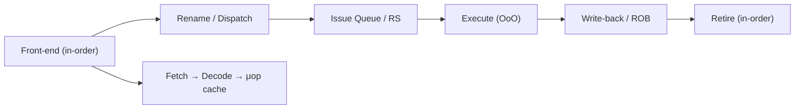
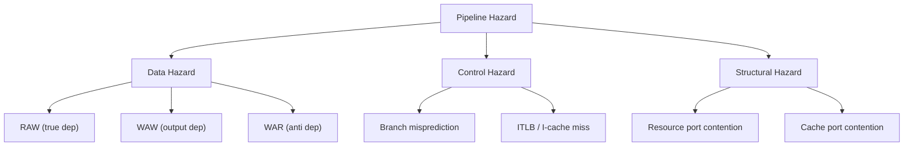
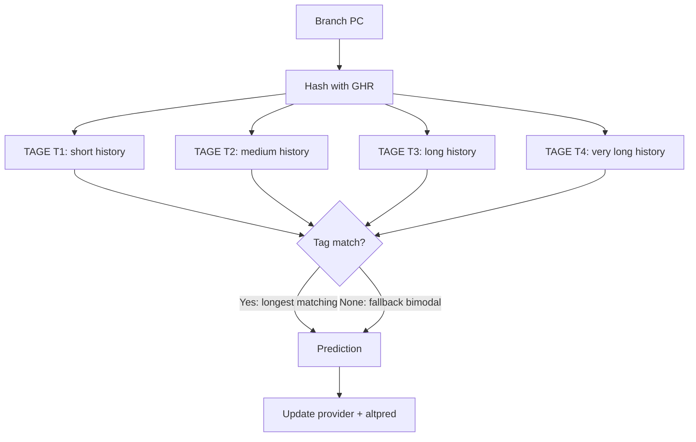
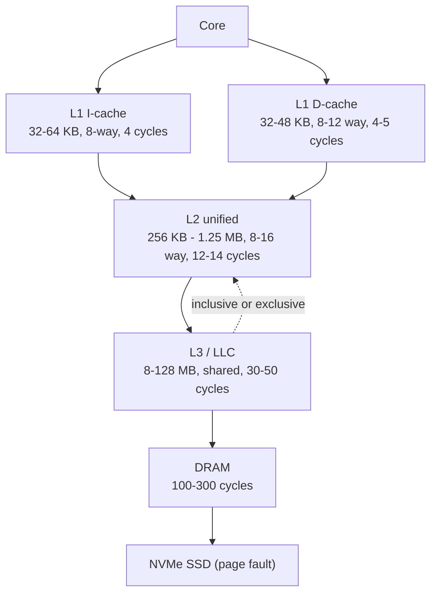
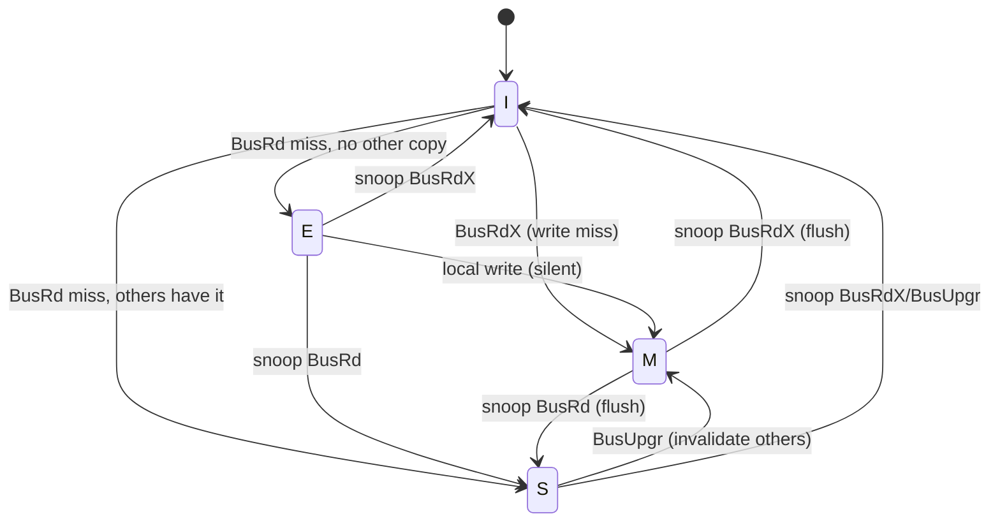
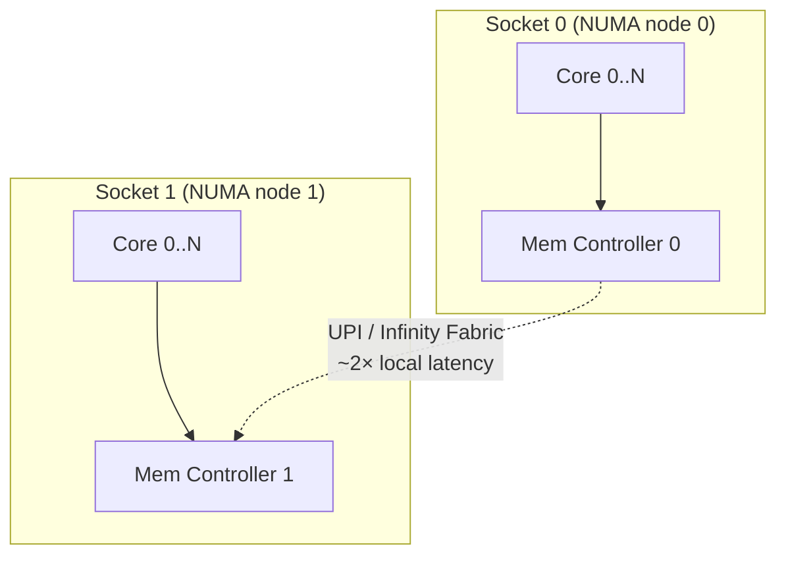
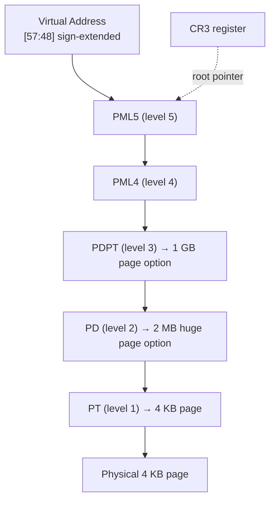

# Hardware / Low-Level

## Overview

This page consolidates the **hardware and low-level systems** topics that bridge the gap between a programmer's view of a machine and the silicon that actually executes code. It covers CPU microarchitecture, the memory hierarchy beyond a single cache level, cache-coherence protocols, memory ordering, virtual memory, the system bus, DMA, and interrupts. The treatment is deliberately cross-ISA: x86-64, ARM64, and RISC-V are compared side by side because almost every interesting low-level design choice (endianness, weak vs strong memory model, calling convention) is best understood by contrasting implementations.

Primary references: **Computer Architecture: A Quantitative Approach** (Hennessy & Patterson, 6th ed.), **Computer Organization and Design: The Hardware/Software Interface** (Patterson & Hennessy, RISC-V ed.), the **Intel® 64 and IA-32 Architectures Software Developer's Manual** (SDM), the **ARM Architecture Reference Manual** (ARM ARM, ARMv8/ARMv9), **Agner Fog's optimizing assembly manuals** (agner.org/optimize), and Ulrich Drepper's **"What Every Programmer Should Know About Memory"** (lwn.net/Articles/250967).

## Detailed Explanation

### 1. CPU Microarchitecture

The **instruction set architecture (ISA)** is the programmer-visible contract (registers, instructions, memory model). The **microarchitecture** (μarch) is how the silicon actually implements that contract. A single ISA may have many microarchitectures — Intel Skylake, Sunny Cove, Golden Cove all implement x86-64 differently.

#### The Five-Stage Front-to-Retire Flow

Every modern out-of-order core can be described as a pipeline with three logical regions: an **in-order front-end**, an **out-of-order execution engine**, and an **in-order retirement back-end**.



| Stage | Activity | Key Structures |
|-------|----------|----------------|
| **Fetch** | Predict next PC, fetch cache line, slice into aligned blocks | BTB, ITTAGE predictor, μop cache |
| **Decode** | Translate macro-ops into μops (x86) or use direct μops (ARM/RISC-V) | Decoders, microcode ROM |
| **Rename / Dispatch** | Allocate physical registers, ROB entry, write RS | RAT (rename table), ROB, PRF |
| **Issue / Execute** | Wake-and-select ready μops, send to execution ports | RS, ALU/FPU/LSU ports, scheduler |
| **Write-back** | Result + tag broadcast on the common data bus | CDB, ROB "complete" bit |
| **Retire** | Commit results to architectural state, free physical regs | ROB head, free list |

#### Pipeline Hazards



| Hazard | Cause | Classical Fix | Modern Fix |
|--------|-------|---------------|------------|
| **RAW** | Consumer needs producer's value | Forwarding/bypass | Forwarding + RS wakeup |
| **WAR/WAW** | Name conflicts on architectural regs | Stall / insert NOPs | **Register renaming** (eliminates entirely) |
| **Control** | Branch outcome unknown until resolved | Branch delay slot (MIPS) | Speculation with branch prediction |
| **Structural** | Two μops want same port same cycle | Stall younger one | Duplicate units, distributed schedulers |

### 2. Superscalar & Out-of-Order Execution

A **superscalar** machine issues more than one instruction per cycle (IPC > 1). Combined with **out-of-order (OoO) execution**, the CPU dynamically reorders μops to honor true (RAW) dependencies while exploiting instruction-level parallelism. The two foundational mechanisms are **Tomasulo's algorithm** and the **Reorder Buffer (ROB)**.

- **Tomasulo (1967)** — reservation stations with tag-based operand capture on a Common Data Bus (CDB). Originally for the IBM System/360/91 floating-point unit.
- **Register Renaming** — eliminates WAR/WAW by mapping architectural registers onto a larger pool of physical registers (PRF). Renamed in the front-end via the **Rename Table (RAT)**.
- **ROB** — circular FIFO that records every in-flight μop in program order. Results are written to the ROB out of order but **committed in order**, enabling **precise exceptions**.

| Structure | Role | Typical Skylake/Zen4 Size |
|-----------|------|----------------------------|
| ROB | In-order commit, precise exceptions | 224 (SKX) / 320 (Zen4) / ~600 (Apple M2) |
| RS / Issue Queue | Hold μops waiting for operands | 97 (SKX) unified |
| PRF (int/FP) | Renamed storage, eliminates WAW/WAR | 180/168 (SKX), 224/192 (Zen4) |
| Load/Store Queue | Memory disambiguation, store forwarding | 72/56 (SKX), 88/64 (Zen4) |

Memory disambiguation predicts whether a load aliases a prior uncommitted store; on mispredict the load is squashed and replayed. Stores commit to L1 only at retirement, guaranteeing the memory model.

### 3. Branch Prediction

Branches occur every ~5 instructions. A misprediction on a 15-stage pipeline costs ~15 cycles. Modern predictors compose multiple schemes.

| Predictor | Mechanism | Hardware Cost | Accuracy (SPEC) |
|-----------|-----------|---------------|-----------------|
| **1-bit** | Last outcome | Trivial | Poor (loops) |
| **Bimodal (2-bit saturating)** | Per-branch 2-bit counter | Small | ~93% |
| **gshare** | Global history XOR branch addr → 2-bit table | Medium | ~95% |
| **Tournament (Alpha 21264)** | Choose between local & global per branch | Medium-high | ~96% |
| **TAGE** | Tagged geometric-history tables, partial tag match | High | ~97%+ |
| **Perceptron (Jiménez & Lin)** | Weighted integer sum of history bits; learned online | High | ~97%+ |



Modern cores (Zen4, Golden Cove, Apple Firestorm) use **TAGE-SC-L** (TAGE + Statistical Corrector + Loop predictor), reaching ~99% on integer SPEC. Branch target prediction is handled separately by the **Branch Target Buffer (BTB)** and the **Return Address Stack (RAS)** for function returns.

### 4. Cache Hierarchy



| Level | Size | Latency | Shared? | Policy |
|-------|------|---------|---------|--------|
| L1 I/D | 32–64 KB each | 3–5 cyc | Private per core | Split I/D, 8-way |
| L2 | 256 KB – 1.25 MB | 12–14 cyc | Private per core | Unified, write-back |
| L3 (LLC) | 8 – 128 MB | 30–50 cyc | Shared by all cores | Unified, write-back, sliced |
| DRAM | GBs | 100–300 cyc | All | — |

**Inclusive vs Exclusive L3:** An *inclusive* L3 contains a copy of every line in any L2 (Intel historically) — invalidating an L3 line invalidates all L2 copies, simplifying coherence snoops but wasting capacity. An *exclusive* L3 (AMD Zen) holds only lines evicted from L2 — better capacity utilization, but a back-invalidation must search L2 separately. Modern designs (Zen 4, Golden Cove) trend toward **non-inclusive** hierarchies that are neither strictly inclusive nor exclusive.

### 5. Cache Coherence

When multiple cores cache the same address, hardware must ensure that reads always return the most recent write. Two main families exist: **snooping** (broadcast every request on a shared bus) and **directory-based** (a directory tracks which caches hold each line; used for >8–16 cores because bus bandwidth does not scale).

#### MESI

The four canonical states: **M**odified, **E**xclusive, **S**hared, **I**nvalid.



The **E** state is the optimization over the older MSI protocol: when a core reads a line nobody else has, it gets E and a subsequent write is a silent E→M transition with no bus traffic.

#### Variants

| Protocol | Extra State | Purpose | Used By |
|----------|-------------|---------|---------|
| **MESI** | — | Baseline 4-state snooping | Textbook; ARM cores |
| **MESIF** | **F**orward | One designated sharer answers read requests (avoids N replies) | Intel (since Nehalem) |
| **MOESI** | **O**wned | A dirty line may be shared; the Owner answers reads without writing back to memory | AMD (since K7) |
| **Directory-based** | — | Scales beyond snooping bus; directory per memory line | AMD Opteron HyperTransport, Intel UPI, server chips |

### 6. Memory Ordering

The memory model defines which orderings of loads/stores from one core are observable by another core. It is the contract every concurrent programmer ultimately depends on.

| Model | Reordering Allowed | Fence Required For | Implementor |
|-------|--------------------|--------------------|-------------|
| **Sequential Consistency (SC)** | None (load→load, store→store, load→store, store→load all preserved) | None | Textbook only |
| **TSO (Total Store Order)** | Store→Load only (after store buffer drain) | `MFENCE` / `LOCK` for store→load | x86-64, SPARC |
| **PSO (Partial Store Order)** | Store→Store also relaxed | Store-store fences | Older SPARC |
| **Weak / Relaxed** | Any reordering except same-address dep | `dmb`/`dsb`/`isb`, acquire/release | ARMv8, RISC-V, PowerPC, Alpha |

On x86-64: stores become globally visible in program order, but a load may be reordered ahead of an earlier store to a *different* address (because of the store buffer). To enforce store→load ordering use `MFENCE`, `LOCK CMP XCHG`, or any serializing instruction.

On ARMv8 (weak): loads and stores may freely reorder unless guarded by acquire-load (`LDAR`) / release-store (`STLR`) or explicit `DMB` barriers. The Linux kernel uses `smp_mb()`, `smp_rmb()`, `smp_wmb()` which expand to the appropriate sequence per ISA.

### 7. NUMA

In a multi-socket system, each socket owns a slice of the DRAM and accesses it through its local memory controller. A core accessing **remote** memory pays an inter-socket hop (Intel UPI / AMD Infinity Fabric / Gen-Z), 1.5–2× the local latency.



Operating-system **NUMA-aware scheduling** (Linux `numad`, `libnuma`, `first-touch` page placement) keeps threads and their data on the same node. The Linux `numactl --hardware` command exposes the topology. NUMA effects dominate large-memory workloads (databases, HPC) where poor placement can cost 30–50% throughput.

### 8. SIMD Instruction Sets

| ISA Extension | Width | Registers | Notable Features |
|---------------|-------|-----------|------------------|
| **x86 SSE/SSE2** | 128 bit | 16 XMM | Baseline since Pentium 4 / x86-64 |
| **x86 AVX/AVX2** | 256 bit | 16 YMM (alias XMM) | VEX encoding, FMA |
| **x86 AVX-512** | 512 bit | 32 ZMM + 8 opmask K | Masking, conflict detection (SKX, ICL, SPR) |
| **ARM NEON / ASIMD** | 128 bit | 32 V (or 32 × 64-bit) | Mandatory in ARMv8-A |
| **ARM SVE / SVE2** | 128–2048 bit (VL agnostic) | 32 Z + 16 P | Predicate-first, gather/scatter (Fujitsu A64FX, AWS Graviton 3) |
| **RISC-V V** ("RVV") | 128–2048 bit (VL agnostic) | 32 vregs | VLEN configurable per core |

**Agner Fog's manuals** document throughput/latency/port pressure per instruction per μarch. They are the canonical reference for hand-tuning SIMD inner loops. AVX-512 has known **frequency-throttling tradeoffs** on some Intel parts (license-based AVX-512 downclocking) — measure, do not assume.

### 9. ISA Comparison

| Feature | x86-64 | ARM64 (AArch64) | RISC-V (RV64GC) |
|---------|--------|------------------|------------------|
| Instruction style | CISC, variable length 1–15 B | RISC, fixed 4 B | RISC, fixed 4 B (C extension: 2 B) |
| GPRs | 16 (8 named, 8 callee-saved conv.) | 31 (X0–X30) | 31 (x1–x31) + x0=zero |
| Calling convention | System V AMD64: RDI,RSI,RDX,RCX,R8,R9 | AAPCS64: X0–X7 | RV calling conv: a0–a7 = x10–x17 |
| Return register | RAX | X0 | a0 = x10 |
| Stack pointer | RSP | SP | sp = x2 |
| Frame pointer | RBP (optional) | X29 | fp = x8 (optional) |
| Link register | (none, on stack) | X30 (LR) | ra = x1 |
| Page size | 4 KB (also 2 MB / 1 GB huge) | 4 KB / 16 KB / 64 KB | 4 KB (configurable) |
| Endianness | Little (default), bi-endian mode rare | Bi-endian, default per EL | Bi-endian, default little |
| Memory model | TSO | Weak (with acquire/release) | Weak (RVWMO) |
| Vector | AVX-512 | SVE/SVE2 + NEON | V extension |

### 10. ABI & Calling Conventions

The **Application Binary Interface (ABI)** specifies register roles, stack layout, syscall numbers, and type sizes so that code compiled by different compilers/linkers can interoperate. The two most relevant conventions on Linux:

**System V AMD64 ABI** (Linux, macOS on Intel, Solaris):
- Integer args: `RDI, RSI, RDX, RCX, R8, R9` (then stack, right-to-left).
- Floating-point args: `XMM0–XMM7`.
- Return: `RAX` (int) / `XMM0` (float). `RDX` for a second return word.
- Callee-saved: `RBX, RBP, R12–R15`. Caller-saved: everything else.
- Stack must be 16-byte aligned at the `CALL` instruction (so that after the push of the return address, RSP mod 16 == 8).
- Red zone: 128 bytes below RSP that leaf functions may use without adjusting RSP.

**AAPCS64 (ARMv8)** — Procedure Call Standard for AArch64:
- Integer args: `X0–X7`. Floating-point args: `V0–V7` (alias D0–D7 / S0–S7).
- Return: `X0` (and `X1` for a second word); `V0` for FP.
- Callee-saved: `X19–X30`, `SP`. Caller-saved: `X0–X18` (X8 = indirect-result, X9–X15 = temporaries, X16–X17 = IP0/IP1 intra-procedure scratch, X18 = platform register).
- Frame record: `X29` (FP) and `X30` (LR) are saved at the top of each frame forming a linked list for stack unwinding.
- Stack alignment: 16-byte (SP mod 16 == 0) at all public boundaries.

RISC-V follows a similar structure: arguments in `a0–a7` (`x10–x17`), return in `a0`/`a1`, callee-saved `s0–s11` (`x8–x9, x18–x27`), return address in `ra` (`x1`), frame pointer optional in `s0`/`fp` (`x8`).

### 11. Endianness & Alignment

- **Byte order**: *big-endian* stores the most-significant byte at the lowest address (network protocols, IBM z, SPARC); *little-endian* stores the least-significant byte first (x86, ARM in default mode, RISC-V in default mode). Conversion functions `htonl`/`ntohl` exist because networks are big-endian ("network byte order").
- **Bit order within a byte** is independent of byte order — confusingly, both can differ.
- **Alignment**: a datum of size \\(2^n\\) is naturally aligned at an address divisible by \\(2^n\\). x86-64 allows unaligned access (with a performance penalty; some instructions like `MOVDQA` *require* alignment). ARMv7 raised alignment-check traps; ARMv8 generally permits unaligned access for normal loads/stores but forbids it for exclusive/load-acquire pairs.
- **Padding & packing**: a C `struct { char c; int i; }` is padded to 8 bytes under most ABIs so that `i` is 4-aligned. Use `__attribute__((packed))` (GCC/Clang) or `#pragma pack(1)` to suppress padding — at the cost of potentially slower/atomic-unsafe access.

### 12. DMA, Interrupts, and the I/O Subsystem

**Direct Memory Access (DMA)** lets a peripheral move data to/from memory without CPU intervention per word. The CPU programs a **descriptor ring** (a circular array of {buffer phys addr, length, status} entries), then writes a doorbell register; the device fetches descriptors, performs the transfer, and writes back completion status. Modern DMA engines (NVMe, InfiniBand) use **scatter-gather** so a single transaction can hit many discontiguous pages.

**Interrupts** signal completion/error to the CPU:

| Mechanism | Description | Used For |
|-----------|-------------|----------|
| **Legacy PIC (8259)** | 15 IRQ lines, fixed priority | Retro / boot |
| **I/O APIC + Local APIC** | Many IRQs, redirected to any CPU's local APIC | Modern x86 |
| **MSI (Message Signaled Interrupts)** | Write a specific value to a specific MMIO address → raises interrupt; no dedicated pin | PCIe devices |
| **MSI-X** | Up to 2048 distinct vectors per device, each with its own address/data and target CPU | High-end NICs, GPUs, NVMe |
| **ARM GICv3** | Distributor + Redistributor per core; LPIs via ITS tables for MSI | ARM servers |

**APIC** (Advanced Programmable Interrupt Controller) on x86: each core has a **Local APIC** (LAPIC) holding its ID, task priority, interrupt request register (IRR), in-service register (ISR), and a timer. The **I/O APIC** routes external interrupts to one or more LAPICs based on a per-vector redirection entry. Reentrancy, masking, and EOI (End Of Interrupt) writes all happen through MMIO on the LAPIC. The **TSC-Deadline** timer mode delivers a one-shot interrupt at an absolute TSC value, the most precise timer on modern x86.

### 13. MMU, TLB, and Page Tables

The **Memory Management Unit** translates virtual to physical addresses. Each process has its own **page table**; the CR3 register (x86) or TTBR0/TTBR1 (ARM) holds its physical root.

#### Multi-level Page Tables

x86-64 uses a **4-level** (48-bit virtual) or **5-level** (57-bit, LA57) page walk. Each level is a 4 KB page of 512 8-byte entries; the leaf is a 4 KB page.



| Page Size | Levels Skipped | Use Case |
|-----------|----------------|----------|
| 4 KB | none | Default |
| 2 MB (1 GB on x86) | leaf at PD (PDP) | TLB-pressure workloads, databases, JVMs (`-XX:+UseLargePages`, `transparent_hugepage`) |
| 1 GB | leaf at PDP | Huge VMs, HPC |

#### TLB

The **Translation Lookaside Buffer** caches recent VA→PA translations. A TLB miss triggers a hardware **page walk** (4 memory accesses on x86-64). Modern TLBs are multi-level (L1 dTLB / iTLB, L2 unified STLB) and use:

- **PCID** (Process-Context ID, x86): tag TLB entries with a process id so `CR3` writes do not flush the TLB on context switch.
- **ASID** (Address Space ID, ARM/RISC-V): same idea, with separate ASID spaces for kernel (TTBR1) and user (TTBR0) on ARM.
- **TLB shootdown**: when a page-table entry changes, every core that may have a cached translation must invalidate it. On x86 this is an `INVPCID`/`INVLPG` IPI; on ARM it is a `TLBI` broadcast. Costs scale with core count — kernel code often batches shootdowns.

### 14. Speculative Execution Attacks

The performance machinery above (OoO, speculation, caches) creates **microarchitectural side channels** that leak data across privilege boundaries:

| Attack | Mechanism | Affected | Mitigation |
|--------|-----------|----------|------------|
| **Meltdown (CVE-2017-5754)** | Speculative load of kernel addr → fault suppressed, but cache warmed | Intel (mostly), some ARM | KPTI (kernel page-table isolation), PCID optimization |
| **Spectre v1 (CVE-2017-5753)** | Mistrained conditional branch speculatively executes leak gadget | All OoO CPUs | `retpoline`, fence after bounds checks, LFENCE in JITs |
| **Spectre v2 (CVE-2017-5715)** | Poisoned indirect-branch predictor | All OoO CPUs | IBRS, IBPB, retpoline, RSB stuffing |
| **Spectre v4 (CVE-2018-3639)** | Speculative store bypass | All OoO CPUs | SSBD |
| **Spectre BHB** | Branch-history bypass of v2 mitigations | All OoO CPUs | BHB clearing sequences |
| **Retbleed (CVE-2022-29900/29909)** | Speculative execution via return stack | Intel (RSB underflow) | eIBRS / PBRSB |

Common defenses: **KPTI** (unmap kernel when in user mode), **retpoline** (replace indirect branch with `lfence`-gated RET push/pop), **IBRS/STIBP/SSBD** microcode flags, **speculation fences** (`LFENCE`, `DSB SY`), and **constant-time code** for crypto. See [spectreattack.com](https://spectreattack.com) and the Project Zero write-ups for primary sources.

## Examples

### Example 1: Computing Effective CPI with Misprediction

A 15-stage pipeline executes 20% branches with a 95% accurate predictor. Each misprediction costs 15 cycles.

\\[
\text{CPI} = 1 + 0.20 \times (1 - 0.95) \times 15 = 1 + 0.15 = 1.15
\\]

Doubling predictor accuracy to 99%:

\\[
\text{CPI} = 1 + 0.20 \times 0.01 \times 15 = 1.03
\\]

A 4 percentage-point accuracy gain buys 11% throughput on this branch-heavy loop — enough to justify TAGE-SC-L hardware.

### Example 2: System V AMD64 Calling Convention

```c
long sum(long a, long b, long c, long d, long e, long f, long g);
```

Compiles (GCC, System V AMD64) to:

```asm
sum:
    mov    rax, rdi      ; a  (arg 1)
    add    rax, rsi      ; + b (arg 2)
    add    rax, rdx      ; + c (arg 3)
    add    rax, rcx      ; + d (arg 4)
    add    rax, r8       ; + e (arg 5)
    add    rax, r9       ; + f (arg 6)
    add    rax, [rsp+8]  ; + g (arg 7, on stack)
    ret
```

Arguments 1–6 go in registers; the 7th is passed on the stack at `[rsp+8]` (caller-reserved slot above the return address).

### Example 3: MESI Read-Modify-Write Sequence

```
Initial: all caches empty, mem X = 0.

Core 0: LOAD X → BusRd, no sharers, fetched from memory, state E.
Core 0: STORE X=5 → silent E→M (no bus traffic!).
Core 1: LOAD X → BusRd. Core 0 snoops, flushes X=5 to L2/L3, transitions M→S.
                       Core 1 receives X=5, state S.
Core 1: STORE X=10 → BusUpgr. Core 0 invalidated (S→I). Core 1: S→M.
Core 0: LOAD X → BusRd. Core 1 flushes X=10, M→S. Core 0: I→S.
```

Only **two** flushes for five accesses — the E state saved one bus transaction on the first write.

### Example 4: x86-64 Page-Walk Cost

A 4 KB page miss in L1 dTLB on Skylake triggers a 4-level walk. If each level hits in L1/L2 cache (4-cycle L1, 12-cycle L2), best case is ~4 × 4 = 16 cycles; worst case (all levels in L3) is ~4 × 40 = 160 cycles. A 2 MB huge page collapses the walk to 3 levels and shrinks TLB footprint by 512×, dramatically reducing walks on database workloads.

## Interview Questions

### Q1: What is the difference between ISA and microarchitecture?
**Answer**: The ISA is the programmer-visible contract — the set of instructions, registers, addressing modes, and the memory model. The microarchitecture is the implementation: how the silicon fetches, decodes, schedules, and executes those instructions. The same ISA (x86-64) has many μarchitectures (Skylake, Sunny Cove, Golden Cove, Zen 4, Apple's Firestorm via translation). A program conforming to the ISA runs on any μarch implementing it; performance varies wildly.

### Q2: How does register renaming eliminate WAR and WAW hazards?
**Answer**: The front-end maintains a Rename Table mapping each architectural register (e.g., RAX) to a physical register from a much larger pool (e.g., 180 PRFs on Skylake). When a new instruction writes RAX, the allocator hands it a fresh PRF and updates the table — the old PRF still holds the value prior instructions are reading. Because subsequent writes target *different* physical registers, WAR (write-after-read) and WAW (write-after-write) name conflicts cannot occur. Old PRFs are freed when the instruction that wrote them retires. Only RAW (true data dependencies) remain and are honored by the reservation-station wakeup logic.

### Q3: Compare MESI, MESIF, and MOESI. Why does each exist?
**Answer**: MESI is the baseline four-state protocol (Modified, Exclusive, Shared, Invalid). MESIF (Intel) adds a Forward state so that when multiple caches share a clean line, exactly one is designated to answer a snoop read — preventing N redundant replies. MOESI (AMD) adds an Owned state that allows a dirty line to be shared: the Owner answers reads from its cache without writing back to memory first, deferring writeback until eviction. Both variants reduce bus traffic in different scenarios; MOESI is better for hit-under-miss, MESIF is better when many caches share the same line.

### Q4: Why is x86 called "TSO" and what does that imply for lock-free code?
**Answer**: Total Store Order means stores become globally visible in program order, but a load can be reordered ahead of an earlier store to a *different* address (because the store is still in the store buffer). Consequently, the canonical Peterson/dekker mutual-exclusion algorithms fail on x86 unless an `MFENCE` (or `LOCK`-prefixed instruction) is inserted between the store and the load. In practice, lock-free x86 code only needs fences around store→load patterns; store→store and load→load are ordered for free.

### Q5: What is a TLB shootdown and why is it expensive?
**Answer**: When a page-table entry changes (e.g., `munmap`, `mprotect`, CoW break), every core that may have a cached translation for that VA must invalidate it. On x86 this is done by sending an inter-processor interrupt (IPI) to each target core, which then executes `INVLPG` or `INVPCID`. The cost grows linearly with core count — a 64-core machine can spend microseconds flushing. Linux batches shootdowns (`mmu_gather`) and uses per-CPU ASID/PCID tags to avoid unnecessary flushes on context switch.

### Q6: Explain the difference between MSI and MSI-X.
**Answer**: MSI delivers an interrupt as a memory write to a fixed MMIO address with a fixed data value, removing the need for a dedicated interrupt pin. A single MSI-capable function supports up to 32 vectors, but they must be contiguous in address/data space. MSI-X extends this to up to 2048 independent vectors per function, each with its own address/data pair, allowing the device to target any CPU directly. This enables per-queue interrupt steering for NICs and per-queue completion for NVMe — essential for scaling I/O on multi-core hosts.

### Q7: What are huge pages and when should you use them?
**Answer**: Huge pages are larger page sizes (2 MB and 1 GB on x86-64; configurable on ARM/RISC-V) that reduce TLB pressure by 512× or 262144× versus 4 KB pages. They benefit workloads with large working sets and poor locality — databases (PostgreSQL `huge_pages = on`), JVMs (`-XX:+UseLargePages`), and HPC codes. Costs: internal fragmentation (a partially used 2 MB page wastes up to 2 MB − 1 byte), harder to allocate under pressure (`/proc/sys/vm/nr_hugepages`), and on some CPUs extra TLB levels must be walked. Use `transparent_hugepage=always|madvise|never` for a system-wide policy.

### Q8: How would you mitigate Spectre v2 in a JIT compiler?
**Answer**: Spectre v2 poisons the indirect-branch predictor so a victim's indirect branch (e.g., a JITted dispatch table) speculatively runs attacker-chosen gadgets. Mitigations include: (1) **retpoline** — replace indirect jumps with a RET-based trampoline that speculatively executes a benign pause-loop; (2) **IBRS/STIBP microcode flags** — prevent predictor cross-contamination, at a perf cost; (3) **RSB stuffing** on context switch to prevent RSB underflow; (4) **JIT hardening** — avoid mapping JIT code adjacent to attacker-controlled data, prefer conditional branches over indirect ones, and insert `LFENCE` after untrusted bounds checks. Modern hardware (Intel eIBRS, AMD PBRSB) closes the underlying predictor shared state; older parts still rely on software retpolines.

## Common Mistakes

1. **Confusing cache *coherence* with *consistency*** — coherence guarantees that writes to a single location are seen in the same order by all cores; consistency (memory model) governs the order of accesses to *different* locations. MESI solves only the former.
2. **Assuming TSO = sequential consistency** — x86 still reorders store→load through the store buffer; lock-free code that "works" on x86 may fail on ARM/RISC-V without explicit fences.
3. **Treating OoO as a license to reorder anything** — the front-end is in-order, retirement is in-order, and stores commit only at retire, so the architectural state always looks sequential. Only memory accesses between cores are observable to be reordered, and only per the memory model.
4. **Forgetting that huge pages trade TLB pressure for internal fragmentation** — a sparse data structure in a 2 MB huge page can waste most of the page; measure before enabling globally.
5. **Ignoring NUMA on multi-socket servers** — a "slow" benchmark on a 2-socket box is often a remote-memory latency artifact; `numactl --cpunodebind=0 --membind=0` is the first thing to try.
6. **Assuming DMA bypasses the IOMMU** — modern systems route DMA through the IOMMU (Intel VT-d / ARM SMMU), which translates device-side IOVAs to physical addresses and isolates devices. VFIO and DPDK depend on it.
7. **Mispredicting the cost of misprediction** — many candidates estimate 5 cycles; the real cost is the *pipeline depth at the branch* (often 15–20 cycles on a modern wide core), and a branchy integer workload can spend 20–30% of cycles on mispredictions even with TAGE.

## Summary

| Topic | Key Takeaway |
|-------|--------------|
| Microarchitecture | ISA ≠ μarch; same contract, many silicon implementations |
| OoO + Superscalar | ROB + renaming + RS → ILP extracted while preserving precise exceptions |
| Branch Prediction | TAGE-SC-L ≈ 99% on integer; misprediction penalty ≈ pipeline depth |
| Cache Hierarchy | L1 private / L3 shared; inclusiveness trades capacity for snoop simplicity |
| Coherence | MESI + variants; directory-based scales beyond ~16 cores |
| Memory Ordering | x86 = TSO; ARM/RISC-V = weak; explicit fences needed for portable lock-free |
| NUMA | Local vs remote latency matters; first-touch placement is critical |
| SIMD | Width doubled each generation; measure throttling on AVX-512 |
| ISA/ABI | 3 RISC-CISC contrasts; calling conv defines register roles |
| MMU/TLB | Multi-level walk is expensive; huge pages + PCID/ASID cut the cost |
| Speculation | Same machinery that makes CPUs fast enables Spectre/Meltdown |

## Cross-References

- [Out-of-Order Execution](./pipelining/ooo.md) — ROB, RS, renaming in depth
- [Superscalar](./pipelining/superscalar.md) — multi-issue hardware
- [Branch Prediction](./pipelining/branch-prediction.md) — predictors expanded
- [Speculative Execution](./pipelining/speculative.md) — Spectre/Meltdown background
- [MESI Protocol](./memory-hierarchy/mesi.md) — full state tables
- [MOESI](./memory-hierarchy/moesi.md) — AMD variant
- [Coherence](./memory-hierarchy/coherence.md) — snooping vs directory
- [Cache Basics](./memory-hierarchy/cache-basics.md) — hit/miss/replacement
- [SIMD](./parallelism/simd.md) — vector lanes and packing
- [AVX](./parallelism/avx.md) — x86 SIMD family
- [NEON](./parallelism/neon.md) — ARM SIMD
- [ISA](./cpu/isa.md) — ISA taxonomy
- [x86-64](./modern/x86-64.md), [ARM](./modern/arm.md), [RISC-V](./modern/risc-v.md) — per-ISA deep dives
- [PCIe](./io/pcie.md), [NVMe](./io/nvme.md) — DMA & MSI-X in context
- [Performance Counters](./performance/counters.md) — measuring all of the above
