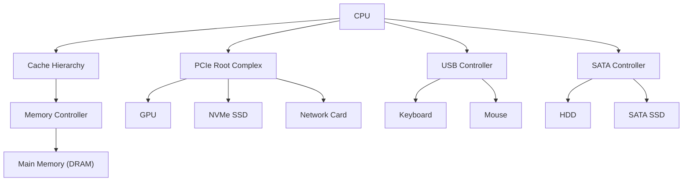
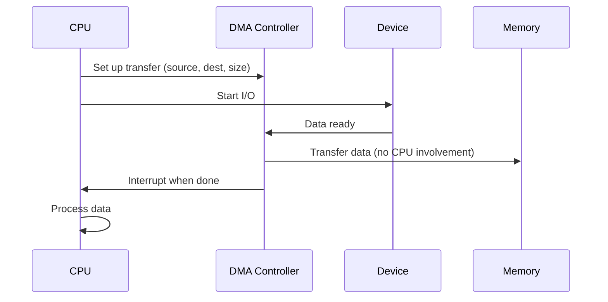

# I/O Systems

## Overview

Input/Output (I/O) systems connect the CPU to peripheral devices like storage, networking, displays, and input devices. Understanding I/O architecture — buses, protocols, and interfaces — is essential for system design interviews and for understanding how data moves between the CPU and the outside world.

## I/O Architecture



## Key I/O Concepts

### Programmed I/O (PIO)
CPU directly reads/writes I/O device registers:
```
while (data_ready) {
    data = read_device_register();  // CPU busy-waits
    process(data);
}
```
**Problem**: CPU is fully occupied during I/O.

### Direct Memory Access (DMA)
Device transfers data directly to/from memory without CPU intervention:


**Benefit**: CPU is free during data transfer.

### Interrupts vs Polling

| Method | Description | Pros | Cons |
|--------|-------------|------|------|
| **Polling** | CPU repeatedly checks device status | Simple | Wastes CPU cycles |
| **Interrupts** | Device signals CPU when ready | CPU efficient | Interrupt overhead |

Modern systems use **interrupt coalescing** — batching multiple events into one interrupt.

## Bus Types

| Bus | Speed | Use Case |
|-----|-------|----------|
| PCIe Gen 4 | 16 GT/s per lane | GPU, NVMe, NIC |
| PCIe Gen 5 | 32 GT/s per lane | High-speed devices |
| USB 3.2 | 20 Gbps | Peripherals |
| USB4 | 40 Gbps | Universal |
| SATA III | 6 Gbps | Storage (legacy) |
| NVMe | Over PCIe | High-speed storage |
| Thunderbolt 4 | 40 Gbps | Universal |

## Cross-References

- [PCIe](pcie.md) — Primary expansion bus
- [USB](usb.md) — Peripheral interconnect
- [SATA](sata.md) — Legacy storage bus
- [NVMe](nvme.md) — Modern storage protocol
- [Buses](buses.md) — Bus fundamentals
- [Storage Overview](../../storage/overview.md) — Storage technologies

## Cross References

- [Buses](buses.md)
- [PCIe](pcie.md)
- [NVMe](nvme.md)
- [OS I/O](../../os/io/README.md)
