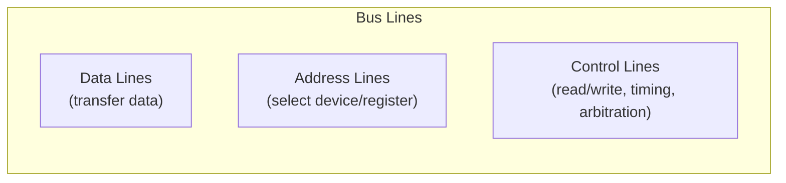
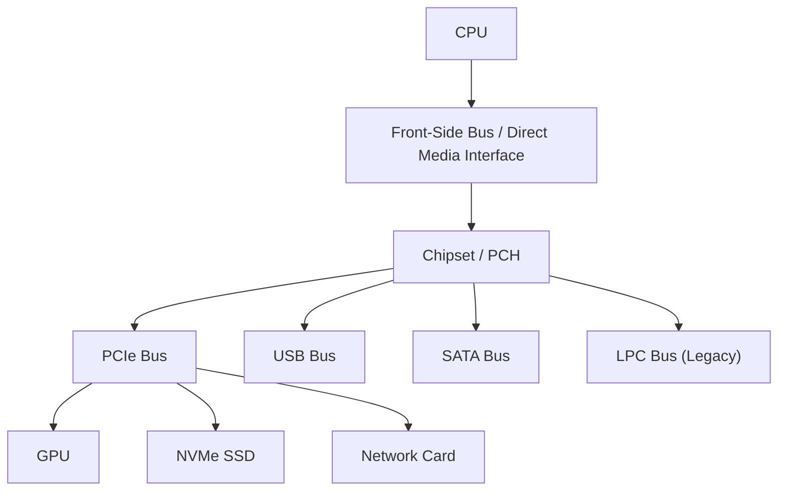
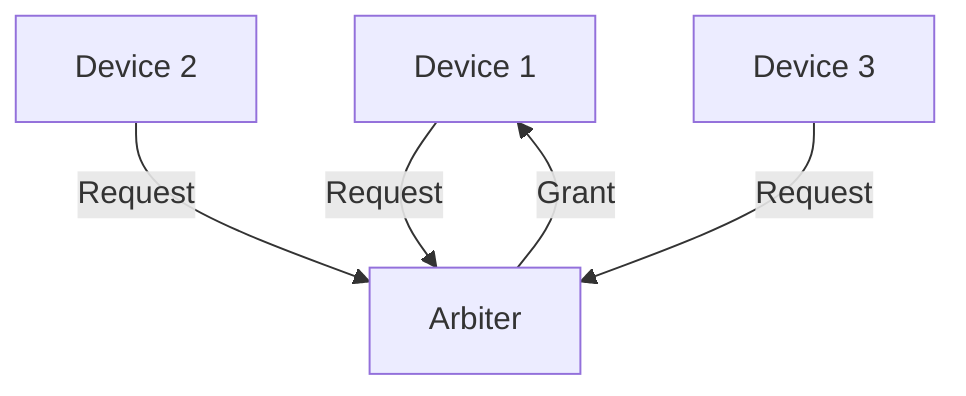

# I/O Buses

## Overview

An **I/O bus** is a communication system that transfers data between the CPU/memory and peripheral devices. Buses have defined protocols for arbitration, addressing, and data transfer. Understanding bus architecture is fundamental to understanding I/O performance.

## Bus Components



### Bus Width
- **Data bus width**: Number of data lines (8, 16, 32, 64 bits)
- **Address bus width**: Number of address lines (determines addressable space)
- **Wider bus = more data per cycle**

### Bus Clock
- **Synchronous**: Transfers synchronized to a clock signal
- **Asynchronous**: Handshaking protocol, no fixed clock

## Bus Hierarchy



Modern systems use **point-to-point connections** instead of shared buses (Intel DMI, AMD Infinity Fabric).

## Bus Types

### Processor Bus (Front-Side Bus)
Historically connected CPU to northbridge:
- Shared bus, high bandwidth
- Replaced by point-to-point connections (Intel QPI, AMD HyperTransport)

### Memory Bus
Connects memory controller to DRAM:
- DDR4/DDR5 channels
- Point-to-point (one or two DIMMs per channel)
- 64-bit width per channel

### I/O Buses

| Bus | Type | Speed | Devices |
|-----|------|-------|---------|
| PCIe | Point-to-point, serial | 16-32 GT/s/lane | GPU, NVMe, NIC |
| USB | Serial, polled | 5-40 Gbps | Peripherals |
| SATA | Serial, point-to-point | 1.5-6 Gbps | Storage |
| SAS | Serial, point-to-point | 12-24 Gbps | Enterprise storage |
| Thunderbolt | Serial, point-to-point | 40 Gbps | Universal |

## Bus Arbitration

When multiple devices share a bus, arbitration determines who gets access:

### Centralized Arbitration
A single arbiter (usually in the chipset) grants bus access:


**Policies**:
- **Fixed priority**: Higher-priority devices always win
- **Round-robin**: Fair rotation
- **Demand-based**: Bandwidth allocation

### Distributed Arbitration
Each device participates in arbitration (e.g., CAN bus, PCI):

**PCI Arbitration**: Each device has a REQ# and GNT# line. The arbiter uses round-robin with priority.

## Bus Bandwidth

```
Bandwidth = Width × Frequency × Efficiency

Example: PCIe Gen 4 × 16 lanes
= 16 lanes × 16 GT/s × 128/130 (encoding efficiency)
= 256 Gbps × 0.985
≈ 252 Gbps = 31.5 GB/s (each direction)
```

## Modern Interconnects

### Intel DMI (Direct Media Interface)
Connects CPU to PCH (Platform Controller Hub):
- PCIe-based protocol
- DMI 3.0: ~4 GB/s
- DMI 4.0: ~8 GB/s

### AMD Infinity Fabric
Connects CPU cores, memory, and I/O:
- Scalable, coherent interconnect
- Used within CCDs and between CCDs
- Connects to I/O die for PCIe, USB, SATA

## Interview Questions

1. **Q**: What is the difference between a bus and a point-to-point connection?
   **A**: A bus is shared among multiple devices (requires arbitration). A point-to-point connection is dedicated between two endpoints (no arbitration needed, higher bandwidth, lower latency). Modern systems prefer point-to-point.

2. **Q**: How does DMA improve I/O performance?
   **A**: DMA allows devices to transfer data directly to/from memory without CPU involvement. The CPU sets up the transfer and is free to do other work. An interrupt signals completion. This eliminates the CPU bottleneck of programmed I/O.

3. **Q**: What is bus arbitration and why is it needed?
   **A**: Arbitration determines which device gets to use a shared bus next. Without arbitration, devices would conflict. Policies include fixed priority, round-robin, and demand-based allocation.

4. **Q**: Why did modern systems move from shared buses to point-to-point connections?
   **A**: Shared buses have bandwidth limitations (all devices share), require arbitration (adds latency), and don't scale well. Point-to-point connections provide dedicated bandwidth, lower latency, and better scalability.

## Common Mistakes

- ❌ Confusing bus width with bus bandwidth (bandwidth also depends on frequency)
- ❌ Not knowing the difference between shared buses and point-to-point
- ❌ Forgetting about encoding overhead (e.g., 128/130b for PCIe)
- ❌ Assuming all I/O goes through the CPU (DMA bypasses CPU)

## Summary

I/O buses transfer data between CPU/memory and devices. Modern systems use point-to-point connections (PCIe, DMI) instead of shared buses. DMA enables devices to transfer data without CPU involvement. Bus bandwidth depends on width, frequency, and encoding efficiency.

## Cross-References

- [PCIe](pcie.md) — Primary expansion bus
- [USB](usb.md) — Peripheral bus
- [SATA](sata.md) — Storage bus
- [NVMe](nvme.md) — Storage protocol over PCIe
- [I/O Overview](README.md) — I/O system architecture
