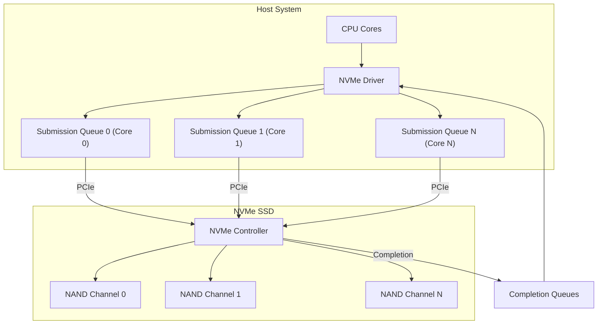
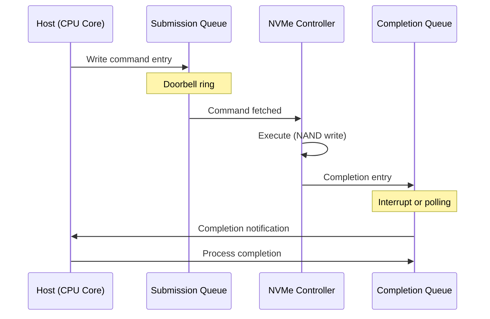
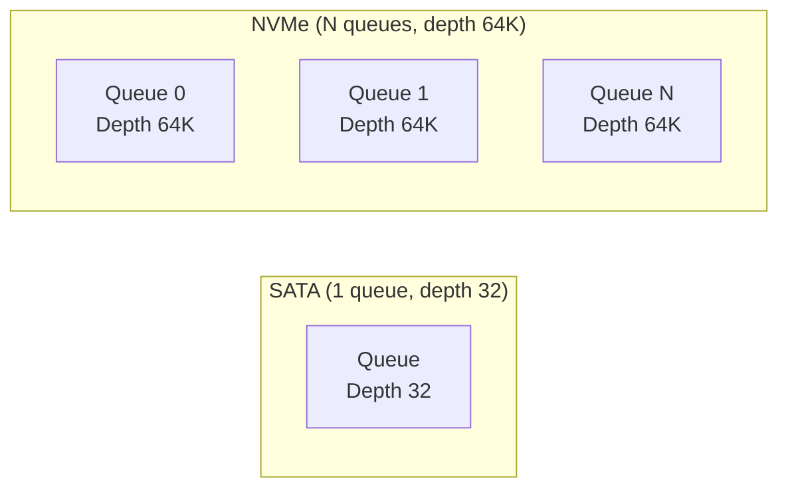

# NVMe (Non-Volatile Memory Express)

## Overview

**NVMe** (Non-Volatile Memory Express) is a storage protocol designed specifically for flash-based storage connected via PCIe. It eliminates the bottlenecks of SATA/AHCI by leveraging PCIe's high bandwidth and providing a streamlined command set optimized for solid-state storage. NVMe is the standard interface for modern high-performance SSDs.

## Why NVMe?

SATA/AHCI was designed for spinning disks:
- Limited command queue depth (32 commands)
- Single command queue
- High per-command overhead
- 600 MB/s bandwidth limit

NVMe was designed for flash:
- Up to 64K commands per queue
- Up to 64K queues (one per CPU core)
- Low per-command overhead
- PCIe bandwidth (7+ GB/s)

## NVMe Architecture



### Submission and Completion Queues



- **Submission Queue (SQ)**: Host writes commands, controller reads them
- **Completion Queue (CQ)**: Controller writes completions, host reads them
- **Doorbell**: Host writes to doorbell register to notify controller of new entries

### Queue Architecture
- Each CPU core can have its own SQ/CQ pair → no lock contention
- Up to 64K queues, each with up to 64K entries
- Lockless design: no shared state between cores

## NVMe Commands

### Admin Commands
- Identify device
- Create/delete I/O queues
- Firmware update
- Health monitoring (SMART)

### I/O Commands
- **Read**: Read data from LBA range
- **Write**: Write data to LBA range
- **Flush**: Write volatile cache to non-volatile storage
- **Dataset Management**: TRIM/deallocate (inform SSD of unused blocks)
- **Write Uncorrectable**: Mark LBAs as invalid

## NVMe vs SATA/AHCI

| Feature | SATA/AHCI | NVMe |
|---------|-----------|------|
| Interface | SATA | PCIe |
| Max bandwidth | 600 MB/s | 7+ GB/s (Gen 4 x4) |
| Queue depth | 32 (1 queue) | 64K (64K queues) |
| Command overhead | ~6 μs | ~2.8 μs |
| Latency | ~100 μs | ~10 μs |
| CPU overhead | Higher | Lower |
| Parallelism | Limited | Per-core queues |

### Queue Depth Impact



Higher queue depth allows the SSD to optimize NAND operations (parallel channel access, wear leveling, garbage collection).

## NVMe Form Factors

### M.2
```
┌─────────────────────────────────────┐
│  M.2 2280 (22mm × 80mm)            │
│  ┌───┐                              │
│  │key│ ← M-key (NVMe) or B+M-key  │
│  └───┘                              │
│  [Controller] [NAND] [NAND] [DRAM] │
└─────────────────────────────────────┘
```
- **2230, 2242, 2260, 2280**: Different lengths
- **M-key**: PCIe x4 (NVMe)
- **B+M-key**: PCIe x2 or SATA

### U.2 (2.5")
- Enterprise form factor
- Hot-pluggable
- PCIe x4 interface
- Higher power capacity

### Add-in Card (AIC)
- PCIe card form factor
- Best cooling
- Highest performance
- Used in servers and workstations

### EDSFF (Enterprise and Data Center SSD Form Factor)
- E1.S, E1.L, E3: Newer enterprise form factors
- Better density and thermal management

## NVMe over Fabrics (NVMe-oF)

Extends NVMe over network fabrics:

```mermaid
graph LR
    subgraph "Host"
        App["Application"]
        Driver["NVMe-oF Driver"]
    end
    subgraph "Network"
        Fab["RDMA / TCP / Fibre Channel"]
    end
    subgraph "Target"
        SSD["NVMe SSD"]
        Target["NVMe Target Controller"]
    end
    App --> Driver --> Fab --> Target --> SSD
```

**Benefit**: Access remote NVMe SSDs with near-local latency (~10-20 μs over RDMA).

### NVMe-oF Transport Types
- **RDMA** (RoCE, iWARP): Lowest latency (~10 μs)
- **TCP**: Most widely deployed (~15-20 μs)
- **Fibre Channel**: Enterprise SANs

## NVMe Features

### Multi-Stream Write
Allows the host to indicate data lifetime to the SSD:
```
Stream 0: Hot data (frequently updated) → go to fast NAND
Stream 1: Cold data (rarely updated) → go to dense NAND
```
Improves SSD endurance and performance by reducing write amplification.

### Zoned Namespaces (ZNS)
Exposes the NAND erase block structure to the host:
```
Zone: Contiguous LBA range that must be written sequentially
- Host manages zone placement
- Reduces write amplification
- Improves QoS and endurance
```

### Persistent Memory Region (PMR)
SSD exposes a portion of its DRAM as persistent memory:
- Battery/capacitor-backed
- Byte-addressable via BAR
- Ultra-low latency for metadata

## Interview Questions

1. **Q**: What are the key advantages of NVMe over SATA?
   **A**: Higher bandwidth (7+ GB/s vs 600 MB/s), lower latency (~10 μs vs ~100 μs), deeper queues (64K vs 32), multiple queues per CPU core (no lock contention), and lower CPU overhead. NVMe is designed for flash storage while SATA was designed for spinning disks.

2. **Q**: How does NVMe's queue architecture improve performance?
   **A**: Each CPU core gets its own submission/completion queue pair, eliminating lock contention. The deep queues (64K entries) allow the SSD controller to optimize NAND operations across multiple channels in parallel. This enables near-linear scaling with queue depth.

3. **Q**: What is NVMe-oF?
   **A**: NVMe over Fabrics extends the NVMe protocol over network fabrics (RDMA, TCP, FC). It allows accessing remote NVMe SSDs with near-local latency, enabling disaggregated storage architectures in data centers.

4. **Q**: What is ZNS (Zoned Namespaces) in NVMe?
   **A**: ZNS exposes the NAND erase block structure to the host. The host writes data sequentially within zones, reducing write amplification and improving SSD endurance and performance. It's a key technology for next-generation SSDs.

5. **Q**: Why does NVMe have multiple queues while SATA has only one?
   **A**: SATA's single queue creates a bottleneck in multi-core systems (lock contention). NVMe's per-core queues allow each core to submit commands independently, scaling linearly with core count. This is essential for modern multi-core processors.

## Common Mistakes

- ❌ Assuming NVMe is always faster than SATA (depends on NAND and controller)
- ❌ Not knowing about NVMe's multi-queue architecture
- ❌ Confusing NVMe (protocol) with M.2 (form factor)
- ❌ Forgetting that NVMe requires PCIe, not SATA
- ❌ Not understanding submission/completion queue mechanics

## Summary

NVMe is the modern storage protocol for flash-based SSDs, leveraging PCIe for high bandwidth (7+ GB/s) and low latency (~10 μs). Its multi-queue architecture eliminates lock contention and scales with CPU cores. NVMe-oF extends this over networks. Advanced features like ZNS and multi-stream writes optimize SSD endurance and performance.

## Cross-References

- [SATA](sata.md) — Legacy storage interface
- [PCIe](pcie.md) — Physical transport for NVMe
- [SSD](../../storage/ssd.md) — Flash storage technology
- [Storage Overview](../../storage/overview.md) — Storage technologies
- [NVMe Storage](../../storage/nvme.md) — Storage-level NVMe details

## Cross References

- [PCIe](pcie.md)
- [SATA](sata.md)
- [Storage NVMe](../../storage/nvme.md)
- [Storage SSD](../../storage/ssd.md)
