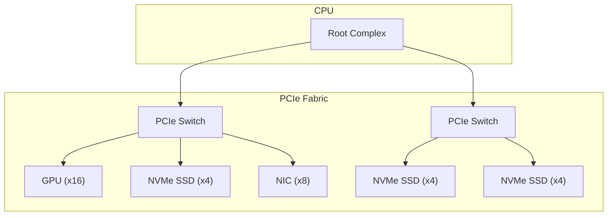
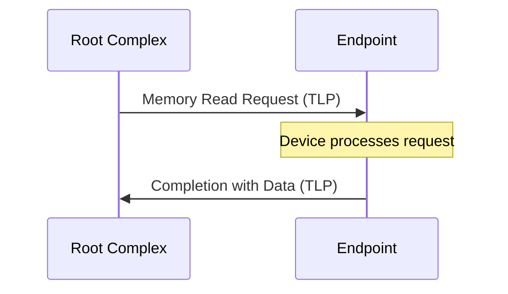
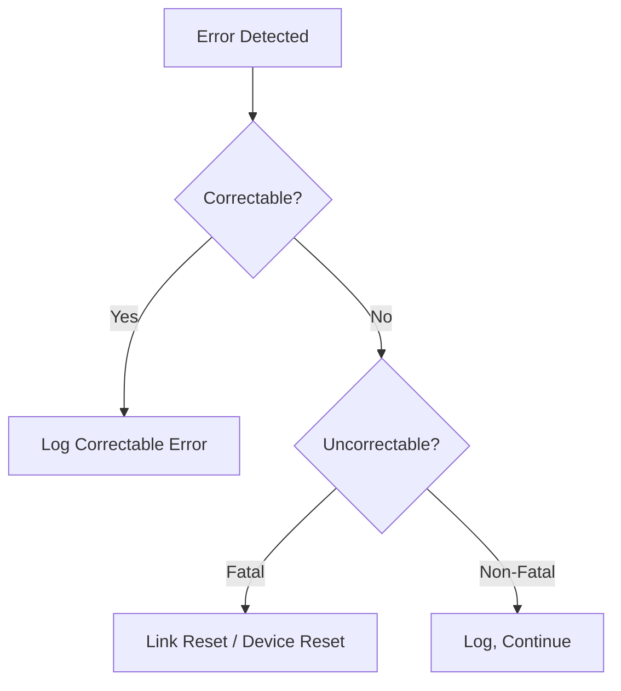
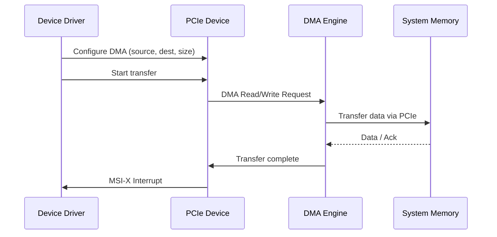

# PCIe (PCI Express)

## Overview

**PCIe** (Peripheral Component Interconnect Express) is the standard high-speed serial bus for connecting components like GPUs, SSDs, NICs, and other peripherals to the CPU. It uses point-to-point connections with multiple lanes for scalable bandwidth. PCIe is the backbone of modern computer I/O.

## PCIe Architecture



### Key Components
- **Root Complex**: Connects CPU to PCIe fabric (usually in CPU die)
- **Switch**: Routes packets between endpoints
- **Endpoint**: Device (GPU, SSD, NIC, etc.)
- **Lane**: One differential pair for TX + one for RX

## PCIe Generations

| Generation | Year | Data Rate/Lane | Encoding | Bandwidth/Lane (each way) | x16 Total |
|------------|------|----------------|----------|---------------------------|-----------|
| Gen 1 | 2003 | 2.5 GT/s | 8b/10b | 250 MB/s | 4 GB/s |
| Gen 2 | 2007 | 5.0 GT/s | 8b/10b | 500 MB/s | 8 GB/s |
| Gen 3 | 2010 | 8.0 GT/s | 128b/130b | 985 MB/s | 15.8 GB/s |
| Gen 4 | 2017 | 16.0 GT/s | 128b/130b | 1.97 GB/s | 31.5 GB/s |
| Gen 5 | 2019 | 32.0 GT/s | 128b/130b | 3.94 GB/s | 63 GB/s |
| Gen 6 | 2022 | 64.0 GT/s | PAM4 + FEC | 7.56 GB/s | 121 GB/s |

### Bandwidth Calculation

```
Bandwidth = Lane Count × Data Rate × Encoding Efficiency / 8

PCIe Gen 4 × 16 lanes:
= 16 × 16 GT/s × (128/130) / 8
= 16 × 16 × 0.985 / 8
= 31.5 GB/s (each direction)
= 63 GB/s (bidirectional)
```

## PCIe Lane Configuration

Lanes are denoted as **x1, x4, x8, x16**:

| Configuration | Lanes | Typical Use | Bandwidth (Gen 4) |
|---------------|-------|-------------|-------------------|
| x1 | 1 | Low-speed devices | 2 GB/s |
| x4 | 4 | NVMe SSDs | 8 GB/s |
| x8 | 8 | NICs, some GPUs | 16 GB/s |
| x16 | 16 | GPUs | 32 GB/s |

### Physical Connector
```
PCIe x16 slot:
┌─────────────────────────────────────────────────┐
│ ■ ■ ■ ■ ■ ■ ■ ■ ■ ■ ■ ■ ■ ■ ■ ■ │← 16 lanes
│ ■ ■ ■ ■ ■ ■ ■ ■ ■ ■ ■ ■ ■ ■ ■ ■ │  (82 pins)
│ ┌──┐                                              │
│ │key│ ← Notch (prevents wrong insertion)          │
│ └──┘                                              │
│ ■ ■ ■ ■ ■ ■ ■ ■ ■ (power)                       │
└─────────────────────────────────────────────────┘
```

Devices with fewer lanes (x1, x4) can fit in larger slots (x16) — they use only the lanes they need.

## PCIe Packet-Based Communication

PCIe uses **packet-based** protocol (unlike PCI's parallel bus):



### Transaction Layer Packets (TLP)

```
┌──────────┬──────────┬──────────┬──────────┐
│  Header  │  Data    │  ECRC    │  LCRC    │
│ (12-16B) │ (0-4KB)  │  (4B)    │  (4B)    │
└──────────┴──────────┴──────────┴──────────┘
```

TLP types:
- **Memory Read/Write**: Access device memory
- **I/O Read/Write**: Legacy I/O access
- **Configuration**: Device setup
- **Message**: Interrupts, power management

## PCIe Error Handling

### Correctable Errors
- Detected and corrected by hardware (retry, FEC)
- Logged but don't affect operation
- Example: CRC errors, corrected by replay

### Uncorrectable Errors
- Cannot be corrected
- May cause link retraining or device reset
- Example: Poisoned TLP, completion timeout

### AER (Advanced Error Reporting)
PCIe devices can report errors via AER capability:


## PCIe and DMA

PCIe devices use DMA to transfer data:



## PCIe vs Previous Buses

| Property | PCI | PCIe |
|----------|-----|------|
| Signaling | Parallel | Serial (per lane) |
| Topology | Shared bus | Point-to-point |
| Bandwidth | 133 MB/s (32-bit/33MHz) | 63 GB/s (x16 Gen 5) |
| Scalability | Limited | Add more lanes |
| Hot-plug | Limited | Full support |
| Power management | Basic | ASPM, L-states |

## Interview Questions

1. **Q**: How does PCIe achieve higher bandwidth than PCI?
   **A**: PCIe uses serial point-to-point connections with multiple lanes. Each lane provides independent bandwidth. Unlike PCI's shared parallel bus, PCIe doesn't need arbitration and can scale by adding lanes. Gen 5 achieves 32 GT/s per lane.

2. **Q**: What is the difference between PCIe x1, x4, x8, and x16?
   **A**: They differ in the number of lanes (1, 4, 8, 16). More lanes = more bandwidth. A x16 GPU slot has 16× the bandwidth of a x1 slot. Devices can work in larger slots (x4 in x16) but use only their lanes.

3. **Q**: What is 128b/130b encoding and why is it used?
   **A**: PCIe Gen 3+ uses 128b/130b encoding: 128 data bits are encoded in 130 bits (2-bit overhead). This is much more efficient than Gen 1/2's 8b/10b (20% overhead). It uses scrambling to maintain DC balance and clock recovery.

4. **Q**: How does PCIe handle errors?
   **A**: Correctable errors (CRC, replay) are automatically fixed. Uncorrectable errors are reported via AER. Fatal errors may cause link retraining. The ECRC (end-to-end CRC) ensures data integrity across switches.

5. **Q**: What is the Root Complex?
   **A**: The Root Complex connects the CPU/memory subsystem to the PCIe fabric. It initiates PCIe transactions on behalf of the CPU and receives completions. It's typically integrated in the CPU die.

## Common Mistakes

- ❌ Confusing GT/s with GB/s (GT/s is raw, GB/s accounts for encoding)
- ❌ Forgetting encoding overhead (8b/10b = 20% loss, 128b/130b = 1.5% loss)
- ❌ Not knowing that PCIe is bidirectional (each direction has full bandwidth)
- ❌ Assuming devices always use all available lanes
- ❌ Confusing PCIe generation with lane count

## Summary

PCIe is the primary high-speed interconnect in modern computers. It uses serial, point-to-point connections with multiple lanes for scalable bandwidth. Gen 5 provides 32 GT/s per lane (~4 GB/s). PCIe uses packet-based communication (TLPs) with error correction and DMA support. GPUs use x16, NVMe SSDs use x4, and lower-speed devices use x1.

## Cross-References

- [NVMe](nvme.md) — Storage protocol over PCIe
- [USB](usb.md) — Peripheral bus
- [Buses](buses.md) — Bus fundamentals
- [GPU](../parallelism/gpu.md) — PCIe for GPU communication
- [Storage Overview](../../storage/overview.md) — Storage interfaces
