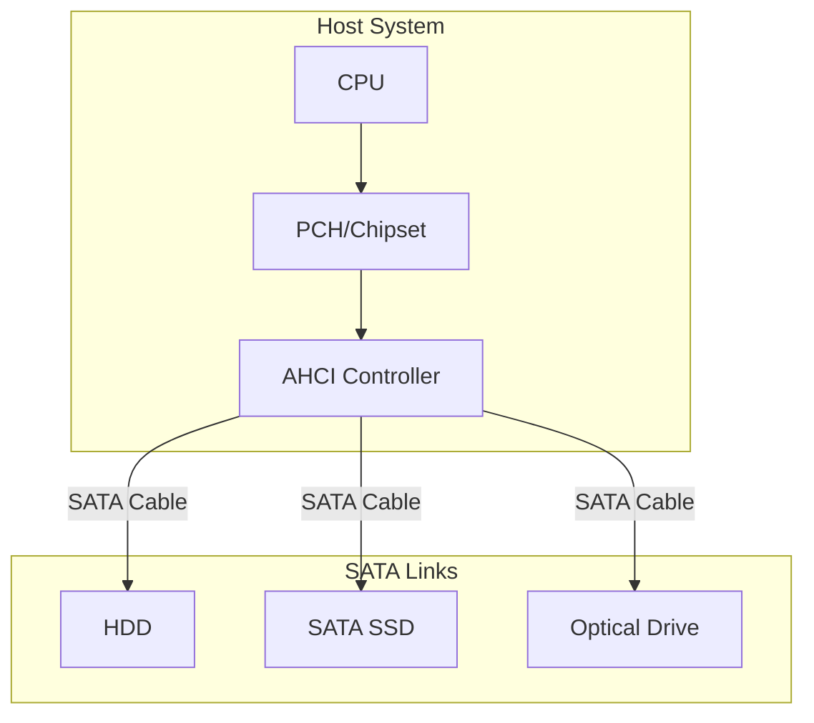
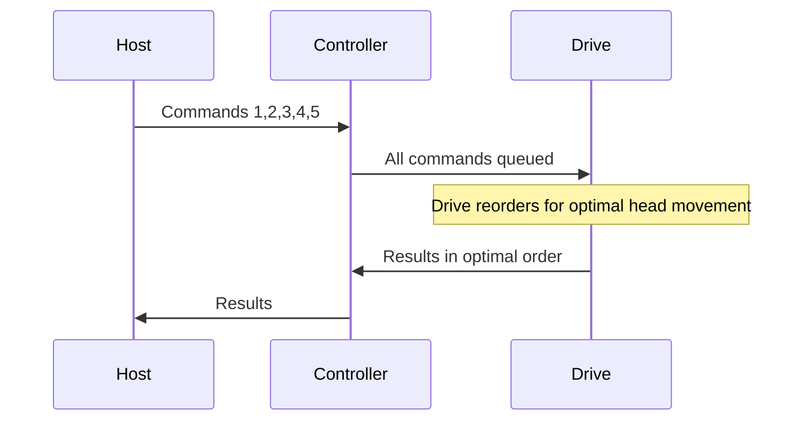

# SATA (Serial ATA)

## Overview

**SATA** (Serial Advanced Technology Attachment) is a bus interface for connecting storage devices (HDDs and SSDs) to the computer. It replaced the parallel ATA (PATA/IDE) interface with a serial, point-to-point connection. While SATA is being superseded by NVMe for high-performance storage, it remains widely used for HDDs and budget SSDs.

## SATA Generations

| Version | Year | Speed | Bandwidth | Encoding |
|---------|------|-------|-----------|----------|
| SATA 1.0 | 2003 | 1.5 Gbps | 150 MB/s | 8b/10b |
| SATA 2.0 | 2004 | 3.0 Gbps | 300 MB/s | 8b/10b |
| SATA 3.0 | 2009 | 6.0 Gbps | 600 MB/s | 8b/10b |

### Bandwidth Calculation
```
SATA 3.0: 6.0 Gbps × (8/10) / 8 = 600 MB/s
```
The 8b/10b encoding adds 20% overhead.

## SATA Architecture



### Point-to-Point
Each SATA device has a dedicated link to the host controller:
- One device per port
- No master/slave configuration (unlike PATA)
- Hot-plug support

### SATA Cables
```
┌────────────────────┐
│ 7-pin Data Cable   │ ← Small, thin, easy to route
├────────────────────┤
│ 15-pin Power Cable │ ← Provides 3.3V, 5V, 12V
└────────────────────┘
```

## AHCI (Advanced Host Controller Interface)

AHCI is the standard programming interface for SATA controllers:

### Features
- **NCQ** (Native Command Queuing): Reorders commands for efficiency
- **Hot-plug**: Connect/disconnect devices while running
- **Port Multiplier**: Connect multiple devices to one port
- **Staggered Spin-up**: Reduces power-on surge

### NCQ (Native Command Queuing)



NCQ allows the drive to execute commands in the most efficient order:
- For HDDs: Minimize head seeks
- For SSDs: Parallelize NAND operations

## SATA vs PATA

| Property | PATA (IDE) | SATA |
|----------|------------|------|
| Signaling | Parallel (40/80 wires) | Serial (7 data pins) |
| Max speed | 133 MB/s | 600 MB/s |
| Cable length | 18 inches | 1 meter |
| Hot-plug | No | Yes |
| Devices per cable | 2 (master/slave) | 1 (point-to-point) |
| Cable size | Wide, flat | Thin, round |

## SATA SSDs vs NVMe SSDs

| Property | SATA SSD | NVMe SSD |
|----------|----------|----------|
| Interface | SATA 3.0 | PCIe |
| Max bandwidth | 600 MB/s | 7+ GB/s (PCIe Gen 4 x4) |
| Protocol | AHCI | NVMe |
| Queue depth | 32 commands | 64K commands |
| Latency | ~100 μs | ~10 μs |
| Form factor | 2.5", M.2 (B+M key) | M.2 (M key), U.2, AIC |

SATA SSDs are limited by the SATA interface, not the NAND flash.

## eSATA

External SATA variant:
- Same speed as internal SATA
- Longer cable length (2 meters)
- Requires external power (unlike USB)
- Largely replaced by USB 3.0 and Thunderbolt

## Interview Questions

1. **Q**: What is the maximum bandwidth of SATA 3.0?
   **A**: 600 MB/s. The raw data rate is 6 Gbps, but 8b/10b encoding reduces effective bandwidth by 20%: 6.0 × 0.8 / 8 = 600 MB/s.

2. **Q**: Why are SATA SSDs slower than NVMe SSDs?
   **A**: SATA 3.0 is limited to 600 MB/s, while NVMe over PCIe Gen 4 x4 can reach 7+ GB/s. The SATA interface, not the NAND flash, is the bottleneck. NVMe also supports much deeper command queues.

3. **Q**: What is NCQ and why does it help?
   **A**: Native Command Queuing allows the storage device to reorder commands for optimal execution. For HDDs, this minimizes head seeks. For SSDs, it enables parallel operations across NAND chips. NCQ can significantly improve random I/O performance.

4. **Q**: What replaced SATA for high-performance storage?
   **A**: NVMe over PCIe. NVMe provides 10-100× higher bandwidth, lower latency, and deeper command queues. However, SATA remains for HDDs and budget SSDs where the lower cost matters.

5. **Q**: What is AHCI?
   **A**: Advanced Host Controller Interface — the standard programming interface for SATA controllers. It defines how the OS communicates with SATA devices, including features like NCQ and hot-plug.

## Common Mistakes

- ❌ Assuming SATA SSDs are as fast as NVMe SSDs (SATA is the bottleneck)
- ❌ Forgetting about 8b/10b encoding overhead
- ❌ Not knowing that SATA is point-to-point (one device per port)
- ❌ Confusing SATA data and power connectors
- ❌ Not understanding NCQ's benefits

## Summary

SATA is a serial point-to-point storage interface with a maximum bandwidth of 600 MB/s (SATA 3.0). It uses AHCI for command management, including NCQ for command reordering. While being replaced by NVMe for high-performance storage, SATA remains relevant for HDDs and budget SSDs.

## Cross-References

- [NVMe](nvme.md) — Modern storage protocol
- [Buses](buses.md) — Bus fundamentals
- [Storage Overview](../../storage/overview.md) — Storage technologies
- [SSD](../../storage/ssd.md) — Solid-state drives
- [HDD](../../storage/hdd.md) — Hard disk drives
