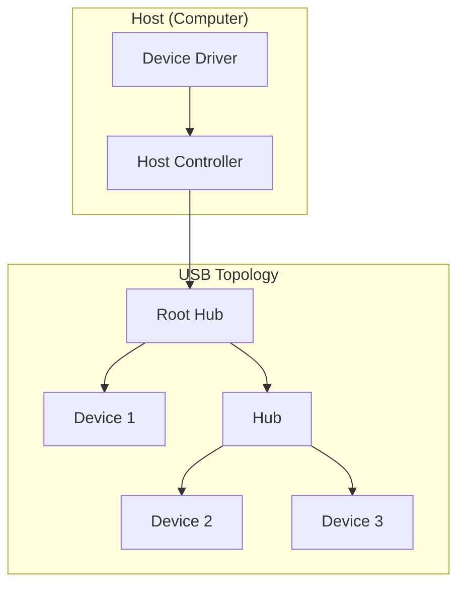
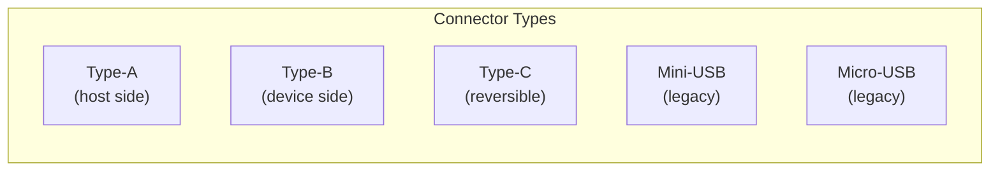
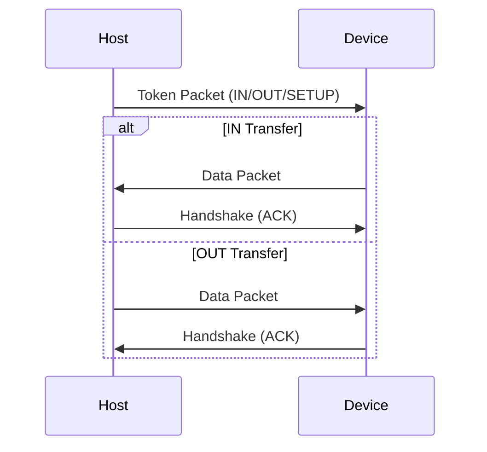

# USB (Universal Serial Bus)

## Overview

**USB** (Universal Serial Bus) is the most common interface for connecting peripherals to computers. It provides power, data transfer, and a standardized connector ecosystem. USB has evolved from 1.5 Mbps (USB 1.0) to 80 Gbps (USB4 v2.0), becoming the universal connectivity standard.

## USB Versions

| Version | Year | Speed | Marketing Name |
|---------|------|-------|----------------|
| USB 1.0 | 1996 | 1.5 Mbps (Low) / 12 Mbps (Full) | USB |
| USB 2.0 | 2000 | 480 Mbps (High Speed) | Hi-Speed USB |
| USB 3.0 | 2008 | 5 Gbps | USB 3.2 Gen 1 |
| USB 3.1 | 2013 | 10 Gbps | USB 3.2 Gen 2 |
| USB 3.2 | 2017 | 20 Gbps | USB 3.2 Gen 2x2 |
| USB4 | 2019 | 40 Gbps | USB4 |
| USB4 v2.0 | 2022 | 80 Gbps (120 Gbps asymmetric) | USB4 Gen 4 |

### Naming Confusion
USB naming has been notoriously confusing:
- USB 3.0 = USB 3.2 Gen 1 = SuperSpeed USB
- USB 3.1 = USB 3.2 Gen 2 = SuperSpeed USB 10 Gbps
- USB 3.2 = USB 3.2 Gen 2x2 = SuperSpeed USB 20 Gbps

## USB Architecture



### Host-Device Model
USB uses a **host-centric** model:
- **Host** initiates all transfers
- **Devices** respond to host requests
- **Hubs** extend the topology (up to 5 levels deep)

### Transfer Types

| Transfer Type | Description | Use Case |
|---------------|-------------|----------|
| **Control** | Device setup and configuration | Enumeration, commands |
| **Bulk** | Large, non-time-critical transfers | File transfer, printing |
| **Interrupt** | Small, periodic, latency-sensitive | Mouse, keyboard |
| **Isochronous** | Real-time, guaranteed bandwidth | Audio, video streaming |

## USB Connectors



### USB Type-C
The modern standard:
- **Reversible** (no wrong orientation)
- **Alternate modes**: DisplayPort, Thunderbolt, HDMI
- **Power Delivery**: Up to 240W (USB PD 3.1)
- **USB4**: Native Type-C only

## USB Power Delivery (PD)

| PD Version | Max Power | Voltage | Current |
|------------|-----------|---------|---------|
| USB 2.0 | 2.5W | 5V | 500mA |
| USB 3.0 | 4.5W | 5V | 900mA |
| USB PD 2.0 | 100W | 5-20V | 5A |
| USB PD 3.0 | 100W | 5-20V | 5A |
| USB PD 3.1 | 240W | 5-48V | 5A |

**Extended Power Range (EPR)**: Up to 240W (48V × 5A) for laptops and monitors.

## USB Protocol

### Transaction Format



### Packet Types
- **Token**: Host tells device what to do (IN, OUT, SETUP)
- **Data**: Payload (DATA0, DATA1, DATA2, MDATA)
- **Handshake**: ACK, NAK, STALL, NYET

## USB4 and Thunderbolt

USB4 is based on **Thunderbolt 3** protocol:

| Feature | USB4 | Thunderbolt 4 |
|---------|------|---------------|
| Speed | 40 Gbps | 40 Gbps |
| Tunneling | USB, DP, PCIe | USB, DP, PCIe |
| Min PCIe | Optional | Required (32 Gbps) |
| Min display | 1 display | 2 displays (4K60) |
| Charging | Optional | Required (100W) |
| Daisy-chain | Optional | Required |

### Tunneling
USB4 can tunnel multiple protocols simultaneously:
```
┌─────────────────────────────────────┐
│ USB4 Link (40 Gbps)                │
│  ┌─────────┐  ┌─────────┐         │
│  │USB 3.2  │  │DisplayPort│  │PCIe  │  │
│  │Tunnel   │  │Tunnel    │  │Tunnel│  │
│  │(10 Gbps)│  │(32 Gbps) │  │(16Gb)│  │
│  └─────────┘  └─────────┘         │
└─────────────────────────────────────┘
```

## Interview Questions

1. **Q**: What is the maximum speed of USB4?
   **A**: 40 Gbps (bidirectional). USB4 v2.0 increases this to 80 Gbps, with asymmetric mode up to 120 Gbps in one direction.

2. **Q**: How does USB Power Delivery work?
   **A**: USB PD negotiates voltage and current between host and device. Starting at 5V, the device can request higher voltages (up to 48V in PD 3.1). Communication happens over the CC (Configuration Channel) pins in the Type-C connector.

3. **Q**: What is the difference between USB and PCIe?
   **A**: USB is host-centric (host initiates all transfers), designed for peripherals, and provides power. PCIe is peer-to-peer, designed for high-performance components, and doesn't provide power to devices (except slot power for GPUs).

4. **Q**: Why is USB Type-C significant?
   **A**: It's reversible, supports alternate modes (DisplayPort, Thunderbolt, HDMI), enables USB Power Delivery up to 240W, and is required for USB4. It's becoming the universal connector for all devices.

5. **Q**: What is tunneling in USB4?
   **A**: USB4 can carry multiple protocols (USB, DisplayPort, PCIe) simultaneously over the same physical link. Each protocol is tunneled in its own container, with bandwidth allocated dynamically.

## Common Mistakes

- ❌ Confusing USB versions (3.0/3.1/3.2 naming is confusing)
- ❌ Assuming USB Type-C = USB4 (Type-C is the connector, USB4 is the protocol)
- ❌ Not knowing that USB is host-centric (devices can't initiate transfers)
- ❌ Forgetting about power delivery capabilities
- ❌ Confusing Gbps (gigabits) with GB/s (gigabytes)

## Summary

USB is the universal peripheral interface, evolving from 1.5 Mbps to 80 Gbps. USB Type-C is the modern connector, supporting alternate modes and up to 240W power delivery. USB4 is based on Thunderbolt 3, enabling tunneling of USB, DisplayPort, and PCIe over a single cable.

## Cross-References

- [PCIe](pcie.md) — High-speed expansion bus
- [Thunderbolt](pcie.md) — Related to USB4
- [Buses](buses.md) — Bus fundamentals
- [I/O Overview](README.md) — I/O system architecture

## Cross References

- [Buses](buses.md)
- [PCIe](pcie.md)
