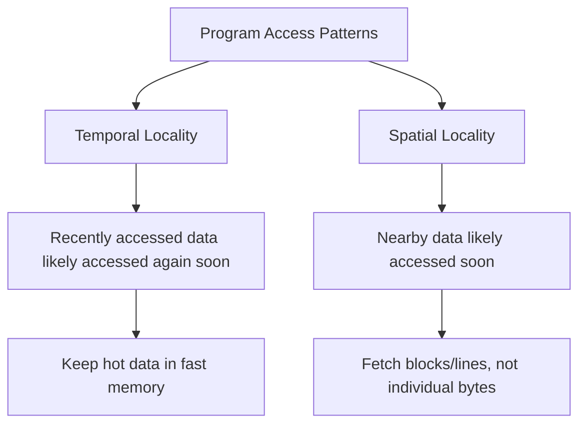
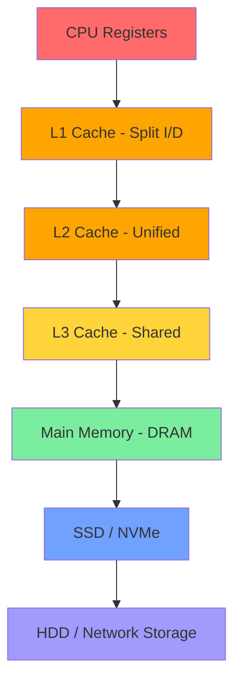

# Memory Hierarchy

## Overview

The **memory hierarchy** is a foundational concept in computer architecture that organizes storage into levels based on speed, cost, and capacity. The goal is to provide the illusion of a large, fast, cheap memory by combining small, fast, expensive memory (caches) with large, slow, cheap memory (main memory, disk).

Understanding the memory hierarchy is **critical** for placement interviews because it directly impacts program performance and is the basis for questions on caching, locality, and system design.

## Why a Hierarchy?

| Property | Registers | L1 Cache | L2 Cache | L3 Cache | Main Memory | SSD | HDD |
|----------|-----------|----------|----------|----------|-------------|-----|-----|
| **Size** | ~1 KB | 32-64 KB | 256 KB-1 MB | 4-64 MB | 4-128 GB | 256 GB-4 TB | 1-20 TB |
| **Latency** | 0.3 ns | 1 ns | 3-10 ns | 10-20 ns | 50-100 ns | 25-100 μs | 5-10 ms |
| **Cost/GB** | Extreme | Very High | High | Moderate | Low | Very Low | Lowest |

No single technology can simultaneously provide:
- **Fast access** (low latency)
- **Large capacity** (many GB/TB)
- **Low cost** (affordable per GB)

The hierarchy exploits **locality** to make fast memory handle most accesses.

## The Principle of Locality



### Temporal Locality
If a memory location is accessed, it is likely to be accessed again soon.
- **Example**: Loop variables, stack pointers, frequently called functions.

### Spatial Locality
If a memory location is accessed, nearby locations are likely to be accessed soon.
- **Example**: Array traversal, sequential instruction fetch, struct fields.

## Hierarchy Levels



Each level acts as a **cache** for the level below it:
1. **Registers** → cache for L1
2. **L1 Cache** → cache for L2
3. **L2 Cache** → cache for L3
4. **L3 Cache** → cache for main memory
5. **OS Virtual Memory** → caches disk in RAM

## Key Metrics

### Hit Rate and Miss Rate
- **Hit**: Data found in the current level → fast access
- **Miss**: Data not found → must fetch from next level

```
Hit Rate = Hits / Total Accesses
Miss Rate = 1 - Hit Rate
```

### Average Memory Access Time (AMAT)

```
AMAT = Hit Time + (Miss Rate × Miss Penalty)
```

**Example**:
- L1 hit time = 1 ns, miss rate = 5%, L2 access = 10 ns
- AMAT = 1 + 0.05 × 10 = 1.5 ns

With multiple levels:
```
AMAT = Hit Time_L1 + Miss Rate_L1 × (Hit Time_L2 + Miss Rate_L2 × Miss Penalty_L2)
```

### Types of Misses (3Cs)

| Type | Cause | Mitigation |
|------|-------|------------|
| **Compulsory** (Cold) | First access to a block | Prefetching |
| **Capacity** | Cache too small for working set | Larger cache |
| **Conflict** | Multiple blocks map to same set | Higher associativity |

## Interview Questions

1. **Q**: Why not make everything as fast as L1 cache?
   **A**: Cost and physics. SRAM (L1) costs ~1000× more per GB than DRAM. Faster memory requires more transistors per bit, more power, and more die area. The hierarchy balances speed vs. cost.

2. **Q**: A program has a 95% L1 hit rate and 90% L2 hit rate. L1 access = 1 cycle, L2 = 10 cycles, main memory = 100 cycles. What is AMAT?
   **A**: AMAT = 1 + 0.05 × (10 + 0.10 × 100) = 1 + 0.05 × 20 = 2 cycles.

3. **Q**: What is a "cache-friendly" program?
   **A**: One that exploits spatial and temporal locality — accesses data sequentially, reuses data recently accessed, and uses small working sets that fit in cache.

4. **Q**: Explain the difference between hit time and miss penalty.
   **A**: Hit time is the time to access data in the current cache level. Miss penalty is the additional time to fetch data from the next level when a miss occurs.

## Common Mistakes

- ❌ Assuming all memory accesses take the same time
- ❌ Ignoring cache line size when designing data structures
- ❌ Confusing hit rate with hit time
- ❌ Forgetting that writes have different policies (write-through vs write-back)
- ❌ Not considering spatial locality in algorithm design

## Summary

The memory hierarchy exploits locality to bridge the speed-capacity gap. Understanding it is essential for writing performant code and answering system design questions. The key formula is **AMAT = Hit Time + Miss Rate × Miss Penalty**.

## Cross-References

- [Cache Basics](cache-basics.md) — How caches work
- [Cache Mapping](cache-mapping.md) — Address mapping strategies
- [Performance](../performance/README.md) — Amdahl's Law and optimization
- [SRAM vs DRAM](../memory-tech/sram.md) — Underlying technologies
