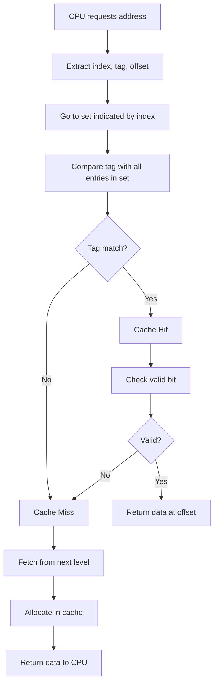
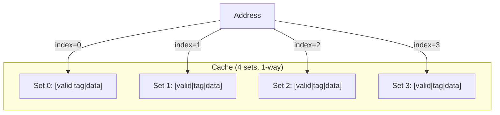

# Cache Basics

## Overview

A **cache** is a small, fast memory that stores copies of data from frequently accessed main memory locations. When the CPU needs data, it checks the cache first. If found (a **hit**), the data is returned quickly. If not (a **miss**), the data is fetched from a slower level and stored in the cache for future use.

Understanding cache mechanics — address decomposition, lookup, hit/miss handling — is fundamental for interviews.

## How a Cache Works

### Address Decomposition

A memory address is split into three fields for cache lookup:

```
┌──────────────┬──────────────┬──────────────┐
│     Tag       │     Index    │   Offset     │
└──────────────┴──────────────┴──────────────┘
  t bits            s bits        b bits

Total address bits = t + s + b
Cache size = 2^s sets × 2^b bytes/line × associativity
```

- **Offset (b bits)**: Selects a byte within the cache line. b = log₂(line_size). For 64-byte lines, b = 6.
- **Index (s bits)**: Selects which set in the cache. s = log₂(num_sets).
- **Tag (t bits)**: Remaining bits to identify which memory block is stored.

### Cache Lookup Process



### Valid Bit

Each cache entry has a **valid bit** indicating whether the entry contains valid data. On power-up, all valid bits are 0 (cold cache).

### Tag Comparison

For a direct-mapped cache: compare 1 tag.
For an n-way set-associative cache: compare n tags in parallel.

## Cache Operations

### Read (Load)
1. Check cache using index/tag
2. **Hit**: Return data immediately
3. **Miss**: Fetch from next level, store in cache, return

### Write (Store)
Policies determine what happens on a write hit:
- **Write-through**: Write to cache AND next level simultaneously
- **Write-back**: Write to cache only; mark as **dirty**; write to next level on eviction

On a **write miss**:
- **Write-allocate**: Fetch the block into cache, then write
- **No-write-allocate**: Write directly to next level, don't cache

Common combinations:
- Write-through + no-write-allocate
- Write-back + write-allocate

## Example: Direct-Mapped Cache Walkthrough

**Setup**: 4 sets, 1 line per set, 16-byte lines, 16-bit addresses

```
Offset bits: b = log₂(16) = 4
Index bits:  s = log₂(4)  = 2
Tag bits:    t = 16 - 2 - 4 = 10
```

**Access sequence for address 0x00A4** (binary: 0000 0000 1010 0100):
- Tag = 0000000010 (0x002)
- Index = 10 (2)
- Offset = 0100 (4)

1. Go to set 2
2. Compare tag 0x002 with stored tag
3. If match and valid → hit, return byte at offset 4
4. If no match → miss, fetch 16 bytes starting at 0x00A0, store in set 2

## Cache Organization Diagram



## Cache Performance Formula

```
AMAT = Hit Time + Miss Rate × Miss Penalty

With multiple levels:
AMAT = HT_L1 + MR_L1 × (HT_L2 + MR_L2 × (HT_L3 + MR_L3 × MP_DRAM))
```

**Optimization strategies**:
| Strategy | Reduces |
|----------|---------|
| Larger cache | Miss rate (capacity misses) |
| Higher associativity | Miss rate (conflict misses) |
| Larger cache lines | Miss rate (spatial locality) |
| Prefetching | Miss rate (compulsory misses) |
| Faster SRAM | Hit time |
| Multi-level caches | Effective miss penalty |

## Interview Questions

1. **Q**: A cache has 64 sets, is 4-way set-associative, with 32-byte lines and 32-bit addresses. How many bits for tag, index, offset?
   **A**: Offset = log₂(32) = 5 bits. Index = log₂(64) = 6 bits. Tag = 32 - 6 - 5 = 21 bits.

2. **Q**: What is a dirty bit and when is it used?
   **A**: A dirty bit marks a cache line that has been written to but not yet written back to the next level. When the line is evicted, the dirty bit determines if a writeback is needed (write-back policy).

3. **Q**: Why don't we use write-through with write-allocate?
   **A**: Write-allocate fetches the block on a write miss, but write-through immediately writes to the next level anyway. This wastes bandwidth. Write-through typically pairs with no-write-allocate.

4. **Q**: What is a cache "line fill"?
   **A**: The process of fetching an entire cache line from the next level on a miss and placing it in the cache.

## Common Mistakes

- ❌ Confusing tag, index, and offset bits
- ❌ Forgetting the valid bit in cache entries
- ❌ Not knowing write-through vs write-back tradeoffs
- ❌ Assuming writes always go through the cache

## Summary

A cache stores recently accessed data in fast memory. Addresses are split into tag, index, and offset. The cache uses index to find the set, tag comparison to find the line, and offset to find the byte. Write policies (write-through/write-back) and write miss policies (write-allocate/no-write-allocate) affect performance and consistency.

## Cross-References

- [Cache Mapping](cache-mapping.md) — Mapping strategies overview
- [Direct Mapped](direct-mapped.md) — Simplest mapping
- [Set Associative](set-associative.md) — Most common mapping
- [Replacement Policies](replacement.md) — What to evict
- [Write Policies](write-policies.md) — Detailed write strategies

## Cross References

- [Cache Mapping](cache-mapping.md)
- [Replacement Policies](replacement.md)
- [Write Policies](write-policies.md)
- [Performance](performance.md)
- [OS Page Tables](../../os/memory/page-tables.md)
