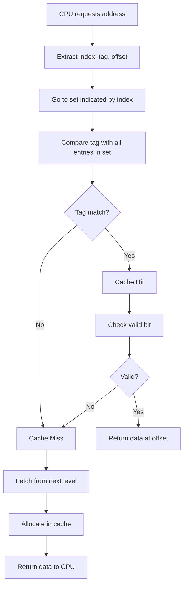
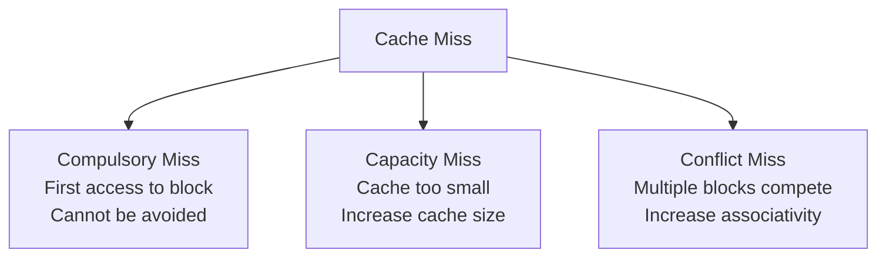
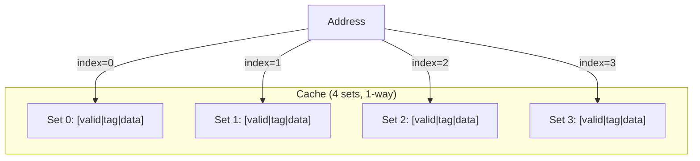

# Cache Basics

## Overview

A **cache** is a small, fast memory that stores copies of data from frequently accessed main memory locations. When the CPU needs data, it checks the cache first. If found (a **hit**), the data is returned quickly. If not (a **miss**), the data is fetched from a slower level and stored in the cache for future use.

Understanding cache mechanics — address decomposition, lookup, hit/miss handling — is fundamental for interviews.

---

## Cache Line (Cache Block)

A **cache line** is the smallest unit of data transferred between cache and main memory. Typical sizes: 32, 64, or 128 bytes.

```
Why cache lines? Memory access exhibits spatial locality —
if you access address X, you're likely to access X+1, X+2, etc.

A 64-byte cache line means:
  - 1 miss fetches 64 bytes (not just 1 byte)
  - Subsequent accesses to nearby addresses are hits
  - Wider bus utilization (burst transfer from DRAM)

Cache line size trade-offs:
  ┌────────────────────┬──────────────────────────────────┐
  │ Larger lines       │ Better spatial locality           │
  │                    │ Higher miss penalty (more data)   │
  │                    │ More waste if locality is low     │
  ├────────────────────┼──────────────────────────────────┤
  │ Smaller lines      │ Less wasted bandwidth             │
  │                    │ More misses for sequential access │
  │                    │ Lower miss penalty                │
  └────────────────────┴──────────────────────────────────┘
```

### Cache Line Structure

```
┌──────────┬──────────┬───────────────────────────────────────────┐
│ Valid Bit│ Tag      │ Data (64 bytes typically)                 │
│ (1 bit)  │ (t bits) │ (512 bits for 64-byte line)               │
└──────────┴──────────┴───────────────────────────────────────────┘

Optional additional bits:
  - Dirty bit (1 bit): Modified but not written back
  - LRU bits: For replacement policy tracking
  - Prefetch bit: Distinguishes useful vs. prefetch data
```

---

## Locality Principles

Caches work because of two fundamental properties of how programs access memory:

### Temporal Locality

> If a memory location is accessed, it's likely to be accessed again soon.

```c
// Temporal locality: variable 'sum' accessed repeatedly
int sum = 0;
for (int i = 0; i < n; i++) {
    sum += arr[i];  // 'sum' accessed every iteration
}
```

**Cache exploitation**: Keep recently accessed data in cache. LRU replacement policy is based on temporal locality.

### Spatial Locality

> If a memory location is accessed, nearby locations are likely to be accessed soon.

```c
// Spatial locality: array elements accessed sequentially
for (int i = 0; i < n; i++) {
    process(arr[i]);  // Accesses arr[0], arr[1], arr[2], ...
}
```

**Cache exploitation**: Fetch entire cache lines (64 bytes), not individual bytes. One miss brings in 16 ints (4 bytes each), making the next 15 accesses hits.

### Locality in Practice

```
Good locality (high hit rate):
  - Sequential array traversal
  - Nested loops with row-major access
  - Linked list traversal (poor spatial locality!)
  - Stack operations (push/pop)

Poor locality (low hit rate):
  - Random access patterns
  - Column-major traversal of row-major arrays
  - Large working sets that exceed cache size
  - Pointer chasing (linked lists, trees)
```

---

## How a Cache Works

### Address Decomposition

A memory address is split into three fields for cache lookup:

```
┌──────────────┬──────────────┬──────────────┐
│     Tag       │     Index    │   Offset     │
└──────────────┴──────────────┴──────────────┘
  t bits            s bits        b bits

Total address bits = t + s + b
Cache size = 2^s sets × 2^b bytes/line × associativity
```

- **Offset (b bits)**: Selects a byte within the cache line. b = log₂(line_size). For 64-byte lines, b = 6.
- **Index (s bits)**: Selects which set in the cache. s = log₂(num_sets).
- **Tag (t bits)**: Remaining bits to identify which memory block is stored.

### Cache Lookup Process



### Valid Bit

Each cache entry has a **valid bit** indicating whether the entry contains valid data. On power-up, all valid bits are 0 (cold cache).

### Tag Comparison

For a direct-mapped cache: compare 1 tag.
For an n-way set-associative cache: compare n tags in parallel.

---

## Hit and Miss Types (The 3 Cs)

Understanding **why** misses occur is critical for optimization. There are three types, known as the **3 Cs of cache misses**:

### 1. Compulsory Miss (Cold Miss)

The first access to a block that has never been in the cache.

```
Example: Program starts, accesses arr[0] for the first time.
→ Cache has never seen this block → compulsory miss.

Cannot be avoided (except with prefetching).
Minimized by: Prefetching, larger cache lines (bring in more data).
```

### 2. Capacity Miss

The cache is too small to hold all blocks the program needs. A block was evicted earlier and is needed again.

```
Example: Working set = 32 KB, Cache = 16 KB.
→ Cache can't hold entire working set → capacity misses.

  for (int i = 0; i < 1000000; i++) {
      sum += big_array[i];  // big_array doesn't fit in cache
  }

Minimized by: Larger cache, better replacement policy.
```

### 3. Conflict Miss

Two blocks map to the same cache set, causing eviction even though the cache isn't full.

```
Example: Direct-mapped cache with 4 sets.
  Access A → maps to set 2
  Access B → maps to set 2
  Access A → conflict miss! (B evicted A, even if cache isn't full)

Minimized by: Higher associativity (2-way, 4-way, fully associative).
```

### 3 Cs Summary



| Miss Type | Cause | Solution |
|-----------|-------|----------|
| Compulsory | First access | Prefetching, larger lines |
| Capacity | Cache too small | Larger cache |
| Conflict | Mapping conflict | Higher associativity |

---

## Cache Operations

### Read (Load)
1. Check cache using index/tag
2. **Hit**: Return data immediately
3. **Miss**: Fetch from next level, store in cache, return

### Write (Store)
Policies determine what happens on a write hit:
- **Write-through**: Write to cache AND next level simultaneously
- **Write-back**: Write to cache only; mark as **dirty**; write to next level on eviction

On a **write miss**:
- **Write-allocate**: Fetch the block into cache, then write
- **No-write-allocate**: Write directly to next level, don't cache

Common combinations:
- Write-through + no-write-allocate
- Write-back + write-allocate

### Write Policy Comparison

| Policy | Write Hit | Write Miss | Consistency | Bandwidth |
|--------|-----------|------------|-------------|-----------|
| Write-through | Cache + next level | No-write-allocate | Always consistent | High |
| Write-back | Cache only (dirty) | Write-allocate | Consistent on eviction | Low |

```
Write-through:
  CPU → Cache + Memory (simultaneous)
  Pro: Simple, always consistent
  Con: Every write goes to memory (high bandwidth)

Write-back:
  CPU → Cache (mark dirty)
  On eviction: Dirty line → Memory
  Pro: Low bandwidth (only evictions write back)
  Con: More complex, risk of data loss on crash
```

---

## Cache Performance Formula

```
AMAT = Hit Time + Miss Rate × Miss Penalty

With multiple levels:
AMAT = HT_L1 + MR_L1 × (HT_L2 + MR_L2 × (HT_L3 + MR_L3 × MP_DRAM))
```

**Example calculation**:
```
L1: Hit time = 1 cycle, Miss rate = 4%
L2: Hit time = 10 cycles, Miss rate = 20%
Main memory: Miss penalty = 100 cycles

AMAT = 1 + 0.04 × (10 + 0.20 × 100)
     = 1 + 0.04 × (10 + 20)
     = 1 + 0.04 × 30
     = 1 + 1.2
     = 2.2 cycles
```

**Optimization strategies**:
| Strategy | Reduces |
|----------|---------|
| Larger cache | Miss rate (capacity misses) |
| Higher associativity | Miss rate (conflict misses) |
| Larger cache lines | Miss rate (spatial locality) |
| Prefetching | Miss rate (compulsory misses) |
| Faster SRAM | Hit time |
| Multi-level caches | Effective miss penalty |
| Non-blocking caches | Stall time on miss |

---

## Example: Direct-Mapped Cache Walkthrough

**Setup**: 4 sets, 1 line per set, 16-byte lines, 16-bit addresses

```
Offset bits: b = log₂(16) = 4
Index bits:  s = log₂(4)  = 2
Tag bits:    t = 16 - 2 - 4 = 10
```

**Access sequence**:

```
Address  Binary (16-bit)         Tag (10)     Index (2)  Offset (4)  Result
0x00A4   0000 0000 1010 0100     0000000010   10         0100        MISS
0x00A8   0000 0000 1010 1000     0000000010   10         1000        HIT
0x01A4   0000 0001 1010 0100     0000000110   10         0100        MISS
0x00A4   0000 0000 1010 0100     0000000010   10         0100        MISS
```

```
Step 1: Access 0x00A4 → Tag=0x002, Index=2, Offset=4
  Set 2 is empty (valid=0) → MISS
  Fetch block 0x00A0-0x00AF, store in set 2 with tag=0x002

Step 2: Access 0x00A8 → Tag=0x002, Index=2, Offset=8
  Set 2 has tag=0x002, valid=1 → HIT
  Return byte at offset 8

Step 3: Access 0x01A4 → Tag=0x006, Index=2, Offset=4
  Set 2 has tag=0x002 ≠ 0x006 → MISS (conflict!)
  Evict 0x00A0 block, load 0x01A0 block

Step 4: Access 0x00A4 → Tag=0x002, Index=2, Offset=4
  Set 2 has tag=0x006 ≠ 0x002 → MISS (conflict!)
  Evict 0x01A0 block, load 0x00A0 block again

Note: Steps 1-2 show temporal locality (hit on second access).
Steps 3-4 show conflict misses (same index, different tags).
```

---

## Cache Organization Diagram



---

## Mapping Strategies Overview

| Strategy | Associativity | Conflict Misses | Hardware Complexity | Speed |
|----------|--------------|-----------------|--------------------|----|
| Direct-mapped | 1-way | Highest | Simplest (1 comparator) | Fastest |
| Set-associative | n-way | Moderate | n comparators | Moderate |
| Fully associative | Full | Lowest | Compare all entries | Slowest |

```
Direct-mapped: Each block maps to exactly one set
  Block 0 → Set 0, Block 1 → Set 1, Block 2 → Set 0 (if 2 sets), ...

Set-associative (2-way): Each block maps to one set, but set has 2 lines
  Block 0 → Set 0 (line 0 or line 1), Block 1 → Set 1, ...

Fully associative: Each block can go in any set
  No index bits needed. Tag = entire block address.
```

---

## Interview Questions

### Q1: A cache has 64 sets, is 4-way set-associative, with 32-byte lines and 32-bit addresses. How many bits for tag, index, offset?
**A**: Offset = log₂(32) = 5 bits. Index = log₂(64) = 6 bits. Tag = 32 - 6 - 5 = 21 bits. Total entries = 64 × 4 = 256 lines. Cache size = 256 × 32 = 8 KB.

### Q2: What is a dirty bit and when is it used?
**A**: A dirty bit marks a cache line that has been written to but not yet written back to the next level. When the line is evicted, the dirty bit determines if a writeback is needed (write-back policy). In write-through caches, dirty bits are not needed.

### Q3: What are the 3 Cs of cache misses?
**A**: **Compulsory** — first access to a block (cold miss). **Capacity** — cache too small to hold working set. **Conflict** — multiple blocks map to same set. Solutions: prefetching (compulsory), larger cache (capacity), higher associativity (conflict).

### Q4: Explain spatial and temporal locality with examples.
**A**: **Spatial locality**: Accessing arr[i] means arr[i+1] is likely accessed next (sequential array traversal). Cache exploits this by fetching entire lines. **Temporal locality**: A variable used in a loop (like `sum`) will be accessed again soon. Cache exploits this by keeping recently used data.

### Q5: Why don't we use write-through with write-allocate?
**A**: Write-allocate fetches the block on a write miss, but write-through immediately writes to the next level anyway. This wastes bandwidth — you fetch a block you're about to overwrite. Write-through typically pairs with no-write-allocate.

### Q6: What is AMAT and how do you calculate it?
**A**: **Average Memory Access Time** = Hit Time + Miss Rate × Miss Penalty. For multi-level caches: AMAT = HT_L1 + MR_L1 × (HT_L2 + MR_L2 × MP_L3). Lower AMAT = better performance. Optimizations target hit time, miss rate, or miss penalty.

### Q7: What is a cache "line fill"?
**A**: The process of fetching an entire cache line from the next level on a miss and placing it in the cache. The entire line is fetched (e.g., 64 bytes), not just the requested word, exploiting spatial locality.

### Q8: How does increasing associativity affect cache performance?
**A**: Higher associativity reduces conflict misses (2-way eliminates ~30% of misses vs direct-mapped). However, it increases hit time (more comparators), power consumption, and hardware complexity. Diminishing returns beyond 8-way — the "rule of 2": 80% of benefit comes from 2-way associativity.

---

## Common Mistakes

- ❌ Confusing tag, index, and offset bits
- ❌ Forgetting the valid bit in cache entries
- ❌ Not knowing write-through vs write-back tradeoffs
- ❌ Assuming writes always go through the cache
- ❌ Confusing compulsory misses with cold starts
- ❌ Not understanding that larger caches have longer hit times
- ❌ Thinking fully associative caches are always better (they're slow)

## Summary

A cache stores recently accessed data in fast memory, exploiting **temporal locality** (reuse) and **spatial locality** (nearby access). Addresses are split into tag, index, and offset. The cache uses index to find the set, tag comparison to find the line, and offset to find the byte. Misses fall into three categories: compulsory, capacity, and conflict. Write policies (write-through/write-back) and write miss policies (write-allocate/no-write-allocate) affect performance and consistency. AMAT = Hit Time + Miss Rate × Miss Penalty.

## Cross-References

- [Cache Mapping](cache-mapping.md) — Mapping strategies overview
- [Direct Mapped](direct-mapped.md) — Simplest mapping
- [Set Associative](set-associative.md) — Most common mapping
- [Replacement Policies](replacement.md) — What to evict (LRU, FIFO, Random)
- [Write Policies](write-policies.md) — Detailed write strategies
- [Performance](performance.md) — Cache performance analysis
- [Prefetching](prefetching.md) — Reducing compulsory misses
