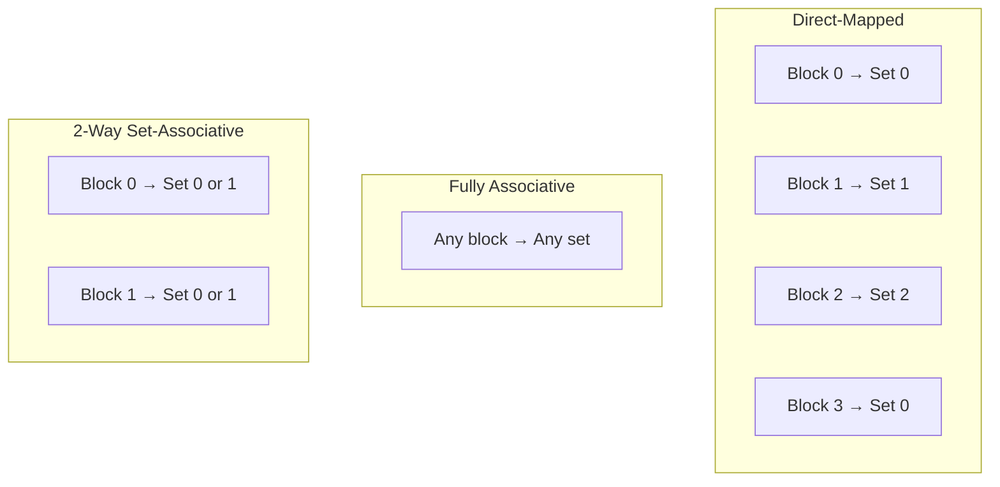
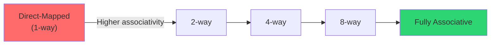
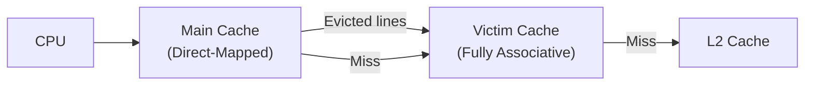

# Cache Mapping

## Overview

**Cache mapping** determines where a block of main memory can be placed in the cache. There are three fundamental strategies: direct-mapped, fully associative, and set-associative. The choice affects hit rate, hardware complexity, and access time.

## The Three Mapping Strategies



## Direct-Mapped Cache

Each memory block maps to **exactly one** cache set.

```
Cache Set = (Block Address) mod (Number of Sets)
```

- **Pros**: Simple hardware, fast lookup (one comparison)
- **Cons**: High conflict misses (thrashing when two blocks compete for the same set)
- **Example**: L1 cache in early processors

### Address Format
```
| Tag | Index (log₂ sets) | Offset (log₂ line size) |
```

## Fully Associative Cache

A memory block can go in **any** set. The entire cache is one big set.

- **Pros**: Zero conflict misses (best hit rate)
- **Cons**: Requires comparing tags with ALL entries simultaneously (expensive hardware, CAM)
- **Use case**: TLBs, small special-purpose caches

### Address Format
```
| Tag (address - offset bits) | Offset |
```

## Set-Associative Cache

A compromise: the cache is divided into **sets**, each containing **n lines** (n-way). A block maps to one set but can occupy any line within that set.

```
Set = (Block Address) mod (Number of Sets)
```

- **Pros**: Fewer conflict misses than direct-mapped; practical hardware
- **Cons**: More complex than direct-mapped; needs n comparators per set
- **Most common**: 4-way, 8-way, 16-way in modern CPUs

### Address Format
```
| Tag | Index (log₂ sets) | Offset (log₂ line size) |
```

## Comparison Table

| Property | Direct-Mapped | Set-Associative | Fully Associative |
|----------|--------------|-----------------|-------------------|
| Lines per set | 1 | n | All (one set) |
| Comparisons | 1 | n | All lines |
| Conflict misses | High | Moderate | Zero |
| Hardware cost | Low | Moderate | High (CAM) |
| Access time | Fast | Moderate | Slow |
| Typical use | L1 (some) | L2, L3, most L1 | TLB |

## Associativity and Hit Rate



Diminishing returns: going from 1-way to 2-way gives ~20-30% miss reduction; 4-way to 8-way gives ~5-10%; beyond 8-way improvements are marginal.

## Example: Address Mapping

**Cache**: 8 sets, 2-way, 16-byte lines, 16-bit address

```
Offset: 4 bits (log₂16)
Index:  3 bits (log₂8)
Tag:    9 bits (16 - 3 - 4)
```

Address `0x1A3C` = `0001 1010 0011 1100`:
- Offset = `1100` = byte 12
- Index = `011` = Set 3
- Tag = `0001 1010 0` = `0x34`

The CPU checks set 3, compares tag `0x34` with both lines in the set.

## Specialized Mapping: Victim Cache

A small fully-associative cache that holds lines **evicted** from the main cache. On a miss, the victim cache is checked before going to the next level.



Reduces conflict misses in direct-mapped caches with minimal hardware.

## Interview Questions

1. **Q**: Why would you choose direct-mapped over set-associative?
   **A**: Direct-mapped is faster (one comparator, simpler mux), uses less power, and is easier to design. For L1 caches where hit time is critical, the slight increase in conflict misses is acceptable.

2. **Q**: A 64 KB cache is 4-way set-associative with 64-byte lines. How many sets?
   **A**: Total lines = 64 KB / 64 B = 1024. Sets = 1024 / 4 = 256 sets.

3. **Q**: What is "cache thrashing" and how does associativity help?
   **A**: Thrashing occurs when frequently accessed blocks map to the same set, causing repeated evictions. Higher associativity reduces this by allowing blocks to coexist in the same set.

4. **Q**: Why are TLBs typically fully associative?
   **A**: TLBs are small (64-512 entries) so the hardware cost of full associativity is manageable. The high hit rate requirement (every memory access goes through TLB) justifies the expense.

## Common Mistakes

- ❌ Confusing "n-way" with "n sets"
- ❌ Thinking fully associative means "faster" (it's slower due to more comparisons)
- ❌ Forgetting that associativity = number of comparators per access
- ❌ Not calculating set count correctly: sets = cache_size / (line_size × associativity)

## Summary

Direct-mapped (1-way) is simple but conflict-prone. Fully associative eliminates conflicts but is expensive. Set-associative (n-way) is the practical middle ground used in most modern caches. Higher associativity reduces conflict misses with diminishing returns.

## Cross-References

- [Direct-Mapped](direct-mapped.md) — Detailed direct-mapped mechanics
- [Set-Associative](set-associative.md) — Detailed set-associative mechanics
- [Fully Associative](fully-associative.md) — Detailed fully-associative mechanics
- [Replacement Policies](replacement.md) — Which line to evict
- [Cache Basics](cache-basics.md) — Fundamental cache concepts
