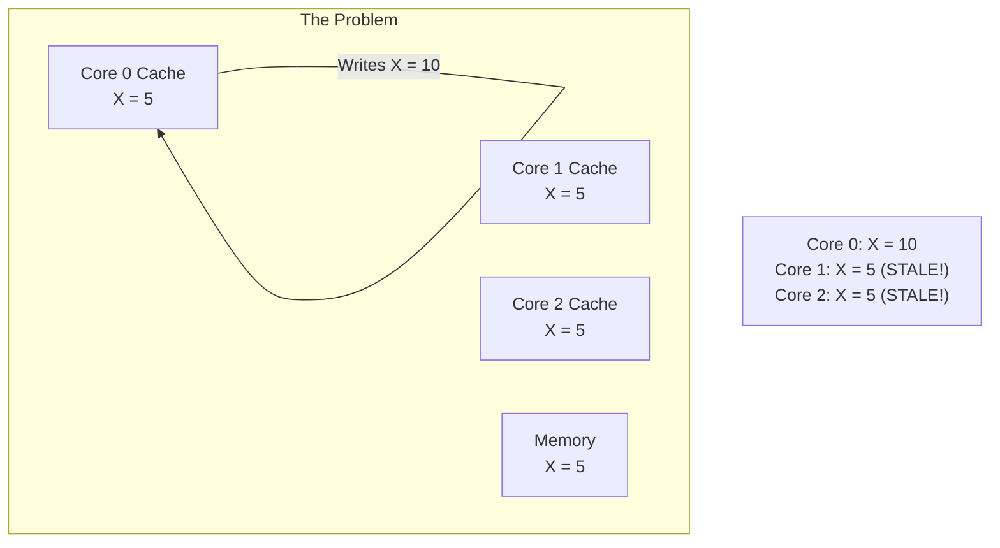
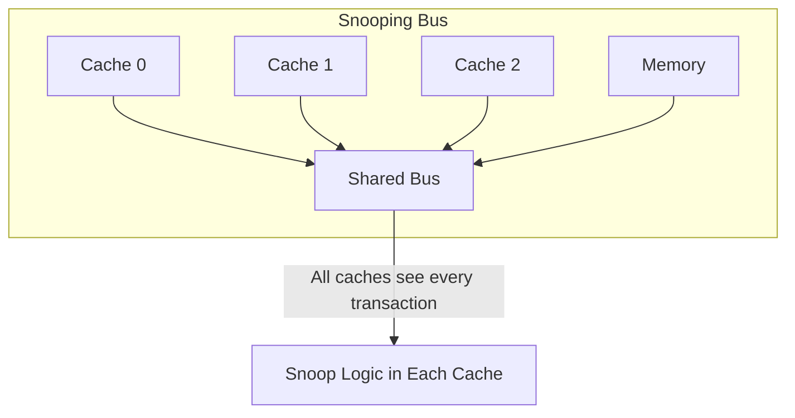
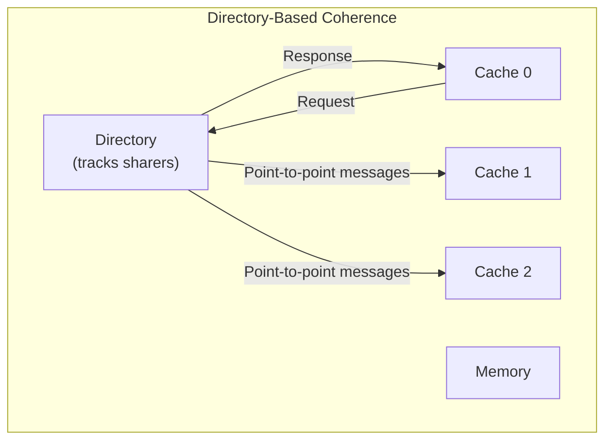
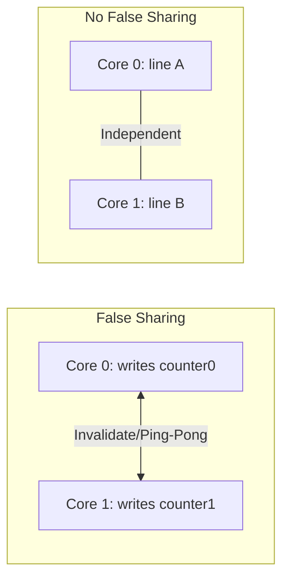

# Cache Coherence

## Overview

In a multi-core processor, each core has its own private cache. When multiple cores access the same memory address, their caches may hold **inconsistent copies**. **Cache coherence** ensures that all cores observe a consistent view of memory, even though each has its own cache.

This is one of the most important topics in computer architecture for placement interviews.

## The Coherence Problem



Without coherence, Core 1 and Core 2 would read stale data (X = 5) after Core 0 writes X = 10.

## Coherence Properties

A coherence protocol must guarantee:

1. **Write Propagation**: A write to a variable eventually becomes visible to all cores.
2. **Write Serialization**: All cores see writes to the same location in the **same order**.

These are sometimes called the **coherence contract**.

## Snooping Protocols

All caches monitor (snoop) the shared bus for memory transactions. When a cache sees a relevant transaction, it takes action.



### How Snooping Works

1. Core 0 wants to write to address X
2. Core 0 broadcasts an **invalidate** or **upgrade** request on the bus
3. All other caches snoop the bus:
   - If they have a copy of X, they invalidate or update it
4. Core 0 proceeds with the write

### Bus Transactions

| Transaction | Description |
|-------------|-------------|
| **BusRd** | Read request (cache miss, want shared copy) |
| **BusRdX** | Read-exclusive (want to write, invalidate others) |
| **BusUpgr** | Upgrade (already have shared, want exclusive for write) |
| **Flush** | Write back dirty data to bus (other caches can snoop it) |

### Pros and Cons of Snooping

| Pros | Cons |
|------|------|
| Low latency (broadcast is fast) | Doesn't scale beyond ~8 cores |
| Simple for small systems | Bus bandwidth is the bottleneck |
| No directory overhead | All caches see all transactions |

**Used in**: Intel Core (up to 8 cores), AMD Zen (within a CCX).

## Directory-Based Protocols

For larger systems, a **directory** tracks which caches have copies of each block.



### Directory Entry

```
For each memory block:
┌────────────┬──────────────────┬──────────────┐
│   State    │    Sharer Bits   │   Owner      │
│  (2-3 bits)│  (1 bit per core)│  (core ID)   │
└────────────┴──────────────────┴──────────────┘
```

### How Directory Works

1. Core 0 wants to read X
2. Core 0 sends request to the directory
3. Directory checks state:
   - **Uncached**: Fetch from memory, record Core 0 as sharer
   - **Shared**: Record Core 0 as sharer, send data from current sharer or memory
   - **Exclusive**: Send intervention to owner, get data, update state to shared
4. Core 0 receives data

### Pros and Cons of Directory

| Pros | Cons |
|------|------|
| Scales to many cores | Higher latency (point-to-point) |
| No bus bandwidth bottleneck | Directory storage overhead |
| Only relevant caches notified | Complex protocol |

**Used in**: AMD EPYC (across CCDs), Intel Xeon (across sockets), NUMA systems.

## Coherence States

Each cache line has a state indicating its status:

### Basic States (MSI)

| State | Meaning |
|-------|---------|
| **Modified (M)** | Dirty, exclusive, must writeback |
| **Shared (S)** | Clean, may exist in other caches |
| **Invalid (I)** | Not valid (evicted or invalidated) |

### Extended States

- **MESI**: Adds **Exclusive** (clean, only copy) — see [MESI](mesi.md)
- **MOESI**: Adds **Owned** (dirty, shared) — see [MOESI](moesi.md)

## Coherence Granularity

Coherence operates at the **cache line** level, not individual bytes.

**Implication**: Two independent variables on the same cache line can cause **false sharing**.

```c
// FALSE SHARING: Core 0 and Core 1 write to different variables
// but they're on the same cache line → ping-pong invalidations
struct {
    int core0_counter;  // Core 0 writes this
    int core1_counter;  // Core 1 writes this
} shared;  // Both on same 64-byte cache line!

// FIX: Pad to separate cache lines
struct {
    int core0_counter;
    char pad0[60];
    int core1_counter;
    char pad1[60];
} shared;
```

## False Sharing Performance Impact



False sharing can cause **10-100×** performance degradation in multi-threaded programs.

## Snooping vs Directory

| Property | Snooping | Directory |
|----------|----------|-----------|
| Scalability | Limited (~8 cores) | High (hundreds of cores) |
| Latency | Low (broadcast) | Higher (point-to-point) |
| Bandwidth | Bus is bottleneck | No broadcast bottleneck |
| Storage | No extra state | Directory memory overhead |
| Complexity | Simpler | More complex |
| Best for | Small multicore | Large multicore, NUMA |

## Interview Questions

1. **Q**: What is cache coherence and why is it needed?
   **A**: Cache coherence ensures all cores see a consistent view of memory. Without it, one core's write might not be visible to others, leading to stale reads. It's needed because each core has a private cache that can hold different values for the same address.

2. **Q**: What is false sharing and how do you fix it?
   **A**: False sharing occurs when different cores write to different variables that happen to be on the same cache line. The coherence protocol treats the entire line as a unit, causing unnecessary invalidations. Fix by padding variables to separate cache lines or using `alignas(64)`.

3. **Q**: Why do snooping protocols not scale well?
   **A**: Every cache transaction is broadcast to all caches via the shared bus. As cores increase, bus traffic grows linearly, quickly saturating the bus bandwidth. Directory protocols send messages only to relevant caches.

4. **Q**: What is the difference between coherence and consistency?
   **A**: Coherence deals with a **single memory location** across caches. Consistency deals with the **ordering of operations** across multiple locations. Coherence is a prerequisite for consistency.

5. **Q**: Why is coherence at cache-line granularity problematic?
   **A**: Independent variables sharing a cache line cause false sharing. When one core writes its variable, the entire line is invalidated in other cores, even though they were accessing different variables.

## Common Mistakes

- ❌ Confusing coherence with consistency (coherence = same address; consistency = ordering across addresses)
- ❌ Forgetting that coherence operates at cache-line granularity
- ❌ Not recognizing false sharing in code
- ❌ Assuming coherence protocols are simple (they're extremely complex)

## Summary

Cache coherence ensures all cores see consistent data in their private caches. Snooping protocols work for small systems by broadcasting on a shared bus. Directory protocols scale to large systems by tracking sharers. False sharing is a common performance pitfall caused by coherence operating at cache-line granularity.

## Cross-References

- [MESI Protocol](mesi.md) — Most common snooping protocol
- [MOESI Protocol](moesi.md) — AMD's preferred protocol
- [Write Policies](write-policies.md) — Write-back interacts with coherence
- [Concurrency](../../concurrency/overview.md) — Software-level synchronization
