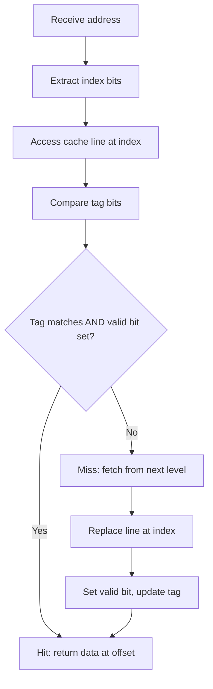
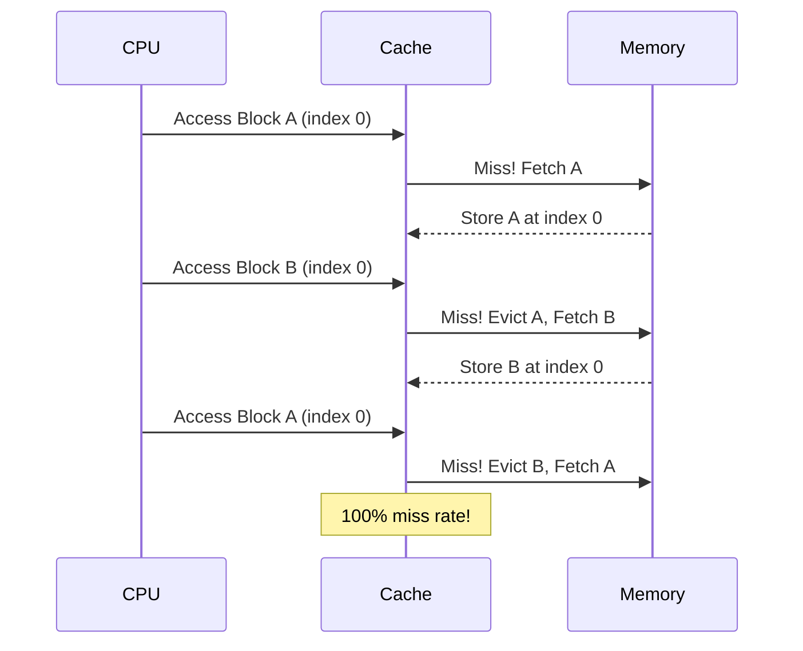

# Direct-Mapped Cache

## Overview

A **direct-mapped cache** is the simplest cache organization where each memory block maps to exactly one cache line. The mapping is determined by modular arithmetic: `Cache Line = Block Address mod Number of Lines`. This simplicity enables fast lookups but can lead to high conflict miss rates.

## How It Works

### Address Decomposition

```
┌──────────┬──────────────┬──────────────┐
│   Tag     │    Index     │   Offset     │
└──────────┴──────────────┴──────────────┘
  t bits       s bits         b bits
```

- **Offset**: `b = log₂(line_size)` — selects byte within line
- **Index**: `s = log₂(num_lines)` — selects which cache line
- **Tag**: remaining bits — identifies which memory block

### Lookup Process



### Example Walkthrough

**Cache**: 8 lines, 16-byte lines, 16-bit address

```
b = log₂(16) = 4
s = log₂(8)  = 3
t = 16 - 3 - 4 = 9
```

| Address | Binary | Tag (9b) | Index (3b) | Offset (4b) |
|---------|--------|----------|------------|-------------|
| 0x0040 | 0000000001000000 | 000000001 | 000 | 0000 |
| 0x0050 | 0000000001010000 | 000000001 | 010 | 0000 |
| 0x0140 | 0000000101000000 | 000000010 | 100 | 0000 |
| 0x0840 | 0000100001000000 | 000001000 | 100 | 0000 |

Addresses `0x0140` and `0x0840` both map to index `100` (line 4) — they will conflict!

## Conflict Misses

The primary weakness of direct-mapped caches. Two blocks mapping to the same line cannot coexist.

### Classic Example: Matrix Access

```c
// Accessing two arrays that map to the same cache lines
int A[256], B[256];  // Both start at addresses that alias
for (int i = 0; i < 256; i++) {
    A[i] += B[i];  // A and B may thrash if they map to same lines
}
```

### Ping-Pong Effect

When two frequently accessed blocks map to the same line, they evict each other alternately:



## Hardware Implementation

```
                    ┌─────────────────┐
Index ─────────────►│  Cache Line     │
                    │  Array          │
                    │  (SRAM)         │
                    └────────┬────────┘
                             │ Tag + Data + Valid + Dirty
                             ▼
                    ┌─────────────────┐
Tag ───────────────►│  Comparator     │
                    └────────┬────────┘
                             │ Match & Valid
                             ▼
                    ┌─────────────────┐
                    │  Mux (select    │
Offset ────────────►│  byte from line)│──────────► Data Out
                    └─────────────────┘
```

Only **one comparator** needed — this is the key hardware advantage.

## Pros and Cons

| Pros | Cons |
|------|------|
| Simplest hardware | High conflict misses |
| Single comparator | Thrashing with aliased addresses |
| Fastest access time | No flexibility in placement |
| Lowest power consumption | Lower hit rate than set-associative |
| Easy to pipeline | Sensitive to access patterns |

## When Direct-Mapped Wins

1. **Small caches**: When the cache is small and associativity overhead matters
2. **Power-constrained designs**: Less hardware = less power
3. **Tight access time requirements**: One comparator, critical path is short
4. **Predictable latency**: No arbitration for line selection

## Optimization: Cache-Aware Data Layout

To avoid conflicts, align data structures to avoid aliasing:

```c
// BAD: A and B may alias
struct { int A[256]; int B[256]; } data;

// GOOD: Pad to avoid aliasing
struct { int A[256]; char pad[64]; int B[256]; } data;
```

## Interview Questions

1. **Q**: For a 32 KB direct-mapped cache with 64-byte lines and 32-bit addresses, what are the tag/index/offset sizes?
   **A**: Offset = log₂(64) = 6 bits. Lines = 32 KB / 64 B = 512. Index = log₂(512) = 9 bits. Tag = 32 - 9 - 6 = 17 bits.

2. **Q**: Why might a direct-mapped L1 cache still be preferred over set-associative?
   **A**: Access time is critical for L1. One comparator means the critical path (address → data out) is shortest. The ~10-20% higher miss rate is offset by the faster hit time and simpler pipeline design.

3. **Q**: Two arrays of 1024 ints each, starting at 0x0000 and 0x4000, accessed alternately. Cache is 4 KB direct-mapped with 16-byte lines. What happens?
   **A**: Each array element is 4 bytes, so 4 elements per line. 0x0000 and 0x4000 are 16 KB apart. Cache has 256 lines. 0x4000 / 16 = 0x400 = 1024 lines apart, mod 256 = 0. They map to the same lines → 100% conflict misses.

## Common Mistakes

- ❌ Confusing "direct-mapped" with "one-way set-associative" (they're the same thing)
- ❌ Forgetting that conflict misses are specific to direct-mapped (capacity misses happen regardless)
- ❌ Not considering address alignment when analyzing conflicts
- ❌ Assuming direct-mapped is always worse (it has the best hit time)

## Summary

Direct-mapped caches are the simplest and fastest to access but suffer from conflict misses. Each block has exactly one place to go. The hardware requires only one comparator per access. It's ideal for L1 caches where speed is paramount, and conflict misses can be mitigated through careful data layout or by using set-associative caches.

## Cross-References

- [Cache Mapping](cache-mapping.md) — Overview of all mapping strategies
- [Set-Associative](set-associative.md) — Next level of complexity
- [Fully Associative](fully-associative.md) — Maximum flexibility
- [Replacement Policies](replacement.md) — N/A for direct-mapped (no choice)
- [Cache Basics](cache-basics.md) — Fundamental concepts

## Cross References

- [Set Associative](set-associative.md)
- [Fully Associative](fully-associative.md)
- [Cache Mapping](cache-mapping.md)
