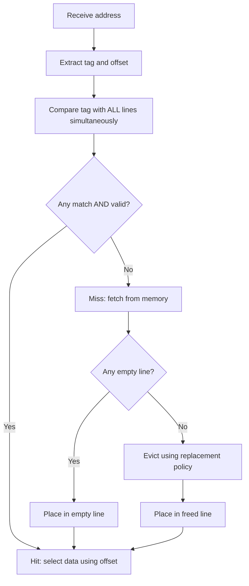
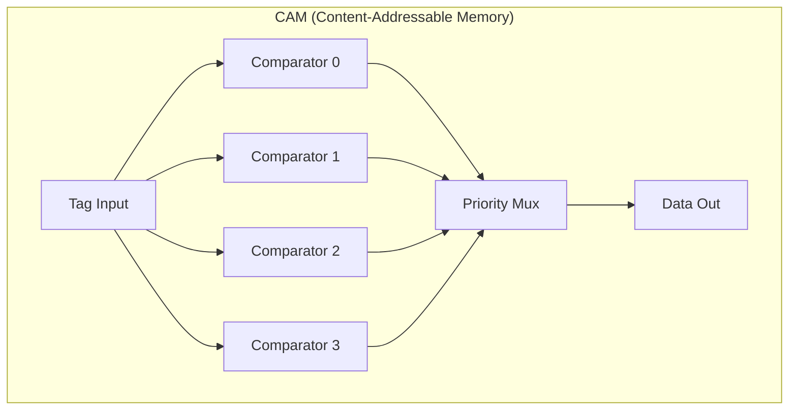

# Fully Associative Cache

## Overview

A **fully associative cache** allows any memory block to be placed in any cache line. There is no index field — the entire address (minus offset) is the tag. Every line must be compared simultaneously to determine a hit. This eliminates conflict misses entirely but requires expensive hardware.

## How It Works

### Address Decomposition

```
┌──────────────────────────────┬──────────────┐
│           Tag                │   Offset     │
└──────────────────────────────┴──────────────┘
  (address bits - offset bits)     b bits
```

No index bits needed — the block can go anywhere.

### Lookup Process



### Hardware: Content-Addressable Memory (CAM)



**CAM** is hardware that searches all entries in parallel. Every bit of the input tag is compared with every stored tag simultaneously.

**Cost**: Each cache line needs its own comparator. For n lines, that's n comparators operating in parallel. This is expensive in terms of:
- **Die area**: Comparators and wiring take significant space
- **Power**: All comparators fire on every access
- **Access time**: The OR tree to combine match signals grows with n

## Comparison: Associativity Levels

| Property | Direct-Mapped | Set-Associative | Fully Associative |
|----------|--------------|-----------------|-------------------|
| Lines compared | 1 | n (per set) | All lines |
| Conflict misses | High | Moderate | **Zero** |
| Hardware | 1 comparator | n comparators | N comparators (all lines) |
| Power | Lowest | Moderate | Highest |
| Access time | Fastest | Moderate | Slowest |
| Practical size | Large | Large | Small (64-512 lines) |

## Where Fully Associative Caches Are Used

### 1. TLBs (Translation Lookaside Buffers)
- Small (64-512 entries)
- Every memory access needs TLB lookup → must maximize hit rate
- Full associativity eliminates conflict misses
- Example: Intel Skylake L1 DTLB = 64 entries, fully associative

### 2. Victim Caches
- Small cache holding recently evicted lines
- Checked on miss before going to next level
- Typically 4-16 entries
- Fully associative because small size makes CAM affordable

### 3. L1 Instruction Caches (some designs)
- Very small, latency-critical
- Some ARM designs use fully associative L1 I-cache

## Fully Associative vs Set-Associative Analysis

### When Fully Associative Wins

For a cache with N total lines:
- **Set-associative (k-way)**: N/k sets, k lines per set
- **Fully associative**: 1 set, N lines

Fully associative gives the best possible hit rate because:
1. No conflict misses (capacity misses still possible)
2. Replacement policy has maximum freedom
3. Any recently used line can be retained

### When It's Not Worth It

For large caches (thousands of lines), the CAM hardware cost is prohibitive:
- 1024 comparators
- 1024-wide OR gate
- Power consumption ~1024× direct-mapped
- Diminishing returns: miss rate improvement over 8-way is tiny

## Replacement Policy Importance

In fully associative caches, replacement policy is critical because **every line is a candidate for eviction**. There's no "easy choice" like in direct-mapped.

| Policy | Description | Quality |
|--------|-------------|---------|
| **LRU** | Evict least recently used | Optimal for temporal locality |
| **Random** | Evict random line | Surprisingly good (~1.2× LRU miss rate) |
| **FIFO** | Evict oldest line | Worse than LRU (doesn't consider reuse) |
| **LFU** | Evict least frequently used | Good for stable access patterns |

For small fully associative caches (TLB, victim cache), exact LRU is practical because the number of entries is small.

## Interview Questions

1. **Q**: Why are TLBs fully associative but L2 caches are not?
   **A**: TLBs are small (64-512 entries), so the CAM cost is acceptable. Every memory access hits the TLB, so maximizing hit rate is critical. L2 caches have thousands of lines — CAM cost would be prohibitive, and the miss rate improvement over 8-way is marginal.

2. **Q**: What is the main disadvantage of fully associative caches?
   **A**: Hardware complexity. Every line needs a comparator, and they all operate in parallel. This increases die area, power consumption, and potentially access time. For large caches, this is impractical.

3. **Q**: How does a fully associative cache determine a hit?
   **A**: The tag portion of the address is compared with the tag of every line in the cache simultaneously (using CAM). If any line's tag matches and its valid bit is set, it's a hit. A priority encoder selects the matching line's data.

4. **Q**: Can a fully associative cache have conflict misses?
   **A**: No. Since any block can go anywhere, there are no conflicts between blocks. Only capacity misses (cache too small for working set) and compulsory misses (first access) can occur.

5. **Q**: A fully associative cache has 256 entries with 64-byte lines and 32-bit addresses. How many comparators are needed?
   **A**: 256 comparators, each comparing 26 bits (32 - 6 offset bits). This is why fully associative caches are only practical for small sizes.

## Common Mistakes

- ❌ Thinking fully associative is "better" in all cases (it's not — hardware cost is too high for large caches)
- ❌ Confusing "fully associative" with "infinite cache" (capacity misses still happen)
- ❌ Forgetting that replacement policy matters most in fully associative caches
- ❌ Not knowing that TLBs are the primary use case

## Summary

Fully associative caches eliminate conflict misses by allowing any block to go anywhere. The hardware cost (CAM) limits their use to small caches like TLBs and victim caches. For larger caches, set-associative offers a better tradeoff. The replacement policy is critical in fully associative caches since every line is an eviction candidate.

## Cross-References

- [Cache Mapping](cache-mapping.md) — Overview of all strategies
- [Direct-Mapped](direct-mapped.md) — Simplest mapping
- [Set-Associative](set-associative.md) — Practical middle ground
- [Replacement Policies](replacement.md) — Critical for fully associative
- [Cache Basics](cache-basics.md) — Fundamental concepts

## Cross References

- [Direct Mapped](direct-mapped.md)
- [Set Associative](set-associative.md)
- [Replacement Policies](replacement.md)
