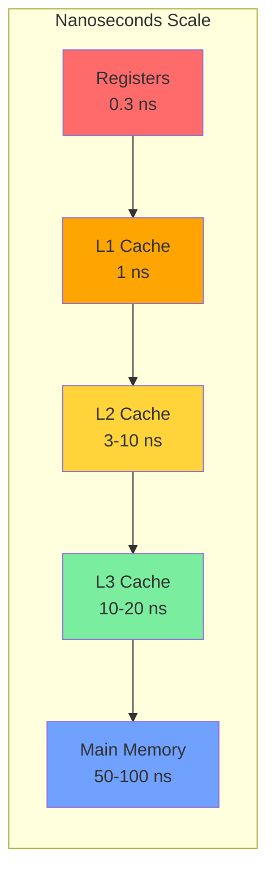

# Memory Levels

## Overview

Modern processors have multiple levels of cache (L1, L2, L3, sometimes L4) between the CPU registers and main memory. Each level trades speed for capacity. Understanding the characteristics of each level is essential for performance optimization and interview questions.

## Detailed Breakdown

### Registers
- **Technology**: Flip-flops (custom SRAM)
- **Size**: 32–256 registers × 64 bits = ~256 bytes to 2 KB
- **Latency**: 0.3 ns (1 CPU cycle at 3 GHz)
- **Managed by**: Compiler (register allocation)
- **Key point**: Fastest storage; operands must be in registers before ALU operations

### L1 Cache
- **Technology**: SRAM
- **Size**: 32–64 KB per core (split: 32 KB instruction + 32 KB data typical)
- **Latency**: 1–4 cycles (~1 ns)
- **Associativity**: 4-way or 8-way set-associative
- **Line size**: 64 bytes (typical)
- **Key point**: Closest to CPU; split into I-cache and D-cache to allow simultaneous fetch

### L2 Cache
- **Technology**: SRAM
- **Size**: 256 KB–1 MB per core
- **Latency**: 3–14 cycles (~3–10 ns)
- **Associativity**: 8-way set-associative (typical)
- **Key point**: Unified (stores both instructions and data); private per core in modern CPUs

### L3 Cache (Last-Level Cache, LLC)
- **Technology**: SRAM
- **Size**: 4–64 MB shared across all cores
- **Latency**: 20–50 cycles (~10–20 ns)
- **Associativity**: 12–16-way set-associative
- **Key point**: Shared among all cores; critical for multi-threaded workloads; inclusive or non-inclusive

### L4 Cache (Rare)
- **Technology**: eDRAM (embedded DRAM)
- **Size**: 64–128 MB
- **Example**: Intel Iris Pro (Crystal Well), some IBM POWER chips
- **Key point**: Used as victim cache or for GPU integration

### Main Memory (DRAM)
- **Technology**: DRAM (DDR4/DDR5)
- **Size**: 4–128 GB (typical)
- **Latency**: 50–100 ns (~200+ cycles)
- **Key point**: Volatile; managed by OS via virtual memory

## Latency Comparison



## Inclusive vs Exclusive vs Non-Inclusive Caches

| Policy | Description | Pros | Cons |
|--------|-------------|------|------|
| **Inclusive** | L2 contains all of L1's data | Simple coherence; eviction from L2 also removes from L1 | Wastes capacity |
| **Exclusive** | L2 contains only data NOT in L1 | Maximizes effective capacity | Complex coherence |
| **Non-inclusive** | L2 may or may not contain L1's data | Balance of simplicity and capacity | Coherence more complex than inclusive |

Modern Intel CPUs use **non-inclusive** L3 caches. AMD Zen uses **exclusive** L1/L2 with a victim L3.

## Cache Line (Block)

The unit of data transfer between cache levels is the **cache line** (or block), typically **64 bytes**.

When a single byte is needed:
1. The entire 64-byte line is fetched
2. Subsequent accesses to nearby bytes are hits (spatial locality)

```
Memory Address: 0x00001004
Cache Line: 0x00001000 - 0x0000103F  (64 bytes)
```

## Interview Questions

1. **Q**: Why is L1 cache split into instruction and data caches?
   **A**: The CPU needs to fetch instructions and read/write data simultaneously. A split cache (Harvard architecture at L1) avoids structural hazards and doubles the bandwidth. L2 and L3 are unified because concurrent access is less critical at those levels.

2. **Q**: What happens when you access memory that's not in any cache?
   **A**: A cache miss propagates through all levels. The line is fetched from DRAM into L3, then promoted to L2, then L1. This is called a "compulsory miss" or "cold miss" and takes ~100 ns.

3. **Q**: Why are caches SRAM and not DRAM?
   **A**: SRAM is faster (no refresh needed, 6 transistors per bit vs 1 transistor + capacitor for DRAM) but much larger and more expensive. DRAM's density makes it suitable for large main memory.

4. **Q**: How does cache line size affect performance?
   **A**: Larger lines exploit spatial locality better but waste bandwidth on poor locality. 64 bytes is the sweet spot for most workloads. Some workloads (sparse matrix) suffer from large lines.

## Common Mistakes

- ❌ Assuming L1/L2/L3 have the same associativity
- ❌ Forgetting that L1 is split (I-cache and D-cache)
- ❌ Not knowing typical cache line size (64 bytes)
- ❌ Confusing inclusive and exclusive cache policies

## Summary

Memory levels form a pyramid: fast and small at the top, slow and large at the bottom. L1 is split I/D, L2 is unified and private, L3 is shared. The cache line (64 bytes) is the unit of transfer. Inclusive/exclusive policies affect effective capacity and coherence complexity.

## Cross-References

- [Cache Basics](cache-basics.md) — How caches work mechanically
- [SRAM](../memory-tech/sram.md) — SRAM technology details
- [DRAM](../memory-tech/dram.md) — Main memory technology
- [Performance](../performance/README.md) — How cache affects performance
