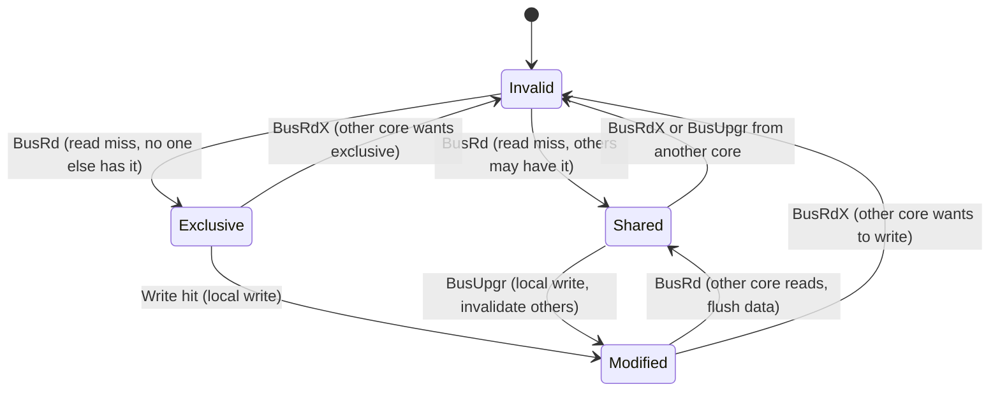
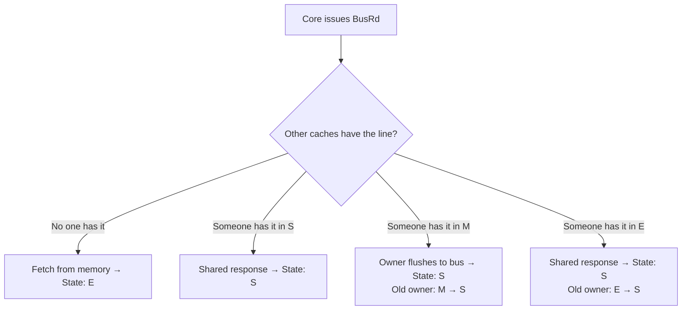
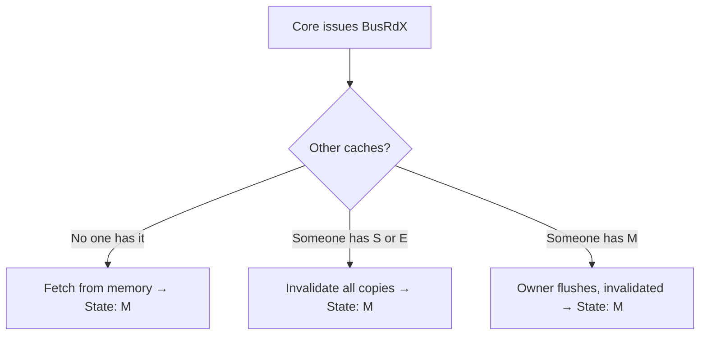
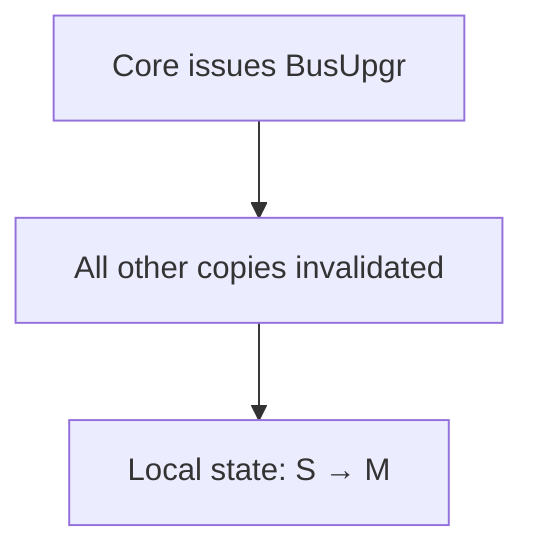

# MESI Protocol

## Overview

The **MESI protocol** is the most widely used cache coherence protocol in modern multi-core processors. Named after its four states — **Modified**, **Exclusive**, **Shared**, **Invalid** — it is a snooping protocol that ensures all private caches maintain a consistent view of memory.

Intel processors use a variant of MESI (MESIF), and AMD uses MOESI, but MESI is the foundation.

## The Four States



| State | Valid? | Dirty? | Exclusive Copy? | Description |
|-------|--------|--------|-----------------|-------------|
| **Modified (M)** | ✅ | ✅ | ✅ | Line has been written. Only copy in system. Must writeback on eviction. |
| **Exclusive (E)** | ✅ | ❌ | ✅ | Clean, only copy. Can transition to M without bus transaction. |
| **Shared (S)** | ✅ | ❌ | ❌ | Clean, may exist in other caches. |
| **Invalid (I)** | ❌ | — | — | Not valid. Equivalent to "not present." |

## State Transitions

### Read Miss (BusRd)

When a core has a read miss and issues BusRd:



### Write Miss (BusRdX)

When a core wants to write but doesn't have the line:



### Write Hit to Shared (BusUpgr)

When a core already has the line in S and wants to write:



No data transfer needed — just an invalidation signal.

### Eviction

When a line must be evicted:

| Current State | Action |
|---------------|--------|
| **M** | Writeback to memory (or next level) |
| **E** | Simply discard (clean) |
| **S** | Simply discard (clean) |
| **I** | Nothing to do |

## Complete State Transition Table

| Current State | Event | Bus Action | New State | Response |
|---------------|-------|------------|-----------|----------|
| **I** | Read miss, no sharers | BusRd | **E** | Fetch from memory |
| **I** | Read miss, sharers exist | BusRd | **S** | Shared response |
| **I** | Write miss | BusRdX | **M** | Fetch + invalidate |
| **E** | Local write | (none) | **M** | Silent transition |
| **E** | Snoop: BusRd | (none) | **S** | Supply data |
| **E** | Snoop: BusRdX | (none) | **I** | Supply data |
| **S** | Local write | BusUpgr | **M** | Invalidate others |
| **S** | Snoop: BusRdX/BusUpgr | (none) | **I** | Invalidate |
| **S** | Snoop: BusRd | (none) | **S** | May supply data |
| **M** | Snoop: BusRd | Flush | **S** | Supply data to requester |
| **M** | Snoop: BusRdX | Flush | **I** | Supply data, writeback |
| **M** | Eviction | Writeback | **I** | Write dirty data |

## MESI Optimization: E State

The **Exclusive state** is the key optimization of MESI over MSI:

```
Without E state (MSI):
  Read miss → State S (even if no other cache has it)
  Write → Must issue BusUpgr (even though no one else has the line)

With E state (MESI):
  Read miss → State E (no bus transaction for subsequent write)
  Write → Silent E→M transition (no bus traffic!)
```

This eliminates bus transactions for the common pattern: read → modify → write to private data.

## Example: Multi-Core Access Pattern

```
Initial: All caches empty, memory X = 0

Core 0 reads X:
  BusRd → No one has X → Fetch from memory → State E

Core 0 writes X = 5:
  E → M (silent, no bus transaction)

Core 1 reads X:
  BusRd → Core 0 has M → Core 0 flushes X=5 to bus
  Core 0: M → S, Core 1 gets data → S

Core 1 writes X = 10:
  BusUpgr → Core 0 invalidated (S → I)
  Core 1: S → M

Core 0 reads X:
  BusRd → Core 1 has M → Core 1 flushes X=10
  Core 1: M → S, Core 0 → S
```

## MESIF (Intel Variant)

Intel adds a **Forward (F)** state to MESI:

| State | Description |
|-------|-------------|
| **F (Forward)** | One sharer designated to respond to read requests |

**Benefit**: In a shared L3 cache, the F state ensures only one cache responds to read requests, reducing redundant data transfers. The most recent reader becomes the forwarder.

## Interview Questions

1. **Q**: What are the four states of MESI?
   **A**: Modified (dirty, exclusive), Exclusive (clean, only copy), Shared (clean, may have copies), Invalid (not valid).

2. **Q**: Why is the Exclusive state important?
   **A**: It allows silent upgrades to Modified without bus transactions. When a core reads a line no one else has, it gets E state. A subsequent write is a local E→M transition with no bus traffic. This saves bandwidth for private data.

3. **Q**: What happens when Core 0 writes to a line in Shared state?
   **A**: Core 0 issues a BusUpgr (upgrade) signal. All other caches invalidate their copies. Core 0 transitions S→M.

4. **Q**: How does MESI handle a dirty eviction?
   **A**: A Modified line must be written back to memory (or the next cache level) when evicted, because it's the only valid copy and has been modified.

5. **Q**: What is the difference between BusRd and BusRdX?
   **A**: BusRd is a read request (wants a shared copy). BusRdX is a read-exclusive request (wants to write, so all other copies must be invalidated). BusRdX is used on write misses.

## Common Mistakes

- ❌ Confusing E and M states (E is clean-only-copy, M is dirty-only-copy)
- ❌ Forgetting that E→M is a silent transition (no bus traffic)
- ❌ Not knowing that M→S requires a flush (data transfer on snoop)
- ❌ Confusing BusUpgr with BusRdX (BusUpgr doesn't transfer data)

## Summary

MESI is the foundation of cache coherence in multi-core CPUs. The four states track whether a line is dirty/clean, shared/exclusive. The Exclusive state is the key optimization, enabling silent write upgrades. Intel uses MESIF (adds Forward state), AMD uses MOESI (adds Owned state).

## Cross-References

- [Coherence](coherence.md) — Overview of coherence problem
- [MOESI](moesi.md) — AMD's variant
- [Write Policies](write-policies.md) — Write-back is essential for MESI
- [Split Cache](split.md) — I/D cache split

## Cross References

- [MOESI](moesi.md)
- [Coherence](coherence.md)
- [Multicore](../parallelism/multicore.md)
