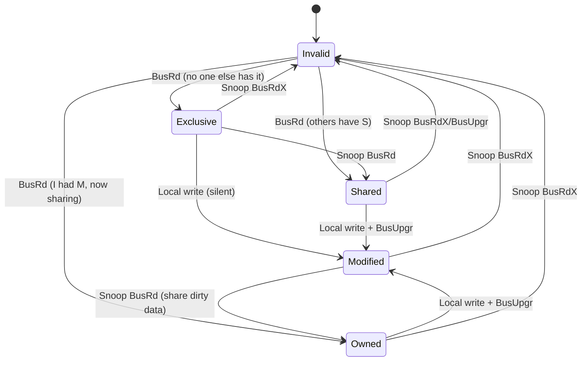
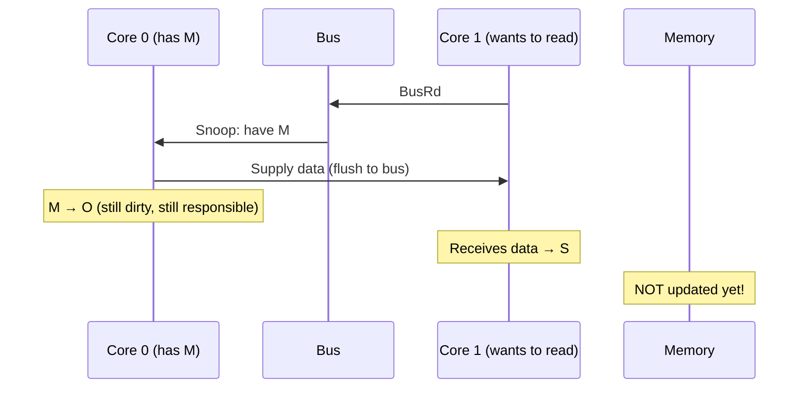
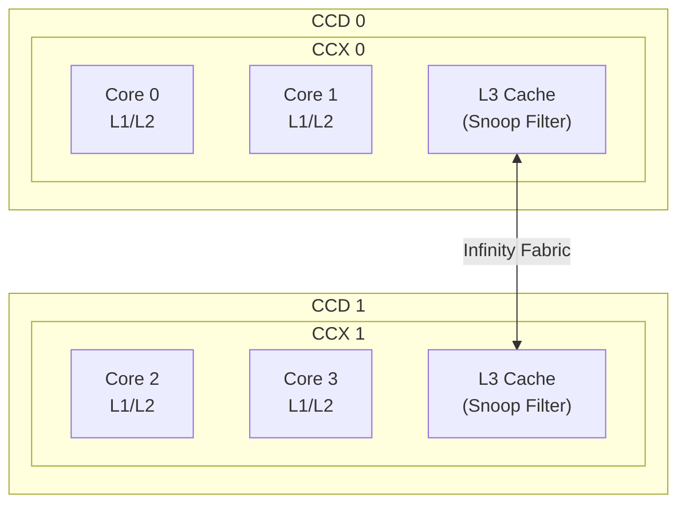

# MOESI Protocol

## Overview

The **MOESI protocol** extends MESI with an **Owned (O)** state. It is used by AMD processors (Zen architecture) and some ARM designs. The Owned state allows dirty data to be shared without writing back to memory first, reducing memory traffic.

## The Five States



| State | Valid? | Dirty? | Exclusive? | Shared? | Description |
|-------|--------|--------|------------|---------|-------------|
| **Modified (M)** | ✅ | ✅ | ✅ | ❌ | Only copy, dirty. Responsible for writeback. |
| **Owned (O)** | ✅ | ✅ | ❌ | ✅ | Dirty, but shared. Must supply data on snoops. |
| **Exclusive (E)** | ✅ | ❌ | ✅ | ❌ | Clean, only copy. Silent upgrade to M. |
| **Shared (S)** | ✅ | ❌ | ❌ | ✅ | Clean, may exist elsewhere. |
| **Invalid (I)** | ❌ | — | — | — | Not valid. |

## Key Difference: Owned State

In MESI, when a core with a Modified line snoops a BusRd from another core:
- M → S: The owner must **writeback to memory** AND supply data to the requester

In MOESI:
- M → O: The owner supplies data to the requester but **doesn't writeback to memory**
- The owner remains responsible for eventual writeback



## MOESI State Transitions

### Read Miss (BusRd)

| Requester State | Snooper State | Action | Requester New | Snooper New |
|-----------------|---------------|--------|---------------|-------------|
| I | I | Fetch from memory | E | I |
| I | S | Fetch from memory (or shared response) | S | S |
| I | E | Shared response | S | E→S |
| I | O | Owner supplies data | S | O |
| I | M | Owner supplies data | S | M→O |

### Write Miss (BusRdX)

| Snooper State | Action |
|---------------|--------|
| I | Nothing |
| S | Invalidate → I |
| E | Invalidate → I |
| O | Invalidate → I (may need writeback) |
| M | Supply data, invalidate → I (writeback to memory) |

### Write Hit (BusUpgr)

| Current State | New State | Bus Action |
|---------------|-----------|------------|
| S | M | BusUpgr (invalidate others) |
| O | M | BusUpgr (invalidate others) |
| E | M | Silent (no bus action) |

## MOESI vs MESI: The Key Advantage

### Scenario: Core 0 writes X, then Core 1 reads X

**MESI**:
1. Core 0 writes X → M state
2. Core 1 reads X → BusRd
3. Core 0: M → S, flushes data to bus, **writes back to memory**
4. Core 1: gets data → S
5. **Memory is updated** (unnecessary writeback)

**MOESI**:
1. Core 0 writes X → M state
2. Core 1 reads X → BusRd
3. Core 0: M → O, flushes data to bus, **does NOT writeback**
4. Core 1: gets data → S
5. **Memory is NOT updated** (saved a write!)

The memory write is deferred until Core 0's line is evicted.

### Performance Impact

For workloads with producer-consumer patterns (one core writes, others read), MOESI can significantly reduce memory traffic:

```
MESI:  1 write to cache + 1 writeback on share + 1 memory update = 2 memory writes
MOESI: 1 write to cache + 0 writeback on share + 1 deferred writeback = 1 memory write
```

## When MOESI Helps Most

1. **Producer-consumer**: One core writes data, others read it
2. **Shared read-heavy data**: Data written once, read by many cores
3. **Streaming writes**: Data produced and consumed without going to memory

## AMD Zen Implementation

AMD Zen processors use MOESI within a CCX (Core Complex):
- L1/L2 caches: Per-core, use MOESI states
- L3 cache: Shared within CCX, acts as a snoop filter
- Between CCDs: Directory-based protocol



## Owned State Responsibilities

When a cache line is in **O** state:
1. It's the **owner** — responsible for supplying data on snoops
2. It's **dirty** — must writeback on eviction
3. It's **shared** — other caches have S copies
4. **S copies are stale** — they have the correct data but the O copy may be newer

Actually, in MOESI, S copies have the same data as O. The O state means "I'm the one who will writeback, and I have the latest data."

## Interview Questions

1. **Q**: What does the O state in MOESI represent?
   **A**: Owned — the line is dirty (modified) but shared with other caches. The owner is responsible for writeback. Other caches have S copies with the same data. The key benefit: dirty data can be shared without writing back to memory.

2. **Q**: How does MOESI reduce memory traffic compared to MESI?
   **A**: When a dirty line is shared, MOESI transitions M→O instead of M→S. The owner doesn't writeback to memory — it just supplies data to the requester. Memory is updated only when the O line is evicted.

3. **Q**: Which processors use MOESI?
   **A**: AMD processors (Zen, Zen 2, Zen 3, Zen 4). Intel uses MESIF (with a Forward state). ARM implementations vary.

4. **Q**: What happens when a line in O state is evicted?
   **A**: The owner must writeback the dirty data to memory (or the next cache level), since it's responsible for the latest copy.

5. **Q**: In MOESI, can multiple caches have the line in O state?
   **A**: No. Only one cache can be the owner. If the owner is invalidated, another cache (or memory) must take over. Typically, the last writer becomes the owner.

## Common Mistakes

- ❌ Confusing O and S states (O is dirty, S is clean)
- ❌ Thinking O state means "original" (it means "owned")
- ❌ Forgetting that O requires eventual writeback
- ❌ Not knowing that only one cache can be in O state for a given line

## Summary

MOESI extends MESI with the Owned state, allowing dirty data to be shared without immediate writeback. This reduces memory traffic for producer-consumer patterns. AMD uses MOESI within CCXes. The owner is responsible for supplying data on snoops and eventual writeback.

## Cross-References

- [MESI Protocol](mesi.md) — The base protocol MOESI extends
- [Coherence](coherence.md) — Coherence overview
- [Write Policies](write-policies.md) — Write-back enables dirty sharing
- [Split Cache](split.md) — I/D cache design

## Cross References

- [MESI](mesi.md)
- [Coherence](coherence.md)
