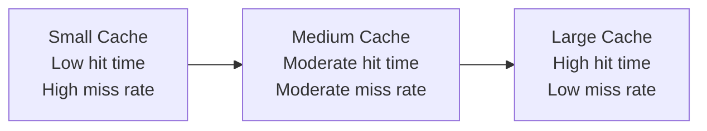
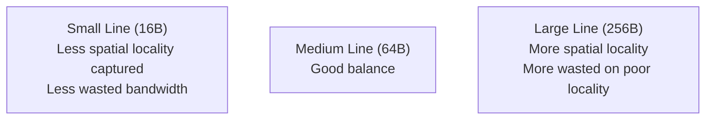
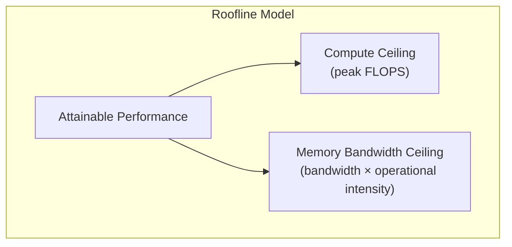

# Cache Performance

## Overview

Cache performance directly determines how fast a program runs. The CPU can execute instructions in 1 cycle, but a cache miss costs 100+ cycles to DRAM. Understanding how to measure, analyze, and optimize cache performance is essential for writing fast code and answering interview questions.

## Key Metrics

### Average Memory Access Time (AMAT)

The fundamental cache performance metric:

```
AMAT = Hit Time + (Miss Rate × Miss Penalty)
```

**Multi-level formula**:
```
AMAT = HT_L1 + MR_L1 × (HT_L2 + MR_L2 × (HT_L3 + MR_L3 × MP_DRAM))
```

**Example**:
| Level | Hit Time | Miss Rate | Miss Penalty |
|-------|----------|-----------|--------------|
| L1 | 1 cycle | 5% | — |
| L2 | 10 cycles | 20% | — |
| L3 | 40 cycles | 10% | — |
| DRAM | — | — | 200 cycles |

```
AMAT = 1 + 0.05 × (10 + 0.20 × (40 + 0.10 × 200))
     = 1 + 0.05 × (10 + 0.20 × 60)
     = 1 + 0.05 × 22
     = 1 + 1.1
     = 2.1 cycles
```

### Cycles Per Instruction (CPI) with Cache Effects

```
Effective CPI = Base CPI + Memory Stall Cycles per Instruction

Memory Stalls = Memory Accesses per Instruction × Miss Rate × Miss Penalty
```

**Example**:
- Base CPI = 1.0
- 1.5 memory accesses per instruction
- 5% L1 miss rate, 10 cycle L2 penalty

```
Effective CPI = 1.0 + 1.5 × 0.05 × 10 = 1.75
```

### Miss Rate

```
Miss Rate = Misses / Total Accesses
Hit Rate = 1 - Miss Rate
```

Typical miss rates:
| Cache | Typical Miss Rate |
|-------|------------------|
| L1 | 2-10% |
| L2 | 10-30% (local) |
| L3 | 10-40% (local) |

**Local miss rate**: Misses at this level / Accesses to this level
**Global miss rate**: Misses at this level / Total CPU accesses

## Factors Affecting Cache Performance

### 1. Cache Size



Larger caches have lower miss rates but longer hit times (more bits to check, longer wires).

### 2. Associativity

```
Miss Rate Reduction (approximate):
1-way → 2-way:  -20-30%
2-way → 4-way:  -10-15%
4-way → 8-way:  -5-8%
8-way → Full:   -2-3%
```

Diminishing returns beyond 4-8 way.

### 3. Cache Line Size



64 bytes is the sweet spot for most workloads.

### 4. Write Policy

| Policy | Effect on Performance |
|--------|----------------------|
| Write-through | Slower writes (every write hits memory bus) |
| Write-back | Faster writes (only dirty evictions cause traffic) |
| Write-allocate | Benefits from write locality |
| No-write-allocate | Avoids cache pollution for streaming writes |

## Cache Miss Analysis (3Cs)

### Compulsory Misses (Cold)
First access to a block. Cannot be avoided (except by prefetching).

```
Example: First iteration of a loop accessing a new array
```

**Mitigation**: Prefetching, larger cache lines.

### Capacity Misses
Cache too small to hold the working set.

```
Example: Working through a 1 MB array with a 256 KB cache
```

**Mitigation**: Larger cache, software blocking/tiling.

### Conflict Misses
Multiple blocks mapping to the same set (direct-mapped or set-associative).

```
Example: Two 32 KB arrays accessed alternately in a 32 KB direct-mapped cache
```

**Mitigation**: Higher associativity, data layout optimization, padding.

### 4th C: Coherence Misses (Multi-core)
Invalidations from other cores cause misses.

```
Example: False sharing between threads on the same cache line
```

**Mitigation**: Avoid false sharing, reduce sharing.

## Cache-Friendly Code Patterns

### 1. Row-Major Access (C/C++)

```c
// GOOD: Sequential access (spatial locality)
for (int i = 0; i < N; i++)
    for (int j = 0; j < N; j++)
        sum += A[i][j];  // A[i][0], A[i][1], ... are contiguous

// BAD: Column access (stride-N, poor locality)
for (int j = 0; j < N; j++)
    for (int i = 0; i < N; i++)
        sum += A[i][j];  // A[0][j], A[1][j], ... are N elements apart
```

### 2. Loop Tiling (Blocking)

```c
// Cache-oblivious: process in blocks that fit in cache
for (int ii = 0; ii < N; ii += BLOCK)
    for (int jj = 0; jj < N; jj += BLOCK)
        for (int i = ii; i < min(ii+BLOCK, N); i++)
            for (int j = jj; j < min(jj+BLOCK, N); j++)
                C[i][j] += A[i][k] * B[k][j];
```

### 3. Data Structure Layout

```c
// BAD: Array of Structures (AoS)
struct Point { float x, y, z, color; };
Point points[1000];
// Processing only x,y,z wastes bandwidth on color

// GOOD: Structure of Arrays (SoA)
struct Points { float x[1000], y[1000], z[1000], color[1000]; };
// Processing x,y,z is sequential
```

### 4. Avoid Pointer Chasing

```c
// BAD: Linked list traversal (pointer chasing, no spatial locality)
struct Node { int data; Node* next; };
for (Node* p = head; p; p = p->next) { ... }

// GOOD: Array traversal (spatial locality)
for (int i = 0; i < n; i++) { data[i]... }
```

## Performance Counters

Modern CPUs provide hardware performance counters to measure cache behavior:

| Counter | Description |
|---------|-------------|
| `L1-dcache-loads` | L1 data cache loads |
| `L1-dcache-load-misses` | L1 data cache load misses |
| `L1-icache-load-misses` | L1 instruction cache misses |
| `LLC-loads` | Last-level cache loads |
| `LLC-load-misses` | Last-level cache load misses |

### Using `perf` (Linux)

```bash
# Measure cache misses for a program
perf stat -e L1-dcache-loads,L1-dcache-load-misses,LLC-loads,LLC-load-misses ./my_program

# Detailed cache miss profiling
perf c2c record ./my_program  # Cache-to-cache (false sharing detection)
perf c2c report
```

## Roofline Model

The **roofline model** visualizes whether a program is compute-bound or memory-bandwidth-bound:



```
Attainable Performance = min(Peak Compute, Bandwidth × Operational Intensity)

Operational Intensity = FLOPs / Bytes Accessed
```

- **Low OI** (< 1 FLOP/byte): Memory-bound → optimize cache usage
- **High OI** (> 10 FLOPs/byte): Compute-bound → optimize computation

## Interview Questions

1. **Q**: A system has L1 hit time 1 cycle, miss rate 4%, L2 hit time 10 cycles, L2 miss rate 25%, memory 100 cycles. Calculate AMAT.
   **A**: AMAT = 1 + 0.04 × (10 + 0.25 × 100) = 1 + 0.04 × 35 = 1 + 1.4 = 2.4 cycles.

2. **Q**: How does loop tiling improve cache performance?
   **A**: Tiling breaks large iterations into blocks that fit in cache. Each block's working set stays in cache, reducing capacity misses. For matrix multiplication, tiling can reduce miss rate from O(N³) to O(N³/√C) where C is cache size.

3. **Q**: What is the difference between local and global miss rate?
   **A**: Local miss rate = misses at level X / accesses to level X. Global miss rate = misses at level X / total CPU accesses. Global miss rate for L2 = L1 miss rate × L2 local miss rate.

4. **Q**: A program has 2 memory accesses per instruction, 5% L1 miss rate, 20 cycle L2 penalty. Base CPI is 1. What is the effective CPI?
   **A**: Memory stall = 2 × 0.05 × 20 = 2 cycles. Effective CPI = 1 + 2 = 3.

5. **Q**: What is the roofline model?
   **A**: A visual model that shows whether a program is compute-bound or memory-bandwidth-bound. Attainable performance = min(Peak FLOPS, Bandwidth × Operational Intensity). It helps identify the optimization target.

## Common Mistakes

- ❌ Confusing local and global miss rates
- ❌ Not accounting for dirty evictions in miss penalty
- ❌ Assuming bigger cache always means better performance (hit time increases)
- ❌ Not knowing how to calculate AMAT with multiple cache levels
- ❌ Ignoring spatial locality when choosing data structures

## Summary

Cache performance is measured by AMAT = Hit Time + Miss Rate × Miss Penalty. The 3Cs (compulsory, capacity, conflict) explain why misses occur. Cache-friendly code exploits spatial and temporal locality through sequential access, loop tiling, and proper data layout. Hardware performance counters provide empirical measurements.

## Cross-References

- [Cache Basics](cache-basics.md) — Hit/miss fundamentals
- [AMAT Formula](cache-basics.md) — Detailed AMAT calculation
- [Amdahl's Law](../performance/amdahl.md) — Overall speedup limits
- [Prefetching](prefetching.md) — Reducing compulsory misses
- [Performance Counters](../performance/counters.md) — Measuring cache behavior

## Cross References

- [Cache Basics](cache-basics.md)
- [Prefetching](prefetching.md)
- [Amdahl's Law](../performance/amdahl.md)
- [OS TLB](../../os/memory/tlb.md)
