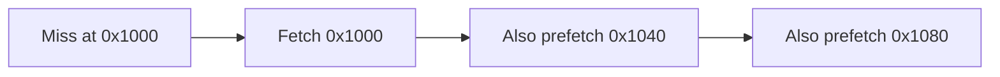
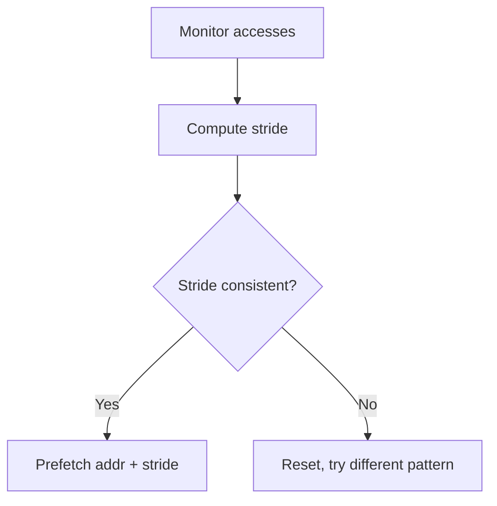
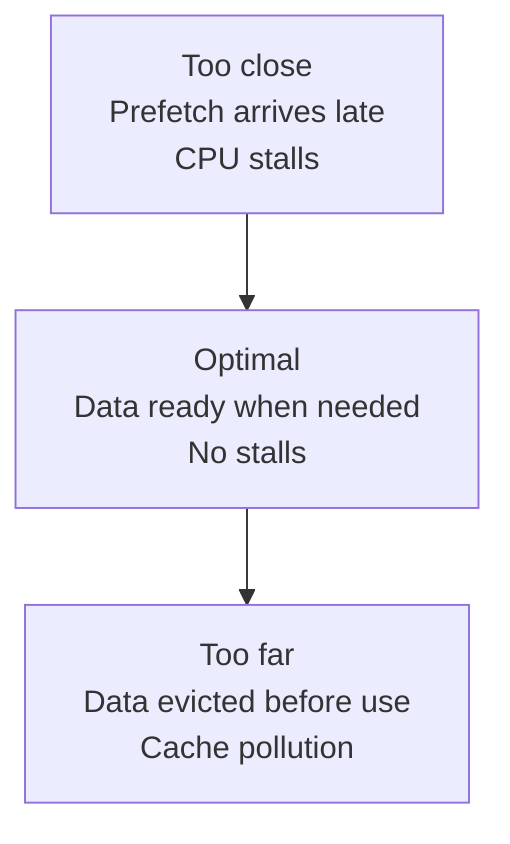
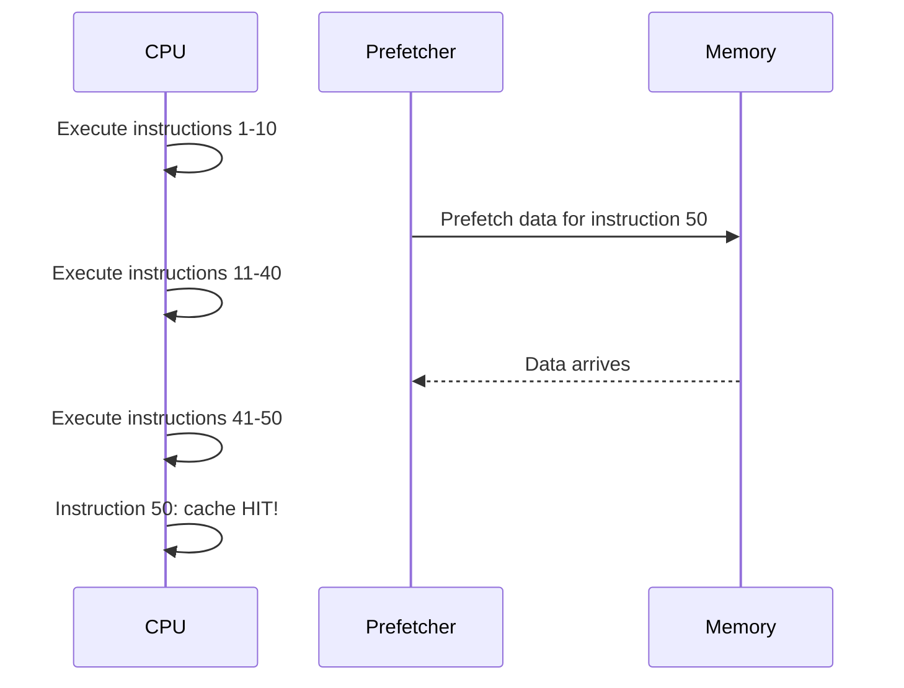

# Prefetching

## Overview

**Prefetching** is a technique that loads data into the cache **before** the CPU needs it, hiding memory latency. When the CPU eventually accesses the data, it's already in cache (a hit). Prefetching is critical for hiding the growing gap between CPU speed and memory latency.

## Why Prefetch?

Without prefetching:
```
CPU: needs data → Cache miss → Wait 100+ cycles → Data arrives → Continue
```

With prefetching:
```
Prefetcher: predicts future access → Loads data into cache
CPU: needs data → Cache hit → Continue immediately
```

The key: prefetching must happen **early enough** to complete before the CPU needs the data.

## Types of Prefetching

### 1. Hardware Prefetching

Automatic, built into the CPU. No software changes needed.

#### Next-Line Prefetcher
The simplest hardware prefetcher: on a cache miss, also fetch the **next cache line**.

```
Access line at 0x1000 → Also fetch 0x1040, 0x1080, 0x10C0...
```

**Assumption**: Spatial locality — sequential access is common.



#### Stride Prefetcher
Detects constant-stride access patterns:

```
Access 0x1000, then 0x2000, then 0x3000 → stride = 0x1000
Prefetch: 0x4000, 0x5000, ...
```

**Detection**: Track recent accesses, compute deltas, look for repeating strides.



#### Stream Prefetcher
Detects streaming access patterns (sequential reads through memory):

```
Access: A[0], A[1], A[2], A[3]...
Prefetch: A[4], A[5], A[6], A[7]...
```

Intel's L2 streamer can track multiple streams simultaneously.

#### Spatial Prefetcher
Intel's **Spatial Prefetcher** in L2: on an L2 miss, fetches the other 64-byte sector within the 128-byte aligned region.

### 2. Software Prefetching

Explicit prefetch instructions inserted by the programmer or compiler.

#### x86 Prefetch Instructions

```x86asm
PREFETCHT0 [addr]   ; Prefetch into all cache levels
PREFETCHT1 [addr]   ; Prefetch into L2 and L3 (not L1)
PREFETCHT2 [addr]   ; Prefetch into L3 only
PREFETCHNTA [addr]  ; Non-temporal: prefetch into L1 only (streaming)
```

#### ARM Prefetch Instructions

```armasm
PRFM PLDL1KEEP, [addr]  ; Prefetch for load, L1, temporal
PRFM PLDL2KEEP, [addr]  ; Prefetch for load, L2, temporal
PRFM PSTL1KEEP, [addr]  ; Prefetch for store, L1, temporal
```

#### Compiler Built-ins

```c
// GCC/Clang
__builtin_prefetch(&data[i + 8], 0, 3);  // read, high locality

// Intel compiler
_mm_prefetch(&data[i + 8], _MM_HINT_T0);

// C++20
std::prefetch(&data[i + 8], std::prefetch_hint::read);
```

### 3. Compiler-Directed Prefetching

The compiler analyzes loop patterns and inserts prefetch instructions:

```c
// Original loop
for (int i = 0; i < N; i++) {
    sum += A[i];
}

// With compiler-inserted prefetch
for (int i = 0; i < N; i++) {
    __builtin_prefetch(&A[i + 8], 0, 3);  // Prefetch 8 iterations ahead
    sum += A[i];
}
```

The compiler must calculate the **prefetch distance** — how far ahead to prefetch.

## Prefetch Distance

Too close: data arrives after CPU needs it (useless)
Too far: data may be evicted before use (wastes cache space)

```
Optimal Distance ≈ Memory Latency / Iteration Time

Example: 100 cycle memory latency, 5 cycle loop body
         Distance = 100 / 5 = 20 iterations ahead
```



## Prefetching Pitfalls

### 1. Cache Pollution
Prefetching data that displaces useful data from the cache.

```
Prefetch large array A → Evicts hot data B → B misses → Net slowdown
```

**Solution**: Use non-temporal prefetch for streaming data.

### 2. Bandwidth Waste
Prefetching data that's never used wastes memory bandwidth.

```
Prefetch 100 lines → Only 60 actually used → 40% bandwidth wasted
```

**Solution**: Accurate stride detection, prefetch throttling.

### 3. Prefetch Too Late
If the prefetch distance is too small, the data arrives after the CPU needs it.

### 4. Irregular Access Patterns
Hardware prefetchers work well for regular patterns (sequential, strided) but poorly for:
- Pointer chasing (linked lists, trees)
- Random access (hash tables, scatter/gather)
- Data-dependent patterns

```
// Hard to prefetch: data-dependent access
p = head;
while (p) {
    process(p->data);  // Where is p->next? Hardware doesn't know
    p = p->next;
}
```

## Software Prefetch Example

```c
// Matrix multiplication with prefetching
void matmul(int N, double A[N][N], double B[N][N], double C[N][N]) {
    for (int i = 0; i < N; i++) {
        for (int j = 0; j < N; j++) {
            // Prefetch B[k+8][j] for future iterations
            for (int k = 0; k < N; k++) {
                if (k + 8 < N)
                    __builtin_prefetch(&B[k + 8][j], 0, 3);
                C[i][j] += A[i][k] * B[k][j];
            }
        }
    }
}
```

## Hardware Prefetcher Implementations

| CPU | Prefetcher Type | Details |
|-----|----------------|---------|
| Intel Skylake | L1: Next-line, L2: Stream | Multiple stream trackers, adaptive |
| Intel Ice Lake | L1: Stride, L2: Spatial | Improved stride detection |
| AMD Zen 3 | L1: Stride, L2: Stream | Up to 8 concurrent streams |
| ARM Cortex-A78 | L1: Stride + stream | Configurable prefetch depth |

## Prefetch and Out-of-Order Execution

Modern CPUs overlap prefetch with computation:



The out-of-order engine can issue prefetches far ahead while executing independent instructions.

## Interview Questions

1. **Q**: What is prefetching and why is it important?
   **A**: Prefetching loads data into cache before the CPU needs it, hiding memory latency. It's important because memory is 100+ cycles slower than the CPU — without prefetching, the CPU stalls on every cache miss.

2. **Q**: What types of access patterns can hardware prefetchers handle?
   **A**: Regular patterns: sequential (next-line), constant stride, and streaming. They cannot handle irregular patterns like pointer chasing or data-dependent access.

3. **Q**: What is cache pollution from prefetching?
   **A**: When prefetched data displaces useful data from the cache. This happens when prefetching fetches data that won't be used, or when the working set is larger than the cache and prefetching pushes out hot data.

4. **Q**: How do you determine the optimal prefetch distance?
   **A**: Distance ≈ Memory Latency / Iteration Time. If memory takes 100 cycles and each loop iteration takes 5 cycles, prefetch ~20 iterations ahead. Too close means data arrives late; too far means eviction before use.

5. **Q**: Can you prefetch for pointer-chasing access patterns?
   **A**: Hardware prefetchers can't predict the next address since it depends on data values. Software prefetching can help: after processing node N, prefetch node N→next while still working on N's data.

## Common Mistakes

- ❌ Assuming hardware prefetching handles all patterns (it doesn't do pointer chasing)
- ❌ Prefetching too close to the use point (arrives late)
- ❌ Not considering cache pollution from prefetch
- ❌ Forgetting that prefetch is a **hint** (CPU can ignore it)
- ❌ Prefetching read-only data with write prefetch

## Summary

Prefetching hides memory latency by loading data before it's needed. Hardware prefetchers handle regular patterns (sequential, strided, streaming). Software prefetching handles irregular patterns with explicit instructions. The prefetch distance must be tuned to the memory latency and loop body time. Pitfalls include cache pollution and bandwidth waste.

## Cross-References

- [Cache Basics](cache-basics.md) — Cache miss fundamentals
- [Performance](performance.md) — AMAT and miss penalty
- [DRAM](../memory-tech/dram.md) — Memory latency source
- [SIMD](../parallelism/simd.md) — Prefetch in vectorized code
