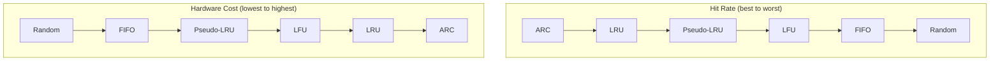

# Replacement Policies

## Overview

When a cache set is full and a new block must be loaded, a **replacement policy** decides which existing line to evict. The choice of policy significantly impacts hit rate, especially for set-associative and fully associative caches.

## Why Replacement Matters

In a direct-mapped cache, there's no choice — the block maps to one line. In set-associative and fully associative caches, the policy must select which line to replace. A good policy retains frequently/recently used data; a poor policy evicts data that will be needed soon.

## Common Replacement Policies

### 1. LRU (Least Recently Used)

**Strategy**: Evict the line that was accessed longest ago.

**Implementation**: Maintain a timestamp or counter for each line. On access, update the timestamp. On eviction, select the line with the oldest timestamp.

**Example (4-way set)**:

```
Access sequence: A, B, C, D, A, E (E causes eviction)

After D:  [A:1] [B:2] [C:3] [D:4]   (numbers = access order)
After A:  [A:5] [B:2] [C:3] [D:4]
After E:  Evict B (oldest at time 2) → [A:5] [E:6] [C:3] [D:4]
```

| Pros | Cons |
|------|------|
| Best hit rate for temporal locality | Expensive for high associativity |
| Well-understood behavior | Requires log₂(n!) bits per set for exact LRU |
| Adapts to access patterns | Counter overflow handling |

**Exact LRU cost**: For n-way, need n! states → log₂(n!) bits.
- 2-way: 1 bit (just a "recently used" flag)
- 4-way: ~5 bits (24 states)
- 8-way: ~16 bits (40320 states) — impractical for exact implementation

### 2. Pseudo-LRU (Tree-PLRU)

**Strategy**: Approximate LRU using a binary tree structure. Much cheaper than exact LRU.

**Implementation**: For n-way, maintain a binary tree with n-1 bits.

```
         [b0]          ← root: 0 = left older, 1 = right older
        /    \
     [b1]    [b2]      ← internal nodes
     / \     / \
    W0  W1  W2  W3     ← ways
```

- On access to way W: traverse path from root to W, set bits to point away from W
- On eviction: follow the path indicated by bits to find the "oldest" way

**For 4-way**: 3 bits. For 8-way: 7 bits. Very efficient.

| Pros | Cons |
|------|------|
| Low hardware cost | Not true LRU |
| Good approximation | Slightly worse hit rate |
| Scales to high associativity | Can make suboptimal choices |

### 3. Random Replacement

**Strategy**: Evict a randomly selected line.

| Pros | Cons |
|------|------|
| Simplest hardware | No adaptation to access patterns |
| No state to maintain | Unpredictable performance |
| Immune to pathological patterns | ~1.2× LRU miss rate typical |

**Used in**: ARM Cortex-A series L1 caches, some GPU caches. Surprisingly competitive with LRU for many workloads.

### 4. FIFO (First-In, First-Out)

**Strategy**: Evict the line that was loaded earliest.

| Pros | Cons |
|------|------|
| Simple (just a pointer) | Doesn't consider access frequency |
| Low hardware cost | Can evict frequently used data |
| | Worse than LRU in most cases |

**Bélády's anomaly**: FIFO can paradoxically have more misses with a larger cache for certain access patterns. LRU doesn't have this anomaly.

### 5. LFU (Least Frequently Used)

**Strategy**: Evict the line with the lowest access count.

| Pros | Cons |
|------|------|
| Good for stable patterns | "Cache pollution" — old popular entries stick forever |
| Considers frequency | Needs counters (aging problem) |
| | Slow to adapt to changing patterns |

**Mitigation**: Use aging (periodically decay counters) or use a time window.

### 6. ARC (Adaptive Replacement Cache)

**Strategy**: Dynamically balance between LRU and LFU based on workload.

- Maintains two lists: one for recency (LRU), one for frequency (LFU)
- Adapts the split based on which list is performing better
- Used in IBM storage controllers and some file systems

## Policy Comparison



## Real-World Implementations

| Processor | Cache | Policy |
|-----------|-------|--------|
| Intel Skylake+ | L1 | Pseudo-LRU (tree) |
| Intel Skylake+ | L2 | Adaptive (pseudo-LRU + frequency) |
| Intel Skylake+ | L3 | Quad-age LRU (approximation) |
| AMD Zen | L1 | Pseudo-LRU |
| ARM Cortex-A | L1 | Random or pseudo-LRU |
| NVIDIA GPU | L1/L2 | Pseudo-LRU |

## Bélády's Optimal Algorithm

The theoretical best policy: evict the line that will be used furthest in the future.

**Problem**: Requires knowing the future — impossible in practice.
**Use**: Benchmarking tool to evaluate how close a real policy is to optimal.

```
Optimal is to real policy as ω is to real numbers — an unreachable ideal.
```

## Interview Questions

1. **Q**: Why is exact LRU impractical for 8-way caches?
   **A**: Exact LRU requires tracking 8! = 40320 possible orderings, needing ~16 bits per set. The hardware to maintain and update this state on every access is expensive. Pseudo-LRU achieves similar hit rates with only 7 bits.

2. **Q**: What is Bélády's anomaly and which policies exhibit it?
   **A**: Bélády's anomaly is when increasing cache size leads to more misses (for a fixed access pattern). FIFO exhibits it; LRU and optimal do not.

3. **Q**: Why might random replacement be preferred over LRU?
   **A**: Random replacement has lower hardware cost, no state to maintain, and is immune to pathological access patterns that can cause LRU to perform poorly. For small caches or specific workloads, the hit rate difference is small.

4. **Q**: How does pseudo-LRU work for a 4-way cache?
   **A**: Use 3 bits arranged as a binary tree. Each bit indicates which subtree was accessed more recently. On access, update bits along the path. On eviction, follow the bits to find the "oldest" subtree and evict from there.

5. **Q**: When would LFU outperform LRU?
   **A**: When the access pattern has a stable frequency distribution — some items are accessed much more frequently than others, and this pattern doesn't change over time. Example: a web cache where popular pages are accessed repeatedly.

## Common Mistakes

- ❌ Assuming LRU is always best (not true for scanning patterns)
- ❌ Forgetting that direct-mapped caches don't need replacement policies
- ❌ Not knowing pseudo-LRU exists as a practical alternative
- ❌ Confusing FIFO with LRU (FIFO ignores access after loading)

## Summary

Replacement policies determine which line to evict when a set is full. LRU is the gold standard for hit rate but expensive for high associativity. Pseudo-LRU is the practical choice for most modern CPUs. Random replacement is surprisingly competitive with minimal hardware. The choice depends on the access pattern, hardware budget, and associativity level.

## Cross-References

- [Set-Associative](set-associative.md) — Where replacement policies are used
- [Fully Associative](fully-associative.md) — Policies matter most here
- [Cache Basics](cache-basics.md) — Hit/miss fundamentals
- [Coherence](coherence.md) — Eviction interacts with coherence

## Cross References

- [LRU](../../os/virtual-memory/lru.md)
- [FIFO](../../os/virtual-memory/fifo.md)
- [Cache Basics](cache-basics.md)
- [OS Page Replacement](../../os/virtual-memory/page-replacement.md)
